# Section 5  JTAG Debugging

:::tip[Important: About board compatibility]
The core logic of this tutorial applies to all ESP32 boards, but all the operation steps are explained using the example of the [**Waveshare ESP32-S3-Zero mini development board**](https://www.waveshare.com/esp32-s3-zero.htm). If you are using a development board of another model, please modify the corresponding settings according to the actual situation.
:::

> This section demonstrates how to use VS Code and the ESP-IDF extension to debug an ESP32-S3 development board via JTAG.

## 1. The Debugging Process

Debugging is a critical part of the development process, especially in embedded systems development. It helps developers discover and fix errors, ensuring that the firmware interacts correctly with peripherals and external hardware.

Debugging via serial print output (commonly viewed using a serial monitor) is the most common and simplest debugging method. It primarily involves adding print statements like `printf` to the code to output variable values or program states to a serial terminal. Without external debugging tools, this is an effective way to gather information about code execution. However, this method has significant limitations: `printf`-based debugging requires modifying the code and rebuilding the project every time you want to test something new. Using a debugger, on the other hand, allows you to step through code, inspect memory, and set breakpoints—all without modifying the source code.

ESP32 series chips typically utilize the JTAG (Joint Test Action Group) interface, in conjunction with OpenOCD and GDB, to implement debugging functions such as breakpoints, single-step execution, and variable and stack inspection. This helps developers quickly locate and fix issues. JTAG debugging establishes a complete debugging link from the development host to the target chip via a dedicated interface on the target chip, supporting in-depth analysis and control of a running program.

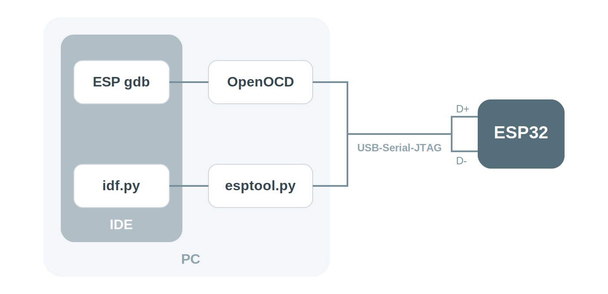

Within the ESP-IDF development environment, the JTAG debugging process is accomplished through the collaboration of multiple tools:

The IDE (such as VS Code) serves as the user interface, calling the GDB (esp-gdb) debugger client through the ESP-IDF extension. GDB then communicates with the OpenOCD ([openocd-esp32](https://github.com/espressif/openocd-esp32)) server, which ultimately connects to the ESP32 chip via a JTAG adapter to achieve hardware-level debugging. These tools work together to complete the debugging link from the user interface down to the chip hardware.

To better support the Espressif chip series, ESP-IDF uses specific branch versions of standard tools:

- esp-gdb: A branch of GDB with enhanced support for ESP series chips.
- openocd-esp32: A branch of OpenOCD that provides faster support for newly released ESP chips.

In the following content, unless otherwise specified, GDB and esp-gdb, as well as OpenOCD and openocd-esp32, can be considered equivalent concepts.

## 2. Hardware Preparation and Drivers

### 2.1 Hardware Requirements

This section explains how to use the built-in JTAG interface of ESP32-S3 for debugging. **The methods in this tutorial are only applicable to devices with USB JTAG functionality (such as ESP32-S3 or ESP32-C3).**

For development boards that do not have USB JTAG functionality, an external JTAG debugger (such as [ESP-PROG](https://docs.espressif.com/projects/esp-iot-solution/en/latest/hw-reference/ESP-Prog_guide.html)) can still be used for debugging, but the relevant content is not within the scope of this article. For more details, refer to the official Espressif tutorial: [Debugging with ESP-IDF VS Code extension](https://developer.espressif.com/blog/2025/05/debugging-with-vscode/).

### 2.2 Install Drivers

To ensure JTAG communication functions correctly, make sure the appropriate drivers are installed:

- Using the **Espressif Installation Manager (EIM)**

  In [**Espressif Installation Manager (EIM)**](https://docs.espressif.com/projects/esp-idf/en/latest/esp32s3/get-started/windows-setup.html) graphical user interface (GUI), click `Open Dashboard` under `Manage Installations`, and then click `Install Drivers`:

  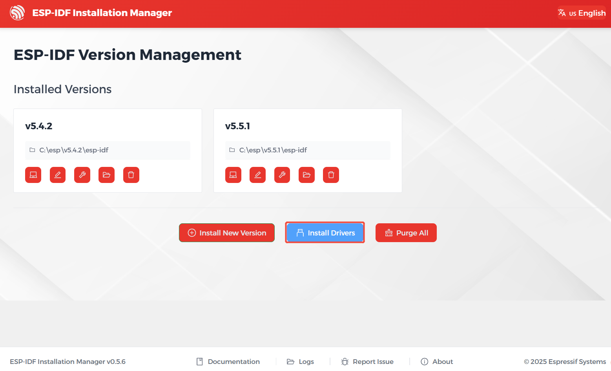

- Using the **PowerShell Commands**

  You can achieve the same result using [idf-env](https://github.com/espressif/idf-env). Open PowerShell with **administrator privileges** and run the following commands:

  ```PowerShell
  Invoke-WebRequest 'https://dl.espressif.com/dl/idf-env/idf-env.exe' -OutFile .\idf-env.exe; .\idf-env.exe driver install --espressif
  ```

## 3. Example Code

1. Create a Project. If you are unsure how to do this, please refer to [Create a Project from a Template](./03-Create-Project.md#2-create-a-project-from-a-template).

2. Copy the following code into **main/main.c**:

   ```c
   #include <stdio.h>

   // Calculate the function that sums all integers from 1 to 'number'
   int summation(int number)
   {
       int sum = 0;
       for (int i = 1; i <= number; i++){
           sum += i;
       }
       return sum;
   }

   void app_main(void)
   {
       printf("Hello world!\n");
       int final_number = 6;
       int sum = summation(final_number);
       printf("The summation up to %d is %d\n", final_number, sum);
   }
   ```

3. Configure Flash Options

   Firstly, before building and flashing, please make sure to check and set the correct target device, serial port, and flashing method. Refer to [Section 2  Run Demo - 1.3 Configure the Project](./02-Example.md#Flash-Option).

   

4. Click  to automatically perform the build, flash, and monitor steps in sequence with one click.

5. After flashing completes, the serial monitor will start printing information.

   ```text
   Hello world!
   The summation up to 6 is 21
   ```

## 4. Configure OpenOCD

OpenOCD employs a client-server architecture for debugging embedded systems. The OpenOCD server establishes a connection to the target hardware via a debug adapter (typically JTAG) and provides a network interface for clients like gdb or telnet to send commands or load code.

1. Select the OpenOCD Board Configuration:

   Use the shortcut keys <kbd>Ctrl</kbd> + <kbd>Shift</kbd> + <kbd>P</kbd> to open the VS Code command panel. Then run `> ESP-IDF: Select OpenOCD Board Configuration`.

   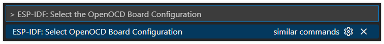

   Select `ESP32-S3 chip (via builtin USB-JTAG)`.

   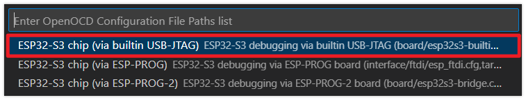

2. Start OpenOCD:

   Use the shortcut keys <kbd>Ctrl</kbd> + <kbd>Shift</kbd> + <kbd>P</kbd> to open the VS Code command panel. Then run `> ESP-IDF: OpenOCD Manager`.

   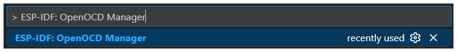

   Click "Start OpenOCD".

   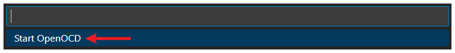

3. After OpenOCD starts successfully, you should see output similar to the following, indicating the server is now waiting for a connection:

   ```
   Open On-Chip Debugger v0.12.0-esp32-20250422 (2025-04-22-13:02)
   Licensed under GNU GPL v2
   For bug reports, read
   	http://openocd.org/doc/doxygen/bugs.html

   debug_level: 2

   Info : only one transport option; autoselecting 'jtag'

   Info : esp_usb_jtag: VID set to 0x303a and PID to 0x1001
   Info : esp_usb_jtag: capabilities descriptor set to 0x2000

   Info : Listening on port 6666 for tcl connections
   Info : Listening on port 4444 for telnet connections

   Info : esp_usb_jtag: serial (24:EC:4A:2C:6D:AC)

   Info : esp_usb_jtag: Device found. Base speed 40000KHz, div range 1 to 255
   Info : clock speed 40000 kHz

   Info : JTAG tap: esp32s3.tap0 tap
   /device found: 0x120034e5 (mfg: 0x272 (Tensilica), part: 0x2003, ver: 0x1)
   Info : JTAG tap: esp32s3.tap1 tap/device found: 0x120034e5 (mfg: 0x272 (Tensilica), part: 0x2003, ver: 0x1)

   Info : [esp32s3.cpu0] Examination succeed

   Info : [esp32s3.cpu1] Examination succeed
   Info : [esp32s3.cpu0] starting gdb server on 3333

   Info : Listening on port 3333 for gdb connections
   ```

   - By default, after the OpenOCD server starts, port `4444` is used for Telnet communication; port `6666` is used for TCL communication; port `3333` is used for GDB.

## 5. Start Debugging Session

Next, we will start gdb and connect to OpenOCD. After starting the debugging session, VS Code will automatically complete this process.

1. Set a breakpoint at the line of code `sum += i;`. Go to this line and press <kbd>F9</kbd>, or click on the blank space to the left of the line number to add a breakpoint.

   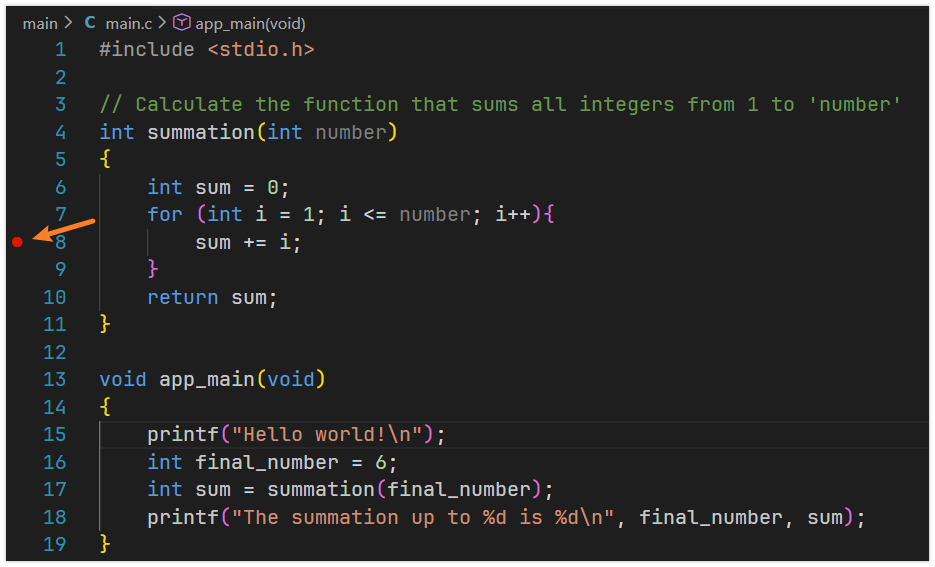

2. Press <kbd>F5</kbd> to start debugging, or click "Run" -> "Start Debugging" in the top menu bar of VS Code.

   After starting debugging, the debugger will pause at the first line of the `app_main` function by default, waiting for user actions.

   On the left, you can see a panel with debugging-related information such as **Variables**, **Watch**, **Call Stack**, and **Breakpoints**, at the bottom are windows like the **Debug Console** and **Output**, and a **Debug Toolbar** will appear above the code window.

   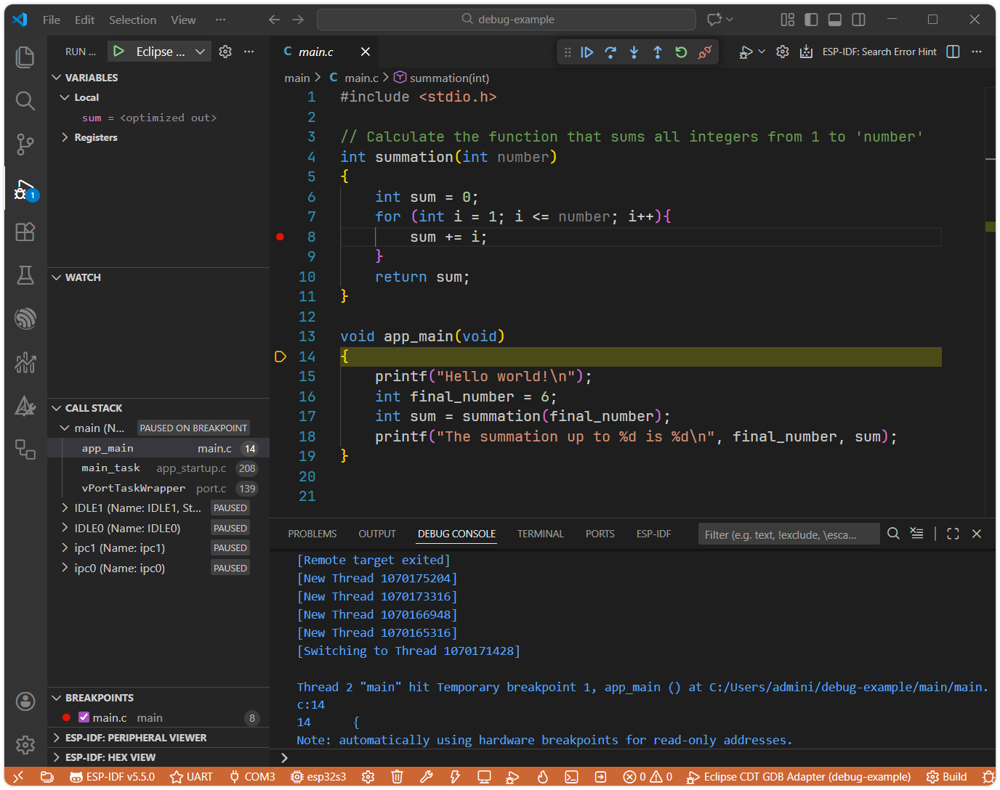

## 6. Common Debugging Operations

1. The debug toolbar contains a set of buttons for controlling the program debugging process:

   

   - (Continue): Resumes program execution from the current paused location until the next breakpoint is encountered or the program ends.
   - (Step Over): Executes the current line of code. If the line contains a function call, it executes the entire function and then pauses at the next line, without stepping into the function.
   - (Step Into): Executes the current line of code. If the line contains a function call, the debugger steps into that function and pauses at its first line.
   - (Step Out): Continues execution until the current function finishes and returns to its caller, then pauses.
   - (Restart): Restarts the entire debugging session from the beginning.
   - (Disconnect): Stops and completely ends the current debugging session.

2. Common debugging operations:

   1. After starting the debug session, press <kbd>F5</kbd> again or click the . The program will run until it reaches the breakpoint and then pause.

      You'll see that the program has paused at line 8. The current values of variables can be viewed on the left side. Note: Since the current line of code has not been executed yet, the value of the `sum` variable is still `0`.

      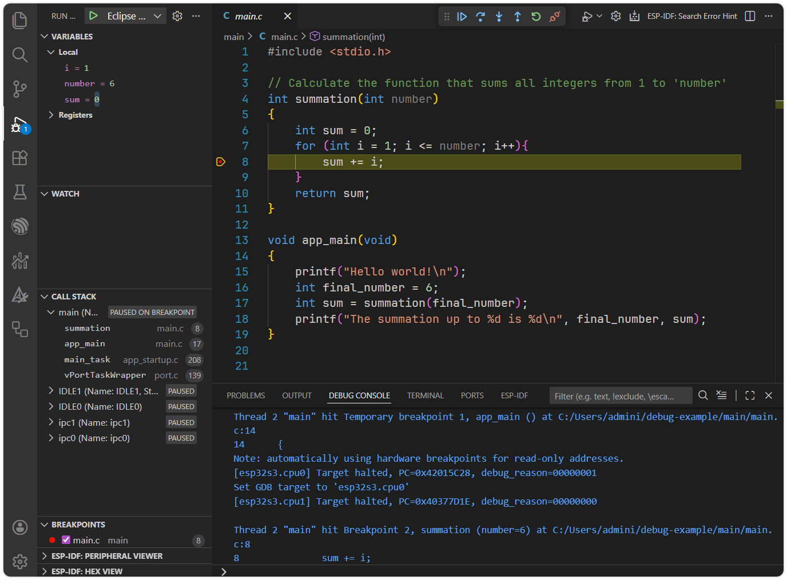

      You can also enter a variable name and press Enter in the Debug Console to view its value.

      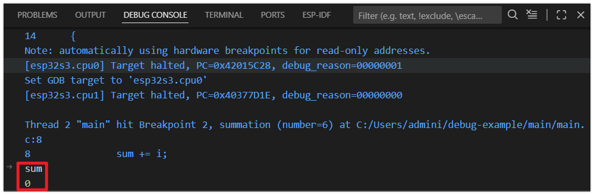

   2. Press <kbd>F10</kbd> or click the  to perform step-over debugging.

      After pressing it, the code advances to the next line. Press this button multiple times to observe how the debugger executes the program line by line, and watch how the variables change.

      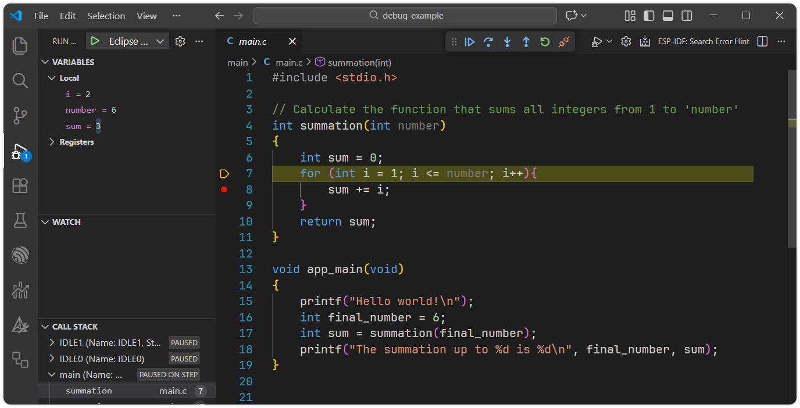

   3. Setting a Conditional Breakpoint allows the program to pause only when a specific condition is met.

      Locate the previously set breakpoint, right-click on it, select "Edit Breakpoint," and then enter the condition `i==6`.

      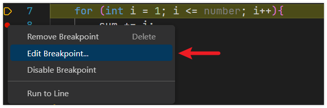

      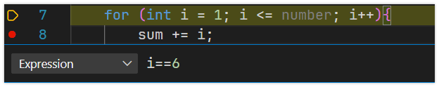

      Press <kbd>F5</kbd> or click the . The code will now pause execution when the value of the variable `i` equals `6`.

      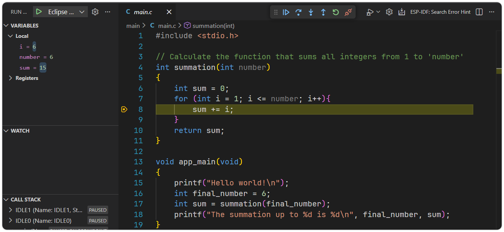

   4. Press <kbd>F11</kbd> or click the  to Perform step-into debugging. When a function call is encountered, the debugger will step into the function. Clicking the  multiple times shows the debugger stepping into the `printf` function and even into FreeRTOS kernel code.

      :::info[Error when step into `printf`]
      When stepping into `printf`, the debugger will attempt to enter the function. However, since `printf` is part of the precompiled newlib library and the source files are not available at the expected path, VS Code will display `The editor could not be opened because the file was not found.` The function will still execute—you just won't be able to view its source code.
      :::

      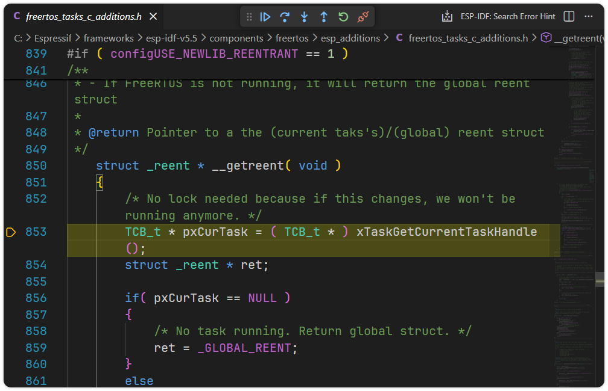

   5. Press <kbd>Shift</kbd> + <kbd>F11</kbd> or click the  to Step Out and return to the main function.

      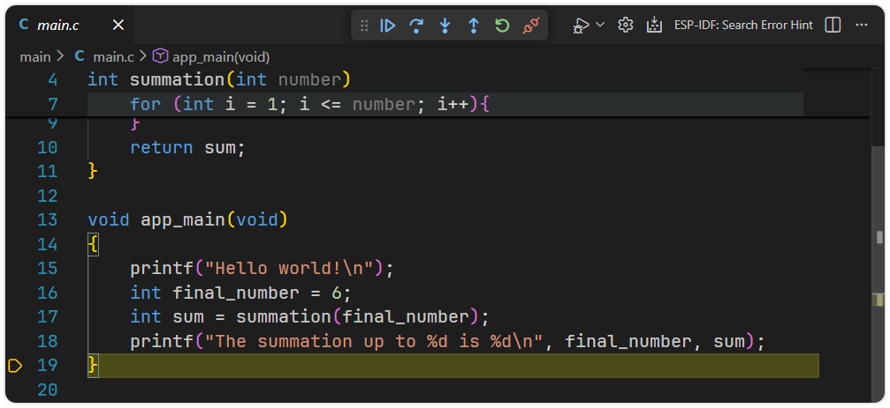

   6. Finally, press <kbd>Shift</kbd> + <kbd>F5</kbd> or click the  to disconnect and stop the debugging session.

## 7. Common Issues and Troubleshooting

:::warning Running into an issue? Try these solutions:

**LIBUSB_ERROR_NOT_FOUND Error**

Search for the corresponding error code on [this page](https://github.com/espressif/openocd-esp32/wiki/Troubleshooting-FAQ) for possible solutions.

**OpenOCD Troubleshooting**

- Confirm that the correct development board model is selected in the Arduino IDE
- Check if the correct port is selected
- Try pressing the BOOT button again to enter download mode
- Close other programs that may be using the serial port

**Abnormal Debugging Behavior**

Try flashing the code again. Every time you modify the code before debugging, you need to rebuild the project and flash the firmware.

:::


## 8. Reference Links

- [ESP-IDF Programming Guide - JTAG Debugging](https://docs.espressif.com/projects/esp-idf/en/latest/esp32s3/api-guides/jtag-debugging/index.html)
- [ESP-IDF Programming Guide - Configure ESP32-S3 Built-in JTAG Interface](https://docs.espressif.com/projects/esp-idf/en/latest/esp32s3/api-guides/jtag-debugging/configure-builtin-jtag.html)
- [ESP-IDF VS Code Extension Documentation - Debug Project](https://docs.espressif.com/projects/vscode-esp-idf-extension/en/latest/debugproject.html)
- [Debugging with ESP-IDF VS Code extension](https://developer.espressif.com/blog/2025/05/debugging-with-vscode/)
- [espressif/openocd-esp32 - Troubleshooting FAQ](https://github.com/espressif/openocd-esp32/wiki/Troubleshooting-FAQ)
- [Eclipse CDT GDB Debug Adapter](https://developer.espressif.com/blog/vscode-esp-idf-v1.8.0/#eclipse-cdt-gdb-debug-adapter)
