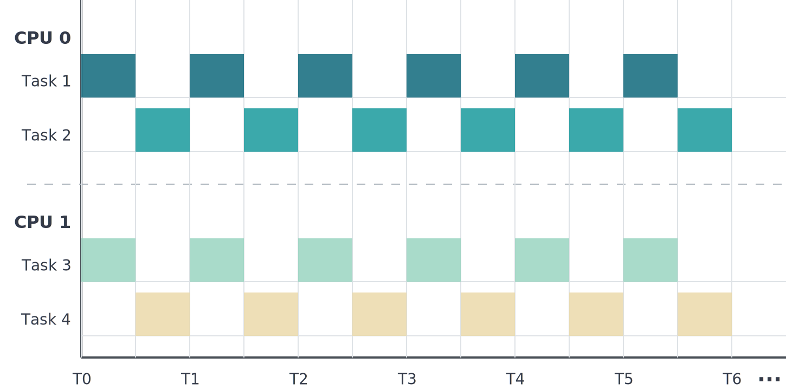
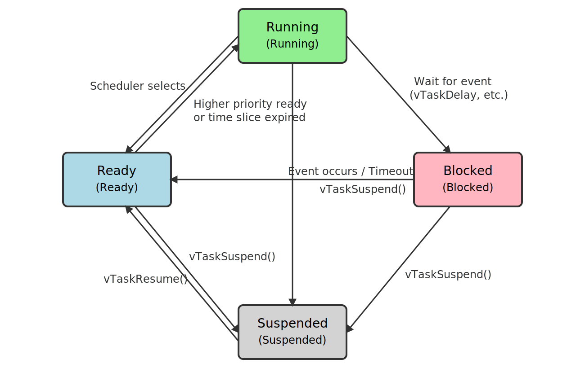

:::tip[Important: About board compatibility]
The core logic of this tutorial applies to all ESP32 boards, but all the operation steps are explained using the example of the [**Waveshare ESP32-S3-Zero mini development board**](https://www.waveshare.com/esp32-s3-zero.htm). If you are using a development board of another model, please modify the corresponding settings according to the actual situation.
:::

> This section introduces the relevant concepts of FreeRTOS and explains how to use its commonly used APIs in ESP-IDF.

FreeRTOS is an open-source real-time operating system (RTOS) kernel that is integrated into ESP-IDF as a component. All ESP-IDF applications and most components are written based on FreeRTOS.

It should be noted that ESP-IDF does not directly use the native FreeRTOS; instead, it has undergone a significant amount of customization and optimization on top of it, particularly in terms of support for multi-core (SMP) architectures. This implementation is referred to as **IDF FreeRTOS**. Although Amazon SMP FreeRTOS (the official SMP implementation) can also be enabled through configuration, this implementation is currently in an experimental/test state and is not adopted by default.

Core features of IDF FreeRTOS on ESP32 include:

- **Multitasking and Real-time Performance**: Supports task priorities, inter-task communication (such as queues, semaphores, event groups), software timers, etc., meeting common real-time requirements of the Internet of Things.
- **SMP Support**: IDF FreeRTOS is optimized for dual-core (up to two cores), where tasks can be specified to run on a specific core (core affinity) or can be scheduled to execute on any core.
- **Adaptation for ESP Hardware**: Leverage the hardware features of ESP chips such as symmetric memory, atomic operations, and cross-core interrupts to achieve efficient multicore scheduling and synchronization.

## 1. Basic FreeRTOS Concepts



FreeRTOS implements multitasking in ESP-IDF through a mechanism called Tasks. Each task is essentially an independent execution thread. Developers can use APIs to create, delete, and manage multiple tasks. These tasks are scheduled by the FreeRTOS kernel, running on the CPU according to policies such as priority and time-slicing, thereby achieving the "multitasking" effect.

### 1.1 Task States

FreeRTOS refers to threads as "Tasks". Each task is implemented as a C function, typically containing an infinite loop.



Task States: A task can be in one of four states at any given time:

- Running: Currently being executed by the CPU.
- Ready: Prepared for execution, but the CPU is currently executing another task.
- Blocked: Waiting for an event (such as from a peripheral or a timeout). It does not consume CPU time.
- Suspended: Blocked indefinitely until actively resumed.

### 1.2 Task Scheduling

How does FreeRTOS decide which task to switch to? Its scheduling can be summarized as a preemptive scheduler with time-slicing and fixed priorities.

In the native FreeRTOS, the scheduler has three core characteristics:

- **Fixed Priority**: Always runs the highest-priority task that is in the Ready state.
- **Time Slicing / Round Robin**: When multiple tasks share the highest priority and are ready, they run in a round-robin sequence.
- **Preemptive**: Immediately switches to a higher-priority task when it becomes ready.

On dual-core chips like ESP32, ESP32-S3, and ESP32-P4, ESP-IDF uses the IDF FreeRTOS implementation which supports Symmetric Multiprocessing (SMP). Scheduling under SMP introduces additional considerations:

- **Core Affinity**: Each task can have an affinity set, specifying it to run on Core 0, Core 1, or any core. Each core schedules independently, choosing the highest-priority ready task that is "runnable on that core". For a task to be runnable on a core, it must match the core's affinity and must not already be running on the other core. Therefore, even with multiple cores and multiple highest-priority ready tasks, it's not guaranteed that each core can run one of them.
- **Time Slicing**: Perfect round-robin may not be achievable due to affinity constraints or a task already running on another core. The IDF FreeRTOS scheduler moves a task that has just been selected to run to the end of its ready list. It always starts searching for a runnable task from the head of the list, sometimes skipping tasks, and may even search for and run a lower-priority runnable task if necessary. This strategy ensures that tasks of the same priority eventually get CPU time after enough ticks.
- **Preemption**: When a higher-priority task becomes ready and is runnable on multiple cores, the scheduler will only preempt one core. It always gives preference to the current core (the core where the event that made the task ready was triggered).

## 2. Example: Task Management

:::warning
The example code in this section can only run on ESP32 chips with multiple cores.
:::

This example demonstrates how to create two tasks in FreeRTOS within ESP-IDF and pin them to different cores. It utilizes a periodic delay-driven loop to showcase task suspension/resumption and deletion, helping to understand FreeRTOS multitasking scheduling and basic inter-task cooperation.

### 2.1 Example Code

1. Create a Project. If you are unsure how to do this, please refer to [Create a Project from a Template](./03-Create-Project.md#2-create-a-project-from-a-template).

2. Copy the following code into **main/main.c**:

   ```c
   #include <stdio.h>

   #include "freertos/FreeRTOS.h"
   #include "freertos/task.h"

   TaskHandle_t myTaskHandleA = NULL;
   TaskHandle_t myTaskHandleB = NULL;

   void Demo_Task_A(void *arg)
   {

       int count = 0;
       while (1)
       {
           count++;
           printf("Demo_Task_A printing...%d\n", count);
           if (count == 10)
           {
               // Resume the execution of task B
               printf("Demo_Task_A resumed Demo_Task_B!\n");
               vTaskResume(myTaskHandleB);
           }
           vTaskDelay(pdMS_TO_TICKS(1000));
       }
   }

   void Demo_Task_B(void *arg)
   {
       int count = 0;
       while (1)
       {
           count++;
           printf("Demo_Task_B printing...%d\n", count);
           if (count == 5)
           {
               // Suspend itself: The scheduler will no longer schedule this task until it is resumed by another task's vTaskResume
               printf("Demo_Task_B is suspended itself!\n");
               vTaskSuspend(NULL);
           }
           if (count == 10)
           {
               // Self-delete: Exit the task; resources such as the stack will be reclaimed by the Idle Task
               printf("Demo_Task_B is deleted itself!\n");
               vTaskDelete(NULL);
           }
           vTaskDelay(pdMS_TO_TICKS(1000));
       }
   }

   void app_main(void)
   {
       // Create tasks and pin them to specific cores; stack size 4096 bytes; both tasks share priority 10
       // Task A pinned to Core 0, Task B pinned to Core 1 (can run in parallel on dual-core)
       xTaskCreatePinnedToCore(Demo_Task_A, "Demo_Task_A", 4096, NULL, 10, &myTaskHandleA, 0);
       xTaskCreatePinnedToCore(Demo_Task_B, "Demo_Task_B", 4096, NULL, 10, &myTaskHandleB, 1);
   }
   ```

### 2.2 Build and Flash the Code

1. Configure Flash Options

   Firstly, before building and flashing, please make sure to check and set the correct target device, serial port, and flashing method. Refer to [Section 2  Run Demo - 1.3 Configure the Project](./02-Example.md#Flash-Option).

   

2. Click  to automatically perform the build, flash, and monitor steps in sequence with one click.

3. After flashing completes, the serial monitor will start printing information.

   :::note
   In a multi-tasking environment, `printf` output may interleave, which is normal.
   :::

   ```
   Demo_Task_A printing...1
   Demo_Task_B printing...1
   Demo_Task_A printing...2
   Demo_Task_B printing...2
   Demo_Task_A printing...3
   Demo_Task_B printing...3
   Demo_Task_A printing...4
   Demo_Task_B printing...4
   Demo_Task_A printing...5
   Demo_Task_B printing...5
   Demo_Task_B is suspended itself!
   Demo_Task_A printing...6
   Demo_Task_A printing...7
   Demo_Task_A printing...8
   Demo_Task_A printing...9
   Demo_Task_A printing...10
   Demo_Task_A resumed Demo_Task_B!
   Demo_Task_A printing...11
   Demo_Task_B printing...6
   Demo_Task_A printing...12
   Demo_Task_B printing...7
   Demo_Task_A printing...13
   Demo_Task_B printing...8
   Demo_Task_A printing...14
   Demo_Task_B printing...9
   Demo_Task_A printing...15
   Demo_Task_B printing...10
   Demo_Task_B is deleted itself!
   Demo_Task_A printing...16
   Demo_Task_A printing...17
   Demo_Task_A printing...18
   Demo_Task_A printing...19
   ...
   ```

### 2.3 Code Analysis

- **Include Header Files**

  ```c
  #include <stdio.h>
  #include "freertos/FreeRTOS.h"
  #include "freertos/task.h"
  ```

  - `stdio.h`: C standard input/output library, we use its `printf` function to print task running information to the console.
  - `freertos/FreeRTOS.h` and `freertos/task.h`: Provide FreeRTOS core functions and task management-related APIs, such as task creation, deletion, suspension, resumption, and delay.

- **Define task handle**

  ```c
  TaskHandle_t myTaskHandleA = NULL;
  TaskHandle_t myTaskHandleB = NULL;
  ```

  - `TaskHandle_t` is a type in FreeRTOS used to uniquely identify a task.
  - We define two global handle variables, `myTaskHandleA` and `myTaskHandleB`, to store the handles for Task A and Task B, respectively.
  - Making the handles global variables allows one task to reference and manipulate another. For example, in this case, Task A needs to use Task B's handle to resume it.

- **Task A (`Demo_Task_A`)**

  ```c
  void Demo_Task_A(void *arg)
  {
      int count = 0;
      while (1)
      {
          count++;
          printf("Demo_Task_A printing...%d\n", count);
          if (count == 10)
          {
              // Resume the execution of task B
              printf("Demo_Task_A resumed Demo_Task_B!\n");
              vTaskResume(myTaskHandleB);
          }
          vTaskDelay(pdMS_TO_TICKS(1000));
      }
  }
  ```

  - This is a task function with an infinite loop, performing counting and printing operations every second.
  - `vTaskDelay(pdMS_TO_TICKS(1000))`: Makes Task A block (pause) for 1000 milliseconds, yielding CPU time to other tasks.
  - `if (count == 10)...`: When Task A's count reaches 10, it resumes the execution of Task B.
  - `vTaskResume(myTaskHandleB)`: Calling this function and passing in Task B's handle can resume Task B from a suspended state.

- **Task B (`Demo_Task_B`)**

  ```c
  void Demo_Task_B(void *arg)
  {
      int count = 0;
      while (1)
      {
          count++;
          printf("Demo_Task_B printing...%d\n", count);
          if (count == 5)
          {
              // Suspend itself: The scheduler will no longer schedule this task until it is resumed by another task's vTaskResume
              printf("Demo_Task_B is suspended itself!\n");
              vTaskSuspend(NULL);
          }
          if (count == 10)
          {
              // Self-delete: Exit the task; resources such as the stack will be reclaimed by the Idle Task
              printf("Demo_Task_B is deleted itself!\n");
              vTaskDelete(NULL);
          }
          vTaskDelay(pdMS_TO_TICKS(1000));
      }
  }
  ```

  - This task also counts and prints every second.
  - `if (count == 5)...`: When Task B's count reaches 5, it calls `vTaskSuspend(NULL)`.
    - `vTaskSuspend()`: Used to suspend a task. A suspended task will no longer be allocated CPU time by the scheduler and enters a dormant state.
    - Passing `NULL` as the parameter means suspending the task itself.
  - `if (count == 10)...`: After being resumed by Task A, when its count reaches 10, it calls `vTaskDelete(NULL)`.
    - `vTaskDelete()`: Used to delete a task. It frees the memory occupied by the task (task control block and stack).
    - Passing `NULL` as the parameter means deleting the task itself.
    - Note: **An RTOS task function should not return; it must properly exit the task via `vTaskDelete(NULL)`.**

- **Main Function (`app_main`)**

  ```c
  void app_main(void)
  {
      // Create tasks and pin them to specific cores; stack size 4096 bytes; both tasks share priority 10
      // Task A pinned to Core 0, Task B pinned to Core 1 (can run in parallel on dual-core)
      xTaskCreatePinnedToCore(Demo_Task_A, "Demo_Task_A", 4096, NULL, 10, &myTaskHandleA, 0);
      xTaskCreatePinnedToCore(Demo_Task_B, "Demo_Task_B", 4096, NULL, 10, &myTaskHandleB, 1);
  }
  ```

  - `void app_main(void)` is the [entry point](https://docs.espressif.com/projects/esp-idf/en/latest/esp32/api-reference/system/freertos.html#application-entry-point) for an ESP-IDF application. ESP-IDF automatically starts FreeRTOS, and the user must define a `void app_main(void)` function as the entry point for the user application, which is called automatically when ESP-IDF starts.
  - `xTaskCreatePinnedToCore()`: This is the FreeRTOS API provided by ESP-IDF, used to create a task and "pin" it to run on a specific CPU core.
    - `Demo_Task_A` / `Demo_Task_B`: The functions to be executed by the tasks.
    - `"Demo_Task_A"` / `"Demo_Task_B"`: Descriptive names for the tasks.
    - `4096`: The stack size allocated to the task, in bytes.
    - `NULL`: A parameters passed to the task function, which is not used in this example.
    - `10`: The priority of the task. Higher values indicate higher priority. The priority cannot exceed `configMAX_PRIORITIES - 1`.
    - `&myTaskHandleA` / `&myTaskHandleB`: The address of the task handle variable. After successfully creating the task, the function will store the handle in this variable.
    - `0` / `1`: Specifies the core ID on which the task runs. Task A runs on core 0, and Task B runs on core 1. If `tskNO_AFFINITY` is passed, the scheduler can run the task on any core.

## 3. Reference Links

- [ESP-IDF Programming Guide - FreeRTOS Overview](https://docs.espressif.com/projects/esp-idf/en/latest/esp32s3/api-reference/system/freertos.html)
- [ESP-IDF Programming Guide - FreeRTOS (IDF)](https://docs.espressif.com/projects/esp-idf/en/latest/esp32s3/api-reference/system/freertos_idf.html)
- [ESP Technical Encyclopedia - Common FreeRTOS APIs](https://docs.espressif.com/projects/esp-techpedia/en/latest/esp-friends/get-started/basic-concepts/common-freertos-api/index.html)
- [ESP DevCon23 Beginner's Guide: Key Concepts and Resources](https://www.youtube.com/watch?v=J8zc8mMNKtc)
- [ESP DevCon22 FreeRTOS in ESP-IDF](https://www.youtube.com/watch?v=03Q8oilo_2U)
- [What is FreeRTOS?](https://www.freertos.org/Why-FreeRTOS/What-is-FreeRTOS)
- [FreeRTOS Beginner's Guide](https://www.freertos.org/Documentation/01-FreeRTOS-quick-start/01-Beginners-guide/00-Overview)
