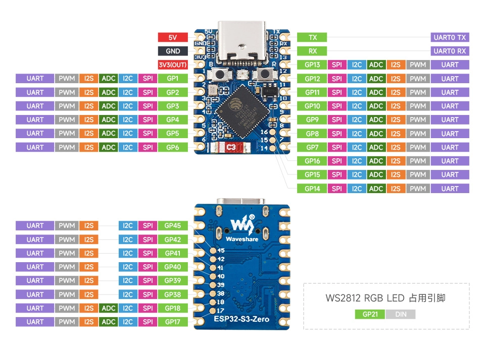

<!-- Image Reference -->

:::tip[Important Note: Development Board Compatibility]
The core logic of this tutorial applies to all ESP32 boards, but all the operation steps are explained using the example of the [**Waveshare ESP32-S3-Zero mini development board**](https://www.waveshare.com/esp32-s3-zero.htm). If you are using a development board of another model, please modify the corresponding settings according to the actual situation.
:::

> This tutorial introduces how to generate a PWM signal using the LED PWM Controller (LEDC) peripheral within the Espressif ESP-IDF framework to control LED brightness.

## 1. LEDC Peripheral (LED PWM Controller)

The LED Controller (LEDC) is primarily used for controlling LEDs but can also generate PWM signals to control other devices. Depending on the specific chip model, it has 6 to 16 independent channels, capable of generating separate waveforms to drive devices like RGB LEDs.

By precisely controlling the duty cycle of the PWM signal, the LED PWM Controller can adjust the brightness of an LED. The LEDC also features built-in hardware fade functionality, allowing for automatic, smooth duty cycle changes without requiring constant CPU intervention.

Most ESP32 GPIO pins can be configured for the LEDC peripheral to generate PWM signals for controlling LED brightness or other output devices requiring duty cycle and frequency control. Note that some GPIO pins are input-only and cannot be used for LEDC output. Please refer to the technical reference manual for your specific chip for the available pins.


The general steps for using LEDC (LED PWM Controller) in ESP-IDF are as follows:

1. **Include Header File**

   First, you need to include the LEDC driver header file:

   ```c
   #include "driver/ledc.h"
   ```

   And add the dependency (e.g., `REQUIRES esp_driver_ledc`) in `CMakeLists.txt`.

2. **Timer Configuration**  
   First, configure the LEDC timer, specifying the frequency and duty cycle resolution of the PWM signal. Use the `ledc_timer_config()` function to complete this step.

3. **Channel Configuration**  
   Configure the LEDC channel, binding the timer to the GPIO that will output the PWM signal and setting the initial duty cycle. Use the `ledc_channel_config()` function to complete this step. Configuring the timer before the channel ensures the PWM signal starts outputting with the correct frequency from the beginning.

4. **Changing the PWM Signal**  
 Use `ledc_set_duty()` to set a new duty cycle and `ledc_update_duty()` to apply it to the channel, enabling real-time adjustment of the PWM signal. The hardware fade functionality can also be used for smooth brightness transitions.

5. **(Optional) Using Hardware Fade Functionality**

   To smoothly adjust brightness, you can use the LEDC fade function. First, call `ledc_fade_func_install(0)` to enable fading, then configure the fade parameters and start it (refer to [Change PWM Duty Cycle Using Hardware](https://docs.espressif.com/projects/esp-idf/en/v5.5.1/esp32s3/api-reference/peripherals/ledc.html#change-pwm-duty-cycle-using-hardware)).

## 2. Example Project

This example will use the LEDC peripheral to drive an external LED, achieving a smooth brightness transition from off to full brightness, and then back from full brightness to off.

### 2.1 Circuit Assembly

Components required:

- LED \* 1
- 330Ω resistor \* 1
- Breadboard \* 1
- Wires
- ESP32 development board ([Waveshare ESP32-S3-Zero Mini Development Board](https://www.waveshare.com/esp32-s3-zero.htm))

Connect the circuit according to the wiring diagram below:

<Details>
  <summary>ESP32-S3-Zero Pinout Diagram</summary>



</Details>

<div style={{maxWidth:500}}> </div>

### 2.2 Create Project

1. Create a Project. If you are unsure how to do this, please refer to [Create a Project from a Template](./03-Create-Project.md#2-create-a-project-from-a-template).

2.  Review the [LEDC API Reference](https://docs.espressif.com/projects/esp-idf/en/v5.5.1/esp32s3/api-reference/peripherals/gpio.html#api-reference-normal-gpio). Follow the instructions in the documentation to complete the following steps.

   First, include the header file in **main.c**:

   ```c
   #include "driver/ledc.h"
   ```

   Then, declare the `esp_driver_ledc` component in **main/CMakeLists.txt**:

   ```
   idf_component_register(SRCS "main.c"
                         INCLUDE_DIRS "."
                         REQUIRES esp_driver_ledc)
   ```

### 2.3 Example Code

```c
#include "driver/ledc.h"
#include "freertos/FreeRTOS.h"
#include "freertos/task.h"
#include "esp_log.h"

static const char *TAG = "example"; // Define a log tag

static const gpio_num_t LED_PIN = GPIO_NUM_7; // GPIO pin connected to the LED
#define LEDC_CHANNEL LEDC_CHANNEL_0           // LEDC channel
#define LEDC_TIMER LEDC_TIMER_0               // LEDC timer
#define LEDC_MODE LEDC_LOW_SPEED_MODE         // LEDC speed mode, low-speed mode
#define LEDC_DUTY_RES LEDC_TIMER_10_BIT       // PWM duty cycle resolution (10-bit, 0-1023)
#define LEDC_FREQUENCY 1000                   // PWM frequency (1 kHz)

void app_main(void)
{
    // Configure the LEDC timer
    ledc_timer_config_t ledc_timer = {
        .speed_mode = LEDC_MODE,          // Set the speed mode
        .duty_resolution = LEDC_DUTY_RES, // Set the duty cycle resolution
        .timer_num = LEDC_TIMER,          // Select the timer
        .freq_hz = LEDC_FREQUENCY         // Set the PWM frequency
    };
    ledc_timer_config(&ledc_timer);       // Apply the timer configuration

    // Configure the LEDC channel
    ledc_channel_config_t ledc_channel = {
        .gpio_num = LED_PIN,     // GPIO pin for the channel output
        .speed_mode = LEDC_MODE, // Set the speed mode (must match the timer)
        .channel = LEDC_CHANNEL, // Select the LEDC channel
        .timer_sel = LEDC_TIMER, // Select the timer for this channel to use
        .duty = 0                // Set initial duty cycle to 0
    };
    ledc_channel_config(&ledc_channel); // Apply the channel configuration

    while (1)
    {
        // Fade in
        ESP_LOGI(TAG, "LED Fade in");
        for (int duty = 0; duty <= 1023; duty += 16)
        {
            ledc_set_duty(LEDC_MODE, LEDC_CHANNEL, duty); // Set the duty cycle
            ledc_update_duty(LEDC_MODE, LEDC_CHANNEL);    // Update the duty cycle to take effect
            vTaskDelay(pdMS_TO_TICKS(20));                // Delay for 20 milliseconds
        }

        // Fade out
        ESP_LOGI(TAG, "LED Fade out");
        for (int duty = 1023; duty >= 0; duty -= 16)
        {
            ledc_set_duty(LEDC_MODE, LEDC_CHANNEL, duty); // Set the duty cycle
            ledc_update_duty(LEDC_MODE, LEDC_CHANNEL);    // Update the duty cycle to take effect
            vTaskDelay(pdMS_TO_TICKS(20));                // Delay for 20 milliseconds
        }
    }
}
```

### 2.4 Build and Flash

1. Configure Flash Options

   Firstly, before building and flashing, please make sure to check and set the correct target device, serial port, and flashing method. Refer to [Section 2  Run Demo - 1.3 Configure the Project](./02-Example.md#Flash-Option).

   

2. Click  to automatically perform the build, flash, and monitor steps in sequence with one click.

3. After flashing is complete, you will see the LED on the development board smoothly fade in and out. At the same time, the serial monitor will start and output the following log information:

   ```text
   I (256) main_task: Started on CPU0
   I (266) main_task: Calling app_main()
   I (266) example: LED Fade in
   I (2826) example: LED Fade out
   I (5386) example: LED Fade in
   I (7946) example: LED Fade out
   ...
   ```

### 2.5 Code Analysis

#### 1. Include Header File

```c
#include "driver/ledc.h"
#include "freertos/FreeRTOS.h"
#include "freertos/task.h"
#include "esp_log.h"
```

- `driver/ledc.h`: The core header file for the LEDC (LED PWM Controller) driver, providing all necessary functions and data types for configuring and controlling PWM signals.
- `freertos/FreeRTOS.h` and `freertos/task.h`: FreeRTOS core header files, providing task management functions such as `vTaskDelay` used for delays in this example.
- `esp_log.h`: The ESP-IDF logging library, used for printing information to the terminal for debugging convenience.

#### 2. Define Global Constants and Macros

```c
static const char *TAG = "example"; // Define a log tag

static const gpio_num_t LED_PIN = GPIO_NUM_7; // GPIO pin connected to the LED
#define LEDC_CHANNEL LEDC_CHANNEL_0           // LEDC channel
#define LEDC_TIMER LEDC_TIMER_0               // LEDC timer
#define LEDC_MODE LEDC_LOW_SPEED_MODE         // LEDC speed mode (low-speed mode)
#define LEDC_DUTY_RES LEDC_TIMER_10_BIT       // PWM duty cycle resolution (10-bit, 0-1023)
#define LEDC_FREQUENCY 1000                   // PWM frequency (1 kHz)
```

- `TAG`: A tag used for `esp_log` output, making it easy to identify the source of log messages.
- `LED_PIN`: Defines the GPIO pin connected to the external LED. This example uses `GPIO_NUM_7`.
- `LEDC_CHANNEL`: Selects the LEDC channel to use. The ESP32 has multiple independent channels (e.g., `LEDC_CHANNEL_0`, `LEDC_CHANNEL_1`, etc.).
- `LEDC_TIMER`: Selects the timer that drives the channel. The working mode of LEDC is "timer generates the base waveform, the channel uses that waveform, controls its duty cycle, and outputs it to a GPIO”.
- `LEDC_MODE`: Sets the speed mode for the LEDC. Unlike some ESP32 variants, the ESP32-S3 only supports setting the channel to low-speed mode.
- `LEDC_DUTY_RES`: Sets the duty cycle resolution for the PWM signal. `LEDC_TIMER_10_BIT` means the duty cycle can vary from `0` to `2^10 - 1` (i.e., 1023), which determines the granularity of brightness adjustment.
- `LEDC_FREQUENCY`: Sets the frequency of the PWM signal in Hertz (Hz). 1000 Hz (1 kHz) is a common value that ensures the human eye cannot perceive LED flickering.

#### 3. Configure LEDC Peripheral

This part of the code is placed at the beginning of the `app_main()` function and is the key initialization step for using LEDC. It consists of two parts: configuring the timer and configuring the channel.

```c
// Configure the LEDC timer
ledc_timer_config_t ledc_timer = {
    .speed_mode = LEDC_MODE,
    .duty_resolution = LEDC_DUTY_RES,
    .timer_num = LEDC_TIMER,
    .freq_hz = LEDC_FREQUENCY
};
ledc_timer_config(&ledc_timer);

// Configure the LEDC channel
ledc_channel_config_t ledc_channel = {
    .gpio_num = LED_PIN,
    .speed_mode = LEDC_MODE,
    .channel = LEDC_CHANNEL,
    .timer_sel = LEDC_TIMER,
    .duty = 0
};
ledc_channel_config(&ledc_channel);
```

- **Configure LEDC Timer (`ledc_timer_config_t`)**:

  - This step defines the fundamental characteristics of the PWM signal.
  - `speed_mode`: Sets the speed mode, which must match the mode configured for the channel later.
  - `duty_resolution`: Sets the duty cycle resolution, determining the number of brightness levels.
  - `timer_num`: Specifies which LEDC timer to configure.
  - `freq_hz`: Sets the PWM frequency.
  - `ledc_timer_config()`: This function applies the above configuration to the specified timer.

- **Configure LEDC Channel (`ledc_channel_config_t`)**:
  - This step binds the timer to a specific GPIO pin.
  - `gpio_num`: Specifies the GPIO pin from which the PWM signal will be output.
  - `speed_mode`: The speed mode, which must be the same as the mode configured for the timer.
  - `channel`: Specifies which LEDC channel to configure.
  - `timer_sel`: Specifies the timer number (e.g., 0~3) used by this channel, which must correspond to the already configured timer.
  - `duty`: Sets the **initial duty cycle** for this channel. Here it is set to 0, meaning the LED starts in the off state.
  - `ledc_channel_config()`: This function applies the above configuration to the specified channel.

#### 4. Main Loop: Controlling LED Brightness Changes

The `while(1)` loop inside the `app_main` function is the main body of the program. It uses two `for` loops to implement the fade-in and fade-out effects for the LED.

```c
while (1)
{
    // Fade in
    for (int duty = 0; duty <= 1023; duty += 16)
    {
        ledc_set_duty(LEDC_MODE, LEDC_CHANNEL, duty);
        ledc_update_duty(LEDC_MODE, LEDC_CHANNEL);
        vTaskDelay(pdMS_TO_TICKS(20));
    }

    // Fade out
    for (int duty = 1023; duty >= 0; duty -= 16)
    {
        // ... (Logic similar to fade-in)
    }
}
```

- **Fade-in Loop**:

  - `for (int duty = 0; duty <= 1023; duty += 16)`: This loop increments the `duty` variable from 0 to 1023 (the maximum value for 10-bit resolution), increasing by 16 each time. The step size `16` controls the speed of the fade.
  - `ledc_set_duty(LEDC_MODE, LEDC_CHANNEL, duty)`: This function is used to set a new target duty cycle. It **only updates the value in an internal register** and does not immediately change the PWM output.
  - `ledc_update_duty(LEDC_MODE, LEDC_CHANNEL)`: This function is the step that **actually makes the new duty cycle take effect**. It loads the value set by `ledc_set_duty` and updates the hardware output, thereby changing the actual brightness of the LED.
  - `vTaskDelay(pdMS_TO_TICKS(20))`: After each duty cycle update, it delays for 20 milliseconds. This delay allows the brightness change process to be observed by the naked eye, creating a smooth fade effect.

- **Fade-out Loop**:
  - The logic is identical to the fade-in loop, except the `duty` variable decrements from 1023 down to 0, achieving a fade effect from full brightness to off.

## 3. Reference Links

- [Peripheral Description - LEDC](https://docs.espressif.com/projects/esp-techpedia/en/latest/esp-friends/get-started/case-study/peripherals-examples/peripheral-description.html#ledc)
- [ESP-IDF Programming Guide - ESP32-S3 LED PWM Controller API Reference](https://docs.espressif.com/projects/esp-idf/en/v5.5.1/esp32s3/api-reference/peripherals/ledc.html)