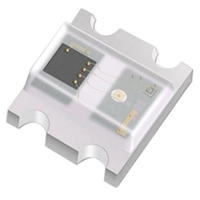
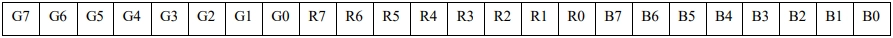
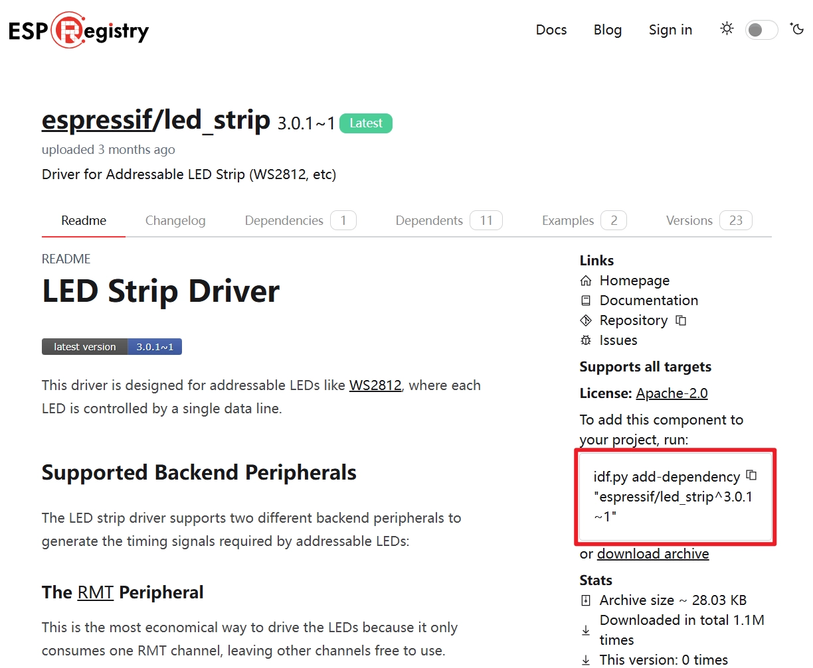
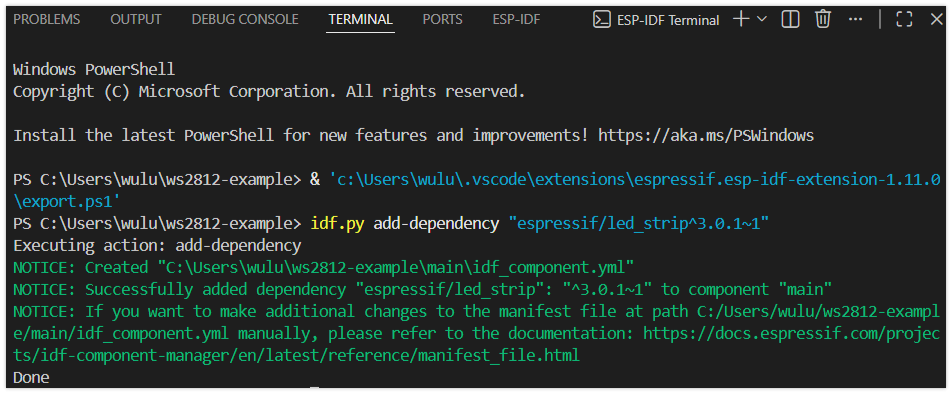
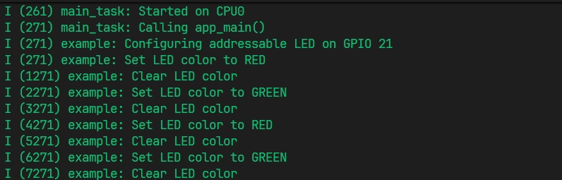

<!-- Image Reference -->
import ImgWS2812SequenceChart from './images/07-WS2812-Sequence-Chart.webp';

> This tutorial demonstrates how to use the Espressif ESP-IDF framework to drive the onboard WS2812 addressable LED on the [**Waveshare ESP32-S3-Zero Mini Development Board**](https://www.waveshare.com/esp32-s3-zero.htm) using the RMT peripheral, enabling functions such as turning the LED on and switching its color.

## 1. WS2812



### 1.1 Introduction to WS2812

The WS2812 is an intelligent RGB LED that integrates control circuitry and light-emitting circuitry into a single package, combining an RGB LED die and a control chip. It is sometimes also referred to as a "NeoPixel".

**Features**: Single-wire control, cascadable, built-in PWM driver, 24-bit color data (8-bit R, 8-bit G, 8-bit B). This means you can control multiple LEDs with a single GPIO port and set the color and brightness of each LED independently.

### 1.2 Operating Principle

Controlling WS2812 LEDs relies on a single-wire timing protocol based on pulse width modulation to transmit data.

- **Data Transmission**: Data is transmitted by sending a sequence of high and low-level pulses representing "0" and "1" codes. A complete cycle is approximately 1.25µs (TH+TL=1.25µs±600ns).

  <div style={{maxWidth:260}}> </div>

  | Parameter | Description           | Time       | Tolerance   |
  | :--- | :--------------- | :-------- | :----- |
  | T0H  | 0 code, high-level time | 0.4µs     | ±150ns |
  | T0L  | 0 code, low-level time | 0.85µs    | ±150ns |
  | T1H  | 1 code, high-level time | 0.8µs     | ±150ns |
  | T1L  | 1 code, low-level time | 0.45µs    | ±150ns |
  | RES  | Reset low-level time | > 50μs   |        |

  - "0" code: A short high-level pulse (~0.4µs) + a long low-level pulse (~0.85µs).
  - "1" code: A long high-level pulse (~0.8µs) + a short low-level pulse (~0.45µs).
  - RESET (RET) code: A sustained low-level pulse for a long duration (>50µs). When the data line remains low for more than 50µs, all LEDs will lock their current displayed color and prepare to receive the next frame of data.

- **Data Format**

  

  Data is sent as a 24-bit sequence, with 8 bits per color, transmitted most significant bit first. The sequence is typically GRB. After transmission, a low-level reset pulse of at least 50µs is required.

### 1.3 Driving Methods

Since WS2812 requires precise timing control at the microsecond or even sub-microsecond level, software-based GPIO control cannot guarantee reliability (especially when running Wi-Fi, Bluetooth, or FreeRTOS). Therefore, hardware peripherals are needed to generate precise timing signals. The two main approaches are **RMT** and **SPI**.

- **RMT (Remote Control Transceiver)**:

  - **Advantages**: Economical resource usage, typically consuming only one RMT channel.
  - **Disadvantages**: Memory usage can increase significantly with the number of LEDs. Without DMA assistance, frequent interrupts occur, increasing CPU load. If RMT interrupts are delayed (e.g., due to conflict with Wi-Fi interrupts), data transmission can be corrupted. **Therefore, if driving a large number of LEDs, enabling DMA is recommended**.

- **SPI (Serial Peripheral Interface)**:
  - **Advantages**: Generally offers more stable performance and is less affected by interrupts, especially when driving a large number of LEDs.
  - **Disadvantages**: Less economical in resource usage, as it **monopolizes the entire SPI bus**. Since WS2812 lacks a "Chip Select" signal, no other SPI devices can be connected to the same bus.

## 2. RMT Peripheral

The [Infrared Remote Control (RMT) peripheral](https://docs.espressif.com/projects/esp-idf/en/latest/esp32s3/api-reference/peripherals/rmt.html) in ESP series chips is a flexible signal transmission and reception controller. Although initially designed for infrared remote control, its "symbol" mechanism allows developers to flexibly generate arbitrary pulse sequences, making it also suitable for applications with extremely strict timing requirements, such as WS2812 LED strips.

1. **RMT Symbol**  
   The RMT hardware defines a data structure called the "[RMT symbol](https://docs.espressif.com/projects/esp-idf/en/latest/esp32s3/api-reference/peripherals/rmt.html#layout-of-rmt-symbols)". Each symbol contains two "level + duration" pairs, specifying the high/low levels and their duration in clock cycles. This allows RMT to accurately describe and output complex pulse timing sequences.

2. **Protocol Encoding**  
   Taking the WS2812 protocol as an example, its "1" code (long high + short low) and "0" code (short high + long low) can be encoded into different RMT symbols:

   - "1" code: `{ duration0: T1H, level0: 1, duration1: T1L, level1: 0 }`
   - "0" code: `{ duration0: T0H, level0: 1, duration1: T0L, level1: 0 }`  
     In this way, any data can be encoded by software into a sequence of RMT symbols.

3. **Data Conversion and Buffering**  
   When sending data, the RMT encoder converts each data bit into its corresponding RMT symbol and fills the RMT memory buffer with this sequence.

4. **Hardware-Automated Output**  
   After initiating an RMT transmission, the RMT controller automatically and precisely outputs the high/low level waveform on the specified GPIO pin according to the symbol sequence in the buffer, achieving timing control of the peripheral without CPU intervention, ensuring timing accuracy.

## 3. led_strip Component

To simplify development, Espressif provides the official [espressif/led_strip](https://components.espressif.com/components/espressif/led_strip/versions/3.0.1~1/readme) component, a driver library specifically designed for driving WS2812 and other addressable LEDs. This component encapsulates the complex underlying operations of RMT and SPI, allowing developers to control LED strips through a simple and easy-to-use API.

**Main Features**:

- Supports RMT and SPI as backend drivers, adapting to various hardware scenarios.
- Abstracts hardware details; developers only need to set LED colors without concerning themselves with low-level timing.
- Can be easily integrated into projects via the IDF component management system.

If you are interested in the underlying implementation, you can view its [source code](https://github.com/espressif/idf-extra-components/tree/master/led_strip/src).

## 4. Example Project

The following is a complete example demonstrating how to use the [espressif/led_strip](https://components.espressif.com/components/espressif/led_strip/versions/3.0.1~1/readme) component with its RMT backend to light up the onboard WS2812 LED on the [**Waveshare ESP32-S3-Zero Mini Development Board**](https://www.waveshare.com/esp32-s3-zero.htm) and make it cycle between red and green colors.

<Details>
  <summary>ESP32-S3-Zero Pinout Diagram</summary>


</Details>

### 4.1 Create Project

Create a Project. If you are unsure how to do this, please refer to [Create a Project from a Template](./03-Create-Project.md#2-create-a-project-from-a-template).

### 4.2 Add espressif/led_strip Component to Project

1. Go to the [ESP Component Registry](https://components.espressif.com/).

2. Search for the "led_strip" component ([espressif/led_strip](https://components.espressif.com/components/espressif/led_strip/versions/3.0.1~1/readme))

3. Copy the command from the right-hand side:

   ```
   idf.py add-dependency "espressif/led_strip^3.0.1~1"
   ```

   

4. Click  to open the ESP-IDF terminal, then paste the command.

   

5. Additionally, you need to include the corresponding header files in your code and call the functions provided in the component's documentation and folder. See the code section for details.

### 4.3 Example Code

```c
#include "freertos/FreeRTOS.h"
#include "freertos/task.h"
#include "esp_log.h"
#include "led_strip.h"

static const char *TAG = "example";

#define BLINK_GPIO 21 // GPIO pin connected to the LED

static led_strip_handle_t led_strip; // LED strip handle

static void configure_led(void)
{
    ESP_LOGI(TAG, "Configuring addressable LED on GPIO %d", BLINK_GPIO);

    // LED strip general configuration
    led_strip_config_t strip_config = {
        .strip_gpio_num = BLINK_GPIO,                                // Set GPIO pin
        .max_leds = 1,                                               // Set number of LEDs
        .color_component_format = LED_STRIP_COLOR_COMPONENT_FMT_RGB, // Set color format
    };

    // RMT backend-specific configuration
    led_strip_rmt_config_t rmt_config = {
        .resolution_hz = 10 * 1000 * 1000, // RMT resolution, 10MHz
        .flags.with_dma = false,           // Disable DMA
    };

    // Create LED strip object
    ESP_ERROR_CHECK(led_strip_new_rmt_device(&strip_config, &rmt_config, &led_strip));

    led_strip_clear(led_strip); // Clear the strip to off initially
}

void app_main(void)
{
    configure_led(); // Configure the LED

    while (1)
    {

        ESP_LOGI(TAG, "Set LED color to RED");
        led_strip_set_pixel(led_strip, 0, 255, 0, 0); // Set to red
        led_strip_refresh(led_strip);                 // Refresh strip to make color effective
        vTaskDelay(pdMS_TO_TICKS(1000));                // Delay for 1000 milliseconds

        ESP_LOGI(TAG, "Clear LED color");
        led_strip_clear(led_strip);      // Clear the strip, turning off LED
        vTaskDelay(pdMS_TO_TICKS(1000));                // Delay for 1000 milliseconds

        ESP_LOGI(TAG, "Set LED color to GREEN");
        led_strip_set_pixel(led_strip, 0, 0, 255, 0); // Set to green
        led_strip_refresh(led_strip);                 // Refresh strip to make color effective
        vTaskDelay(pdMS_TO_TICKS(1000));                // Delay for 1000 milliseconds

        ESP_LOGI(TAG, "Clear LED color");
        led_strip_clear(led_strip);      // Clear the strip, turning off LED
        vTaskDelay(pdMS_TO_TICKS(1000));                // Delay for 1000 milliseconds
    }
}
```

### 4.4 Build and Flash

1. Configure Flash Options

   Firstly, before building and flashing, please make sure to check and set the correct target device, serial port, and flashing method. Refer to [Section 2  Run Demo - 1.3 Configure the Project](./02-Example.md#Flash-Option).

   

2. Click  to automatically perform the build, flash, and monitor steps in sequence with one click.

3. After flashing is complete, you will see the LED on the development board start blinking. At the same time, the serial monitor will start and output the following log information:

   

### 4.5 Code Analysis

#### 1. Include Header Files

```c
#include "freertos/FreeRTOS.h"
#include "freertos/task.h"
#include "esp_log.h"
#include "led_strip.h"
```

- `freertos/FreeRTOS.h` and `freertos/task.h`: FreeRTOS core header files, providing task management functions such as `vTaskDelay` used for delays in this example.
- `esp_log.h`: The ESP-IDF logging library, used for printing information to the terminal for debugging convenience.
- `led_strip.h`: The core header file of the `led_strip` component, providing all APIs for controlling WS2812 LEDs, such as configuration, creation, color setting, and refresh.

#### 2. Define Global Variables and Macros

```c
static const char *TAG = "example";

#define BLINK_GPIO 21 // GPIO pin connected to the LED

static led_strip_handle_t led_strip; // LED strip handle
```

- `TAG`: A tag used for `esp_log` output, making it easy to identify the source of log messages.
- `BLINK_GPIO`: Defines the GPIO pin connected to the WS2812 data line. The [**Waveshare ESP32-S3-Zero Mini Development Board**](https://www.waveshare.com/esp32-s3-zero.htm) features one onboard WS2812B LED, connected to GPIO 21.
- `led_strip_handle_t led_strip`: Defines an LED strip handle. A handle is a "pointer" or "reference" to an internal driver instance. After initialization, all operations on this strip (such as setting colors, refreshing) will be performed through this handle.

#### 3. Configure and Create LED Strip

This part of the code is completed in the `configure_led()` function and is the key initialization step for driving the WS2812.

```c
// LED strip general configuration
led_strip_config_t strip_config = {
    .strip_gpio_num = BLINK_GPIO,
    .max_leds = 1,
    .color_component_format = LED_STRIP_COLOR_COMPONENT_FMT_RGB,
};

// RMT backend-specific configuration
led_strip_rmt_config_t rmt_config = {
    .resolution_hz = 10 * 1000 * 1000, // 10MHz
    .flags.with_dma = false,
};

// Create LED strip object
ESP_ERROR_CHECK(led_strip_new_rmt_device(&strip_config, &rmt_config, &led_strip));

led_strip_clear(led_strip); // Clear the strip to off initially
```

- **General Configuration (`led_strip_config_t`)**:
  - `strip_gpio_num`: Specifies the GPIO pin controlling the LED.
  - `max_leds`: The total number of LEDs on the strip. This example uses a board with only one onboard LED, so it's set to 1.
  - `color_component_format`: Specifies the format of the color components. `LED_STRIP_COLOR_COMPONENT_FMT_RGB` indicates that color data will be sent in Red, Green, Blue order. The default format for the `led_strip` component is `LED_STRIP_COLOR_COMPONENT_FMT_GRB`. Therefore, if your strip uses the common GRB order, you can omit this parameter or delete this line to use the default configuration.
- **RMT Backend Configuration (`led_strip_rmt_config_t`)**:
  - `resolution_hz`: Sets the resolution (clock frequency) of the RMT channel. 10 MHz is a common value for driving WS2812, determining the precision of the pulses generated by RMT. A resolution of 10MHz means each clock cycle is 1/10,000,000 seconds, i.e., 100ns.
  - `flags.with_dma`: Whether to enable DMA (Direct Memory Access). DMA can transfer data without occupying the CPU, which is especially beneficial for driving a large number of LEDs. Since this example uses only one LED with minimal data, DMA (`false`) is disabled (false) to conserve resources.
- **Create Device Instance**:
  - `led_strip_new_rmt_device()`: This is the core function. It initializes the RMT peripheral based on the provided general and RMT configurations and creates an LED strip driver instance. On success, the `led_strip` handle will point to this instance.
- **Clear the Strip**:
  - `led_strip_clear()`: Calling this function after initialization sets all LEDs to the off state (color 0, 0, 0), ensuring the strip starts off.

#### 4. Main Loop: Controlling LED Color

The `while(1)` loop inside the `app_main` function is the main body of the program, responsible for cyclically changing the LED's color.

```c
while (1)
{
    // Set to red
    led_strip_set_pixel(led_strip, 0, 255, 0, 0);
    led_strip_refresh(led_strip);
    vTaskDelay(pdMS_TO_TICKS(1000));

    // Turn off LED
    led_strip_clear(led_strip);
    vTaskDelay(pdMS_TO_TICKS(1000));

    // ... (Repeat for green, etc.)
}
```

- `led_strip_set_pixel(led_strip, 0, 255, 0, 0)`:
  - This function sets the color of a single pixel, but **it only updates the color buffer in memory** and does not immediately send the color to the LED.
  - Parameters are: strip handle, LED index (starting from 0), red component, green component, blue component.
- `led_strip_refresh(led_strip)`:
  - This function is the step that **actually performs data transmission**. It reads the color data from the memory buffer, encodes it into a precise timing signal via the RMT peripheral, and sends it to the GPIO pin, thereby updating the physical LED's color.
- `led_strip_clear(led_strip)`:
  - This is a convenience function that **sets the color of all LEDs in the buffer to (0, 0, 0) and then automatically calls `led_strip_refresh()`** to turn off the entire strip.
- `vTaskDelay(pdMS_TO_TICKS(1000))`:
  - FreeRTOS delay function, keeping the current color displayed for 1000 milliseconds before moving to the next state. `pdMS_TO_TICKS()` is a macro that converts milliseconds to FreeRTOS system ticks.

## 5. Reference Links

- [Espressif Lighting Solutions Introduction](https://docs.espressif.com/projects/esp-techpedia/en/latest/esp-friends/solution-introduction/light/light-solution.html)
- [espressif/led_strip Component Repository](https://components.espressif.com/components/espressif/led_strip/versions/3.0.1~1/readme)
- [Peripheral Description - RMT](https://docs.espressif.com/projects/esp-techpedia/en/latest/esp-friends/get-started/case-study/peripherals-examples/peripheral-description.html#rmt)
- [ESP32-S3-Zero Schematic](https://files.waveshare.com/wiki/ESP32-S3-Zero/ESP32-S3-Zero-Sch.pdf)