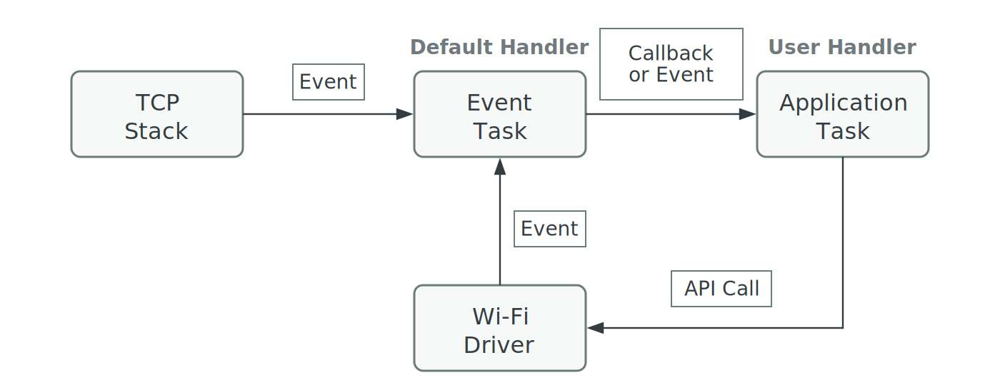
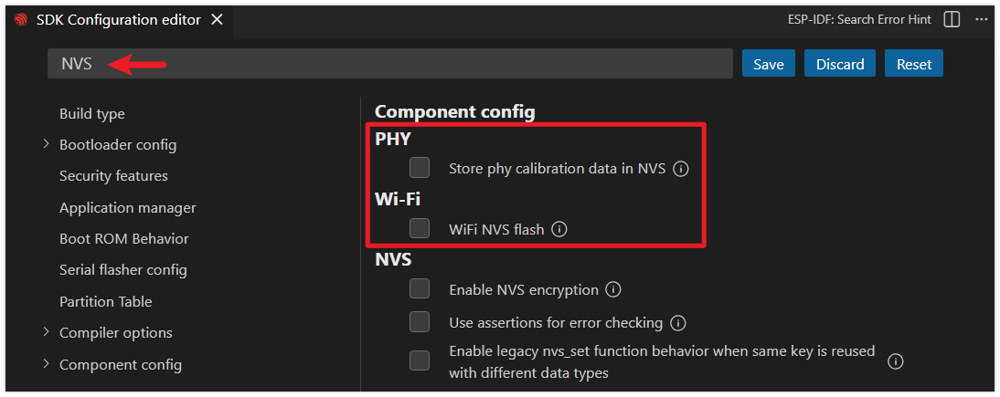
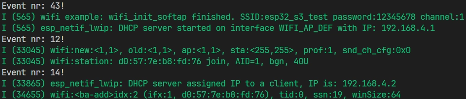

:::tip[Important Note: Development Board Compatibility]
The core logic of this tutorial applies to all ESP32 boards, but all the operation steps are explained using the example of the [**Waveshare ESP32-S3-Zero mini development board**](https://www.waveshare.com/esp32-s3-zero.htm). If you are using a development board of another model, please modify the corresponding settings according to the actual situation.
:::

> In this section, you will learn the fundamentals of the ESP32's Wi-Fi capabilities and its core programming model, and master the general steps and key code for developing Wi-Fi applications using ESP-IDF.

## 1. Overview of ESP32 Wi-Fi Capabilities

The ESP32 series chips feature powerful built-in wireless connectivity. Most ESP32 chips integrate Wi-Fi, making them very suitable for Internet of Things (IoT) projects. Some models (such as the P series and H series), designed for high-performance processing or specific application scenarios, do not integrate Wi-Fi functionality. For detailed wireless support for each model, please refer to the official [ESP32 Product Overview](https://products.espressif.com/static/Espressif%20SoC%20Product%20Portfolio.pdf) document.

- **Basic Introduction**: Most chips in the ESP32 series feature built-in 2.4 GHz Wi-Fi, and some newer models (like the ESP32-C6) support 5 GHz and Wi-Fi 6. They support protocols like 802.11b/g/n/ax and are suitable for scenarios like IoT, smart home, and industrial automation.
- **Supported Operating Modes**:
  - **Station (STA)**: Client mode, connects to an existing Wi-Fi network.
  - **SoftAP (AP)**: Access point mode, creates its own Wi-Fi network for other devices to connect to.
  - **STA+AP Coexistence**: Both modes operate simultaneously; the device connects to a router while also acting as a hotspot.
  - **Sniffer**: Monitor mode, used for capturing and analyzing Wi-Fi data packets.
- **Security Features**: Supports various security protocols like WPA2, WPA3, and enterprise-grade authentication.
- **Key Performance Parameters**: Maximum data rate up to 150 Mbps (higher on some models), support for multiple power-saving modes, multiple antenna diversity (on some models), etc.

[](https://products.espressif.com/static/Espressif%20SoC%20Product%20Portfolio.pdf)

## 2. Wi-Fi Programming Model



The Wi-Fi programming model in ESP-IDF is event-driven, with core components working together to implement networking functionality.

The Wi-Fi driver can be seen as a black box, unaware of upper-layer code (such as the TCP/IP protocol stack, application tasks, and event tasks). The application task (your code) typically calls the Wi-Fi driver APIs to initialize Wi-Fi and handle related events. The Wi-Fi driver receives these API calls, processes them, and sends events back to the application.

Wi-Fi event handling is based on the [esp_event library](https://docs.espressif.com/projects/esp-idf/en/latest/esp32s3/api-reference/system/esp_event.html). The driver sends events to the [default event loop](https://docs.espressif.com/projects/esp-idf/en/latest/esp32s3/api-reference/system/esp_event.html#default-event-loop), and the application can handle these events in callback functions registered via `esp_event_handler_register()`. The [esp_netif component](https://docs.espressif.com/projects/esp-idf/en/latest/esp32s3/api-reference/network/esp_netif.html) also handles Wi-Fi events to provide default behavior, such as automatically starting the DHCP client when the Wi-Fi Station connects to an AP.

## 3. General Steps for Wi-Fi Programming

Whether configuring as Station or AP mode, Wi-Fi programming generally follows these three phases. For more detailed flowcharts, refer to [Wi-Fi Station Process](https://docs.espressif.com/projects/esp-idf/en/latest/esp32s3/api-guides/wifi-driver/index.html) and [Wi-Fi AP Process](https://docs.espressif.com/projects/esp-idf/en/latest/esp32s3/api-guides/wifi-driver/index.html).

### Initialization Phase

1. Initialize the TCP/IP protocol stack ([LwIP](https://docs.espressif.com/projects/esp-idf/en/latest/esp32s3/api-guides/lwip.html)) and the network interface management module ([esp-netif](https://docs.espressif.com/projects/esp-idf/en/latest/esp32s3/api-reference/network/esp_netif.html)).
2. Set up the system's event-driven framework by creating the [default event loop](https://docs.espressif.com/projects/esp-idf/en/latest/esp32s3/api-reference/system/esp_event.html) (esp_event).
3. Create the default network interface(s) (e.g., STA/AP).
4. Initialize the Wi-Fi driver (esp_wifi_init). This starts relevant internal tasks, ensuring the wireless hardware and protocol stack operate correctly.

### Configuration Phase

1. Configure Wi-Fi connection parameters (e.g., SSID, password, authentication mode, etc., using the `wifi_config_t` structure).
2. Set the Wi-Fi operating mode (`esp_wifi_set_mode`).
3. Apply the configuration to the interface (`esp_wifi_set_config`).

### Connection and Event Handling Phase

1. Start Wi-Fi (`esp_wifi_start`).
2. Initiate connection (in STA mode) (`esp_wifi_connect`).
3. Handle asynchronous events like connection, disconnection, and obtaining an IP address through event callbacks.

## 4. Demo

The following example code demonstrates how to configure the ESP32 as a simple Wi-Fi Access Point (SoftAP). Other devices can search for and connect to a Wi-Fi network named `esp32_s3_test`.

This example is adapted and simplified from the official ESP-IDF example [wifi/getting_started/softAP](https://github.com/espressif/esp-idf/blob/master/examples/wifi/getting_started/softAP/main/softap_example_main.c).

1. Create a Project. If you are unsure how to do this, please refer to [Create a Project from a Template](./03-Create-Project.md#2-create-a-project-from-a-template).

2. Copy the following code into **main/main.c**:

   ```c
   #include <stdio.h>
   
   #include "freertos/FreeRTOS.h"
   #include "freertos/task.h"
   
   #include "esp_wifi.h"
   #include "esp_log.h"
   #include "string.h"
   
   static const char *TAG = "wifi example";
   
   // --- AP (Access Point) Configuration ---
   #define ESP_WIFI_SSID "esp32_s3_test"
   #define ESP_WIFI_PASS "12345678"
   #define ESP_WIFI_CHANNEL 1
   #define MAX_STA_CONN 2
   
   static void wifi_event_handler(void *arg, esp_event_base_t event_base,
                                  int32_t event_id, void *event_data)
   {
       // Simple event handling, only printing the event ID.
       // In a practical application, you would perform corresponding actions here based on different event IDs (e.g., STA connection, disconnection).
       printf("Event nr: %ld!\n", event_id);
   }
   
   void wifi_init_softap()
   {
       // 1. Initialization Phase
       // Initialize the underlying TCP/IP protocol stack
       esp_netif_init();
       // Create the default event loop
       esp_event_loop_create_default();
       // Create the default Wi-Fi AP network interface
       esp_netif_create_default_wifi_ap();
   
       // Get the default Wi-Fi initialization configuration
       wifi_init_config_t cfg = WIFI_INIT_CONFIG_DEFAULT();
       // Initialize the Wi-Fi driver based on the default configuration
       esp_wifi_init(&cfg);
       // Register a Wi-Fi event handler to listen for all Wi-Fi events
       esp_event_handler_instance_register(WIFI_EVENT,
                                           ESP_EVENT_ANY_ID,
                                           &wifi_event_handler,
                                           NULL,
                                           NULL);
   
       // 2. Configuration Phase
       // Define the Wi-Fi configuration structure
       wifi_config_t wifi_config = {
           .ap = {
               .ssid = ESP_WIFI_SSID,
               .ssid_len = strlen(ESP_WIFI_SSID),
               .channel = ESP_WIFI_CHANNEL,
               .password = ESP_WIFI_PASS,
               .max_connection = MAX_STA_CONN,
               .authmode = WIFI_AUTH_WPA2_PSK,
               .pmf_cfg = {
                   .required = true,
               },
           },
       };
   
   
       // 3. Startup Phase
       // Set the Wi-Fi operating mode to AP mode
       esp_wifi_set_mode(WIFI_MODE_AP);
       // Apply the configuration to the Wi-Fi AP interface
       esp_wifi_set_config(WIFI_IF_AP, &wifi_config);
       // Start Wi-Fi
       esp_wifi_start();
   
       // Print a log message confirming the AP has started, showing its SSID, password, and channel
       ESP_LOGI(TAG, "wifi_init_softap finished. SSID:%s password:%s channel:%d",
                ESP_WIFI_SSID, ESP_WIFI_PASS, ESP_WIFI_CHANNEL);
   }
   
   void app_main(void)
   {
       // Initialize and start the Wi-Fi AP
       wifi_init_softap();
   
       while (1)
       {
           vTaskDelay(pdMS_TO_TICKS(1000));
       }
   }
   ```

3. Disable NVS

   :::warning
   This is **not** the recommended way to store credentials. For best practices, please refer to the official ESP-IDF example [wifi/getting_started/softAP](https://github.com/espressif/esp-idf/blob/master/examples/wifi/getting_started/softAP/main/softap_example_main.c).
   :::

   Typically, Wi-Fi applications store credentials in Non-Volatile Storage (NVS). To simplify this example, we have hard-coded the AP credentials.

   NVS is enabled by default. To avoid warnings and errors, we will disable it via menuconfig.

   - Click the  icon to open the SDK Configuration Editor.

   - Search for NVS, then disable the option shown in the image.

     

   - After making the modifications, click the "Save" button.

4. Configure Flash Options

   Firstly, before building and flashing, please make sure to check and set the correct target device, serial port, and flashing method. Refer to [Section 2  Run Demo - 1.3 Configure the Project](./02-Example.md#Flash-Option).

   

5. Click  to automatically perform the build, flash, and monitor steps in sequence with one click.

6. After flashing completes, the serial monitor will start printing information. You should see some logs and event numbers.

   

   - Use a smartphone to connect to the ESP32's hotspot. At this point, you should see `Event nr: 14!` in the terminal, which corresponds to `WIFI_EVENT_AP_STACONNECTED` (enumeration values can be viewed on [GitHub](https://github.com/espressif/esp-idf/blob/c5865270b50529cd32353f588d8a917d89f3dba4/components/esp_wifi/include/esp_wifi_types_generic.h#L964), where enumeration values start from 0.)

## 5. Next Step

After successfully connecting to the network, the next step is to implement specific application functionality. ESP-IDF provides rich support for application-layer protocols:

- **HTTP/HTTPS Client/Server**: For exchanging data with Web servers or using the ESP32 as a small Web server.
- **MQTT**: A lightweight publish/subscribe messaging protocol, the preferred solution for communication between IoT devices and cloud platforms.
- **WebSocket**: Provides a full-duplex communication channel, suitable for real-time data exchange scenarios.
- **SNTP (Simple Network Time Protocol)**: Synchronizes the ESP32 system time from Internet time servers, crucial for applications requiring accurate timestamps.
- **mDNS (Multicast DNS)**: Allows accessing devices on the local network by hostname (e.g., `my-esp32.local`) without needing to know the IP address, simplifying the device discovery process.

You can find example code for these protocols in the ESP-IDF **[examples/protocols](https://github.com/espressif/esp-idf/tree/master/examples/protocols)** directory.

## 6. Reference Links

- [ESP Friends - Wi-Fi Examples](https://docs.espressif.com/projects/esp-techpedia/en/latest/esp-friends/get-started/case-study/wifi-examples/index.html)
- [ESP-IDF Programming Guide - Wi-Fi Driver](https://docs.espressif.com/projects/esp-idf/en/latest/esp32s3/api-guides/wifi-driver/index.html)
- [ESP-IDF Basics: Your First Project with ESP32-C3 and Components](https://developer.espressif.com/workshops/esp-idf-basic/)
- [ESP-IDF Programming Guide - lwIP](https://docs.espressif.com/projects/esp-idf/en/latest/esp32s3/api-guides/lwip.html)
- [ESP-IDF Official Examples - examples/protocols](https://github.com/espressif/esp-idf/tree/master/examples/protocols)
- [API Reference - Application Layer Protocols](https://docs.espressif.com/projects/esp-idf/en/latest/esp32s3/api-reference/protocols/index.html)
