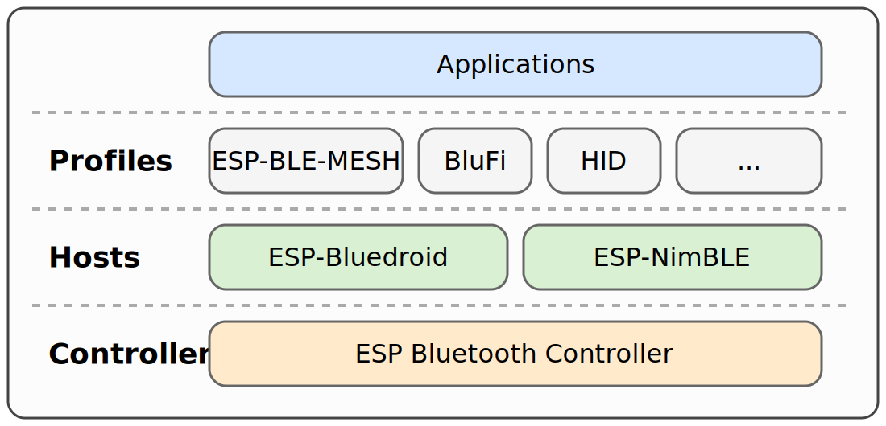
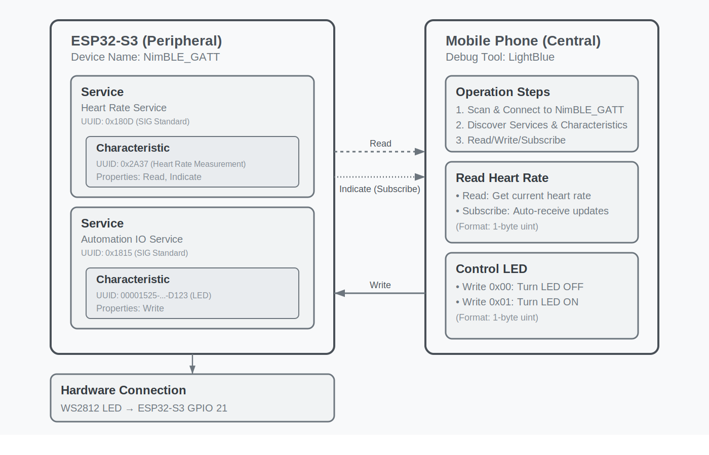
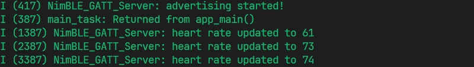
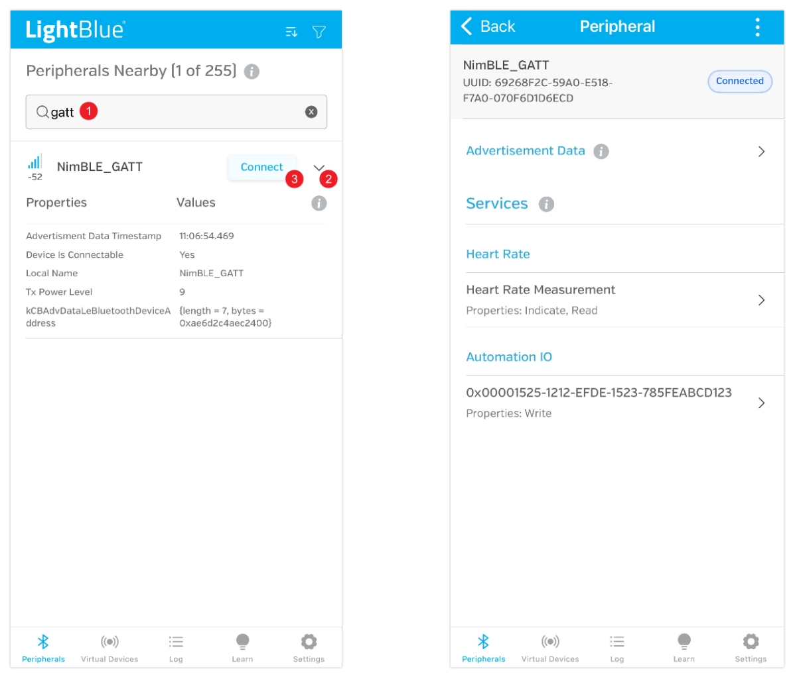
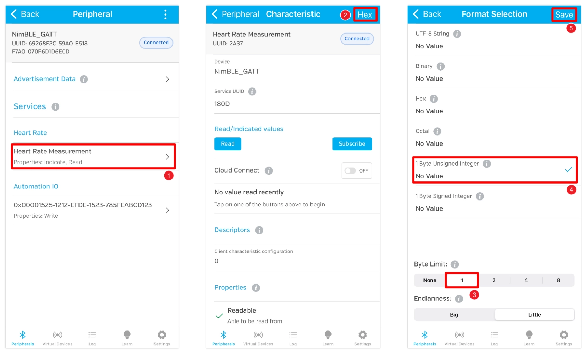
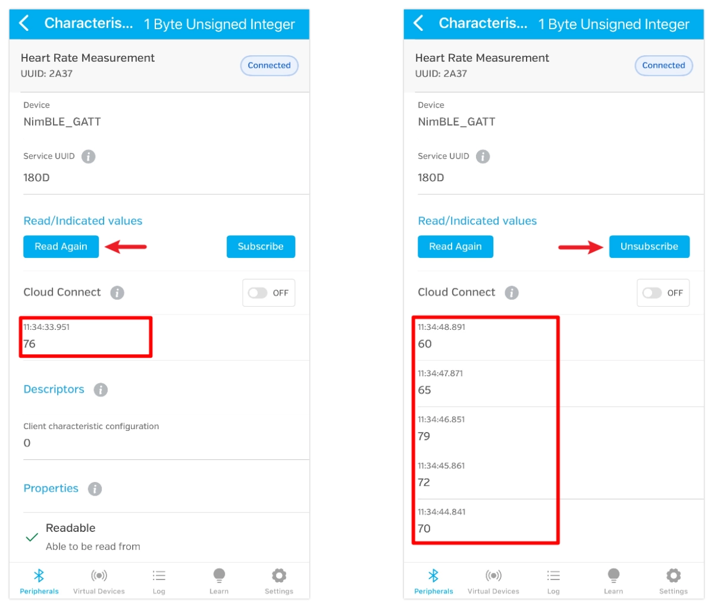
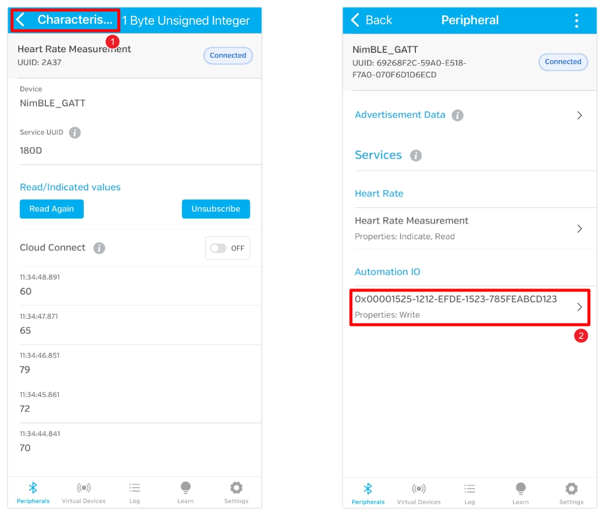

<!-- Image Reference -->

:::tip[Important Note: Development Board Compatibility]
The core logic of this tutorial applies to all ESP32 boards, but all the operation steps are explained using the example of the [**Waveshare ESP32-S3-Zero mini development board**](https://www.waveshare.com/esp32-s3-zero.htm). If you are using a development board of another model, please modify the corresponding settings according to the actual situation.
:::

> This section introduces the fundamentals of ESP32's Bluetooth Low Energy (BLE) and demonstrates the process of creating BLE services and characteristics, as well as using a mobile app for Bluetooth communication with the development board, through a GATT server example.

## 0. Bluetooth

The ESP32 series of chips feature powerful built-in Bluetooth functionality, making them an ideal choice for smart wearables, wireless sensing, and near-field communication between devices. Bluetooth technology is divided into two main types:

- **Bluetooth Classic**: Designed for continuous, high-throughput data transmission, commonly found in wireless audio devices.
- **Bluetooth Low Energy (BLE)**: Optimized for low-power, intermittent, small-packet communication. It is the mainstream choice for Internet of Things (IoT) applications, such as smart wristbands and wireless sensors.

Bluetooth support varies among ESP32 chips:

- Classic ESP32 chips support both Bluetooth Classic and BLE;
- Subsequent new models only support BLE (for specific support details, please check the [ESP32 Product Overview](https://products.espressif.com/static/Espressif%20SoC%20Product%20Portfolio.pdf)). In fields like IoT and wearables, BLE is the preferred choice due to its low power consumption and high compatibility.

This tutorial focuses on the application of Bluetooth Low Energy (BLE) technology.

## 1. Bluetooth Low Energy (BLE) Overview

BLE (Bluetooth Low Energy) is a wireless communication protocol designed specifically for low-power, intermittent data transmission. It was introduced in the Bluetooth 4.0 standard and is not backward compatible with Bluetooth Classic. Typical application scenarios for BLE include Internet of Things (IoT) devices, smart switches, smart sensors, and wearable devices. Compared to Bluetooth Classic, BLE has a lower communication rate but extremely low power consumption, making it very suitable for devices requiring long battery life.

ESP-IDF (Espressif IoT Development Framework) provides complete BLE protocol stack support for the ESP32 series chips. Its BLE protocol stack adopts a layered architecture, mainly including:

- **Bluetooth Controller Layer (Controller)**: Responsible for low-level hardware interfaces and link management.
- **Bluetooth Host Layer (Host)**: ESP-IDF supports two host protocol stacks:
  - **ESP-Bluedroid**: Supports Bluetooth Classic and BLE (some chips only support BLE). It has a clear architecture but consumes more resources.
  - **ESP-NimBLE**: Supports BLE only, with smaller resource footprint, suitable for scenarios with high requirements for memory and firmware size.
- **Bluetooth Profile Layer (Profiles)**: Such as ESP-BLE-MESH (based on Zephyr Mesh protocol stack), BluFi (configuring Wi-Fi via BLE), etc.
- **Application Layer (Applications)**: Developers can create various BLE applications based on the above APIs and profiles.

## 2. Key BLE Protocols

The core BLE protocols include GAP (Generic Access Profile, responsible for device discovery, connection management, advertising, etc.) and GATT (Generic Attribute Profile, which defines the format for data communication). For a detailed introduction, please refer to [ESP32 Arduino Getting Started Tutorial - BLE Basic Concepts](../Arduino-Tutorials/11-Bluetooth-Communication.md#ble-basic-concepts) and [The Layered Architecture of BLE](https://docs.espressif.com/projects/esp-idf/en/latest/esp32s3/api-guides/ble/get-started/ble-introduction.html#layered-architecture-of-bluetooth-le).

- **GAP (Generic Access Profile)**: Defines device discovery, connection management, advertising, etc. It specifies device connection behaviors and roles (such as advertiser, scanner, initiator, peripheral, central device) and supports multi-role and multi-connection topologies.
- **GATT/ATT (Generic Attribute Profile / Attribute Protocol)**: Defines how data is represented and exchanged. ATT uses attributes as the basic data structure and adopts a client/server architecture. GATT, building on ATT, defines concepts like Characteristic, Service, and Profile to achieve layered and reusable data structures.
- **L2CAP (Logical Link Control and Adaptation Protocol)**: Responsible for data segmentation, reassembly, and multiplexing, providing data channels for upper-layer protocols.
- **SMP (Security Manager Protocol)**: Responsible for authentication, encryption, and secure pairing.

## 3. Demo

Based on the official code example [NimBLE_GATT_Server](https://github.com/espressif/esp-idf/tree/5c5eb99e/examples/bluetooth/ble_get_started/nimble/NimBLE_GATT_Server), this section demonstrates how to implement a Bluetooth Low Energy application on ESP32-S3 using ESP-IDF. It uses the **[LightBlue](https://punchthrough.com/lightblue/)** mobile debugging app to control an LED and read simulated heart rate data, establishing an intuitive understanding of BLE functionality. For an alternative method using **[nRF Connect for Mobile](https://www.nordicsemi.com/Products/Development-tools/nRF-Connect-for-mobile)**, please refer to the [ESP-IDF Programming Guide - BLE Getting Started Guide](https://docs.espressif.com/projects/esp-idf/en/latest/esp32s3/api-guides/ble/get-started/ble-introduction.html#hands-on-practice).

### 3.1 Open the Example Project

1. Open VS Code and click the icon to start the ESP-IDF extension. Under the "Advanced" option, click "Show Example Project".

   

2. Select your ESP-IDF version.

   

3. In the example list under the "bluetooth" category, select "NimBLE_GATT_Server". Then, click "Select location for creating NimBLE_GATT_Server project" to choose the folder for storing the project.

   The ESP-IDF extension will automatically copy the sample code to the specified location and open a new project.

   :::warning
   The project path should not contain spaces, Chinese characters, or special characters.
   :::

   

### 3.2 Modify Project Configuration

This example project is configured with a default LED for status indication. To allow the program to correctly control the onboard LED of the development board, you need to modify the LED type and GPIO pin according to the actual hardware connections of your board.

1. Click  to open the SDK configuration editor.

   Unlike the command-line configuration tool (TUI) provided by `idf.py menuconfig`, the ESP-IDF VS Code plugin offers a more intuitive graphical configuration interface.

2. Modify the configuration according to the onboard LED of the development board:

   

   - Blink LED type: Select the LED type.
     - `GPIO`: Regular LED.
     - `LED strip`: Addressable LED (such as WS2812).
   - Blink GPIO number: Set the GPIO pin number connected to the LED.
   - Blink period in ms: Set the period of LED blinking (unit: milliseconds).

   :::info
   This tutorial uses the [**Waveshare ESP32-S3-Zero Mini Development Board**](https://www.waveshare.com/esp32-s3-zero.htm), which has a WS2812 addressable LED connected to GPIO 21 pin.
   :::

3. After making the modifications, click the "Save" button.

### 3.3 Build, Flash and Monitor

1. Configure Flash Options

   Firstly, before building and flashing, please make sure to check and set the correct target device, serial port, and flashing method. Refer to [Section 2  Run Demo - 1.3 Configure the Project](./02-Example.md#Flash-Option).

   

2. Click  to automatically perform the build, flash, and monitor steps in sequence with one click.

3. After flashing completes, the serial monitor will start printing information. You will see BLE initialization logs, as well as randomly generated heart rate data updating within the range of 60-80 at a frequency of approximately 1 Hz.

   

### 3.4 Connect to the Development Board via Bluetooth

:::tip
This example requires a Bluetooth debugging tool, such as [LightBlue](https://apps.apple.com/us/app/lightblue/id557428110). iOS users can download it from the [Apple Store](https://apps.apple.com/us/app/lightblue/id557428110). Android users can search for LightBlue in their app store.
:::

Open LightBlue and follow these steps:

- **Connect to the Development Board**:

  First, search for "GATT" and find the "NimBLE_GATT" device. Click the button on the right to expand and view the advertising information, then click "Connect".

  
 

  On the device details page, you can see the device has two services, each with one characteristic. Both services use [standard Bluetooth SIG UUIDs](https://www.bluetooth.com/specifications/assigned-numbers/), so they are automatically recognized as "Heart Rate" and "Automation IO", providing heart rate data reading and LED control functions respectively.

- **Receive Heart Rate Data**:

  Click to enter the "Heart Rate Measurement" characteristic. Then click "HEX" in the top right corner to set the data type. Set "Byte Limit" to 1, select "1 Byte Unsigned Integer", and save for easier data viewing later.

  
 

  After saving, return to the characteristic details page and click "Read" to read the data. You can also click "Subscribe" to subscribe to data; updates will be pushed automatically when the heart rate value changes.

  
 

- **Control the LED**:

  Click the back button in the top left corner to return to the previous page. Then enter the characteristic with UUID "0x00001525-1212-EFDE-1523-785FEABCD123".
  
  This UUID is not a Bluetooth SIG-defined standard UUID, so it is not automatically recognized and is displayed as the raw UUID. (In Nordic Semiconductor's nRF Connect for Mobile app, it can be recognized as an LED characteristic.)

  
 

  It is actually a UUID widely used in example code by several well-known vendors, particularly Nordic Semiconductor, typically representing an LED state characteristic. It accepts a 1-byte integer: writing `0x01` means "on", and writing `0x00` means "off".
  
  Click "Write new value", write the value 1, and the LED will light up. If you write the value 0, the LED will turn off.

  
 

  

## 5. Reference Links

- [ESP Friends - BLE Examples](https://docs.espressif.com/projects/esp-techpedia/en/latest/esp-friends/get-started/case-study/BLE-examples/index.html)
- [ESP Friends - BLE Examples - General Steps](https://docs.espressif.com/projects/esp-techpedia/en/latest/esp-friends/get-started/case-study/BLE-examples/general-steps.html)
- [API Guide - Bluetooth Low Energy ®](https://docs.espressif.com/projects/esp-idf/en/latest/esp32s3/api-guides/ble/index.html)
- [API Guide - Bluetooth Low Energy ® - Getting Started](https://docs.espressif.com/projects/esp-idf/en/latest/esp32s3/api-guides/ble/get-started/ble-introduction.html)