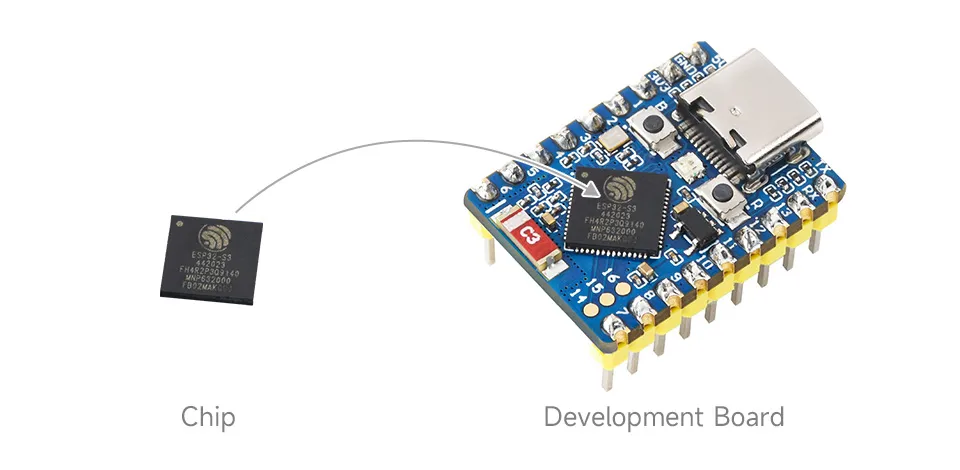
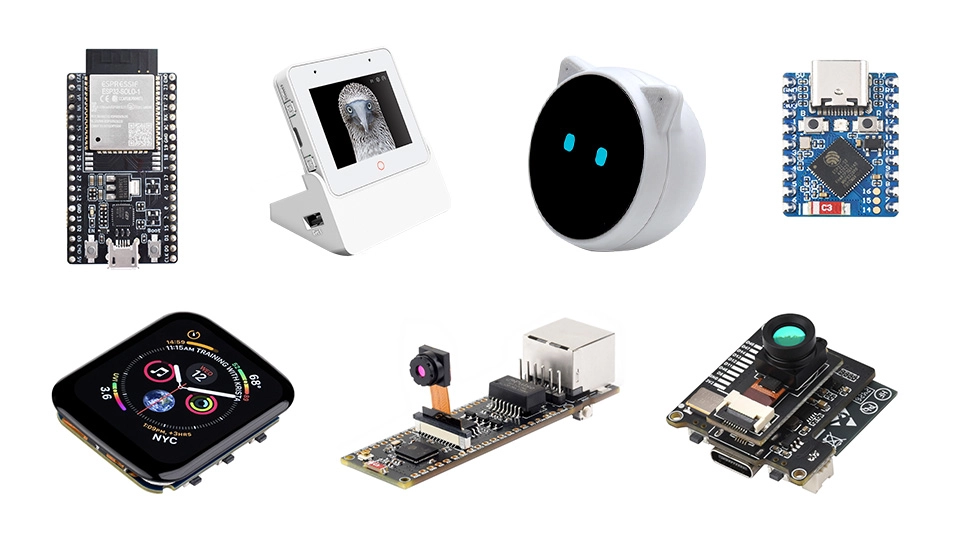
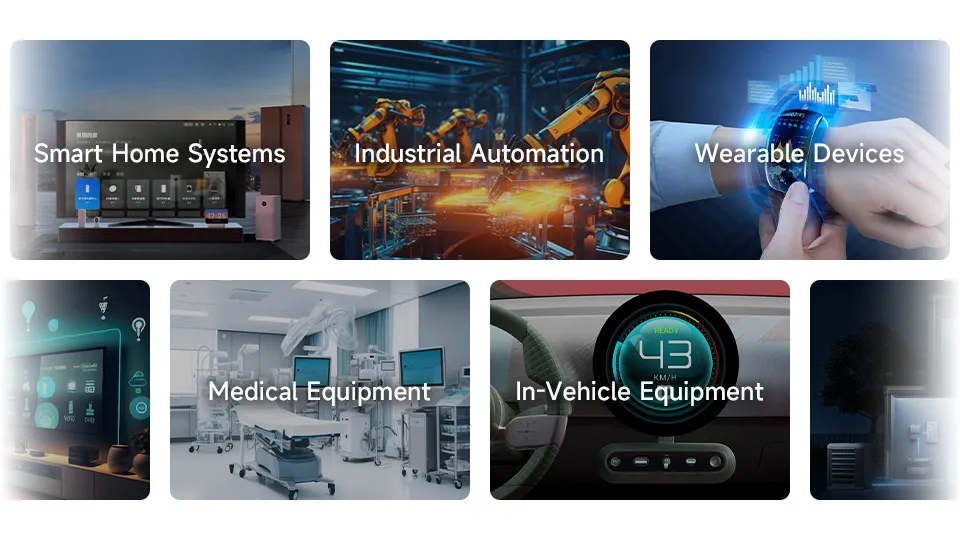

# Getting to Know ESP32

ESP32 is a series of System-on-Chip (SoC) developed by Espressif Systems. These chips integrate Wi-Fi and Bluetooth capabilities and are characterized by high cost-effectiveness, low power consumption, and stable performance, making them widely used in the Internet of Things (IoT) and smart home sectors.

Espressif continues to release various ESP32 chips, forming a complete product line. Although **[different models](https://products.espressif.com/static/Espressif%20SoC%20Product%20Portfolio.pdf)** vary in processor cores, specific functions, and pin configurations, they can all be developed using Espressif's unified Software Development Kit (SDK). This ensures good code compatibility and a consistent development experience.

The following is a comparison of some models:

| Model    | Processor            | Wi-Fi | Bluetooth         | Key Features                            | Application Scenarios         |
| -------- | -------------------- | ----- | ----------------- | --------------------------------------- | ----------------------------- |
| ESP32    | Single/Dual-core     | ✓     | Classic + BLE 4.2 | Comprehensive features, strong performance | General development, complex apps |
| ESP32-C3 | Single-core RISC-V   | ✓     | BLE 5.0           | Low cost, RISC-V architecture           | Cost-sensitive projects       |
| ESP32-C6 | Single-core RISC-V   | ✓     | BLE 5.3           | Supports Wi-Fi 6, Zigbee/Matter         | Next-gen smart homes          |
| ESP32-S2 | Single-core          | ✓     | ✗                 | Enhanced security, USB support          | High-security applications    |
| ESP32-S3 | Dual-core            | ✓     | BLE 5.0           | AI acceleration, camera support         | AI/ML apps, image processing  |
| ESP32-P4 | Dual-core RISC-V     | ✗     | ✗                 | High-perf processor (360MHz), MIPI support | Industrial HMI, Edge AI       |

## 1. ESP32 Development Boards

The ESP32 chip is powerful, but developing directly with the chip requires designing complex peripheral circuits, including power management, clock circuits, and RF matching. This poses a high barrier for beginners. Development boards effectively solve this problem.

ESP32 development boards integrate the core chip with necessary peripheral circuits onto a single Printed Circuit Board (PCB), allowing developers to focus on software functionality without spending excessive energy on hardware design. For learning, testing, and prototyping, development boards are a more practical and efficient choice.

Here are the key functions provided by development boards:

- **Built-in Power Module**: Ensures a stable power supply.
- **USB Interface**: Used for data transmission and powering the board.
- **Programming Interface**: Supports convenient software flashing and debugging.
- **Peripheral Interfaces**: Extensive GPIO pins for connecting sensors and other external devices.
- **Status LEDs and Wi-Fi Antenna**: Used to indicate power status and ensure wireless communication performance.

There are many forms of ESP32 development boards on the market. Their core functions are similar, but different models focus on specific project needs regarding size, pin layout, and onboard resources. Some development boards are even equipped with additional components like sensors, cameras, and display screens.

## 2. ESP32 Development Platforms

ESP32 supports various development methods. You can use Espressif's official ESP-IDF framework for professional development, or choose platforms like Arduino IDE or MicroPython for rapid prototyping.

The main development platforms include:

- **ESP-IDF**: Espressif's official development framework, designed specifically for the ESP32 series. It provides a complete toolchain, code libraries, and documentation. It allows developers to fully utilize the performance and features of the ESP32 and is the preferred choice for professional development and commercial products.

- **Arduino**: A renowned open-source hardware and software platform providing a simple, standard C++ interface that supports many microcontrollers, including the ESP32. Arduino boasts a rich library and example codes, making it widely used for prototyping and education, and is a popular entry-level platform for beginners. You can refer to: [Waveshare ESP32 Arduino Tutorial](/docs/ESP32/Tutorials/Arduino-Tutorials/index.md).

- **MicroPython**: A lean version of Python 3, containing core functions and optimized for microcontroller environments. It supports immediate execution without repeated compilation and flashing, offering an effective way for Python-savvy developers to get started with ESP32 quickly.

- **Other Development Methods**: The ESP32 development ecosystem is very rich. In addition to the platforms mentioned above, it supports development via PlatformIO, Mongoose OS, Espruino (JavaScript), ESPHome, and others, meeting the needs of developers with different technical backgrounds.

## 3. What Can ESP32 Do?

The powerful features and flexibility of the ESP32 make it the foundation for numerous innovative applications. It has broad application prospects in fields such as smart homes, wearable devices, wireless sensor networks, robotics, industrial automation, and countless creative projects.

## 4. Conclusion

With its high cost-performance ratio, rich features, and mature development ecosystem, the ESP32 has become one of the mainstream IoT development platforms globally. It is suitable not only for professional developers building commercial products but also offers a friendly entry experience for beginners.

Whether used for:

- Learning embedded development and IoT technology
- Rapidly validating creative ideas and prototyping
- Developing smart hardware products
- Or simply enjoying the fun of hands-on creation

ESP32 provides strong support for all these endeavors.