<!-- Image Reference -->


> This tutorial will introduce MicroPython and guide you through configuring the MicroPython development environment for ESP32.

:::tip[Important: About board compatibility]
The core logic of this tutorial applies to all ESP32 boards, but all the operation steps are explained using the example of the [**Waveshare ESP32-S3-Zero mini development board**](https://www.waveshare.com/esp32-s3-zero.htm). If you are using a development board of another model, please modify the corresponding settings according to the actual situation.
:::

## 1. What is MicroPython?

MicroPython is a lean and efficient implementation of the Python 3 programming language, specifically optimized to run on microcontrollers and other resource-constrained environments.

MicroPython supports various microcontroller platforms. It can run on devices with as little as 256KB of flash memory and 16KB of RAM. However, you will get the most complete and smoothest experience on hardware like ESP32, which has more than 512KB of flash and 128KB of RAM.

In simple terms, MicroPython is a "miniature version" of Python that runs on microcontrollers. It allows developers to control hardware using Python syntax, lowering the barrier to entry for embedded development.

### 1.1 How It Works

MicroPython's operation primarily relies on firmware (Firmware) flashed into the device.

1. **Interactive Interpreter (REPL)**:
   When the MicroPython firmware starts, it runs a miniature Python interpreter and enters a standby state. At this point, via a serial connection, the user can access the **REPL** (Read-Eval-Print Loop) environment. Python commands sent in this environment are executed immediately, and results are returned. This immediate feedback mechanism significantly improves debugging efficiency.
2. **File Execution Mechanism**:
   In addition to interactive input, MicroPython also supports running code saved in the file system. When the device boots, it will sequentially try to run `boot.py` (the system boot script) and `main.py` (the user's main program). Saving code as `main.py` enables the program to run automatically on device power-up.

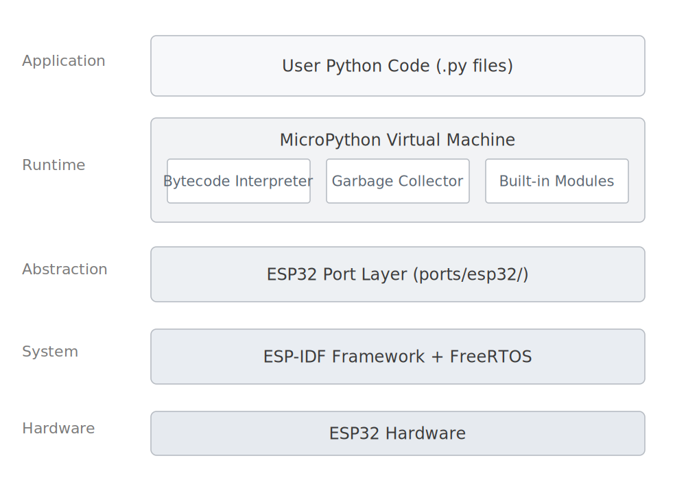

<!-- ```
┌─────────────────────────────────┐
│    Python User Code (.py files)        │
├─────────────────────────────────┤
│    MicroPython Virtual Machine (VM)         │
│  ┌─────────────┬─────────────────┤
│  │  Bytecode Interpreter  │   Garbage Collector │
│  ├─────────────┼─────────────────┤
│  │   Object System  │     Built-in Modules      │
├──┴─────────────┴─────────────────┤
│      Hardware Abstraction Layer (HAL)             │
├─────────────────────────────────┤
│      ESP-IDF/FreeRTOS           │
├─────────────────────────────────┤
│        ESP32 Hardware               │
└─────────────────────────────────┘
``` -->

### 1.2 Differences from Standard Python

- **Independent Implementation**: MicroPython is not a modified version of standard Python (CPython) source code. It is written from scratch for embedded environments. It strictly adheres to Python 3 syntax, but its internal implementation differs.
- **Feature Subset**: Due to the very limited memory (RAM) and flash memory (Flash) on microcontrollers, MicroPython includes only a subset of standard Python's core libraries. Some large or inapplicable libraries (like the full versions of `numpy` or `requests`) are removed or replaced with more streamlined modules.
- **Hardware Support**: MicroPython's biggest feature is the addition of modules for hardware control, such as the `machine` module (for GPIO, I2C, SPI, etc.) and the `network` module (for Wi-Fi, Bluetooth).
- **Cross-Platform**: Besides ESP32, MicroPython supports many other development boards, such as the STM32 series, ESP8266, Raspberry Pi Pico (RP2040), and more.

### 1.3 Comparison with Other ESP32 Development Methods

| Feature     | MicroPython | Arduino | ESP-IDF |
| -------- | ----------- | ------- | ------- |
| Learning Difficulty | Low | Medium | High |
| Development Efficiency | High  | Medium  | Low     |
| Performance   | Medium      | High    | Highest |
| Memory Footprint | Relatively High | Medium  | Controllable |

## 2. Setting up the Development Environment{#setup-micropython}

[Thonny](https://thonny.org/) is a beginner-friendly Python Integrated Development Environment (IDE). It has built-in, comprehensive support for MicroPython, allowing you to easily perform all operations such as firmware flashing, file management, and code debugging.

:::note
The following content in this tutorial will be demonstrated using the **Thonny IDE**.
:::

### 2.1 Installing Thonny

Go to the [Thonny website](https://thonny.org/) to download and install Thonny.

[](https://thonny.org/)

### 2.2 Flashing MicroPython Firmware{#install-micropython-firmware}

MicroPython needs to run on its specific firmware, so you must flash the corresponding firmware before first use. Here are two methods to flash the firmware.

import Tabs from '@theme/Tabs';
import TabItem from '@theme/TabItem';

import EspInstallButton from '@site/src/components/EspInstallButton';

<Tabs queryString="install-method">
  <TabItem value="thonny" label="Via Thonny" default>

    :::note
    This method is simple to operate and suitable for most scenarios. Thonny will automatically download the firmware.
    :::

    1. **Connect the development board**: Connect the ESP32 development board to your computer using a USB cable.

       :::info
       If you encounter connection timeouts or flashing failures in subsequent steps, try manually entering download mode: Hold down the **BOOT** button on the board, then plug in the USB cable, and finally release the **BOOT** button.
       :::
    2. **Configure the interpreter**: Open Thonny, click the interpreter status box in the bottom right corner (initially it may show 'Local Python'), then select `Configure interpreter`.

       <div style={{maxWidth:700}}> 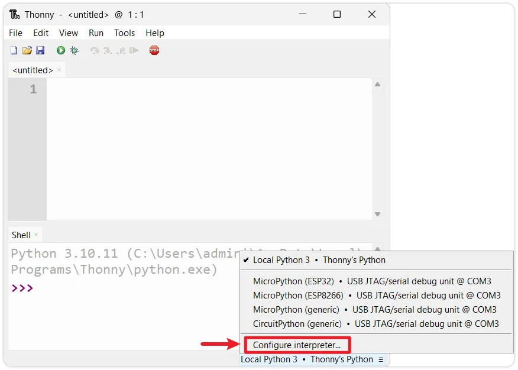</div>

    3. **Open the firmware flashing tool**: In the pop-up window, select the `MicroPython(ESP32)` interpreter and the corresponding port for your development board. Then, click the `Install or update MicroPython(esptool)` link in the bottom right.

       <div style={{maxWidth:550}}> 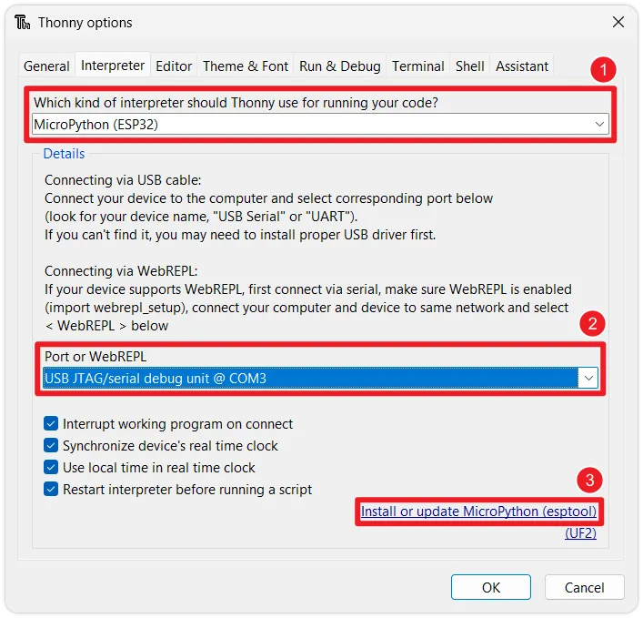</div>

    4. **Select firmware**: Configure the following parameters in the `Install MicroPython(esptool)` window:

       :::info
       If the interface options are greyed out, wait for Thonny to update the firmware list via the internet. If the firmware list cannot be refreshed, please use the [**Via Thonny (Custom Firmware)**](/docs/ESP32/Tutorials/MicroPython-Tutorials/01-Setup.md?install-method=thonny-custom#install-micropython-firmware)  installation method.
       :::
      
       <div style={{maxWidth:600}}> 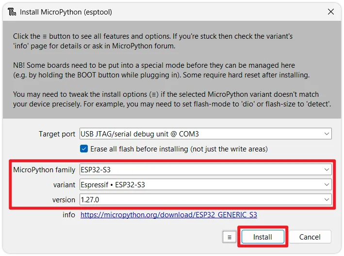</div>

       - **Target port**: Select the port corresponding to your ESP32 device (if unsure, unplug and replug the device to see which port disappears and reappears).
       - **MicroPython family**: Choose the chip model according to your actual hardware.
       - **variant**: Choose the generic `Espressif xxx`.
       - **version**: It is recommended to select the latest stable version.

    5. **Start flashing**: Click `Install`. Thonny will automatically erase the flash memory and flash the new MicroPython firmware. Wait for the progress bar to complete until you see the `Done!` prompt.

       <div style={{maxWidth:600}}> 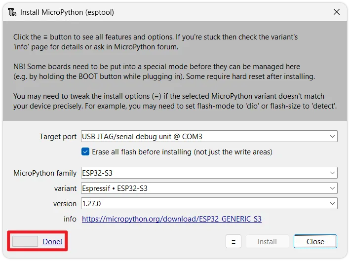</div>

  </TabItem>
  <TabItem value="thonny-custom" label="Via Thonny (Custom Firmware)" default>
  
     :::note
    When you need to flash a specific firmware version (such as an older or beta version), you can flash a local firmware file through Thonny.
    :::

    1. **Download the firmware**: Go to the [MicroPython official website firmware download page](https://micropython.org/download/?port=esp32). Select and download the latest stable version `.bin` firmware corresponding to your ESP32 chip model (e.g., ESP32, ESP32-S2, ESP32-S3) to your local machine.

       <div style={{maxWidth:550}}> 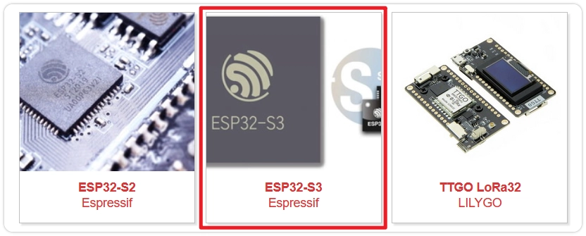</div>
       <div style={{maxWidth:550}}> 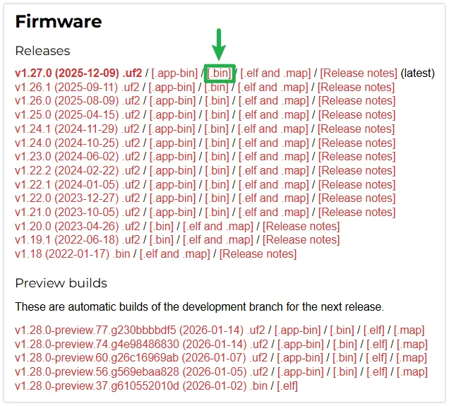</div>

    2. **Connect the development board**: Connect the ESP32 development board to your computer using a USB cable.

       :::info
       If you encounter connection timeouts or flashing failures in subsequent steps, try manually entering download mode: Hold down the **BOOT** button on the board, then plug in the USB cable, and finally release the **BOOT** button.
       :::

    3. **Configure the interpreter**: Open Thonny, click the interpreter status box in the bottom right corner (initially it may show 'Local Python'), then select `Configure interpreter`.

       <div style={{maxWidth:700}}> </div>

    4. **Open the firmware flashing tool**: In the pop-up window, select the `MicroPython(ESP32)` interpreter and the corresponding port for your development board. Then, click the `Install or update MicroPython(esptool)` link in the bottom right.

       <div style={{maxWidth:550}}> </div>

    5. **Select local firmware**: In the `Install MicroPython(esptool)` window, click the `☰` button in the bottom right corner, then click `Select local MicroPython image` to choose a local firmware file.

       <div style={{maxWidth:650}}> 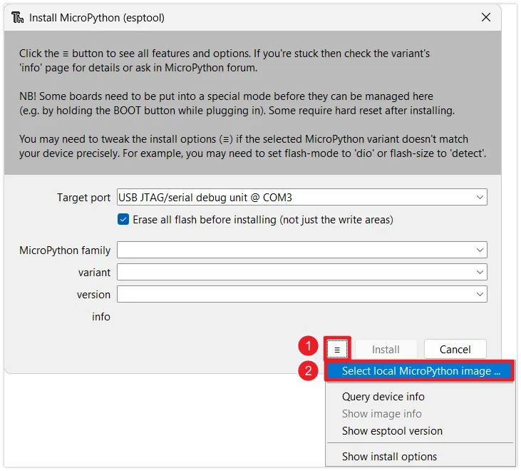</div>

    6. **Start flashing**: Click `Install`. Thonny will automatically erase the flash memory and flash the new MicroPython firmware. Wait for the progress bar to complete until you see the `Done!` prompt.

       <div style={{maxWidth:600}}> 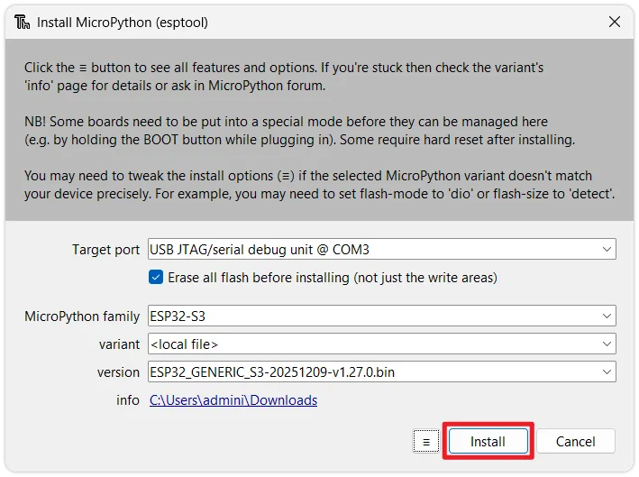</div>
       <div style={{maxWidth:600}}> 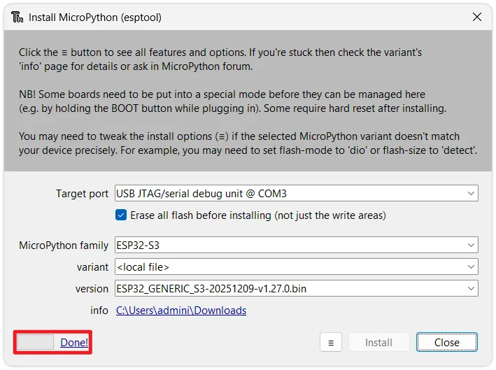</div>

  </TabItem>
  <TabItem value="esp_web_tools" label="Web Quick Flash">

  :::note
    Flash MicroPython firmware quickly through the following method without installing any tools. **Please use Chrome or Edge browser to access this page.**

    **This method currently only supports ESP32-S3, ESP32-C3, and ESP32-C6 development boards.**
  :::

  :::info
    First, manually put the development board into download mode: Hold down the BOOT button on the board, then plug in the USB cable, and finally release the BOOT button.
  :::

  1. Click the button below to connect the device and start flashing the MicroPython firmware.

     <EspInstallButton manifest="/firmware/MicroPython/manifest.json" />

  2. Select the corresponding serial port in the top-left corner of the browser.

     <div style={{maxWidth:400}}> 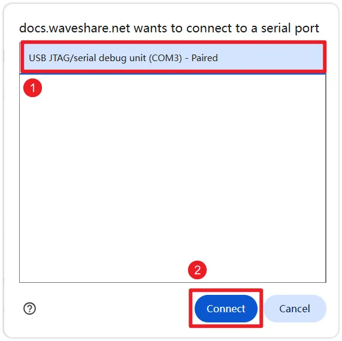</div>

  3. Click the "Install MicroPython Firmware" button, then click the "Install" button again in the pop-up window to confirm flashing the firmware.

     <div style={{maxWidth:700}}> 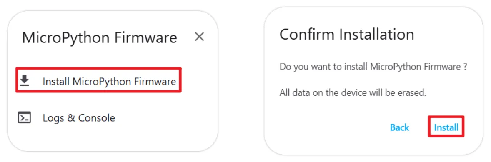</div>
   
  4. Wait for the flashing to complete until you see the "Installation completed!" prompt. You can close the flashing window after completion.

     <div style={{maxWidth:700}}> 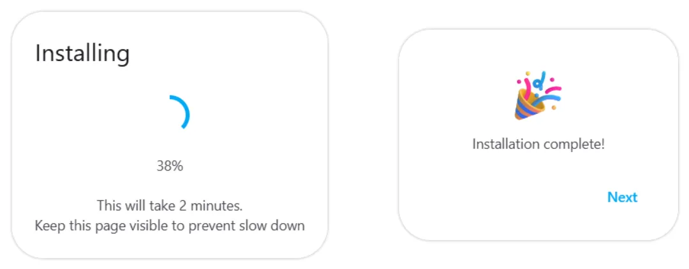</div>
  
  </TabItem>
  <TabItem value="flash_download_tool" label="Via Espressif Flash Download Tool">

    :::note
    Use Espressif's official flashing tool when you only need to flash the firmware.
    :::

    :::info
    If you encounter connection timeouts or flashing failures in subsequent steps, try manually entering download mode: Hold down the **BOOT** button on the board, then plug in the USB cable, and finally release the **BOOT** button.
    :::

    1. **Download the firmware**: Go to the [MicroPython official website firmware download page](https://micropython.org/download/?port=esp32). Choose the latest stable version `.bin` firmware corresponding to your ESP32 chip model (e.g., ESP32, ESP32-S2, ESP32-S3) and download it to your local machine.

       <div style={{maxWidth:550}}> </div>
       <div style={{maxWidth:550}}> </div>

    2. **Download the flashing tool**: Download the official Espressif [Flash Download Tool](https://dl.espressif.com/public/flash_download_tool.zip).

    3. **Configure the tool**: Unzip and run `flash_download_tool.exe`.

       <div style={{maxWidth:200}}> 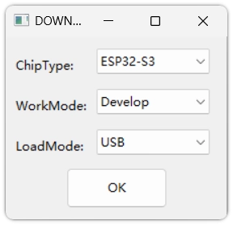</div>

       - Select `ESP32-S3` (or the corresponding model) in `ChipType`.
       - Select `Develop` in `WorkMode`.
       - Select `USB` in `LoadMode`.

       For detailed explanations of the options, refer to: [Flash Download Tool User Guide](https://docs.espressif.com/projects/esp-test-tools/en/latest/esp32s3/production_stage/tools/flash_download_tool.html)

    4. **Set up the file to flash**: 

       <div style={{maxWidth:350}}> 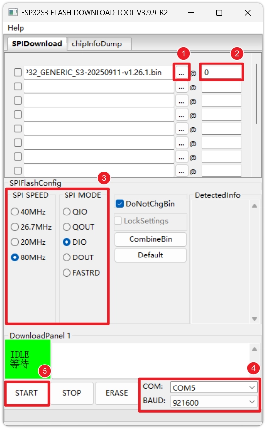</div>

       - Click the `...` button and select the downloaded `.bin` firmware file.
       - Enter `0` in the address (`@`) field.

         :::info
         Please refer to the specific address instructions on the MicroPython website download page for this chip (usually `0x1000` for original ESP32, `0x0` for S3/C3).
         :::

    5. **Execute the flashing**: Select the correct `COM` port, set the `BAUD` baud rate (recommend `921600` or higher for speed), then click `START`. Wait until `FINISH` is displayed in the bottom right corner of the tool, indicating the flashing is complete.

       <div style={{maxWidth:350}}> 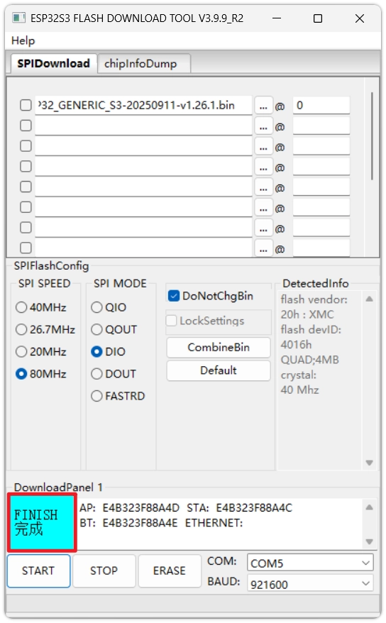</div>

       :::caution
       This method has many configuration items. Be absolutely sure the chip model, firmware file, and flash address are correct. For daily development, Thonny is still recommended.
       :::

  </TabItem>
</Tabs>

### 2.3 Verifying the Development Environment

After flashing, the next step is to verify if the environment configuration is successful.

1. **Reconnect the device**: Disconnect the ESP32 from your computer, then reconnect it. Ensure the interpreter in the bottom right corner of Thonny is set to `MicroPython (ESP32)` and the correct port.

   :::info Port Changes
   After flashing the MicroPython firmware, the corresponding COM port number for the device might change (especially when using native USB interfaces like those on ESP32-S3/C3). If the connection fails, click the bottom right corner to reselect the correct port.
   :::

   <div style={{maxWidth:500}}> 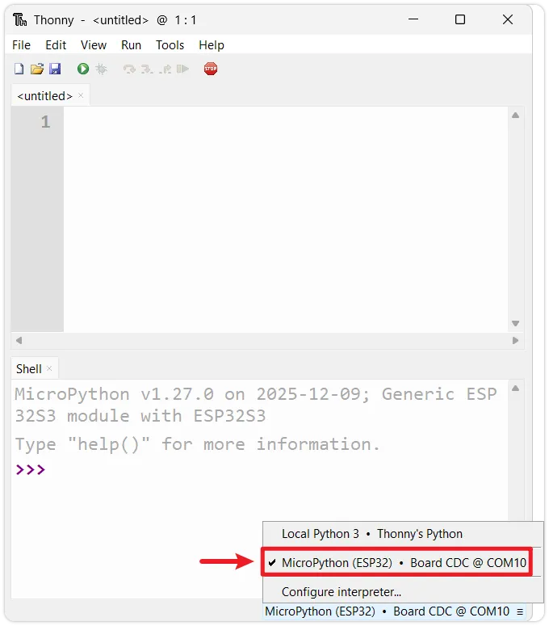</div>

2. **Restart the interpreter**: If the **Shell** window at the bottom is unresponsive, you can click the red **Stop** button on the toolbar to restart the onboard interpreter.

   <div style={{maxWidth:500}}> 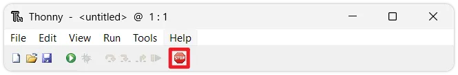</div>

3. **Check the prompt**: Upon successful connection, the Shell window should display the MicroPython version information, development board info, and the `>>>` prompt. This indicates you have successfully entered the MicroPython REPL environment on the ESP32.

   <div style={{maxWidth:500}}> 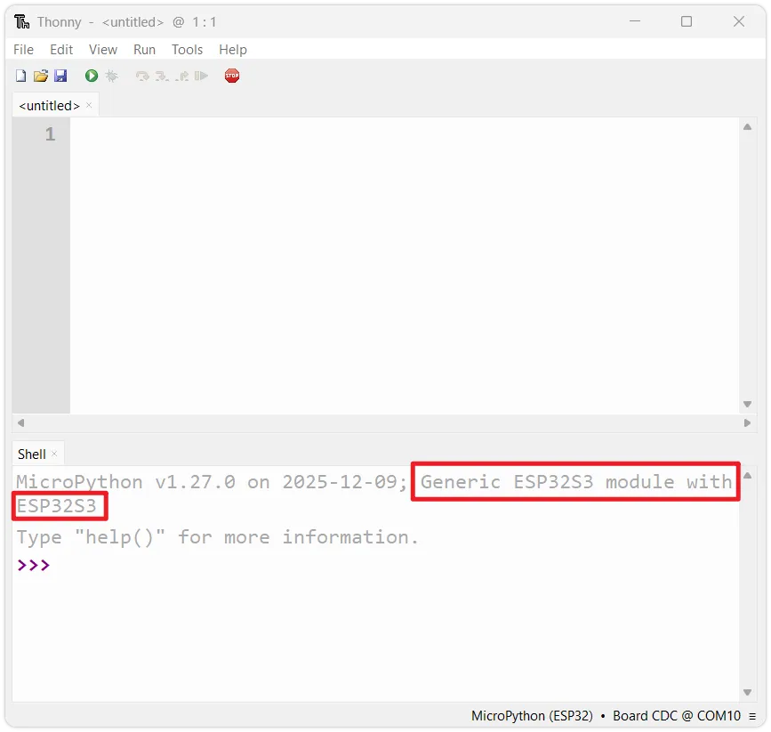</div>

4. **Run test code**: At the `>>>` prompt, enter your first line of MicroPython code and press Enter:

   ```python
   print('Hello, ESP32!')
   ```

   <div style={{maxWidth:500}}> 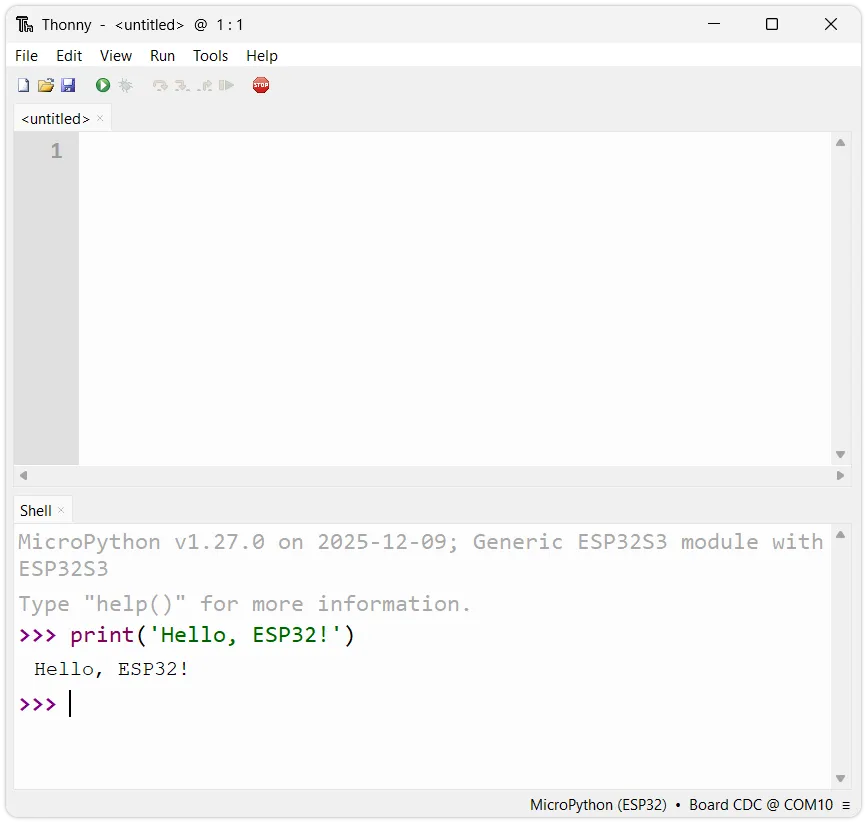</div>

   You should immediately see the ESP32 return the message `Hello, ESP32!`.

At this point, the ESP32 MicroPython development environment has been successfully set up, and you have run your first line of code.

## 3. Reference Links

- [MicroPython ESP32 Instructions (Github README)](https://github.com/micropython/micropython/blob/master/ports/esp32/README.md)
- [MicroPython Official Documentation](https://docs.micropython.org/en/latest/reference/index.html)
- [MicroPython GitHub Wiki](https://github.com/micropython/micropython/wiki)
- [Espressif Flash Download Tool User Guide](https://docs.espressif.com/projects/esp-test-tools/en/latest/esp32s3/production_stage/tools/flash_download_tool.html)