<!-- Image Reference -->


> This section will guide you to further understand MicroPython and become familiar with the usage of the Thonny IDE.

:::tip[Important Note on Board Compatibility]
The core logic of this tutorial applies to all ESP32 development boards. However, all operational steps are explained using the [**Waveshare ESP32-S3-Zero Mini Development Board**](https://www.waveshare.com/esp32-s3-zero.htm) as an example. If you are using a different model of development board, please modify the relevant settings according to your actual situation.
:::

## 1. Thonny File View

In embedded development, it's often necessary to transfer and manage files between the "local computer" and the "ESP32 device". Thonny provides a visual file view function to accomplish this.

1. **Open the file view**: Open Thonny, select `View` -> `Files` from the top menu bar.

   <div style={{maxWidth:550}}> 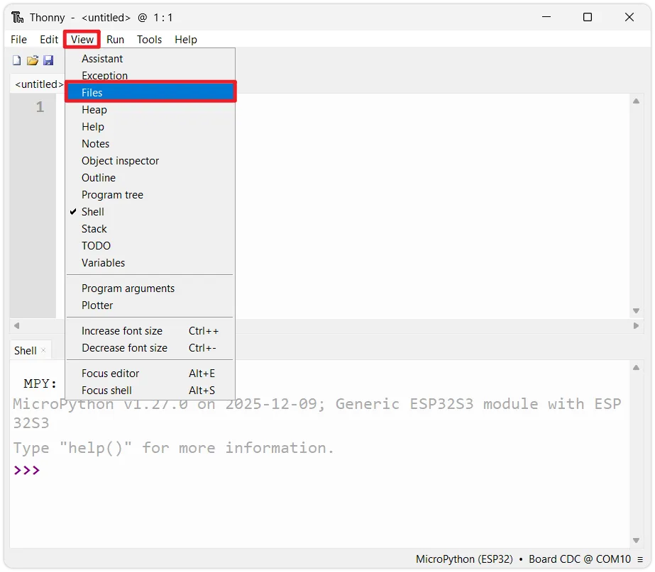</div>

2. **Interface layout**: The left sidebar will now show two areas:

   <div style={{maxWidth:550}}> 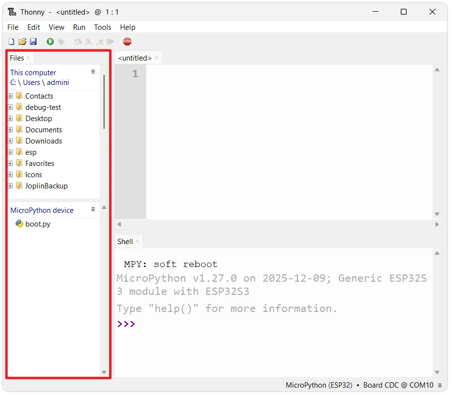</div>

   - **Top section (Local Files)**: Displays files stored locally on your computer.
   - **Bottom section (MicroPython device)**: Displays files in the ESP32's internal storage.

     :::info Initial Files
     On a newly flashed ESP32, there is usually a file named `boot.py`. This is a system-generated boot script.
     :::

## 2. Two Modes of Code Execution

MicroPython offers two different ways to run code: interactive execution (REPL) and script execution.

### 2.1 Interactive Execution (REPL)

REPL (Read-Eval-Print Loop) allows users to directly input code in the **Shell** window at the bottom of the Thonny interface. Pressing Enter executes it immediately.

- **Characteristics**: Immediate feedback on execution results.
- **Applicable scenarios**: Testing short commands, querying variable values, checking hardware connection status (e.g., scanning I2C device addresses).
- **Disadvantage**: The entered code cannot be saved; it is lost when the device loses power or is restarted.

Copy the following code into the Shell window, or type it line by line and press Enter:

```python
import sys
import machine

freq = machine.freq() / 1000000
print(f"Device Info: {sys.platform}\nCPU Freq: {freq} MHz")
```

The Shell window will output the platform name of the current device and the operating frequency of the CPU.

<div style={{maxWidth:550}}> 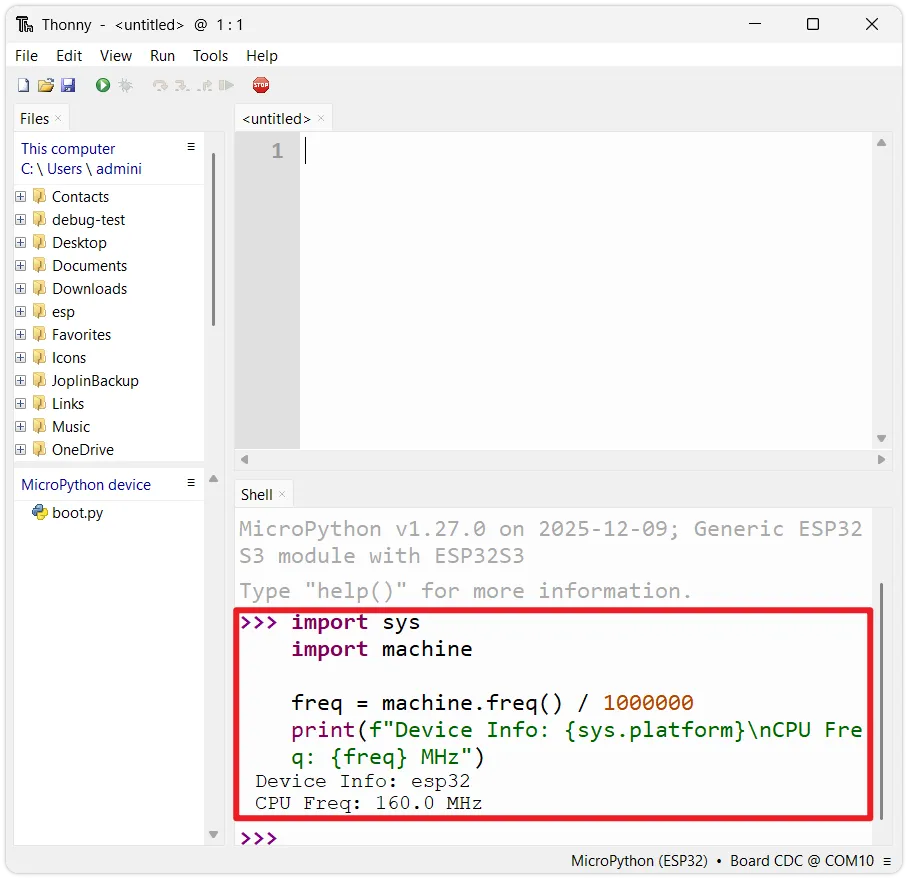</div>

### 2.2 Script Execution

Script execution is the standard way to develop complex programs. It involves writing complete code files in the editor area, saving them, and then sending them to the ESP32 for execution.

1. **Write the code**: Enter the following test code in the editor. This program prints device information and outputs an increasing count every second.

   ```python
   import sys
   import machine
   import time

   # Get and print CPU frequency (converted to MHz)
   freq = machine.freq() / 1000000
   print(f"Device Info: {sys.platform}\nCPU Freq: {freq} MHz")

   count = 0

   while True:
       # Print the current count value
       print(f"Hello World! {count}")
       count += 1
       # Delay for 1 second
       time.sleep(1)
   ```

2. **Run the script**: Click the green `Run` button on the toolbar (or press <kbd>F5</kbd>).

   <div style={{maxWidth:550}}> 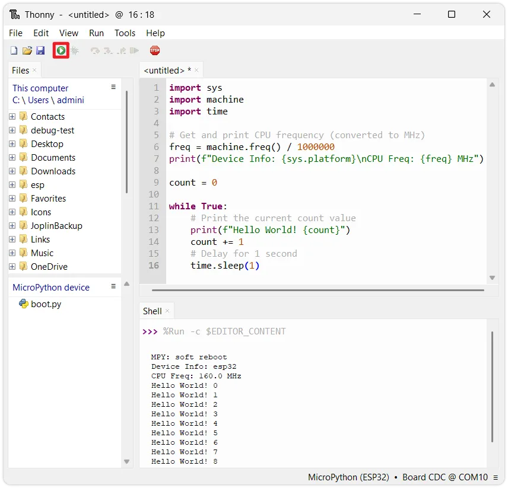</div>

3. **Observe the output**: The Shell window at the bottom will start outputting device information and the loop count.

   :::tip How to stop the program?
   Since the code above contains a `while True` infinite loop, the Shell will be occupied, preventing other operations like saving files. To stop the program, click the red Stop button on the toolbar, or press <kbd>Ctrl</kbd> + <kbd>C</kbd> in the Shell.

   <div style={{maxWidth:400}}> </div>

   ***

   <div style={{maxWidth:500}}> 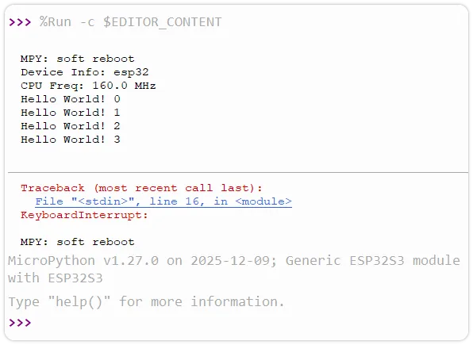</div>

   Forcibly interrupting may cause the Shell to throw a `KeyboardInterrupt` error. To implement more robust exit handling, you can wrap the main logic in a try-except structure to catch the exception:

   ```python
   import sys
   import machine
   import time

   # Get and print CPU frequency (converted to MHz)
   freq = machine.freq() / 1000000
   print(f"Device Info: {sys.platform}\nCPU Freq: {freq} MHz")

   count = 0

   # highlight-next-line
   try:
       while True:
           # Print the current count value
           print(f"Hello World! {count}")
           count += 1
           # Delay for 1 second
           time.sleep(1)
   # highlight-start
   except KeyboardInterrupt:
       # This block executes when a keyboard interrupt (CTRL+C) is detected
       print("Exit")
   # highlight-end
   ```

   :::

4. **Save the code**: Save the code to the ESP32 for later use.

   - Stop the program, then click the `Save` button on the toolbar (or press <kbd>Ctrl</kbd> + <kbd>S</kbd>).

     <div style={{maxWidth:400}}> </div>

   - The system will prompt you to choose a save location. Select **MicroPython device**.

     <div style={{maxWidth:180}}> 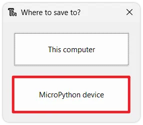</div>

   - Then enter a filename (e.g., `test_print.py`) and click OK.

     <div style={{maxWidth:400}}> 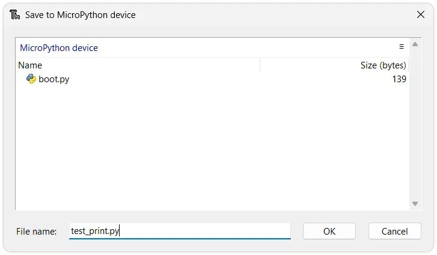</div>

   - After saving, you can see `test_print.py`  in the MicroPython device area of the left file view.

     <div style={{maxWidth:550}}> 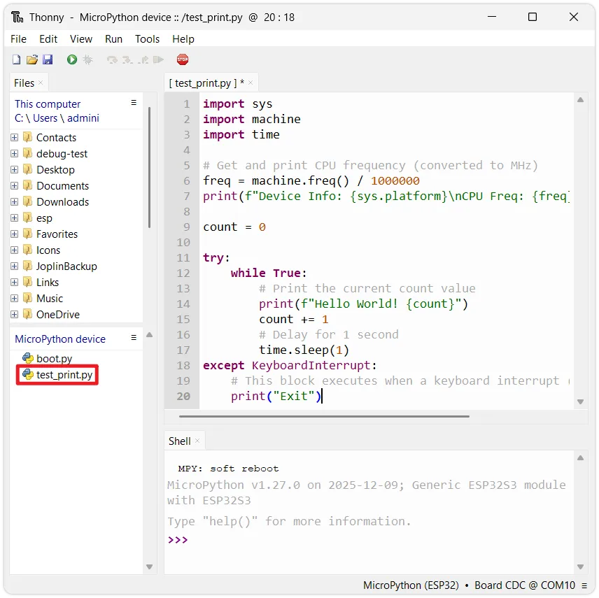</div>

## 3. ESP32 Boot Mechanism

In the previous step, although the code was saved to the device, the program does not run automatically after unplugging the USB cable and powering it back on. This is determined by MicroPython's boot rules. After the ESP32 powers on and resets, it goes through the following stages:


### 3.1 boot.py (Boot Script)

- **Priority**: Runs after system startup.
- **Purpose**:Typically used to configure system underlying parameters, such as configuring USB connection mode, establishing network connections, etc.
- **Advice**: It is recommended for beginners to keep the default settings. Modifying it arbitrarily may prevent the system from booting.

### 3.2 main.py (Main Program)

- **Priority**: Runs after `boot.py` finishes execution.
- **Purpose**: Stores the user's application code.
- **Key Point**: **Only a file named `main.py` will run automatically on power-up.** Scripts with other names (like `test_print.py`) are stored as ordinary files and will not execute automatically.

### 3.3 Interactive Interpreter (REPL)

If `main.py` is not found, or if `main.py` finishes execution, MicroPython will enter interactive interpreter mode (REPL).

- Global variables set in `boot.py` and `main.py` will still be valid in the REPL.

- The REPL will continue until a hard or soft reset is triggered.

## 4 Example: Auto-running Script

If you want the program to run automatically in an offline state (connected only to battery or power supply), you need to name the script `main.py`.

1. **Locate the file**: In the `MicroPython device` area at the bottom left of Thonny, double-click to open the `test_print.py` saved in the previous step.
2. **Save as main.py**: Click `File` - `Save copy` in Thonny's menu bar, choose to save to the `MicroPython device`, and set the filename to `main.py`.

   <div style={{maxWidth:550}}> 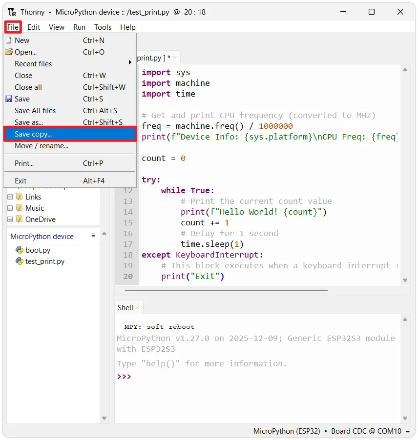</div>

   <div style={{maxWidth:180}}> </div>

   <div style={{maxWidth:400}}> 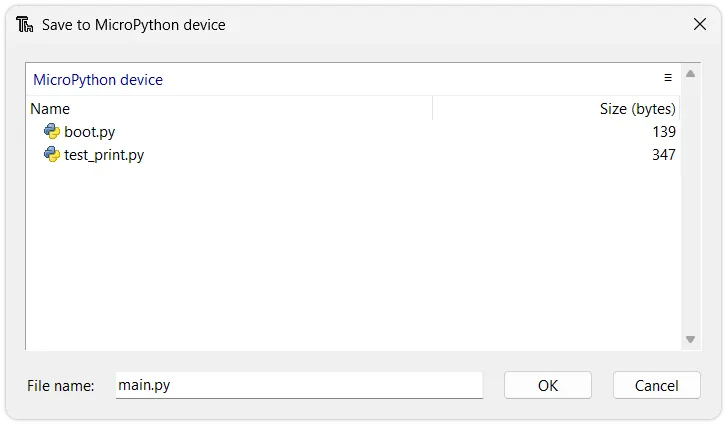</div>

3. **Verify**: Press <kbd>Ctrl</kbd> + <kbd>D</kbd> (soft reboot) in the Shell window to verify if `main.py` runs automatically after the device restarts.

   <div style={{maxWidth:550}}> 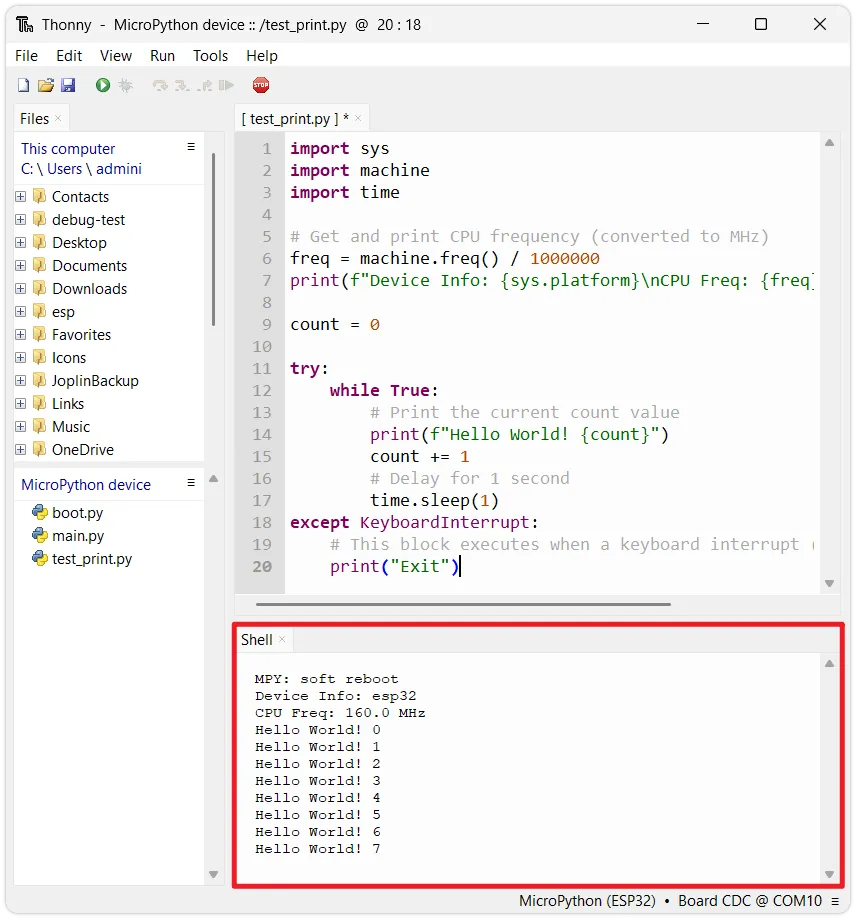</div>

   :::info Why press Ctrl+D?
   When Thonny establishes a connection with the ESP32, it sends an interrupt signal by default, stopping the currently running program and entering REPL mode. (This behavior can be changed in the settings.)

   <div style={{maxWidth:550}}> 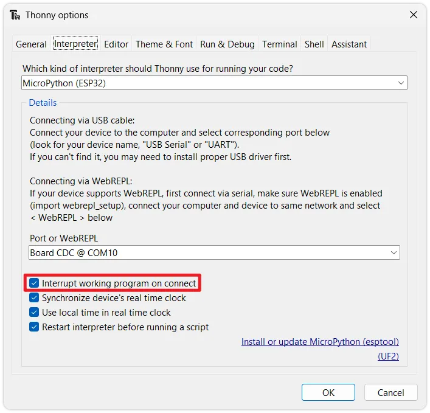</div>

   This means that even if the ESP32 automatically runs `main.py` on power-up, the program stops immediately once connected by Thonny, resulting in no output in the Shell window.
   
   Pressing <kbd>Ctrl</kbd> + <kbd>D</kbd> (soft reset) in the REPL restarts the MicroPython interpreter while keeping the Thonny connection, allowing you to observe the full startup execution of `main.py` in the Shell window.
   :::

## 5. Uploading Files

During development, when you need to use external driver libraries (e.g., for an OLED screen or a temperature/humidity sensor), you typically need to use external library files (`.py` files).

To transfer a file from your computer to the ESP32, follow these steps:

1. Locate the target file (e.g., `ssd1327.py`) in the top-left section (Local files).
2. **Right-click** the file and select `Upload to /`.

   <div style={{maxWidth:550}}> 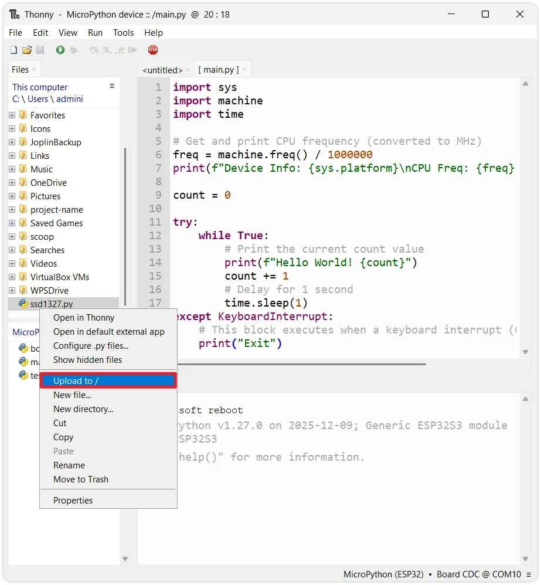</div>

3. The file will be copied to the ESP32's file system. You can then use it in your code via `import ssd1327`.

   <div style={{maxWidth:550}}> 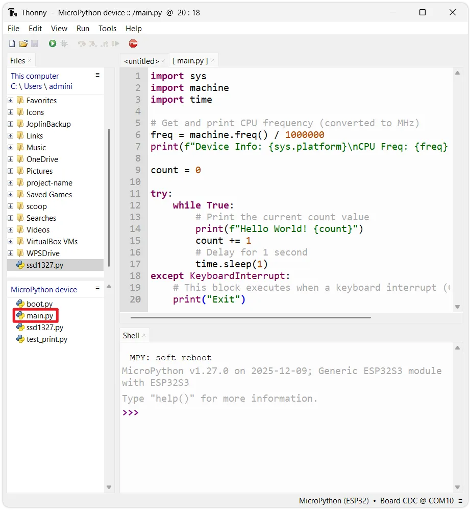</div>

## 6. Overview of Common Built-in Modules

MicroPython provides a series of hardware-related built-in modules on the ESP32. Here is a brief overview of commonly used modules:

### 6.1 `machine` Module

The `machine` module provides interfaces to access underlying hardware and is the core module for controlling peripherals:

- `machine.Pin`: Controls GPIO input/output.
- `machine.ADC`: Acquires analog signals.
- `machine.PWM`: Outputs PWM signals.
- `machine.UART`: Serial port communication.
- `machine.I2C`: I2C bus.
- `machine.SPI`: SPI bus.
- `machine.Timer`: Timer.
- `machine.RTC`: Real-time clock.

For example, check the current CPU frequency in the REPL:

```python
import machine
print(machine.freq())  # View CPU clock frequency
```

### 6.2 `time` / `utime` Module

The `time` module (called `utime` in some firmware versions) provides delay and time counting functions:

```python
import time

time.sleep(1)       # Delay 1 second
time.sleep_ms(500)  # Delay 500 milliseconds
time.sleep_us(100)  # Delay 100 microseconds

print(time.ticks_ms())  # Returns millisecond count since power-on
```

### 6.3 `network` and `bluetooth` Modules

The `network` and `bluetooth` modules are used to configure Wi-Fi and Bluetooth functions, providing wireless connectivity for the ESP32. You can view the interfaces included in a module with the following command:

```python
import network, bluetooth
help(network)
help(bluetooth)
```

### 6.4 Viewing Available Modules and Help

The built-in modules supported vary slightly between different firmware versions or chips. You can query the current device's support in the following ways:

1. **List all built-in modules of the current firmware**:

   Enter in the Shell:

   ```python
   help('modules')
   ```

2. **Query module attributes and functions**:

   Use the `dir()` function to list all attributes of an object. For example, to see what's under the `machine` module:

   ```python
   import machine
   dir(machine)
   ```

3. **View object help documentation**:

   MicroPython's `help()` function provides a brief description of a specific object:

   ```python
   import machine
   help(machine.Pin)
   ```

   :::note
   `help()` provides only a brief description. For complete API definitions, please refer to the [**official documentation**](https://docs.micropython.org/en/latest/index.html#).
   :::

## 7. Reference Links

- [MicroPython Core Library Documentation](https://docs.micropython.org/en/latest/library/index.html)
- [MicroPython - ESP32 Quick Reference](https://docs.micropython.org/en/latest/esp32/quickref.html)
- [MicroPython REPL Reference](https://docs.micropython.org/en/latest/reference/repl.html#)
- [MicroPython Boot Process Reference](https://docs.micropython.org/en/latest/reference/reset_boot.html)