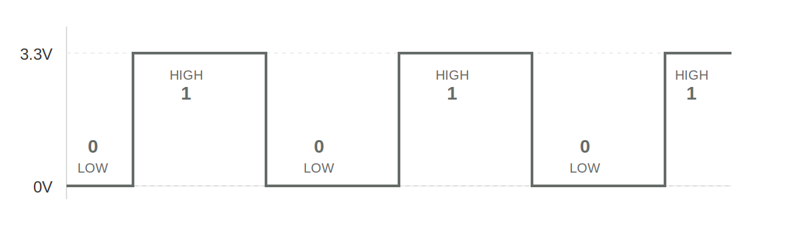
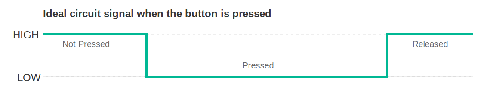
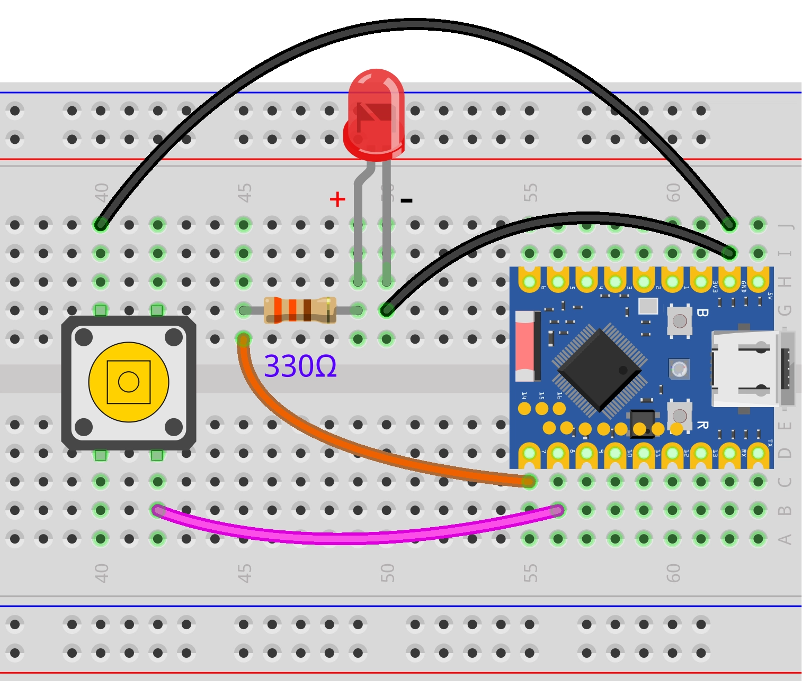

<!-- Image Reference -->


<!-- Video reference -->

import VideoPlayer from '@site/src/components/VideoPlayer';
import VideoBlink from './videos/04-Blink.mp4';

# GPIO Digital Output/Input

> This section introduces the basic concepts of GPIO (General Purpose Input/Output) and explains how to control GPIO output and input in the ESP32 MicroPython environment through examples of blinking an LED and reading the state of a button.

## 1. Digital Signals

A **digital signal** is a signal that uses discrete values to represent information. The simplest and most common digital signal is the **binary digital signal**, which has only two states.

In ESP32 GPIO control, this **binary digital signal** is primarily used. Just like a light switch in a room, a binary digital signal is, at any moment, in one of two distinct states:

- **High level (HIGH)**: Represents the logical "1" or "True". On an ESP32 development board, this usually means the pin outputs a voltage close to 3.3V.
- **Low level (LOW)**: Represents the logical "0" or "False". On an ESP32 development board, this usually means the pin outputs approximately 0 volts, i.e., it's connected to ground (GND).



In simple terms, digital signals use these two voltage states to convey information like True (HIGH) / False (LOW) or 1 / 0.

- When the ESP32 **outputs** a digital signal, it controls a pin to become high or low level, like it is "talking", for example, to control an LED's on/off state.
- When the ESP32 **inputs** a digital signal, it detects whether a pin is at a high or low level, like it is "listening", for example, to detect if a button is pressed.

:::tip Why is HIGH 3.3V?
**The HIGH level voltage typically depends on the microcontroller's operating voltage:**

- ESP32's operating voltage is 3.3V → HIGH = 3.3V
- Arduino Uno's operating voltage is 5V → HIGH = 5V
- Some low-power chips have an operating voltage of 1.8V → HIGH = 1.8V

Therefore, the specific voltage value represented by "HIGH" depends on the development board being used.
:::

## 2. Digital Output{#digital-output}

This example uses an ESP32 development board and the MicroPython environment to control an external LED to blink, demonstrating how to use the Thonny IDE to control the digital output of an ESP32 development board.

### 2.1 Circuit Assembly

The components required are:

- LED \* 1
- 330Ω resistor \* 1
- Breadboard \* 1
- Wires
- ESP32 development board

Connect the circuit according to the wiring diagram below:

<Details>
  <summary>ESP32-S3-Zero Pinout Diagram</summary>


</Details>

<div style={{maxWidth:500}}> </div>

#### Circuit Working Principle

Let's understand how this simple circuit works:

1. **Current Path:** When GPIO7 outputs a high level (3.3V), current flows from the pin → through the 330Ω resistor → through the LED → back to the ESP32's GND pin, forming a complete circuit loop.

2. **Function of the Resistor**: The 330Ω resistor is a **current-limiting resistor**.

   - Protects the LED: Prevents excessive current from burning out the LED.
   - Protects the ESP32: Prevents the GPIO pin from outputting excessive current.
   <!-- - Calculation Formula: I = (3.3V - LED Voltage Drop) ÷ 330Ω ≈ 6-8mA (within safe range) -->

3. **LED Polarity**:

   - **Long pin (Anode)**: Connects to the other end of the resistor.
   - **Short pin (Cathode)**: Connects to GND.
   - If connected in reverse, the LED will not light up, but it generally won't be damaged.

:::tip
If you don't have a 330Ω resistor, you can use a resistor within the range of 220Ω to 1kΩ. A larger resistance value will result in lower LED brightness.
:::

### 2.2 REPL Interaction

First, familiarize yourself with GPIO-related functions through the REPL. Here are some common operations.

Enter the following commands line by line in the Shell and observe the results:

```python
from machine import Pin # Import Pin class
```

```python
led = Pin(7, Pin.OUT)  # Initialize the pin
```

```python
led.on()               # Turn on
```

```python
led.off()              # Turn off
```

```python
led.toggle()           # Toggle the state
```

```python
led.toggle()
```

```python
led.value(1)           # Set to high level
```

```python
led.value(0)           # Set to low level
```

```python
led.value()            # Read the current state
```

### 2.3 Complete Code Example

Create a new file in the Thonny IDE, enter the following code, and run it.

```python
import time
from machine import Pin

# Define the LED pin number
LED_PIN = 7

# Initialize the pin: Create a Pin object, set to output mode (Pin.OUT)
led = Pin(LED_PIN, Pin.OUT)

while True:
    led.value(1)      # Turn on the LED (1 represents high level)
    time.sleep(1)     # Wait for 1 second
    led.value(0)      # Turn off the LED (0 represents low level)
    time.sleep(1)     # Wait for 1 second
```

After running, the LED connected to the ESP32 development board will blink with a pattern of 1 second on and 1 second off.

<VideoPlayer src={VideoBlink} asGif />

#### Code Analysis

1. `from machine import Pin`:

   - Imports the `Pin` class from MicroPython's built-in `machine` module. This is the core class for controlling GPIO pins.

2. `led = Pin(led_pin, Pin.OUT)`:

   - **Instantiate a Pin object**: Creates an object named `led` to control the specified pin.
   - **Parameter 1 (`LED_PIN`)**: Specifies the pin number (7 in this example).
   - **Parameter 2 (`Pin.OUT`)**: Configures the pin mode. `Pin.OUT` means output mode, allowing the ESP32 to output high/low levels to this pin.

3. `led.value(1)` and `led.value(0)`:

   - **`value()` method**: Used to control the output level of the pin.
   - `1`: Outputs high level (3.3V), turning the LED on.
   - `0`: Outputs low level (GND), turning the LED off.
   - _Note: You can also use the `led.on()` and `led.off()` methods for the same effect._

4. `time.sleep(1)`:

   - Pauses program execution for the specified number of seconds.
   - During this time, the program remains in a blocked state and performs no other operations. For simple blinking tasks, using `sleep` is the most straightforward method.

## 3. Digital Input{#digital-input}

This example demonstrates the basic operation of digital input by creating a simple button circuit with an ESP32 development board and reading the button state.

### 3.1 Circuit Assembly

The components required are:

- Button \* 1
- Breadboard \* 1
- Wires
- ESP32 development board
- 10kΩ resistor \* 1 (Optional, not needed when using internal pull-up)

:::tip Why is a Pull-up Resistor Needed?
If the button pin is connected neither to power nor to ground, the pin will be in a "Floating" state, and the read value is indeterminate. A pull-up resistor ensures the pin has a definite HIGH level state when the button is not pressed.
:::

<Details>
  <summary>ESP32-S3-Zero Pinout Diagram</summary>


</Details>

| Internal Pull-up Resistor (Recommended)                                                                                                                                                                                                                                                                              | External Pull-up Resistor                                                                                                                                                                                                                                                                                                  |
| -------------------------------------------------------------------------------------------------------------------------------------------------------------------------------------------------------------------------------------------------------------------------------------------------- | ------------------------------------------------------------------------------------------------------------------------------------------------------------------------------------------------------------------------------------------------------------------------------------------------------------- |
|                                                                                                                                                                                                                                                             |                                                                                                                                                                                                                                                                        |
| **Connection**:<br/>• Button one end → GPIO8<br/>• Button other end → GND<br/><br/>**Working Principle**:<br/>• ESP32's internal pull-up resistor pulls GPIO8 to HIGH (3.3V)<br/>•Button NOT pressed: reads HIGH<br/>• Button pressed: reads LOW<br/><br/>**Advantages**:<br/>• Saves components<br/>• Simple wiring<br/>• Code: `Pin(buttonPin, Pin.IN, Pin.PULL_UP)` | **Connection**:<br/>• Button one end → GPIO8<br/>• Button other end → GND<br/>• 10kΩ resistor: 3.3V ↔ GPIO8<br/><br/>**Working Principle**:<br/>• External resistor pulls GPIO8 to HIGH (3.3V)<br/>• Button NOT pressed: reads HIGH<br/>• Button pressed: reads LOW<br/><br/>**Advantages**:<br/>• Controllable pull-up current<br/>• Controllable pull-up current<br/>• Code: `Pin(buttonPin, Pin.IN)` |

<Details>
  <summary>ESP32-S3-Zero Pinout Diagram</summary>


</Details>



### 3.2 REPL Interaction

1. **Initialize the pin**:
   Enter the following command to configure GPIO8 as input mode and enable the internal pull-up.

   ```python
   from machine import Pin
   button = Pin(8, Pin.IN, Pin.PULL_UP)
   ```

2. **Read the state**:

   - **Release the button**, type `button.value()` in the Shell, press Enter.

     ```python
     button.value()
     ```

     **Explanation: Due to the pull-up resistor, a HIGH level (1) is read when not pressed.**

   - **Hold the button down**, type `button.value()` in the Shell, press Enter.

     ```python
     button.value()
     ```
     **Explanation: When the button is pressed, the pin is grounded, reading a LOW level (0).**

### 3.3 Complete Code Examples

#### Example 1: Reading Button State

```python
import time
from machine import Pin

# Define the pin connected to the button
BUTTON_PIN = 8

# Initialize the pin: set as input mode and enable the internal pull-up resistor
# When the button is not pressed, the pin is pulled HIGH and reads as 1; reads as 0 when pressed (grounded).
button = Pin(BUTTON_PIN, Pin.IN, Pin.PULL_UP)

while True:
    # Read the level state of the pin
    button_state = button.value()

    # Print the read state to the console
    print(button_state)

    # Add a small delay to prevent console lag or device unresponsiveness to interrupts due to data refreshing too fast
    time.sleep_ms(20)
```

**Code Analysis**:

1. `button = Pin(button_pin, Pin.IN, Pin.PULL_UP)`:

   - `Pin.IN`: Configures the pin as input mode.
   - `Pin.PULL_UP`: Enables the ESP32 chip's internal pull-up resistor. This sets the button's default state to HIGH (1).

2. `button.value()`:

   - In input mode, this function returns the current logic level of the pin.
   - eturns `1`: Indicates high level (button not pressed).
   - eturns `0`: Indicates low level (button pressed, pin connected to GND).

**Running Result**:

After running the code, observe the Shell window at the bottom of Thonny. When the button is not pressed, the Shell window will continuously display "1"; when the button is pressed, it will display "0". By pressing and releasing the button, you can observe the state change.

#### Example 2: Counting Button Presses

```python
import time
from machine import Pin

# Define pins
BUTTON_PIN = 8

# Initialize pins 
button = Pin(BUTTON_PIN, Pin.IN, Pin.PULL_UP)

# Initialize variables
last_button_state = 1  # Initial state defaults to 1 (HIGH, not pressed)
count = 0

while True:
    # Read the current button state
    current_button_state = button.value()

    # Logic check: look for state edges
    if last_button_state == 1 and current_button_state == 0:
        # Falling edge detected: button was just pressed
        pass  # Do nothing here for now

    elif last_button_state == 0 and current_button_state == 1:
        # Rising edge detected: button was just released
        count += 1      # Increment counter
        print(count)     # Print the current count

    # Update state for the next loop iteration
    last_button_state = current_button_state
```

**Code Analysis**:

1. **State Variable (`last_button_state`)**:

   To detect changes, you need to record the state from the last check. The program compares `current_button_state` and `last_button_state` to determine if an action occurred.

2. **Edge Detection**:

   This code triggers the count on the **Rising Edge**, i.e., the moment the button changes from pressed (0) back to released (1). This often matches user intuition (releasing the finger completes a click).

3. **State Update**:

   `last_button_state = current_button_state`: This is a crucial step at the end of the loop, ensuring the next iteration compares against the most recent historical data.

**Running Result**:

Run the code and observe the Shell window. Try pressing the button multiple times. You might observe that the counter sometimes increments by 1, but sometimes suddenly increases by 2, 3, or more. This is Button Bouncing.

:::caution What is Button Bouncing?
When a mechanical button is pressed or released, its internal metal contacts undergo tiny, rapid physical bouncing. This causes the circuit to quickly connect and disconnect many times within the very short duration of a single button press. The ESP32 runs very fast and can capture each tiny on/off event, thus mistakenly identifying it as multiple button presses.


:::

#### Example 3: Counting Button Presses (Simple Debouncing)

A simple method to eliminate bouncing is to add a brief delay after detecting a button press, ignoring subsequent bounce signals.

```python
import time
from machine import Pin

# Define pins
BUTTON_PIN = 8

# Initialize pins
button = Pin(BUTTON_PIN, Pin.IN, Pin.PULL_UP)

# Initialize variables
last_button_state = 1  # Initial state defaults to 1 (HIGH, not pressed)
count = 0

while True:
    # Read the current button state
    current_button_state = button.value()

    # Logic check: look for state edges
    if last_button_state == 1 and current_button_state == 0:
        # Falling edge detected: button was just pressed
        pass  # Do nothing here for now

    elif last_button_state == 0 and current_button_state == 1:
        # Rising edge detected: button was just released
        count += 1       # Increment counter
        print(count)     # Print the current count

        # highlight-next-line
        # 100ms delay for debouncing
        # highlight-next-line
        time.sleep_ms(100)

    # Update state for the next loop iteration
    last_button_state = current_button_state
```

**Running Result**:

Same as before, the counter increments by 1 each time the button is released. Because `time.sleep_ms(100)` is added, each button release is counted only once, effectively reducing the number of false triggers. Try pressing the button rapidly multiple times, noting whether the counter increments match your actual presses.

**Code Analysis**:

- **`time.sleep_ms(100)`**: After confirming a button action, the program pauses for 100 milliseconds. This time is sufficient for the physical bouncing of the mechanical contacts to settle. Although the CPU cannot handle other tasks during this time (blocking), for simple button applications, this is an efficient and easy-to-implement solution.

## 4. Extension Exercises{#digital-io-exercise}

<Details>
  <summary>Try to implement: Turn on the LED when the button is pressed. Turn off the LED when the button is released.</summary>

**Wiring Diagram**:

<div style={{maxWidth:500}}> </div>

**Code**:

```python
import time
from machine import Pin

# Define pin numbers
LED_PIN = 7
BUTTON_PIN = 8

# Initialize LED pin as OUTPUT mode
led = Pin(LED_PIN, Pin.OUT)

# Initialize button pin as INPUT mode and enable internal pull-up resistor
button = Pin(BUTTON_PIN, Pin.IN, Pin.PULL_UP)

while True:
    # Read button state (0 means pressed, 1 means not pressed)
    button_state = button.value()

    if button_state == 0:
        # Button pressed, turn on LED
        led.value(1)
    else:
        # Button not pressed, turn off LED
        led.value(0)

    # Add a very short delay to reduce CPU usage
    time.sleep_ms(10)
```

</Details>

<Details>
  <summary>Try to implement: Press the button once to toggle the LED state once.</summary>

**Wiring Diagram**:

<div style={{maxWidth:500}}> </div>

**Code**:

```python
import time
from machine import Pin

# Define pins
LED_PIN = 7
BUTTON_PIN = 8

# Initialize pins
led = Pin(LED_PIN, Pin.OUT)
button = Pin(BUTTON_PIN, Pin.IN, Pin.PULL_UP)

# Initialize state variables
last_button_state = 1   # Previous button state, initialized to HIGH (not pressed)
led_state = 0           # Current LED state, 0 for off, 1 for on

while True:
    # Read the current button state
    current_button_state = button.value()

    # Detect rising edge: last state was LOW (pressed), current is HIGH (released)
    if last_button_state == 0 and current_button_state == 1:
        # Toggle the LED state variable (0 to 1, 1 to 0)
        led_state = not led_state

        # Apply the new state to the LED (MicroPython automatically converts True/False to 1/0)
        led.value(led_state)

        # Debouncing delay
        time.sleep_ms(100)

    # Update state for the next comparison in the loop
    last_button_state = current_button_state

    # Add a very short delay to reduce CPU usage
    time.sleep_ms(10)
```

</Details>

## 5. Related Links

- [MicroPython - ESP32 Quick Reference - Pins and GPIO](https://docs.micropython.org/en/latest/esp32/quickref.html#pins-and-gpio)
- [MicroPython - machine.Pin class](https://docs.micropython.org/en/latest/library/machine.Pin.html)
- [MicroPython - time.sleep](https://docs.micropython.org/en/latest/library/time.html#time.sleep)
- [PEP 8 - Style Guide for Python Code](https://peps.python.org/pep-0008/)
