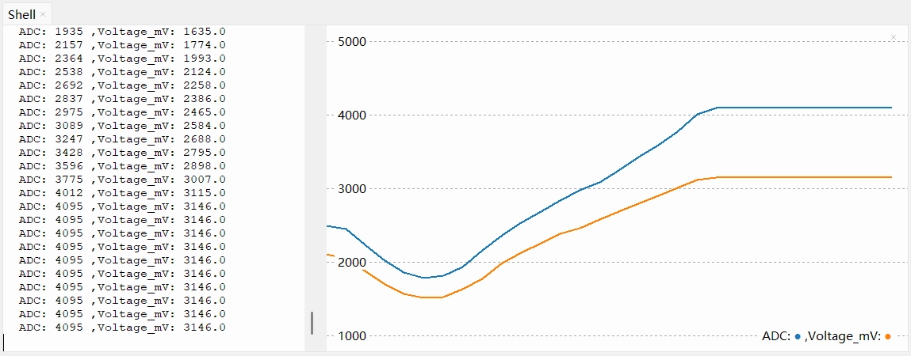
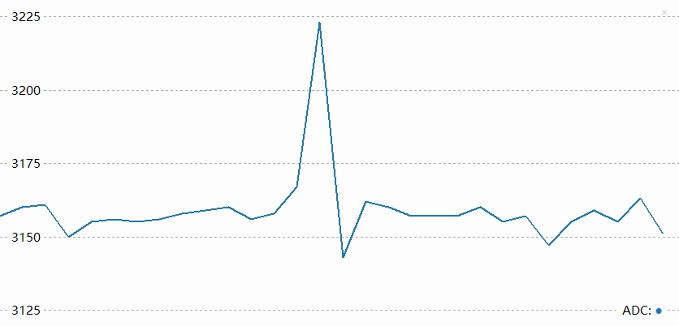
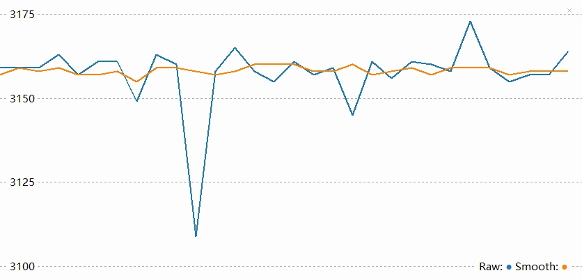

<!-- Image Reference -->


# Analog Input

> This section introduces the basic concepts of ADC (Analog-to-Digital Converter) and explains how to read analog signals in the ESP32 MicroPython environment by reading the voltage value from a potentiometer.

## 1. Analog Signal

An **Analog Signal** is a signal that can **change continuously** within a certain range.

For example, the knob of a dimmable light allows for smooth adjustment of the light's brightness, from completely off to maximum brightness, with an infinite number of brightness levels in between. This brightness adjustment process is analog. In contrast, a digital signal is like a regular light switch, having only "ON" and "OFF" states.

In the real world, many physical quantities such as temperature, light intensity, and sound volume are analog, and their changes are continuous and smooth.

For the ESP32, measuring continuously varying signals (e.g., reading values from a potentiometer or sensor) cannot be achieved using only the two digital states of `1` (High) or `0` (Low). In such cases, an **ADC** is required.

- **ADC (Analog-to-Digital Converter)**: A device that can convert a continuous analog voltage signal (e.g., 0V ~ 3.3V) into a digital value that the ESP32 can process.

  

Simply put, an ADC is like a ruler that divides the voltage between 0~3.3V into many "ticks," allowing each voltage range to correspond to a specific number. The number of discrete levels an ADC can subdivide the voltage into is called its **resolution**. Higher resolution allows for finer detection of voltage changes.

The ESP32's ADC is typically **12-bit**, meaning it can be divided into **2¹² (= 4096)** levels in total. Therefore, the ADC reading range is **0 ~ 4095**.

- When the input voltage is **0V**, the ADC reading is approximately **0**.
- When the input voltage **changes continuously from 0V to 3.3V**, the ADC reading will correspondingly **change continuously from 0 to 4095**.

<div style={{maxWidth:600, margin: '0 auto'}}> </div>

This way, the MicroPython program can obtain an integer between 0~4095 via `adc.read()`. This value directly corresponds to the voltage level on the input pin.

## 2. ADC Pins

Not all ESP32 pins support analog input. You need to consult the pinout diagram of your specific development board or the chip's datasheet to find pins labeled "ADC" for use as analog input.  
**It is recommended to prioritize pins from the ADC1 channel to avoid conflicts with other functions.**

| Chip Model    | ADC Channel 1 (Recommended) | ADC Channel 2              | Reference Documentation            |
| :----------- | :-------------------- | :------------------------ | :------------------------------------------------------------------------------------------------------------------------------ |
| **ESP32**    | GPIO32 - GPIO39       | GPIO0, 2, 4, 12-15, 25-27 | [ESP32 Datasheet Section 2.2](https://documentation.espressif.com/esp32_datasheet_en.html#[14,%22XYZ%22,56.69,70.87,null])          |
| **ESP32-C3** | GPIO0 - GPIO5         | -                         | [ESP32-C3 Datasheet Section 2.3.2](https://documentation.espressif.com/esp32-c3_datasheet_en.html#[19,%22XYZ%22,56.69,785.2,null])  |
| **ESP32-C6** | GPIO0 - GPIO6         | -                         | [ESP32-C6 Datasheet Section 2.3.3](https://documentation.espressif.com/esp32-c6_datasheet_en.html#[19,%22XYZ%22,56.69,785.2,null])  |
| **ESP32-C5** | GPIO1 - GPIO6         | -                         | [ESP32-C5 Datasheet Section 2.3.3](https://documentation.espressif.com/esp32-c5_datasheet_en.html#[19,%22XYZ%22,56.69,785.2,null])  |
| **ESP32-S3** | GPIO1 - GPIO10        | GPIO11 - GPIO20           | [ESP32-S3 Datasheet Section 2.3.3](https://documentation.espressif.com/esp32-s3_datasheet_en.html#[20,%22XYZ%22,56.69,785.2,null]) |
| **ESP32-P4** | GPIO16 - GPIO23       | GPIO49 - GPIO54           | [ESP32-P4 Datasheet Section 2.3.3](https://documentation.espressif.com/esp32-p4-chip-revision-v1.3_datasheet_en.html#[18,%22XYZ%22,56.69,785.2,null])  |
| **Others**     | -                     | -                         | [Espressif Documentation Center (CDP)](https://documentation.espressif.com/en/home)                                                              |

## 3. Circuit Assembly

The components required are:

- Potentiometer \* 1
- Breadboard \* 1
- Wires
- ESP32 development board

<Details>
  <summary>ESP32-S3-Zero Pinout Diagram</summary>


</Details>

<div style={{maxWidth:500}}> </div>

**Circuit Analysis**

Let's understand how this analog signal reading circuit works:

1. **Potentiometer Connection**:

   - **VCC Pin**: Connected to ESP32's 3.3V to supply the working voltage for the potentiometer.
   - **GND Pin**: Connected to ESP32's GND to complete the circuit loop.
   - **Signal Pin (middle pin)**: Connected to ESP32's GPIO7 (an ADC pin) to output an analog voltage between 0V~3.3V.

2. **Potentiometer Operating Principle**:
   - Inside the potentiometer is a variable resistor; rotating the knob changes its resistance.
   - When you rotate the potentiometer knob, the output voltage on the signal pin changes continuously between 0V and 3.3V.
   - Fully counter-clockwise: Output close to 0V.
   - Fully clockwise: Output close to 3.3V.

## 4. Code

### 4.1 REPL Interaction

Before writing a complete program, you can familiarize yourself with ADC-related functions via the REPL.

Enter the following commands line by line in the Shell and observe the results:

```python
from machine import Pin, ADC
```

```python
pot = ADC(Pin(7))          # Create an ADC object on GPIO7
```

```python
pot.read()                 # Read directly; the value should reflect the current potentiometer position (0-4095)
```

```python
pot.read()                 # Read again
```

```python
pot.read_uv()              # Read voltage value in microvolts (uV)
```

### 4.2 Complete Code Example

Create a new file in the Thonny IDE, enter and run the following code. This code will read the voltage values in a loop and output them in a specific format for use with Thonny's "Plotter" feature.

```python
import time
from machine import Pin, ADC

# Define the pin connected to the potentiometer (GPIO 7)
POT_PIN = 7

# Initialize ADC
# 1. Create an ADC object associated with the pin
pot = ADC(Pin(POT_PIN))

while True:
    # Read the raw analog value (0 - 4095)
    adc_value = pot.read()

    # Read the voltage value (unit: microvolts uV), and convert to millivolts (mV)
    voltage_uv = pot.read_uv()
    voltage_mv = voltage_uv / 1000

    # Format the output for easy observation in the plotter
    # Format: Label:Value
    print("ADC:", adc_value, ",Voltage_mV:", voltage_mv)

    # Delay for 0.1 seconds
    time.sleep(0.1)
```

**Running Result**:

After running the code on the ESP32 development board, the Shell window will continuously output values.

In the Thonny IDE, click on the menu **"View" -> "Plotter"**, and you will see a real-time waveform graph appear on the right side. Rotate the potentiometer, and the curve will rise and fall accordingly.



:::tip[Digging Deeper: Why doesn't the maximum reading correspond exactly to 3.3V?]

You might observe that the ADC reading saturates (reaches 4095) before the voltage reaches 3.3V, or shows non-linearity at the extremes (near 0V and 3.3V).

This is one of the design characteristics of the ESP32 ADC. The internal core circuitry has a limited voltage range it can process directly, so an internal module called an Attenuator is used to extend the measurable voltage range.

In the MicroPython environment, the firmware enables an attenuation option by default that allows measuring higher voltages. According to the official documentation, the reliable measurement upper limit for the ESP32 S3 ADC with this setting is approximately 3.1V. (Note: The measurable input voltage range differs across chips and under different attenuation options. Refer to [this table](https://docs.espressif.com/projects/arduino-esp32/en/latest/api/adc.html#analogsetattenuation).)

Therefore, when the input voltage exceeds 3.1V, the reading "saturates," staying at the maximum value of 4095.

Thus, `read_uv()` is the recommended method. It uses factory calibration data to convert the raw reading into a more accurate voltage value (in microvolts), compensating to some extent for non-linearity and reference voltage errors.
:::

**Code Analysis**

1. `pot = ADC(Pin(POT_PIN))`

   Creates an ADC object to control the specified GPIO pin.

2. `pot.read()`

   Reads the raw ADC value. For ESP32, this is typically a 12-bit value ranging from 0 to 4095.

3. `pot.read_uv()`

   Directly returns the calibrated voltage value in microvolts (μV). This is a very practical function, eliminating the need for manual mathematical conversion using `(reading / 4095) * 3300`, and it is usually factory-calibrated for higher accuracy.

4. `print("ADC:", adc_value, ",Voltage_mV:", voltage_mv)`

   **Thonny Plotter Format Explanation**:
   Thonny's plotter draws curves by recognizing print output in the Shell. To ensure the plotter displays data correctly, it is recommended to follow this format:

   - **Pure Numerical Values**: Print one or more numerical values per line (separated by commas or spaces).
   - **Key-Value Pairs (Recommended)**: Use the `name:value` format. For example, `print("ADC:", value)`.

   This format not only plots the curve but also displays the name of each curve in the legend, making it easy to distinguish between multiple data sets.

## 5. Extension: Reducing Noise{#reduce-adc-noise}

When you stop rotating the potentiometer, you might observe that the ADC reading does not stabilize at a single value but continues to fluctuate within a small range, sometimes with noticeable spikes.



This phenomenon is usually caused by noise. The ESP32's ADC is relatively sensitive to power supply noise and electromagnetic interference from the external environment.

To mitigate the effects of noise, there are typically two methods:

- **Hardware Filtering**：Connect a 0.1µF (100nF) ceramic capacitor in parallel between the ADC input pin and GND to filter out high-frequency interference.

- **Software Filtering**: Process multiple sampling results using algorithms. The simplest and most effective method is averaging (mean) filtering.

**Code Example: Outlier-Removing Mean Filter**

The following code demonstrates how to perform multiple consecutive samples, remove the maximum and minimum values, and then calculate the average to obtain a smoother reading.

```python
import time
from machine import Pin, ADC

POT_PIN = 7

pot = ADC(Pin(POT_PIN))

def read_average_adc(adc_obj, times=10):
    """
    Continuously read ADC values multiple times, remove the maximum and minimum, then calculate the average.
    :param adc_obj: ADC object
    :param times: Number of samples, default is 10
    :return: Averaged integer value
    """
    val_list = []
    for _ in range(times):
        val_list.append(adc_obj.read())
        time.sleep_ms(1) # Sampling interval

    # Remove the maximum and minimum, then calculate the average of the remaining data.
    if len(val_list) > 2:
        val_list.remove(min(val_list))
        val_list.remove(max(val_list))

    return int(sum(val_list) / len(val_list))

while True:
    # Get the average of 20 samples
    smooth_value = read_average_adc(pot, 20)

    print("Raw:", pot.read(), "Smooth:", smooth_value)
    time.sleep(0.1)
```

After applying software filtering, you can see a reduction in spikes and a smoother waveform.



## 6. Related Links

- [MicroPython - ESP32 Quick Reference - ADC](https://docs.micropython.org/en/latest/esp32/quickref.html#adc-analog-to-digital-conversion)
- [MicroPython - ADC Class](https://docs.micropython.org/en/latest/library/machine.ADC.html)
- [MicroPython - ADCBlock Class](https://docs.micropython.org/en/latest/library/machine.ADCBlock.html#machine-adcblock)
- [MicroPython - esp32 machine_adc.c](https://github.com/micropython/micropython/blob/master/ports/esp32/machine_adc.c)