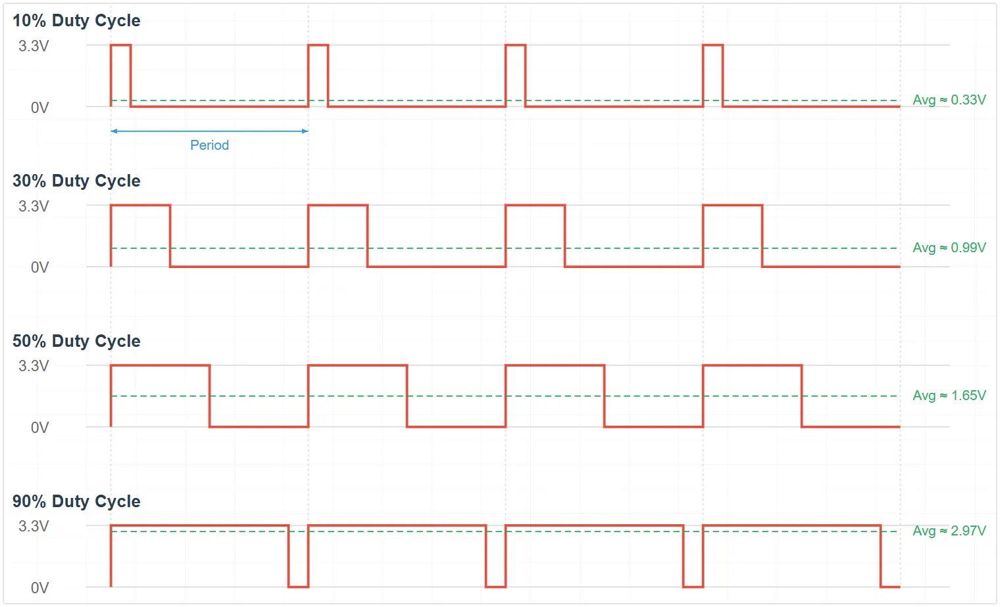

<!-- Image Reference -->


# Pulse Width Modulation (PWM)

> This section introduces the basic concepts of Pulse Width Modulation (PWM) and demonstrates how to use MicroPython to control the ESP32's PWM functionality to adjust LED brightness and achieve a breathing light effect.

## 1. What is PWM?

**PWM (Pulse Width Modulation)** is a digital signal modulation technique used to "simulate" a continuously varying voltage.

When you need to control the "intensity" of a device's output (such as adjusting LED brightness or motor speed), rather than just simple on/off states, **PWM (Pulse Width Modulation)** technology provides an effective solution.

A PWM signal is still fundamentally a digital signal, with only HIGH and LOW states, but by controlling the proportion of time the signal is HIGH, it can achieve effects similar to an analog output.



The key concepts of PWM include:

- **Duty Cycle**: The percentage of time within one PWM cycle that the signal is HIGH. The duty cycle directly affects the average power or intensity of the output.

  Different duty cycles produce different average voltage effects:
  - **0% Duty Cycle**: Average voltage ≈ 0V
  - **25% Duty Cycle**: Average voltage ≈ 0.825V (3.3V \* 0.25)
  - **50% Duty Cycle**: Average voltage ≈ 1.65V (3.3V \* 0.50)
  - **75% Duty Cycle**: Average voltage ≈ 2.475V (3.3V \* 0.75)
  - **100% Duty Cycle**: Average voltage ≈ 3.3V

- **Frequency**: The number of times a complete PWM cycle repeats per second, measured in Hertz (Hz). Choosing an appropriate frequency is crucial for the application: for LED dimming, the frequency must be high enough to avoid visible flickering to the human eye; for motor control, the frequency affects efficiency and noise.

## 2. PWM Implementation on ESP32

The ESP32 integrates dedicated hardware modules for generating PWM signals:

- **LEDC (LED Control) Peripheral**: The main PWM generator for the ESP32. Although called LED control, it produces a universal PWM signal. Depending on the chip model, it has 6 to 16 independent channels with a frequency range of 1Hz-40MHz.

In MicroPython, this functionality is encapsulated and called through the `machine.PWM` class.

## 3. Circuit Assembly

The components required are:

- LED \* 1
- 330Ω resistor \* 1
- Breadboard \* 1
- Wires
- ESP32 development board

Connect the circuit according to the wiring diagram below:

<Details>
  <summary>ESP32-S3-Zero Pinout Diagram</summary>


</Details>

<div style={{maxWidth:500}}> </div>

## 4. REPL Interaction

Enter the following commands line by line in the REPL for testing:

1. **Import Libraries and Initialize the PWM Object**:

   ```python
   from machine import Pin, PWM
   # Configure GPIO 7 as a PWM output
   led_pwm = PWM(Pin(7))
   ```

   View the default PWM parameters. The default frequency is 5000Hz, and the default duty cycle is 32768 (approximately 50%):

   ```python
   print(led_pwm)
   ```

   You can also get the current PWM parameters using the `freq()` and `duty_u16()` methods.

2. **Set Frequency**:
   Set the frequency to 10Hz. You can observe the LED blinking.

   ```python
   led_pwm.freq(10)
   ```

   Set the frequency to 5000Hz. Due to the persistence of vision effect, you can observe a stable LED brightness.

   ```python
   led_pwm.freq(5000)
   ```

3. **Set Duty Cycle**:

   Use the `duty_u16` method to set the brightness. The range is 0 to 65535.
   - Set to maximum brightness (65535):

     ```python
     led_pwm.duty_u16(65535)
     ```

   - Set to low brightness (1000):

     ```python
     led_pwm.duty_u16(1000)
     ```

   - Turn off the LED (0):
     ```python
     led_pwm.duty_u16(0)
     ```

   Use the `duty` method to set the brightness. The range is 0 to 1023.
   - Set to maximum brightness (1023):

     ```python
     led_pwm.duty(1023)
     ```

   - Set to medium brightness (512):

     ```python
     led_pwm.duty(512)
     ```

   - Turn off (0):

     ```python
     led_pwm.duty(0)
     ```

## 5. Example: LED Breathing Light

The following code will implement a "breathing light" effect: the LED brightness will gradually increase from off to full brightness, then gradually decrease from full brightness back to off, repeating in a loop.

```python
import time
from machine import Pin, PWM

# 5000 Hz is a sufficiently smooth frequency for LED dimming
FREQUENCY = 5000

# Define the pin connected to the LED (GPIO 7)
LED_PIN = 7

# Create a PWM object
led_pwm = PWM(Pin(LED_PIN),freq=FREQUENCY,duty_u16=0)

while True:
    # Gradually increase brightness (fade in)
    for duty in range(0, 65536, 1000):
        led_pwm.duty_u16(duty)  # Apply the current duty cycle
        time.sleep_ms(10)       # Short delay to control breathing speed

    # Gradually decrease brightness (fade out)
    for duty in range(65535, -1, -1000):
        led_pwm.duty_u16(duty)  # Apply the current duty cycle
        time.sleep_ms(10)       # Short delay to control breathing speed
```

**Code Analysis**

1.  **`PWM(Pin(LED_PIN))`**:
    Instantiates a PWM object. MicroPython automatically assigns an available LEDC channel on the ESP32 for this pin.

2.  **`duty_u16(value)`**:
    This is the key function for controlling brightness.
    - The `u16` stands for "unsigned 16-bit integer".
    - Regardless of the underlying hardware timer resolution (the ESP32 is typically configured for 13-bit or 14-bit), MicroPython automatically scales the input value from 0-65535 to the actual range supported by the hardware.
    - `0` corresponds to a 0% duty cycle.
    - `65535` corresponds to a 100% duty cycle.

3.  **`range()` Loop**:
    Using a `for` loop with `time.sleep_ms()`, a linear and smooth transition in brightness is achieved. Adjusting the step size (e.g., `1000`) or delay time (e.g., `10` ms) changes the rhythm of the breathing light.

## 6. Extension

<Details>
  <summary>Try to implement: Control the brightness of an LED light by adjusting a potentiometer knob, making the light brightness correspond to the knob position.</summary>

**Wiring Diagram**:

<div style={{maxWidth:500}}> </div>

**Code**:

```python
import time
from machine import Pin, PWM, ADC

# 5000 Hz is a sufficiently smooth frequency for LED dimming
FREQUENCY = 5000

# Define pins
LED_PIN = 7  # Pin connected to the LED
POT_PIN = 8  # Pin connected to the potentiometer

# Create a PWM object, associated with GPIO 7
led_pwm = PWM(Pin(LED_PIN), freq=FREQUENCY, duty_u16=0)

# Initialize ADC (for the potentiometer)
pot = ADC(Pin(POT_PIN))

while True:
    # Read the analog value from the potentiometer
    # read_u16() returns an integer between 0 and 65535, scaled from the raw value
    pot_value = pot.read_u16()

    # Set the LED brightness
    # The ADC reading range (0-65535) matches the PWM setting range (0-65535)
    # We can directly assign the read value to the PWM
    led_pwm.duty_u16(pot_value)

    time.sleep_ms(20)

```

**Code Analysis**:

1.  **Unified 16-bit Interface (`u16`)**:
    The design of MicroPython is evident here. MicroPython provides a `read_u16()` interface on different hardware platforms, returning a unified 16-bit value (0-65535), regardless of whether the underlying ADC is 10-bit, 12-bit, or other bit widths. This makes the code more portable.
    - `ADC.read_u16()` reads the analog voltage (0V-3.3V) as a 16-bit integer (0-65535).
    - `PWM.duty_u16()` accepts a 16-bit integer (0-65535) to set the duty cycle.
    - Therefore, we can directly pass the ADC reading to the PWM.

</Details>

## 7. Related Links

- [MicroPython - ESP32 Quick Reference - PWM](https://docs.micropython.org/en/latest/esp32/quickref.html#pwm-pulse-width-modulation)
- [MicroPython - ESP32 PWM Tutorial](https://docs.micropython.org/en/latest/esp32/tutorial/pwm.html#esp32-pwm)
- [MicroPython - machine.PWM](https://docs.micropython.org/en/latest/library/machine.PWM.html)
- [MicroPython - esp32 machine_pwm.c](https://github.com/micropython/micropython/blob/master/ports/esp32/machine_pwm.c)