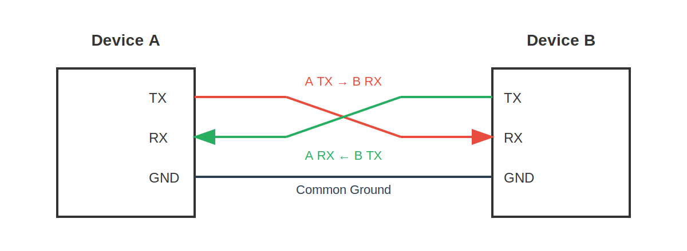

<!-- Image Reference -->

import ImgUARTExample1Diagram from './images/03-LED-Blink_bb.webp';
import ImgUARTExample2Diagram from './images/06-UART_bb.webp';

# UART Communication

> This section introduces the basic concepts of the Universal Asynchronous Receiver/Transmitter (UART) and demonstrates how to use MicroPython to control the ESP32's UART functionality for communication between devices.

## 1. What is UART?

**UART (Universal Asynchronous Receiver/Transmitter)** is a hardware interface circuit used for asynchronous serial communication. Common applications include: communication with sensors/modules, data transmission between development boards and computers (such as printing logs and debugging information), etc.

Serial communication based on UART has the following characteristics:

- **Asynchronous Communication**: The transmitting and receiving devices do not need to share a clock signal; instead, they synchronize data transmission through a pre-agreed baud rate.
- **Serial Transmission**: Data is sent bit by bit, rather than transmitting multiple bits in parallel.
- **Full-Duplex**: Can simultaneously perform sending and receiving operations.

---

UART is **asynchronous** communication, meaning it does not have a shared clock line. To achieve correct data transmission and reception, both communication parties must agree to use the same **baud rate** and **data frame format**.

**Baud Rate** represents the number of data bits transmitted per second (bps, bits per second). Both communication parties must use the same baud rate to correctly transmit data. Common baud rates are 9600 and 115200.

Each **UART data frame** consists of the following parts:

- **Start Bit**: 1 bit, always 0, indicates the start of data transmission.
- **Data Bits**: Typically 5-9 bits, commonly 8 bits, containing the actual data to be transmitted.
- **Parity Bit (Optional)**: Used for error detection.
- **Stop Bit(s)**: 1-2 bits, always 1, indicates the end of data transmission.


---

UART communication requires two core signal lines:

- **TX (Transmit)**: Data transmission line.
- **RX (Receive)**: Data reception line.
- **GND (Ground)**: The "common reference point" for both communication parties, ensuring voltage signals can be interpreted correctly.
- **Connection Method**: Devices must be connected crosswise. Device A's TX connects to Device B's RX, and Device A's RX connects to Device B's TX. Additionally, both devices must share a common ground (connect GND) to ensure a stable reference point for signal levels.



---

## 2. UART in ESP32 and MicroPython

The ESP32 chip typically integrates multiple UART controllers (usually UART0, UART1, UART2). In MicroPython, this functionality is encapsulated and called through the `machine.UART` class.

- **UART0**: Usually used for the REPL (Read-Eval-Print Loop, Interactive Interpreter) console, i.e., the input/output interface seen when connected to a computer via USB.
- **UART1 / UART2**: Can be used to connect external devices.

Using `machine.UART` allows easy configuration of parameters such as baud rate and pin assignment.

## 3. Example 1: Controlling an LED via REPL {#repl-control-led}

This example demonstrates the most basic application of serial communication: controlling an ESP32 by sending commands from a computer. In MicroPython, the REPL (Read-Eval-Print Loop) is used directly as a "serial monitor". The program will wait for user input of "on" or "off" to control the LED's state.

### 3.1 Circuit Assembly

The components required are:

- LED \* 1
- 330Ω resistor \* 1
- Breadboard \* 1
- Wires
- ESP32 development board

Connect the circuit according to the wiring diagram below:

<Details>
  <summary>ESP32-S3-Zero Pinout Diagram</summary>


</Details>

<div style={{maxWidth:500}}> </div>

### 3.2 Code

```python
import sys
from machine import Pin

# Define pins
LED_PIN = 7

# Initialize pin
led = Pin(LED_PIN, Pin.OUT)

print("System Ready. Please enter 'on' or 'off':")

while True:
    # The input() function pauses program execution, waiting for the user to enter a line of text and press Enter.
    # This is the simplest way to receive commands from the computer via the REPL.
    command = input()

    if command == "on":
        # If input is "on", turn on the LED
        led.value(1)
        print("LED is ON")
    elif command == "off":
        # If input is "off", turn off the LED
        led.value(0)
        print("LED is OFF")
    else:
        print("Unknown command. Please enter 'on' or 'off'.")
```

### 3.3 Code Analysis

1.  **`input()`**:
    This is a built-in Python function. In the MicroPython REPL environment, it reads data from standard input (usually the USB serial port connected to the computer) until a newline character is detected. Program execution "blocks" (pauses) here until the user sends a command.

2.  **Logic Judgment**:
    Based on the content of `command`, control the GPIO output to high or low level, and send feedback information back to the computer for display via the `print()` function.

### 3.4 Running Result

1.  Run the code.
2.  In the Thonny Shell (REPL) window, type `on` and press Enter. The LED should light up, and the Shell displays "LED is ON".
3.  Type `off` and press Enter. The LED should turn off, and the Shell displays "LED is OFF".

## 4. Example 2: UART Communication Between ESP32 Boards {#esp32-uart-communication}

This example demonstrates how to use the ESP32's hardware serial port (UART1) to enable communication between two ESP32 development boards. One board (transmitter) is connected to a button to control an LED on the other board (receiver).

### 4.1 Circuit Assembly

The components required are:

- LED \* 1
- 330Ω resistor \* 1
- Breadboard \* 2
- Button \* 1
- Wires
- ESP32 development board \* 2

Connect the circuit according to the wiring diagram below:

<Details>
  <summary>ESP32-S3-Zero Pinout Diagram</summary>


</Details>

<div style={{maxWidth:600}}> </div>

| Transmitter (Board A) | Receiver (Board B) | Description                                     |
| --------------------- | ------------------ | ----------------------------------------------- |
| GPIO 11 (RX)          | GPIO 2 (TX)        | Data sent from B to A                           |
| GPIO 12 (TX)          | GPIO 1 (RX)        | Data sent from A to B                           |
| GND                   | GND                | **Must share common ground** for stable signals |

### 4.2 Code

#### 4.2.1 Transmitter Code (ESP32 Board A)

Save and run this code on the board connected to the button.

```python
import time
from machine import Pin, UART

# Define pins
BUTTON_PIN = 7
TX_PIN = 12
RX_PIN = 11

# Configure UART1
# baudrate=9600: Baud rate
# tx=12, rx=11: Specify transmit and receive pins
uart = UART(1, baudrate=9600, tx=TX_PIN, rx=RX_PIN)

# Configure button pin (pull-up input)
button = Pin(BUTTON_PIN, Pin.IN, Pin.PULL_UP)

last_button_state = 1  # Initial state (pull-up defaults to 1)

print("Sender Ready. Press the button.")

while True:
    current_button_state = button.value()

    # Detect state change
    if current_button_state != last_button_state:
        if current_button_state == 0:
            # Button pressed (low level)
            # write() method sends byte data
            uart.write('1')
            print("Sent: 1 (Button Pressed)")
        else:
            # Button released (high level)
            uart.write('0')
            print("Sent: 0 (Button Released)")

        last_button_state = current_button_state
        time.sleep_ms(50)  # Simple debouncing
```

#### 4.2.2 Receiver Code (ESP32 Board B)

Save and run this code on the board connected to the LED.

```python
import time
from machine import Pin, UART

# Define pins
LED_PIN = 7
RX_PIN = 1
TX_PIN = 2

# Configure UART1
# Note: Receiver's RX connects to Transmitter's TX, Receiver's TX connects to Transmitter's RX
# According to the wiring diagram: RX=1, TX=2
uart = UART(1, baudrate=9600, tx=TX_PIN, rx=RX_PIN)

# Configure LED pin
led = Pin(LED_PIN, Pin.OUT)

print("Receiver Ready. Waiting for commands...")

while True:
    # any() returns the number of characters in the receive buffer; if > 0, data is available.
    if uart.any():
        # read(1) reads 1 byte
        command = uart.read(1)

        # Note: read() returns a bytes object (e.g., b'1')
        if command == b'1':
            led.value(1)
            print("Received: 1 -> LED ON")
        elif command == b'0':
            led.value(0)
            print("Received: 0 -> LED OFF")

    time.sleep_ms(10) # Short delay to avoid high CPU usage
```

### 4.3 Code Analysis

#### 4.3.1 The `machine.UART` Class

- **`UART(id, baudrate, tx, rx)`**:
  - `id`: UART channel number, typically use 1 or 2 (0 is usually reserved for REPL).
  - `baudrate`: Baud rate, must match between communication parties (9600 in this example).
  - `tx`, `rx`: Specify the GPIO pins to be used for transmission and reception.

#### 4.3.2 Transmitter (Board A)

- **`uart.write(data)`**:
  Used to send data. `data` can be a string or a bytes object. For example, `uart.write('1')` sends the character '1'.
- **State Detection**:
  The code detects button actions by comparing `current_button_state` and `last_button_state`, sending data only when the state changes to avoid repeated transmission.

#### 4.3.3 Receiver (Board B)

- **`uart.any()`**:
  Checks if there is data waiting to be read in the receive buffer. If data is available, it returns an integer greater than 0. This is a non-blocking check method.
- **`uart.read(n)`**:
  Reads `n` bytes from the buffer. If `n` is not specified, it reads all available data.
  **Note**: MicroPython's `read()` method returns a **bytes** object. Therefore, when comparing, use `b'1'` instead of the string `'1'`.

### 4.4 Running Result

1.  Run the respective codes on the two ESP32 development boards.

    :::tip **Tip**: There are two methods to run both boards simultaneously:
    - **Method 1 (Recommended)**: Save the code as `main.py` on each respective development board and upload it. This way, the program will run automatically when the boards are powered on.

      **Note**: If Thonny is connected, it might send an interrupt signal stopping the `main.py` program. If this happens, press `Ctrl+D` in the Shell for a soft reset, or power cycle the board after closing Thonny.

    - **Method 2**: Open two Thonny windows, connect to different COM ports in each, and then click the Run button in each window.

      **Note**: By default, Thonny allows only one instance. To open multiple windows, go to the menu bar and select **Tools** -> **Options** -> **General**, uncheck **"Allow only one Thonny instance"**, and then restart Thonny.

    :::

2.  Press the button on the transmitter board. The LED on the receiver board should light up, the transmitter Shell should display "Sent: 1", and the receiver Shell should display "Received: 1".
3.  Release the button. The LED on the receiver board should turn off.

## 5. Related Links

- [MicroPython - ESP32 Quick Reference - UART](https://docs.micropython.org/en/latest/esp32/quickref.html#uart-serial-bus)
- [MicroPython - machine.UART Class Documentation](https://docs.micropython.org/en/latest/library/machine.UART.html)
