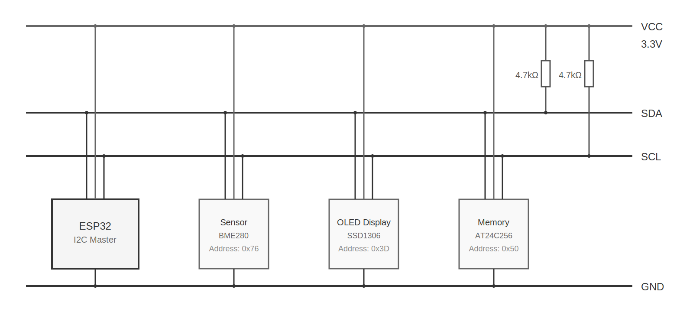
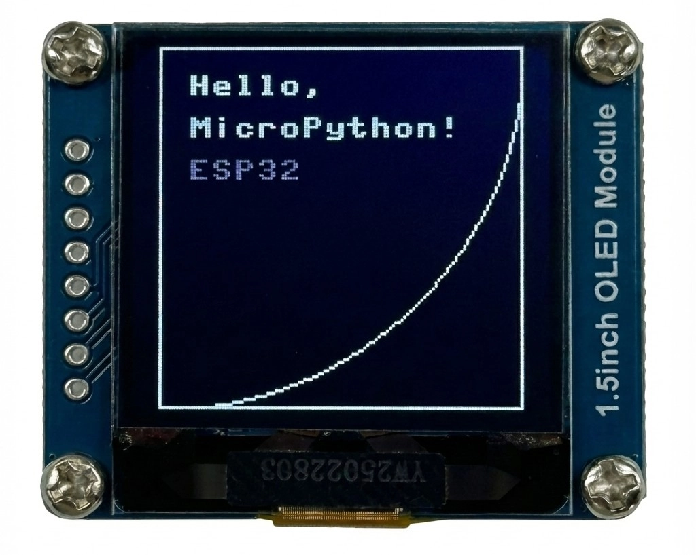

import Tabs from '@theme/Tabs';
import TabItem from '@theme/TabItem';

<!-- Image Reference -->


# I2C Communication

> This section introduces the basic concepts of the I2C communication protocol and demonstrates how to use MicroPython's `machine.I2C` class to scan for I2C devices and drive an OLED display.

**I2C (Inter-Integrated Circuit)**, also known as **I²C** or **IIC**, is a widely used two-wire serial communication protocol. The I2C protocol allows devices to communicate via two signal lines and is commonly used to connect peripherals such as sensors, displays, and memory modules.

Key characteristics of I2C include:

- **Two-wire communication**: Requires only two signal lines: SDA (Serial Data Line) and SCL (Serial Clock Line).
- **Master-slave architecture**: Supports multiple masters (controllers) and slaves (targets) on the same bus.

  :::info
  **[The seventh revision of the I²C specification](https://www.nxp.com/docs/en/user-guide/UM10204.pdf)** has updated the traditional "Master/Slave" terminology to "Controller/Target". To maintain compatibility with existing code and documentation, this tutorial may use both terms interchangeably based on context.
  :::

- **Address-based communication**: Each device has a unique 7-bit or 10-bit address.
- **Synchronous communication**: Synchronized via the clock line, making data transmission more reliable.

---

The I2C bus consists of the following signal lines:

- **SDA (Serial Data Line)**: Transmits data.
- **SCL (Serial Clock Line)**: Provides the clock signal, generated by the master device.

In actual hardware connections, all I2C devices must also be connected to a common ground (GND) to **ensure a shared electrical reference**.



:::tip About Pull-up Resistors
The I2C protocol specification requires that pull-up resistors must be present on both the SDA and SCL lines. This is because the I2C bus uses an Open-Drain circuit structure; devices can only pull the signal line to a low level and cannot actively drive it high. The pull-up resistors ensure the signal lines return to a high level when the bus is idle, guaranteeing proper communication.

**When to add external pull-up resistors**:

- In practical wiring (especially when connecting external modules or multi-board communication), it is recommended to connect a 4.7kΩ pull-up resistor from both SDA and SCL to 3.3V to improve communication reliability.
- External pull-up resistors are essential when the bus is long, has many devices, or experiences unstable communication.

**When external pull-up resistors can be omitted**:

- Many I2C modules (such as the [Waveshare 1.5inch OLED Module](https://www.waveshare.com/1.5inch-oled-module.htm) used in this tutorial) have built-in pull-up resistors. When using such modules, direct connection is usually sufficient without additional resistors.
- ESP32 GPIO pins support internal weak pull-ups, which might suffice for simple applications. However, the best practice is still to add external pull-up resistors for stable communication.

If unsure whether a module includes pull-up resistors, consult the module's schematic or datasheet.
:::

## 1. I2C on ESP32

In MicroPython, I2C functionality is implemented via the `I2C` class (Hardware I2C) and the `SoftI2C` class (Software I2C) within the `machine` module.

- **Hardware I2C (`machine.I2C`)**: Uses the ESP32 chip's dedicated internal I2C hardware controller. It is faster and has lower CPU overhead. **ESP32's hardware I2C can be mapped to any GPIO pin.**
- **Software I2C (`machine.SoftI2C`)**: Simulates I2C timing via software (bit-banging). Typically used only when hardware I2C resources are insufficient.

**It is recommended to use Hardware I2C**. Since ESP32 supports pin matrix remapping, Software I2C is usually unnecessary.

## 2. Example 1: I2C Scanner {#i2c-scanner}

When connecting a new I2C module, determining its address is the first step. Many modules do not display their address, or the address can be changed via jumpers. An I2C scanner program quickly detects and reports the addresses of all devices on the bus, making it a crucial tool for I2C development and debugging.

### 2.1 Build the Circuit

The components required are:

- [Waveshare 1.5inch OLED Module](https://www.waveshare.com/1.5inch-oled-module.htm) \* 1 (can be replaced with another I2C module)
- 4.7kΩ resistor \* 2 (optional, can be omitted if the I2C module has built-in pull-ups)
- Breadboard \* 1
- Wires
- ESP32 development board

Connect the circuit according to the wiring diagram below:

<Details>
  <summary>ESP32-S3-Zero Pinout Diagram</summary>


</Details>

<div style={{maxWidth:800}}> </div>

:::info Circuit Diagram Note
The 4.7kΩ pull-up resistors in the circuit diagram are the standard connection for I2C. Since the [OLED Module](https://www.waveshare.com/1.5inch-oled-module.htm) used in this tutorial has built-in pull-up resistors, the circuit can still function normally without these external resistors.
:::

<br/>

| Dev Board Pin | OLED Module |                    Description                    |
| :--------: | :-------: | :----------------------------------------: |
|   GPIO 1   | DIN(SDA)  | I2C data line. Connect external 4.7kΩ pull-up resistor to 3.3V if needed |
|   GPIO 2   | CLK(SCL)  | I2C clock line. Connect external 4.7kΩ pull-up resistor to 3.3V if needed |
|    3.3V    |    VCC    |                  Power positive                  |
|    GND     |    GND    |                  Power ground                  |

### 2.2 Code

```python
from machine import Pin, I2C

# I2C pin definitions
SDA_PIN = 2
SCL_PIN = 1

# Initialize I2C
# id=0 uses the first hardware I2C controller
# scl=Pin(SCL_PIN), sda=Pin(SDA_PIN) specifies the pins
# freq=100000 sets the I2C frequency to 100kHz (standard mode)
i2c = I2C(0, scl=Pin(SCL_PIN), sda=Pin(SDA_PIN), freq=100000)

print("Scanning I2C bus...")
devices = i2c.scan() # Scan for devices on the bus

if len(devices) == 0:
    print("No I2C devices found")
else:
    print("I2C devices found:", len(devices))
    for device in devices:
        # Print decimal and hexadecimal addresses
        print("Decimal address: ", device, " | Hex address: ", hex(device))
```

### 2.3 Code Analysis

1.  **`I2C(0, scl=Pin(SCL_PIN), sda=Pin(SDA_PIN), freq=100000)`**:

    - `0`: Specifies the use of the I2C0 hardware controller.
    - `scl`, `sda`: Specify the connected GPIO pins.
    - `freq`: Sets the communication frequency, typically 100000 (100kHz) or 400000 (400kHz).

2.  **`i2c.scan()`**:

    - Scans all possible 7-bit addresses on the I2C bus (0x08 to 0x77).
    - Returns a list containing the addresses of all responding devices.

3.  **`hex(device)`**:
    - Converts the decimal address to a hexadecimal string (e.g., `0x3d`), which is the most common representation for I2C addresses.

### 2.4 Expected Output

After running the code, the REPL will output the addresses of detected devices. For example, for the Waveshare 1.5inch OLED module, you will typically see address `0x3d`.

```text
Scanning I2C bus...
I2C devices found: 1
Decimal address:  61  | Hex address:  0x3d
```

## 3. Example 2: Driving an OLED Display (SSD1327) {#i2c-ssd1327}

In practical applications, you typically do not need to write underlying I2C data transfer code from scratch. Instead, you use libraries (provided by the community or manufacturer) designed for specific hardware.

:::tip
This code example requires the [**`ssd1327.py` driver library**](https://github.com/eMUQI/micropython-ssd1327), which is based on the [micropython-ssd1327](https://github.com/mcauser/micropython-ssd1327) project by community developer mcauser.

Download link: [micropython-ssd1327-master.zip](https://github.com/eMUQI/micropython-ssd1327/archive/refs/heads/master.zip)

Please upload the `ssd1327.py` file from this library to the root directory of your development board.
:::

### 3.1 Prepare the Driver File

MicroPython firmware typically does not include driver libraries for specific displays. To drive an OLED screen using the SSD1327 chip, we need to manually add the driver file.

Upload the `ssd1327.py` file from the downloaded library to the ESP32 device.

**Note: This file must be saved in the root directory of the ESP32's file system.**

### 3.2 Code

Ensure `ssd1327.py` is uploaded to the development board, then run the following code:

```python
from machine import I2C, Pin
import ssd1327

# Pin definitions
SDA_PIN = 2
SCL_PIN = 1
I2C_ADDR = 0x3d

# Initialize I2C
i2c = I2C(0, scl=Pin(SCL_PIN), sda=Pin(SDA_PIN), freq=400000)

# Initialize OLED
oled = ssd1327.SSD1327_I2C(128, 128, i2c, I2C_ADDR)

# Clear screen (fill with black)
oled.fill(0)

# Display text
# framebuf.text(s, x, y, c)
# c is the color value. For 4-bit grayscale, the range is 0-15. 15 is brightest, 0 is black.
oled.text("Hello,", 10, 10, 15)
oled.text("MicroPython!", 10, 25, 8)
oled.text("ESP32", 10, 40, 1) # Lower brightness text

# Use framebuf to draw graphics
# Draw a rectangle frame
oled.framebuf.rect(0, 0, 128, 128, 15)
# Draw a circle or ellipse
oled.framebuf.ellipse(0, 0, 128, 128, 15)

# Refresh the display
oled.show()
```

### 3.3 Code Analysis

1.  **`import ssd1327`**: Imports the driver library.
2.  **`oled = ssd1327.SSD1327_I2C(128, 128, i2c, 0x3d)`**: Creates an OLED object. Requires passing the screen width, height, I2C object, and I2C address.
3.  **`oled.fill(0)`**: Clears the screen buffer. `0` represents black.
4.  **`oled.text(...)`**: Writes text to the buffer. Note that the `framebuf` module has a built-in default font (8x8 pixels).
    - The first parameter is the text content to display.
    - The second parameter is the x-coordinate of the text.
    - The third parameter is the y-coordinate of the text.
    - The fourth parameter is the color value. SSD1327 supports 16 levels of grayscale (4-bit), so you can pass an integer between 0 and 15 to control brightness. 15 is brightest, 0 is black.
5.  **About the `framebuf` module**:
    - The `ssd1327` driver library is built on top of MicroPython's built-in `framebuf` (Frame Buffer) module. `framebuf` provides a standard set of graphics drawing APIs, including drawing text, lines, rectangles, circles, and other basic shapes.
    - In the code, methods like `oled.framebuf.rect()` and `oled.framebuf.ellipse()` directly call the `framebuf` drawing functions.
    - `framebuf` supports multiple color formats and drawing operations and is the standard tool for graphics display in MicroPython. For more drawing methods and detailed usage, refer to the [MicroPython framebuf official documentation](https://docs.micropython.org/en/latest/library/framebuf.html).
6.  **`oled.show()`**: Sends the data from the buffer to the OLED screen, updating the display. **The screen content will not change until this method is called.**

### 3.4 Expected Output

The OLED screen will light up, displaying "Hello, MicroPython!" and "ESP32", surrounded by a rectangular frame.

<div style={{maxWidth:300}}> </div>

## 4. Common Issues and Notes

### 4.1 Hardware I2C vs Software I2C

**Note**: ESP32's I2C pins support routing through the GPIO matrix to any available pin, so **using `SoftI2C` is usually unnecessary**. Use `I2C` (Hardware I2C) directly.

```python
from machine import Pin, SoftI2C

# SoftI2C is emulated by the CPU
i2c = SoftI2C(scl=Pin(SCL_PIN), sda=Pin(SDA_PIN), freq=100000)
```

The usage of `SoftI2C` is identical to `I2C` , but it is emulated by the CPU and may be less stable than hardware I2C at high speeds or under heavy load.

### 4.2 About I2C Slave Mode

MicroPython's standard `machine.I2C` and `machine.SoftI2C` classes currently only support **master (controller) mode** and do not support slave (target) mode.

## 5. Related Links

- [MicroPython - I2C Documentation](https://docs.micropython.org/en/latest/library/machine.I2C.html)
- [MicroPython - framebuf Library Documentation](https://docs.micropython.org/en/latest/library/framebuf.html)
- [MicroPython - ESP32 Reference - i2c](https://docs.micropython.org/en/latest/esp32/quickref.html#hardware-i2c-bus)