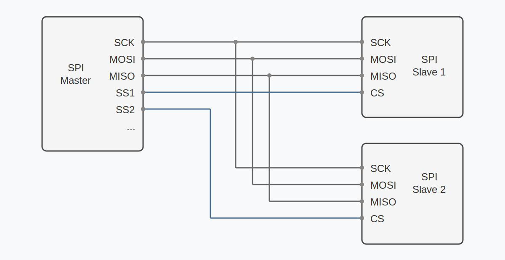

<!-- Image Reference -->

import ImgSPIDiagram from './images/08-SPI_bb.webp';
import ImgI2COLED from './images/07-I2C-OLED.webp';

# SPI Communication

:::tip[Important Note: Development Board Compatibility]
The core logic of this tutorial applies to all ESP32 development boards, but all operational steps are explained using the [**Waveshare ESP32-S3-Zero mini development board**](https://www.waveshare.com/esp32-s3-zero.htm). If you are using a different model of development board, please adjust the corresponding settings based on your actual hardware.
:::

> This section introduces the basic concepts of the SPI communication protocol and demonstrates how to use MicroPython's `machine.SPI` class to drive an OLED display.

**SPI (Serial Peripheral Interface)** is a high-speed, full-duplex synchronous serial communication protocol. SPI is widely used for communication between microcontrollers and various peripherals, such as TF cards, displays, sensors, and Flash memory.

Key characteristics of SPI include:

- **Four-wire communication**: Uses 4 signal lines for communication (can be reduced to 3 lines with a single slave device)
- **Master-slave architecture**: A clear master-slave relationship where the master device controls the communication timing
- **Full-duplex**: Can simultaneously send and receive data
- **High-speed transmission**: Typically faster than I2C and UART, reaching tens of MHz
- **Synchronous communication**: The clock signal is provided by the master device, ensuring reliable data transmission

The four core signal lines of the SPI protocol are:



- **SCK (Serial Clock)**: Serial clock line. The clock signal generated by the host for synchronizing data transmission.
- **MOSI (Master Out Slave In)**: Master output, slave input line. The master device sends data to the slave device through this line.
- **MISO (Master In Slave Out)**: Master input, slave output line. The slave device sends data to the master device through this line.
- **SS/CS (Slave Select/Chip Select)**: Chip select signal line. The host uses this line to select the currently targeted slave device; active low. The SPI master selects the target slave via different CS (Chip Select) lines. Each additional SPI peripheral requires a dedicated CS pin.

import Details from '@theme/Details';

<Details summary="Supplementary Note on SPI Terminology Updates">
You may notice in some recent technical manuals or open-source projects that SPI terminology is undergoing changes. Understanding these new terms will help you read the latest materials without barriers. The following table shows the correspondence between old and new terminology:

|  Category   | Traditional Term |                 New Term                  |
| :---------: | :--------------: | :---------------------------------------: |
| Device Role |    **Master**    |              **Controller**               |
| Device Role |    **Slave**     |              **Peripheral**               |
| Signal Line |     **MOSI**     | **PICO** (Peripheral In / Controller Out) |
| Signal Line |     **MISO**     | **POCI** (Peripheral Out / Controller In) |

</Details>

## 1. SPI in ESP32

### 1.1 Hardware Resources

ESP32 series chips typically have multiple built-in SPI controllers, but their purposes differ:

- **SPI0 & SPI1**: These two controllers are primarily used to connect to external Flash and PSRAM and are dedicated system resources.
- **SPI2 & SPI3**: These are two **general-purpose** controllers, fully available for user applications. They can be used for high-speed communication with displays, TF cards, sensors, and other devices.

### 1.2 ID Mapping in MicroPython

MicroPython uses the `machine.SPI` class to drive these hardware resources. To distinguish between different controllers, MicroPython uses the `id` parameter for mapping:

- **`id=1`**: Corresponds to hardware **SPI2**. Often called HSPI in classic ESP32; called FSPI in ESP32-S3.
- **`id=2`**: Corresponds to hardware **SPI3**. Often called VSPI in classic ESP32.

:::tip Tip
Although the naming (HSPI/VSPI/FSPI) in different chip manuals may vary, you only need to use the `id` parameter in MicroPython code to distinguish them.
:::

### 1.3 Hardware SPI Pins

ESP32's SPI pin assignment is very flexible, thanks to its internal **GPIO Matrix**. The SCK, MOSI, and MISO signals of SPI can be mapped to any GPIO pin that supports output/input.

However, each SPI controller has a set of **default pins** (also called IO MUX pins).

- **Using default pins**: Signals are transmitted directly through the IO MUX, supporting clock frequencies up to 80MHz.
- **Using custom pins**: Signals need to be routed through the GPIO matrix, with the maximum clock frequency typically limited to around 40MHz (still very fast and sufficient for most applications).

The following table provides a reference for the default SPI pins of common models:

| Chip Model   | MicroPython ID | Hardware Name | MOSI    | MISO    | SCK     |
| :----------- | :------------- | :------------ | :------ | :------ | :------ |
| **ESP32**    | 1              | HSPI          | GPIO 13 | GPIO 12 | GPIO 14 |
|              | 2              | VSPI          | GPIO 23 | GPIO 19 | GPIO 18 |
| **ESP32-S3** | 1              | SPI2 (FSPI)   | GPIO 11 | GPIO 13 | GPIO 12 |
|              | 2              | SPI3          | GPIO 35 | GPIO 37 | GPIO 36 |

:::warning Note
Different ESP chip models have varying numbers of SPI peripherals and pin configurations. Please refer to the target chip's datasheet for detailed information.

You can also check the default pins in the REPL using the following commands:

```python
from machine import SPI
```

```python
SPI(1)  # Check default pins for SPI2
```

```python
SPI(2)  # Check default pins for SPI3
```

:::

## 2. Example 1: Using SPI to Control a Display

This example demonstrates how to use the SPI interface to drive an OLED display. Compared to I2C, the SPI version of the display typically offers faster refresh rates.

### 2.1 Build the Circuit

The components required are:

- [Waveshare 1.5inch OLED Module](https://www.waveshare.com/1.5inch-oled-module.htm) × 1
- Breadboard × 1
- Wires
- ESP32 development board

Connect the circuit according to the wiring diagram below:

<Details summary="ESP32-S3-Zero Pinout Diagram">


</Details>

<div style={{maxWidth:800}}> </div>

| ESP32 Pin | OLED Module | Module              |
| --------- | ----------- | ------------------- |
| GPIO 13   | SCK         | SPI Clock Line      |
| GPIO 11   | MOSI        | SPI Data Output     |
| GPIO 10   | CS          | Chip Select Signal  |
| GPIO 8    | DC          | Data/Command Select |
| 3.3V      | VCC         | Power Positive      |
| GND       | GND         | Power Ground        |

### 2.2 Code

:::tip
This code example requires the [**`ssd1327.py` driver library**](https://github.com/eMUQI/micropython-ssd1327), which is based on the [micropython-ssd1327](https://github.com/mcauser/micropython-ssd1327) project by community developer mcauser.

Download link: [micropython-ssd1327-master.zip](https://github.com/eMUQI/micropython-ssd1327/archive/refs/heads/master.zip)

Please upload the `ssd1327.py` file from this library to the root directory of your development board.
:::

```python
from machine import Pin, SPI
import ssd1327

# SPI pin configuration
SCK_PIN = 13
MOSI_PIN = 11
CS_PIN = 10
DC_PIN = 8
RST_PIN = 9  # Reset pin

# Initialize hardware SPI
# Use id=1 (HSPI), set clock frequency to 10 MHz
spi = SPI(1, baudrate=10000000, sck=Pin(SCK_PIN), mosi=Pin(MOSI_PIN))

# Initialize display
oled = ssd1327.SSD1327_SPI(128, 128, spi, dc=Pin(DC_PIN), res=Pin(RST_PIN), cs=Pin(CS_PIN))

print("SSD1327 OLED test")

# Clear screen (fill with black)
oled.fill(0)

# Display text
# framebuf.text(s, x, y, c)
# c is the color value. For 4-bit grayscale, the range is 0-15. 15 is brightest, 0 is black.
oled.text("Hello,", 10, 10, 15)
oled.text("MicroPython!", 10, 25, 8)
oled.text("ESP32", 10, 40, 1) # Lower brightness text

# Use framebuf to draw graphics
# Draw a rectangle frame
oled.framebuf.rect(0, 0, 128, 128, 15)
# Draw a circle or ellipse
oled.framebuf.ellipse(0, 0, 128, 128, 15)

# Refresh the display
oled.show()
```

### 2.3 Code Analysis

1. **`from machine import Pin, SPI`**: Imports MicroPython's MicroPython's `Pin` and `SPI` class.

2. **`SPI(1, baudrate=10000000, sck=Pin(SCK_PIN), mosi=Pin(MOSI_PIN))`**: Initializes hardware SPI.
   - `1`: Specifies using the SPI controller with ID 1.
   - `baudrate=10000000`: Sets the SPI clock frequency to 10 MHz.
   - `sck`, `mosi`: Specifies the SPI clock and data output pins.
   - Since the OLED display typically only needs to receive data, the `miso` pin is not configured in this example.

3. **`ssd1327.SSD1327_SPI(...)`**: Creates an SSD1327 display object.
   - `128, 128`: Specifies the screen resolution.
   - `spi`: Passes in the initialized SPI object.
   - `dc`, `res`, `cs`: Specifies the Data/Command select pin, Reset pin, and Chip Select pin, respectively.

4. **`oled.fill(0)`**: Clears the screen buffer (fills with black).

5. **`oled.text(...)`**: Writes text to the buffer.
   - The first parameter is the text content to display.
   - The second parameter is the x-coordinate of the text.
   - The third parameter is the y-coordinate of the text.
   - The fourth parameter is the color value (brightness). SSD1327 supports 16 levels of grayscale (4-bit), so you can pass an integer between 0 and 15 to control brightness. 15 is brightest, 0 is black.

6. **About the `framebuf` module**:
   - The `ssd1327` driver library is built on top of MicroPython's built-in `framebuf` (Frame Buffer) module. `framebuf` provides a standard set of graphics drawing APIs, including drawing text, lines, rectangles, circles, and other basic shapes.
   - In the code, methods like `oled.framebuf.rect()` and `oled.framebuf.ellipse()` directly call the `framebuf` drawing functions.
   - `framebuf` supports multiple color formats and drawing operations and is the standard tool for graphics display in MicroPython. For more drawing methods and detailed usage, refer to the [MicroPython framebuf official documentation](https://docs.micropython.org/en/latest/library/framebuf.html).

7. **`oled.show()`**: Sends the data from the buffer to the OLED screen, updating the display. **The screen content will not change until this method is called.**

### 2.4 Expected Output

After uploading and running the code, the OLED display will show the following:

- The first line shows "Hello," at high brightness.
- The second line shows "MicroPython!" at medium brightness.
- The third line shows "ESP32" at low brightness.
- A rectangular frame and an inscribed circle will also be displayed on the screen.

<div style={{maxWidth:300}}> </div>

## 3. Related Links

- [MicroPython - ESP32 Quick Reference - SPI](https://docs.micropython.org/en/latest/esp32/quickref.html#hardware-spi-bus)
- [MicroPython - machine.SPI](https://docs.micropython.org/en/latest/library/machine.SPI.html)
- [micropython-ssd1327 Driver Library](https://github.com/mcauser/micropython-ssd1327)
- [A Resolution to Redefine SPI Signal Names | OSHWA](https://oshwa.org/resources/a-resolution-to-redefine-spi-signal-names/)
- [New SPI Terminology | OSHWA](https://oshwa.org/announcements/new-spi-terminology/)
