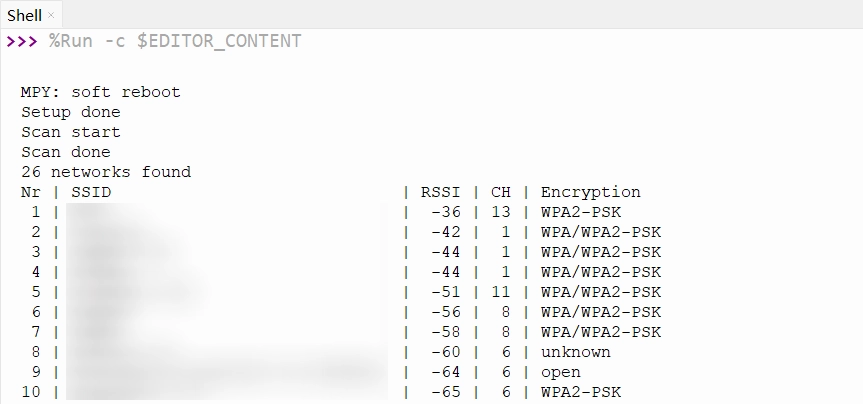
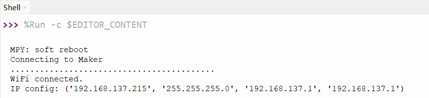
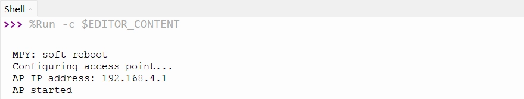

# WiFi Basic Usage

> This section covers the basic Wi-Fi operations with ESP32 MicroPython, including scanning for Wi-Fi networks, connecting to a specific Wi-Fi, creating an access point, and configuring a static IP address.

The ESP32 series chips are equipped with powerful wireless connectivity capabilities. Most ESP32 chips integrate Wi-Fi, making them excellent choices for Internet of Things (IoT) projects. Some models do not integrate Wi-Fi functionality to meet cost or specific application needs. For detailed support by model, please refer to the official [ESP32 Product Overview](https://products.espressif.com/static/Espressif%20SoC%20Product%20Portfolio.pdf) document.

The ESP32 can operate in various Wi-Fi modes:

- **STA mode (Station)**: The ESP32 acts as a client, connecting to a router or access point.
- **AP mode (Access Point)**: The ESP32 creates its own Wi-Fi hotspot, allowing other devices to connect to it.
- **AP+STA mode**: The ESP32 can simultaneously connect to a network as a client and provide a hotspot for other devices.

This tutorial demonstrates the fundamental Wi-Fi operations for the ESP32 in a MicroPython environment through the following examples:

- [Example 1: Scan for WiFi](#wifi-scan)
- [Example 2: Connect to Specific Wi-Fi (STA Mode)](#wifi-sta)
- [Example 3: Create Wi-Fi Hotspot (AP Mode)](#wifi-ap)
- [Example 4: Configure a Static IP](#wifi-static-ip)

## 1. Example 1: Scan WiFi {#wifi-scan}

This example shows how to scan for surrounding Wi-Fi networks and display their details, including network name, signal strength, channel, and encryption type.

### 1.1 Code

```python
import time
import network

def get_security_name(security_type):
    """Convert security type to a readable string"""
    if security_type == 0:
        return "open"
    elif security_type == 1:
        return "WEP"
    elif security_type == 2:
        return "WPA-PSK"
    elif security_type == 3:
        return "WPA2-PSK"
    elif security_type == 4:
        return "WPA/WPA2-PSK"
    else:
        return "unknown"

# Create a WLAN object in STA mode
wlan = network.WLAN(network.STA_IF)
# Activate the WLAN interface
wlan.active(True)

print("Setup done")

while True:
    print("Scan start")
    # Scan for available Wi-Fi networks
    networks = wlan.scan()
    print("Scan done")

    if len(networks) == 0:
        print("no networks found")
    else:
        print(f"{len(networks)} networks found")
        print("Nr | SSID                             | RSSI | CH | Encryption")

        for i, net in enumerate(networks):
            # Network info format: (ssid, bssid, channel, RSSI, security, hidden)
            ssid = net[0].decode('utf-8') if net[0] else "Hidden"
            rssi = net[3]
            channel = net[2]
            security = net[4]

            # Format the output
            print(f"{i+1:2d} | {ssid:32.32s} | {rssi:4d} | {channel:2d} | {get_security_name(security)}")

    print("")

    # Wait 10 seconds before scanning again
    time.sleep(10)
```

### 1.2 Code Analysis

- `network.WLAN(network.STA_IF)`: Creates a WLAN network interface object. The parameter `network.STA_IF` specifies Station mode.
- `wlan.active(True)`: Activates the WLAN interface. This must be done before performing any Wi-Fi operations.
- `wlan.scan()`: Performs a network scan. This method blocks execution until the scan is complete and returns a list containing information about all discovered networks. Each network's information is a tuple with the format `(ssid, bssid, channel, RSSI, security, hidden)`.
- **Tuple element details**:
  - `ssid`: Network name, in bytes. It needs to be decoded to a string using `.decode('utf-8')`.
  - `bssid`: The router's MAC address, in bytes.
  - `channel`: The Wi-Fi channel number.
  - `RSSI`: Received Signal Strength Indicator, in dBm. This is a negative value; values closer to 0 indicate a stronger signal.
  - `security`: Encryption type, an integer value.
  - `hidden`: Boolean indicating if it's a hidden network.
- `get_security_name()`: A helper function that converts the numeric security type into a human-readable string.

:::tip
A soft reset usually does not reset the Wi-Fi hardware state. To completely reset Wi-Fi, it is recommended to explicitly call `wlan.active(False)` in your code or perform a hard reset.
:::

### 1.3 Expected Output

After running the code, the Shell will display a list of available Wi-Fi networks detected. The output will be similar to:



## 2. Example 2: Connect to Specific Wi-Fi (STA Mode) {#wifi-sta}

The ESP32 connects to the specified Wi-Fi network, obtains an IP address, and maintains the connection.

### 2.1 Code

```python
import time
import network

// Replace with your actual Wi-Fi network information
SSID = "Maker"        # Replace with your Wi-Fi name (SSID)
PASSWORD = "12345678"  # Replace with your Wi-Fi password

# Create a WLAN object in STA mode
wlan = network.WLAN(network.STA_IF)
# Activate the WLAN interface
wlan.active(True)

print(f"Connecting to {SSID}")

# Connect to the specified Wi-Fi network
wlan.connect(SSID, PASSWORD)

# Wait for the connection to be established
while not wlan.isconnected():
    time.sleep(0.5)
    print(".", end="")

print("")
print("WiFi connected.")
print("IP config:", wlan.ifconfig())
```

### 2.2 Code Analysis

- `wlan.connect(ssid, password)`: Initiates the connection process. This is an asynchronous function that returns immediately while the connection proceeds in the background.
- `wlan.isconnected()`: Returns the current Wi-Fi connection status. It returns `True` if successfully connected, otherwise `False`. The `while` loop polls this status to wait for the connection to complete.
- `wlan.ifconfig()`: Gets the network interface configuration. It returns a tuple containing 4 elements: `(ip, subnet_mask, gateway, dns_server)`.
  - `wlan.ifconfig()[0]`: Gets the assigned IP address.

### 2.3 Expected Output

Modify the `SSID` and `PASSWORD` in the code to your actual Wi-Fi information and run it. The Shell will display the connection progress and print out the obtained IP address upon success.


## 3. Example 3: Create Wi-Fi Hotspot (AP Mode) {#wifi-ap}

This example shows how the ESP32 creates a Wi-Fi hotspot that other devices can connect to.

### 3.1 Code

```python
import network

SSID = "ESP32-S3-TEST"  # Set the hotspot name
PASSWORD = "12345678"   # Set the hotspot password (at least 8 characters)

# Create a WLAN object in AP mode
ap = network.WLAN(network.AP_IF)
# Activate the AP interface
ap.active(True)

print("Configuring access point...")

# Configure and create the hotspot
ap.config(essid=SSID, password=PASSWORD, authmode=network.AUTH_WPA_WPA2_PSK)

# Get the AP's IP address
ip = ap.ifconfig()[0]
print(f"AP IP address: {ip}")
print("AP started")
```

### 3.2 Code Analysis

- `network.WLAN(network.AP_IF)`: Creates a WLAN network interface object. The parameter `network.AP_IF` specifies Access Point (AP) mode.
- `ap.config(essid=ssid, password=password)`: Configures the AP's parameters. The `essid` parameter sets the hotspot name, and the `password` parameter sets the password (must be at least 8 characters).

### 3.3 Expected Output

After the program runs, the ESP32 will create a Wi-Fi hotspot named "ESP32-S3-TEST". The Shell will print the AP's IP address:


## 4. Example 4: Configure a Static IP {#wifi-static-ip}

In specific application scenarios, setting a fixed IP address for the ESP32 (rather than dynamically obtaining one via DHCP) is a common requirement to facilitate stable device access.

### 4.1 STA Mode: Configure Static IP

Building on Example 2, this adds static IP configuration:

```python
import time
import network

SSID = "Maker"         # Wi-Fi name
PASSWORD = "12345678"  # Wi-Fi password

# highlight-start
# Set the static IP address, subnet mask, gateway, and DNS server
// Modify according to your actual LAN configuration
STATIC_IP = "192.168.137.100"     # Set static IP address
SUBNET = "255.255.255.0"   # Set subnet mask
GATEWAY = "192.168.137.1"  # Set gateway
DNS = "192.168.137.1"      # Set DNS server
# highlight-end

# Create a WLAN object in STA mode
wlan = network.WLAN(network.STA_IF)
wlan.active(True)
# highlight-start
# Configure the static IP
wlan.ifconfig((STATIC_IP, SUBNET, GATEWAY, DNS))
# highlight-end

print(f"Connecting to {SSID}")

# Connect to the specified Wi-Fi network
wlan.connect(SSID, PASSWORD)

# Wait for the connection to be established
while not wlan.isconnected():
    time.sleep(0.5)
    print(".", end="")

print("")
print("WiFi connected.")
print(f"IP address: {wlan.ifconfig()[0]}")
```

**Code Analysis**

- `wlan.ifconfig((STATIC_IP, SUBNET, GATEWAY, DNS))`: Configures the network interface with a static IP. The parameter is a tuple of 4 strings representing the IP address, subnet mask, gateway, and DNS server.

  :::warning
  Ensure that the set IP address, gateway, and subnet mask are compatible with your local network environment and that the IP address is not already in use by another device.
  :::

  :::tip
  It's recommended to configure the static IP before connecting to the Wi-Fi to ensure the device establishes the connection using the specified network configuration.
  :::

### 4.2 AP Mode: Configure Static IP

Building on Example 3, this sets a custom IP address for the hotspot:

```python
import network

SSID = "ESP32-S3-TEST"  # Set the hotspot name
PASSWORD = "12345678"   # Set the hotspot password (at least 8 characters)

# highlight-start
STATIC_IP = "192.168.5.1"       # Set static IP address
SUBNET = "255.255.255.0"   # Set subnet mask
GATEWAY = "192.168.5.1"  # Set gateway
DNS = "192.168.5.1"      # Set DNS server
# highlight-end

# Create a WLAN object in AP mode
ap = network.WLAN(network.AP_IF)
ap.active(True)

print("Configuring access point...")

# highlight-start
# Configure the static IP after activating the interface
ap.ifconfig((STATIC_IP, SUBNET, GATEWAY, DNS))
# highlight-end

# Configure and create the hotspot
ap.config(essid=SSID, password=PASSWORD)

print(f"AP IP address: {ap.ifconfig()[0]}")
print("AP started")
```

**Code Analysis**

- `ap.ifconfig((STATIC_IP, SUBNET, GATEWAY, DNS))`: After activating the AP interface, use this method to configure a custom IP address, subnet mask, gateway, and DNS server.

## 6. Related Links

- [MicroPython - ESP32 Quick Reference - Networking](https://docs.micropython.org/en/latest/esp32/quickref.html#networking)
- [MicroPython - network module](https://docs.micropython.org/en/latest/library/network.html)
- [MicroPython - network.WLAN](https://docs.micropython.org/en/latest/library/network.WLAN.html)
