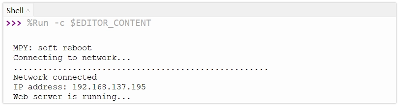
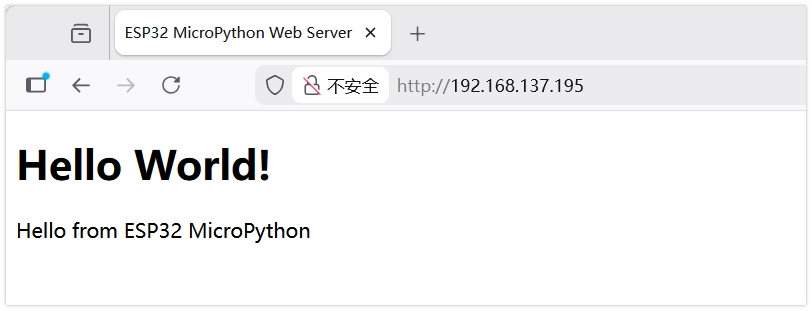
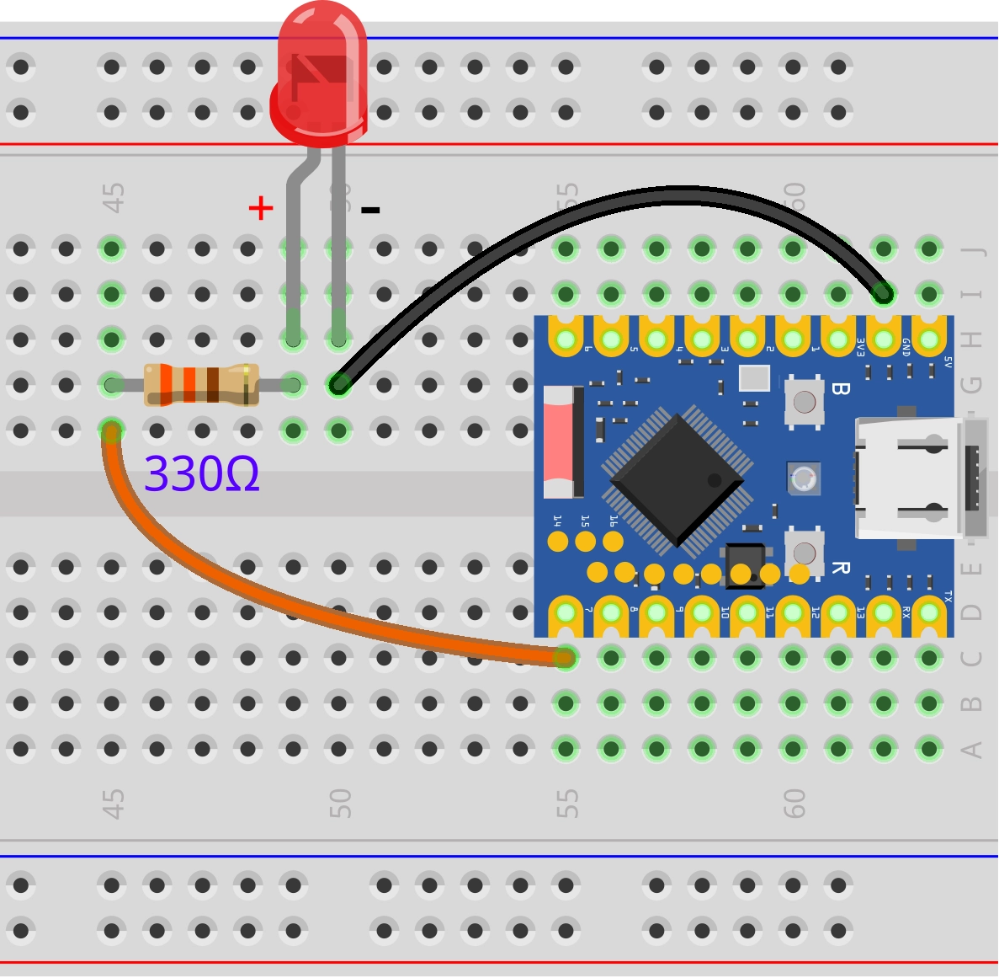
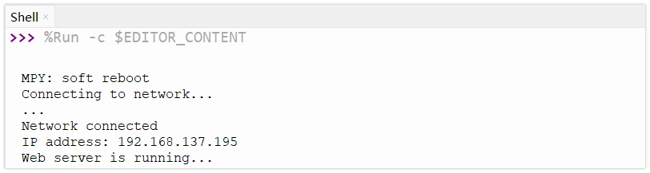
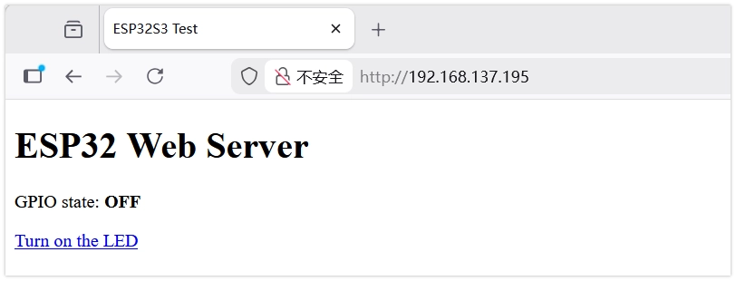
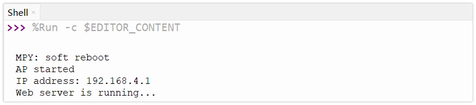
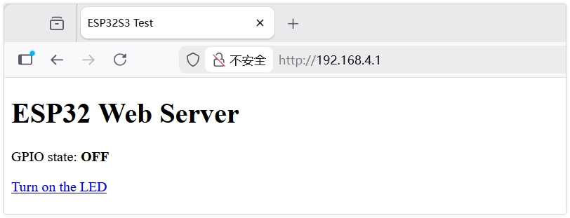

<!-- Image Reference -->

# Web Server

The ESP32 has built-in Wi-Fi capabilities that can serve other devices in the network as a web server. By running a web server on ESP32, a browser-based user interface can be created for monitoring sensor data or controlling device status, which is one of the fundamental features for implementing IoT applications.

## 1. Web Server in MicroPython

In MicroPython, the built-in `socket` module is typically used to create a Web server. While there are third-party libraries like `Microdot` that provide a higher-level wrapper, using `socket` offers a deeper understanding of the basic principles of the HTTP protocol and network communication. It requires no additional libraries to install, making it ideal for beginners.

The basic workflow of a Web server is as follows:

1.  **Create a Socket**: Establish an endpoint for network communication.
2.  **Bind**: Bind the socket to a specific IP address and port (typically port 80 for HTTP).
3.  **Listen**: Start listening for connection requests from clients (e.g., web browsers).
4.  **Accept Connection**: When a client connects, establish a connection channel.
5.  **Receive Request**: Read the HTTP request message sent by the client.
6.  **Send Response**: Send an HTTP response message (containing HTML pages, etc.) based on the request content.
7.  **Close Connection**: Disconnect from the client.

## 2. Example 1: Basic Web Services (STA Mode){#web-server-sta}

Create a basic web server in STA mode to display a static page containing "Hello World!".

### 2.1 Code

```python
import time
import network
import socket
from machine import Pin

# Wi-Fi Configuration
SSID = "Maker"         # Replace with your Wi-Fi name
PASSWORD = "12345678"  # Replace with your Wi-Fi password

def connect_wifi():
    wlan = network.WLAN(network.STA_IF)
    wlan.active(True)
    if not wlan.isconnected():
        print('Connecting to network...')
        wlan.connect(SSID, PASSWORD)
        while not wlan.isconnected():
            time.sleep(0.5)
            print('.', end='')
    print('\nNetwork connected')
    print('IP address:', wlan.ifconfig()[0])
    return wlan

def web_page():
    html = """<!DOCTYPE html> <html>
<head><meta charset="utf-8" name="viewport" content="width=device-width, initial-scale=1">
<title>ESP32 MicroPython Web Server</title>
</head><body>
<h1>Hello World!</h1>
<p>Hello from ESP32 MicroPython</p>
</body></html>
"""
    return html

# Connect to Wi-Fi
connect_wifi()

# Create a Socket
s = socket.socket(socket.AF_INET, socket.SOCK_STREAM)
# Bind to port 80
s.bind(('', 80))
# Start listening
s.listen(5)

print("Web server is running...")

while True:
    try:
        # Accept a client connection
        conn, addr = s.accept()
        print('Got a connection from %s' % str(addr))

        # Receive the request
        request = conn.recv(1024)
        # print('Content = %s' % str(request)) # For debugging, prints the full request header

        # Send the response
        response = web_page()

        # Send HTTP response headers
        conn.send('HTTP/1.1 200 OK\n')
        conn.send('Content-Type: text/html\n')
        conn.send('Connection: close\n\n')

        # Send HTML content
        conn.sendall(response)

        # Close the connection
        conn.close()

    except OSError as e:
        conn.close()
        print('Connection closed')
```

### 2.2 Code Analysis

- **`socket.socket(socket.AF_INET, socket.SOCK_STREAM)`**: Creates a new socket object. `AF_INET` specifies the use of the IPv4 address family, and `SOCK_STREAM` specifies the use of the TCP protocol.
- **`s.bind(('', 80))`**: Binds the socket to the specified IP address and port. `''` means binding to all available network interfaces, and `80` is the standard HTTP service port.
- **`s.listen(5)`**: Starts listening for connection requests. The parameter `5` specifies the maximum number of queued unprocessed connections allowed before rejecting new ones.
- **`s.accept()`**: Blocks program execution until a new client connection request arrives. Once a connection is made, it returns a new socket object `conn` (for communicating with that specific client) and the client's address information `addr`.
- **`conn.recv(1024)`**: Receives data from the client. `1024` specifies the maximum number of bytes to receive at once. The received data is of type bytes.
- **HTTP Response Headers**: Before sending HTML content, HTTP-compliant response headers must be sent first. `HTTP/1.1 200 OK` indicates the request was successful, and `Content-Type: text/html` informs the browser that HTML content follows.

### 2.3 Expected Output

After modifying the Wi-Fi name and password, run the code. Check the ESP32's IP address in the Shell window of Thonny. Enter this IP address in a web browser to see the "Hello World!" page.





## 3. Example 2: Controlling an LED via Web Page (STA Mode){#web-server-led-sta}

In STA mode, control an LED on/off via web page buttons by parsing the path (URL) in the HTTP request.

### 3.1 Circuit Assembly

Components required:

- LED \* 1
- 330Ω resistor \* 1
- Breadboard \* 1
- Wire
- ESP32 development board

Connect the circuit according to the wiring diagram below:

<Details>
  <summary>ESP32-S3-Zero Pinout Diagram</summary>


</Details>

<div style={{maxWidth:500}}> </div>

### 3.2 Code

```python
import time
import network
import socket
from machine import Pin

# LED Configuration
led = Pin(7, Pin.OUT)
led.value(0) # Initially off

# Wi-Fi Configuration
SSID = "Maker"         # Replace with your Wi-Fi name (SSID)
PASSWORD = "12345678"  # Replace with your Wi-Fi password

def connect_wifi():
    wlan = network.WLAN(network.STA_IF)
    wlan.active(True)
    if not wlan.isconnected():
        print('Connecting to network...')
        wlan.connect(SSID, PASSWORD)
        while not wlan.isconnected():
            time.sleep(0.5)
            print('.', end='')
    print('\nNetwork connected')
    print('IP address:', wlan.ifconfig()[0])
    return wlan

def web_page():
    if led.value() == 1:
        gpio_state = "ON"
        button_html = '<a href="/ledoff">Turn off the LED</a>'
    else:
        gpio_state = "OFF"
        button_html = '<a href="/ledon">Turn on the LED</a>'

    html = """<!DOCTYPE html><html>
<head><meta name="viewport" content="width=device-width, initial-scale=1">
<title>ESP32S3 Test</title>
</head>
<body><h1>ESP32 Web Server</h1>
<p>GPIO state: <strong>""" + gpio_state + """</strong></p>
""" + button_html + """
</body></html>"""
    return html

# Connect to Wi-Fi
connect_wifi()

# Create a Socket
s = socket.socket(socket.AF_INET, socket.SOCK_STREAM)
s.bind(('', 80))
s.listen(5)

print("Web server is running...")

while True:
    try:
        conn, addr = s.accept()
        print('Got a connection from %s' % str(addr))

        request = conn.recv(1024)
        request = str(request)
        # Check the network request
        # print(request)

        if 'GET /ledon' in request:
            print('LED ON')
            led.value(1)
        elif 'GET /ledoff' in request:
            print('LED OFF')
            led.value(0)

        # Prepare and send the web page response
        response = web_page()
        conn.send('HTTP/1.1 200 OK\n')
        conn.send('Content-Type: text/html\n')
        conn.send('Connection: close\n\n')
        conn.sendall(response)
        conn.close()

    except OSError as e:
        conn.close()
        print('Connection closed')
```

### 3.3 Code Analysis

- **Request Parsing**:
  - `request = str(request)`: The data received by `conn.recv()` is in bytes. It's converted to a string for easier processing.
  - `if 'GET /ledon' in request`: Checks if the request content contains `GET /ledon`. When a user clicks the "Turn ON" link on the web page, the browser sends a GET request containing this path to the server.
  - The program executes the corresponding LED control logic by determining whether the URL path is `/ledon` or `/ledoff`.
- **Dynamic HTML Generation**:
  - The `web_page()` function dynamically generates HTML code containing different text and links based on the LED's current state (`led.value()`).
  - If the LED is on, the generated page shows a "Turn off" link; if the LED is off, it shows a "Turn on" link.

### 3.4 Expected Output

Access the ESP32's IP address. The page will display a large button. Clicking the button controls the LED on/off, and the page refreshes to show the latest LED state.





## 4. Example 3: Controlling an LED via Web Page (AP Mode){#web-server-led-ap}

In AP (Access Point) mode, the ESP32 creates its own Wi-Fi hotspot. Phones or computers can connect to this hotspot to access the web server without relying on an external router.

### 4.1 Circuit Assembly

The circuit connection is the same as in Example 2.

### 4.2 Code

```python
import time
import network
import socket
from machine import Pin

# LED Configuration
led = Pin(7, Pin.OUT)
led.value(0) # Initially off

# Wi-Fi Configuration
SSID = "ESP32-S3-TEST"  # Set the hotspot name
PASSWORD = "12345678"   # Set the hotspot password (at least 8 characters)

def start_ap():
    ap = network.WLAN(network.AP_IF)
    ap.active(True)
    ap.config(essid=SSID, password=PASSWORD, authmode=network.AUTH_WPA_WPA2_PSK)

    while not ap.active():
        pass

    print('AP started')
    print('IP address:', ap.ifconfig()[0])

def web_page():
    if led.value() == 1:
        gpio_state = "ON"
        button_html = '<a href="/ledoff">Turn off the LED</a>'
    else:
        gpio_state = "OFF"
        button_html = '<a href="/ledon">Turn on the LED</a>'

    html = """<!DOCTYPE html><html>
<head><meta name="viewport" content="width=device-width, initial-scale=1">
<title>ESP32S3 Test</title>
</head>
<body><h1>ESP32 Web Server</h1>
<p>GPIO state: <strong>""" + gpio_state + """</strong></p>
""" + button_html + """
</body></html>"""
    return html

start_ap()

s = socket.socket(socket.AF_INET, socket.SOCK_STREAM)
s.bind(('', 80))
s.listen(5)

print("Web server is running...")

while True:
    try:
        conn, addr = s.accept()
        print('Got a connection from %s' % str(addr))

        request = conn.recv(1024)
        request = str(request)
        # Check the network request
        # print(request)

        if 'GET /ledon' in request:
            print('LED ON')
            led.value(1)
        elif 'GET /ledoff' in request:
            print('LED OFF')
            led.value(0)

        # Prepare and send the web page response
        response = web_page()
        conn.send('HTTP/1.1 200 OK\n')
        conn.send('Content-Type: text/html\n')
        conn.send('Connection: close\n\n')
        conn.sendall(response)
        conn.close()

    except OSError as e:
        conn.close()
        print('Connection closed')
```

### 4.3 Code Analysis

- **`network.WLAN(network.AP_IF)`**: Creates a WLAN object, specifying the use of the AP (Access Point, hotspot) mode interface.
- **`ap.active(True)`**: Activates the AP interface, starting the wireless hotspot functionality.
- **`ap.config(...)`**: Configures hotspot parameters.
  - `essid`: Sets the hotspot name (SSID).
  - `password`: Sets the hotspot password.
  - `authmode`: Sets the authentication mode; here, WPA/WPA2 PSK security mode is used.
- **IP Address**: In AP mode, the ESP32's default IP address is typically `192.168.4.1`.

### 4.4 Expected Output

1.  Upload the code.
2.  Use a phone or computer to search for and connect to the Wi-Fi named "ESP32-AP-Test" (password: 12345678).
3.  Enter `192.168.4.1`.
4.  You will see the control page and can control the LED.





## 5. Related Links

- [MicroPython - ESP32 Quick Reference - Networking](https://docs.micropython.org/en/latest/esp32/quickref.html#networking)
- [MicroPython - socket Module Documentation](https://docs.micropython.org/en/latest/library/socket.html)
- [MicroPython - network Module Documentation](https://docs.micropython.org/en/latest/library/network.html)