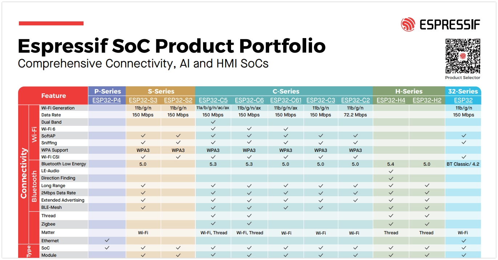
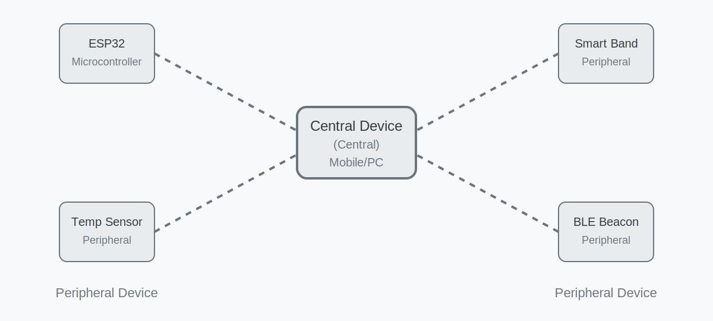
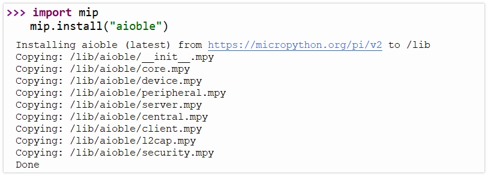
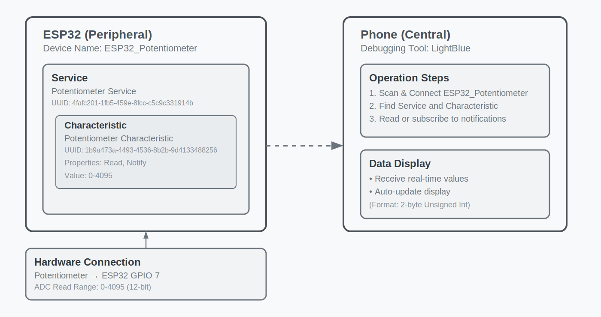
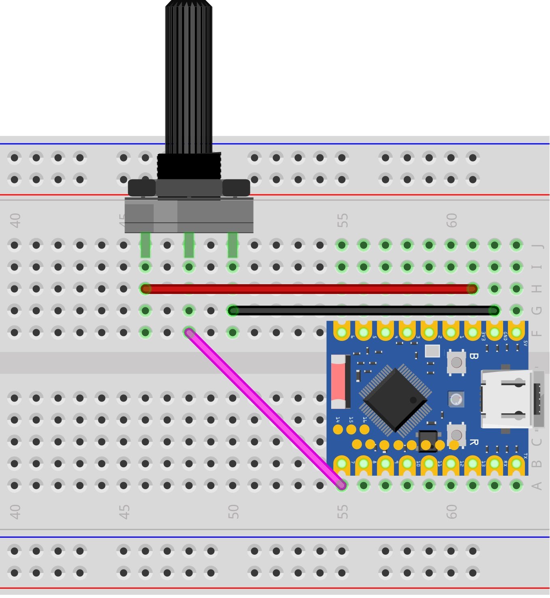
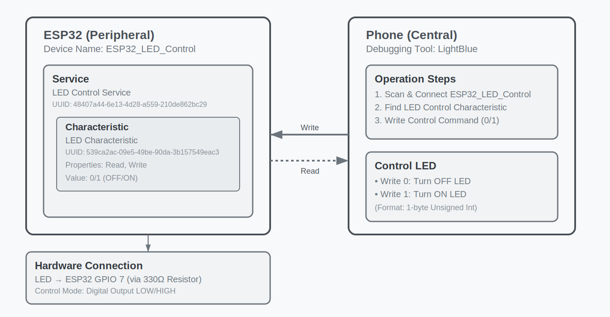
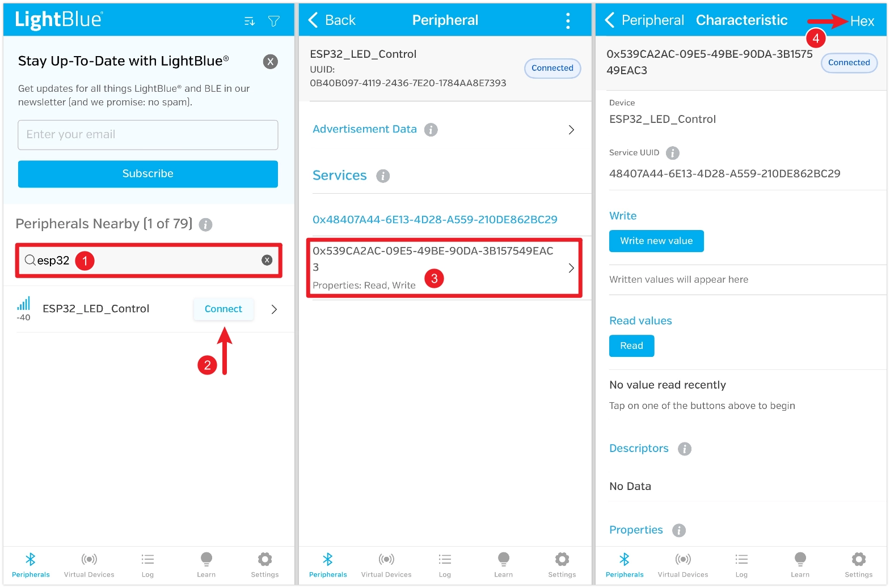
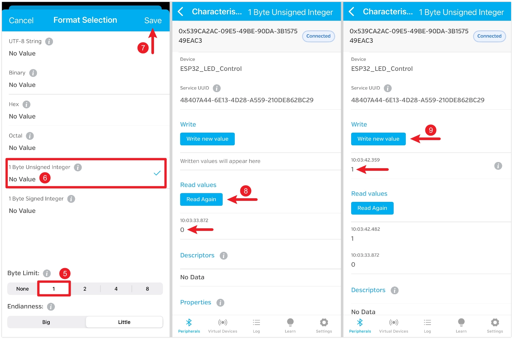
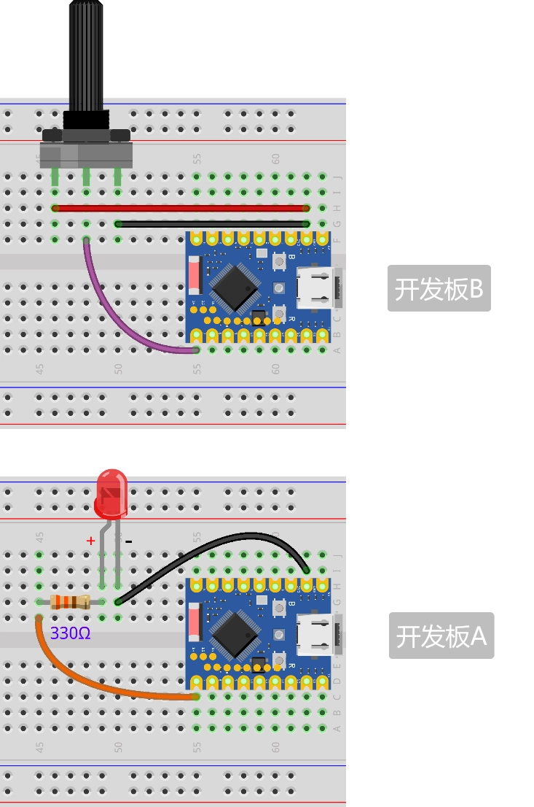

<!-- Image Reference -->


# Bluetooth

The ESP32 series of chips have built-in Bluetooth functionality, making them suitable for smart wearables, wireless sensing, and near-field communication between devices. Bluetooth technology is divided into two main types:

- **Bluetooth Classic**: Designed for continuous, high-throughput data transmission, commonly found in wireless audio devices.
- **Bluetooth Low Energy (BLE)**: Optimized for low-power, intermittent, small-packet communication. It is the mainstream choice for Internet of Things (IoT) applications, such as smart wristbands and wireless sensors.

[](https://products.espressif.com/static/Espressif%20SoC%20Product%20Portfolio.pdf)

ESP32 The Bluetooth support varies among ESP32 chips: the classic ESP32 chip supports both Bluetooth Classic and BLE, while newer models focus on supporting BLE to optimize cost and power consumption (for specific support, see: [ESP32 Product Portfolio](https://products.espressif.com/static/Espressif%20SoC%20Product%20Portfolio.pdf)). In fields like IoT and wearables, BLE is the preferred choice due to its low power consumption and high compatibility.

This tutorial focuses on the application of Bluetooth Low Energy (BLE) technology.

## 1. BLE Basic Concepts

BLE communication is based on the following two core concepts:

- **GAP (Generic Access Profile)**: Defines the rules for device broadcasting, discovery, and connection. For example, an ESP32 broadcasts its presence, and a smartphone scans for and connects to it.
- **GATT (Generic Attribute Profile)**: Defines the data structure and communication methods between BLE devices. The GATT layer consists of "Service" and "Characteristic", each with a unique UUID.

In short, GAP is responsible for "making devices find and connect to each other". Once connected, GATT takes over and defines "how the two parties exchange data in a standardized way”.

### 1.1 GAP (Generic Access Profile)

GAP manages device connections and advertising and defines the roles of devices in Bluetooth communication.

GAP defines two primary roles:

- **Peripheral**: Typically a device that holds data, such as a sensor. It advertises its presence through Advertising and waits to be connected. In the examples, the ESP32 primarily plays this role.
- **Central**: Typically the device that initiates the connection, such as a smartphone or computer. It discovers peripherals through Scanning and initiates connections.



GAP facilitates interaction between devices through the following process:

- **Advertising**: A peripheral periodically sends advertising packets containing information like the device name and service UUID so that central devices can discover it.
- **Scanning**: A central device listens on advertising channels, receives, and parses advertising packets from peripherals.
- **Connecting**: The central device sends a connection request to its chosen peripheral. Once the peripheral accepts, a one-to-one connection is established.

### 1.2 GATT (Generic Access Profile)

GATT (Generic Attribute Profile) takes effect after a connection is established. It defines the framework and format for data exchange. GATT is based on a Client-Server architecture. These two roles typically correspond directly to the GAP roles:

- **GATT Server**: The device that holds the data (usually corresponding to the GAP **Peripheral**). It stores and provides data.
- **GATT Client**: The device that accesses the data (usually corresponding to the GAP **Central**). It sends read/write requests to the server.

Data in GATT is organized in a standardized hierarchical structure:


- **Service**
  A service is a logical collection of related "Characteristics", representing a function of the device. Each service is identified by a unique UUID. For example, the "Battery Service" might contain a "Battery Level" characteristic.

- **Characteristic**
  A characteristic is the basic unit of data exchange, encapsulating a specific data value. A complete characteristic includes:

  - **Value**: The actual stored data.
  - **Properties**: Define the operations a client can perform on the "Value". Typically includes:
    - `Read`: Allows the client to read the value.
    - `Write`: Allows the client to write to the value.
    - `Notify`: Allows the server to proactively send the new value to the client when it changes.
    - `Indicate`: Similar to Notify, but requires client acknowledgment of receipt.
  - **Declaration**: Contains the characteristic's properties, UUID, and location within the service.

- **Descriptor**
  Descriptors are optional and provide additional metadata for a characteristic. For example, they can provide a human-readable description (e.g., "Temperature Measurement"), indicate the unit of the value (e.g., "Celsius"), or define a valid value range.

- **UUID (Universally Unique Identifier)**
  A UUID is a 128-bit number used to uniquely identify services, characteristics, and descriptors. For convenience, the Bluetooth Special Interest Group (SIG) has predefined a set of official short UUIDs (typically 16-bit) for common functions, such as `0x180F` for the Battery Service. When developing custom applications, fully random 128-bit UUIDs should be used to ensure global uniqueness. All assigned standard UUIDs can be queried on the [SIG official website](https://bitbucket.org/bluetooth-SIG/public/src/main/assigned_numbers/uuids/).

## 2. Preparation: Install `aioble` Library

MicroPython provides [aioble](https://github.com/micropython/micropython-lib/tree/master/micropython/bluetooth/aioble) library, which is built on `asyncio` (asynchronous I/O) and simplifies BLE development. Compared to the low-level `bluetooth` module, `aioble` provides a higher-level API.

Before using it, the `aioble` library needs to be installed on the ESP32 development board.

1.  **Ensure the ESP32 is connected to WiFi**: Installing the library requires a network connection.

    ```python
    import network
    wlan = network.WLAN(network.STA_IF)
    wlan.active(True)
    ```

    ```python
    wlan.connect("Maker", "12345678") # Replace with actual SSID and password
    ```

    ```python
    wlan.isconnected()
    wlan.ifconfig()
    ```

2.  **Use `mip` to install**: Run the following command in Thonny's REPL:

    ```python
    import mip
    mip.install("aioble")
    ```

    `mip` will install the library to the `/lib` directory of the MicroPython device. It is not visible by default in the file view but can be viewed by right-clicking in the file view and selecting "Show Hidden Files”.

    

After installation, you can now `import aioble` in your code.

## 3. Example 1: Sending Data via BLE (Peripheral){#ble-peripheral-sent}

This example configures the ESP32 as a peripheral, reads the analog value from a potentiometer, and publishes it via a BLE Characteristic. A smartphone app (like LightBlue) can be used as a central device to connect to the ESP32 and read the value of this characteristic.



### 3.1 Circuit Assembly

Components required:

- Potentiometer \* 1
- Breadboard \* 1
- Wires
- ESP32 development board

Connect the circuit according to the wiring diagram below:

<Details>
  <summary>ESP32-S3-Zero Pinout Diagram</summary>


</Details>

<div style={{maxWidth:500}}> </div>

### 3.2 Code

:::tip
To ensure BLE device uniqueness, it is recommended to use custom UUIDs. You can use online tools (e.g., [Online UUID Generator](https://www.uuidgenerator.net/)) to generate new UUIDs.
:::

```python
import aioble
import bluetooth
import machine
import uasyncio as asyncio

# Define UUIDs (Recommended to use randomly generated UUIDs)
_SERVICE_UUID = bluetooth.UUID("4fafc201-1fb5-459e-8fcc-c5c9c331914b")
_POT_CHAR_UUID = bluetooth.UUID("1b9a473a-4493-4536-8b2b-9d4133488256")

# Advertising interval
_ADV_INTERVAL_US = 250_000

# Configure Peripheral (GATT Server)
# Register Service and Characteristic
# read=True:  Allows clients to read
# notify=True: Allows the server to actively notify
pot_service = aioble.Service(_SERVICE_UUID)
pot_characteristic = aioble.Characteristic(
    pot_service, _POT_CHAR_UUID, read=True, notify=True
)
aioble.register_services(pot_service)

# Hardware initialization
pot = machine.ADC(machine.Pin(7))

# Task: Read sensor and update characteristic value
async def sensor_task():
    print("Sensor task started")
    last_val = -1

    while True:
        # Read potentiometer value (0-4095)
        val = pot.read()

        # Only update when the value changes significantly (simple debounce/filter)
        if abs(val - last_val) > 10:
            last_val = val
            print(f"Potentiometer value: {val}")

            # Write the characteristic value
            # Note: BLE data transmission typically uses byte strings, so integers need to be converted to bytes.
            # Here, the 12-bit integer (0-4095) is converted to a 2-byte little-endian byte string.
            encoded_val = val.to_bytes(2, "little")
            pot_characteristic.write(encoded_val)

            # Send notification to connected clients
            # notify only works if a client is connected and subscribed, and aioble automatically handles checks like this.
            pot_characteristic.write(encoded_val, send_update=True) # connection=None means notifying all subscribed clients

        # Asynchronous delay, yielding CPU to other tasks
        await asyncio.sleep_ms(100)

# Handle Bluetooth advertising and connections
async def peripheral_task():
    print("Advertising task started")
    while True:
        # Start advertising
        # name: Device name
        # services: List of service UUIDs included in advertising, facilitating client scan discovery
        async with await aioble.advertise(
            _ADV_INTERVAL_US, # Advertising interval (microseconds)
            name="ESP32_Potentiometer",
            services=[_SERVICE_UUID],
        ) as connection:
            print("Connection from", connection.device)
            # When a device connects, the code blocks here until the connection is lost.
            # During the connection, sensor_task continues to run in the background and update data.
            await connection.disconnected()
            print("Disconnected")

        # After disconnection, the loop continues, restarting advertising.

# Main program entry point
async def main():
    # Run two tasks concurrently
    t1 = asyncio.create_task(sensor_task())
    t2 = asyncio.create_task(peripheral_task())
    await asyncio.gather(t1, t2)

# Start the asyncio event loop
asyncio.run(main())
```

#### 3.2.1 Code Analysis

This example uses the `aioble` library and `uasyncio` coroutines to achieve "concurrent" execution of BLE event handling (like connection, disconnection) and sensor reading.

1.  **Define UUIDs**:
    Use `bluetooth.UUID` objects to define unique identifiers for the service and characteristic.

2.  **Register Service and Characteristic (`aioble.Service`, `aioble.Characteristic`)**:

    - First, create a `Service` object.
    - Then create a `Characteristic` object under that service.
    - `read=True` and `notify=True` define the permissions of this characteristic.
    - Finally, call `aioble.register_services()` to register them with the BLE stack.

3.  **`sensor_task` (Sensor Task)**:

    - This is an infinite loop task responsible for periodically reading the potentiometer.
    - `pot_characteristic.write(encoded_val, send_update=True)`: Updates the characteristic's local value and sends a notification (Notify) to all subscribed clients.
      - `encoded_val`: BLE BLE data transmission uses byte strings, so integers need to be converted to byte strings using `to_bytes`.
      - `send_update=True`: Instructs `aioble` to automatically handle notification sending. If a client is subscribed, it will receive the new data; if not, only the local value is updated.
    - `await asyncio.sleep_ms(100)`: Asynchronous delay, yielding CPU control back to the scheduler, allowing other tasks (like advertising or the underlying BLE stack) to run.

4.  **`peripheral_task` (Advertising Task)**:

    - `aioble.advertise(...)`: Starts BLE advertising.
      - `name`: Sets the device name in the advertising packet.
      - `services`: Lists the supported service UUIDs, facilitating client scan discovery.
    - `async with await ... as connection`: Uses an asynchronous context manager to handle the connection lifecycle.
      - When a central device connects, the code enters the `with` block and obtains a `connection` object.
      - At this point, advertising automatically stops (unless configured for multiple connections).
    - `await connection.disconnected()`: Asynchronously waits for the connection to be lost. During this time, the task is suspended until the disconnection event occurs.
    - Loop Mechanism: When the connection is lost, the program exits the `with` block and immediately enters the next loop iteration, restarting advertising to wait for a new connection.

5.  **`asyncio.run(main())`**:
    Starts the asyncio event loop, scheduling and running the defined tasks.

#### 3.2.2 Running Results

:::tip
This example requires using a Bluetooth debugging tool, such as [LightBlue](https://apps.apple.com/cn/app/lightblue/id557428110). iOS users can download it from the [Apple Store](https://apps.apple.com/cn/app/lightblue/id557428110), and Android users can download it from [Google Play](https://play.google.com/store/apps/details?id=com.punchthrough.lightblueexplorer).
:::

Open LightBlue and perform the following operations:

First, search for "ESP32", find the "ESP32_Potentiometer" device, and click "Connect". On the device details page, find the characteristic that shows read and subscribe functions are enabled, then click into it. Click the "HEX" icon in the top right to set the data type for subsequent viewing.


Set "Byte Limit" to 2, select "2 Byte Unsigned Integer", and save. After saving, return to the characteristic details page and click "Read" to read the data. Rotate the potentiometer and read again to see the change. You can also click "Subscribe" to subscribe to the data; the value will automatically refresh when you rotate the potentiometer.


## 4. Example 2: Receiving Data via BLE (Peripheral){#ble-peripheral-received}

This example configures the ESP32 as a peripheral and creates a writable BLE Characteristic. A smartphone app (like LightBlue) can write specific values (e.g., 0 or 1) to this characteristic to control an LED connected to the ESP32.



### 4.1 Circuit Assembly

Components required:

- LED \* 1
- 330Ω resistor \* 1
- Breadboard \* 1
- Wires
- ESP32 development board

Connect the circuit according to the wiring diagram below:

<Details>
  <summary>ESP32-S3-Zero pinout definition</summary>


</Details>

<div style={{maxWidth:500}}> </div>

### 4.2 Code

```python
import aioble
import bluetooth
import machine
import uasyncio as asyncio

# Define UUIDs (Recommended to use randomly generated UUIDs)
_SERVICE_UUID = bluetooth.UUID("48407a44-6e13-4d28-a559-210de862bc29")
_LED_CHAR_UUID = bluetooth.UUID("539ca2ac-09e5-49be-90da-3b157549eac3")

# Advertising interval
_ADV_INTERVAL_US = 250_000

# Configure Peripheral
# read=True, write=True: Allows read and write
# capture=True: Allows aioble to capture write events for processing in code
led_service = aioble.Service(_SERVICE_UUID)
led_characteristic = aioble.Characteristic(
    led_service, _LED_CHAR_UUID, read=True, write=True, capture=True
)
aioble.register_services(led_service)

# Hardware initialization
led = machine.Pin(7, machine.Pin.OUT)
led.value(0) # Default off

# Task: Handle write requests
async def led_task():
    print("LED task started")
    while True:
        # Wait for client to write data
        # written() returns a context manager. When a write occurs, it returns connection and value
        connection, value = await led_characteristic.written()

        print(f"Received: {value} from {connection.device}")

        if value:
            # Parse command (assuming only 1 byte is sent)
            command = value[0]

            if command == 1:
                print("Turning LED ON")
                led.value(1)
            elif command == 0:
                print("Turning LED OFF")
                led.value(0)
            else:
                print(f"Unknown command: {command}")

            # Update the characteristic's value so clients can read the latest state
            led_characteristic.write(value)

# Task: Handle advertising (same as Example 1)
async def peripheral_task():
    print("Advertising task started")
    while True:
        async with await aioble.advertise(
            _ADV_INTERVAL_US,
            name="ESP32-LED",
            services=[_SERVICE_UUID],
        ) as connection:
            print("Connection from", connection.device)
            await connection.disconnected()
            print("Disconnected")

# Main program entry point
async def main():
    t1 = asyncio.create_task(led_task())
    t2 = asyncio.create_task(peripheral_task())
    await asyncio.gather(t1, t2)

asyncio.run(main())
```

#### 4.2.1 Code Analysis

1.  **`capture=True`**:
    Setting `capture=True` during `Characteristic` initialization is crucial. This parameter instructs `aioble` to pass write requests to the application layer for handling, rather than having the underlying stack automatically acknowledge them. This allows the program to capture write events and execute corresponding logic (like controlling the LED).

2.  **`await led_characteristic.written()`**:
    This is an asynchronous wait method used to listen for write events.
    - When a client writes data, this method returns a tuple `(connection, value)`.
    - `connection`: The client connection object that initiated the write request.
    - `value`: The raw data (byte string) written by the client.

3.  **Data Parsing and Control**:
    After obtaining `value`, the program extracts the command byte and controls the LED's GPIO level based on the command value (0 or 1).

4.  **State Synchronization (`led_characteristic.write`)**:
    After handling the hardware operation, calling `write(value)` updates the characteristic's local cached value. This ensures that if a client subsequently reads this characteristic, it will get the latest value consistent with the hardware state.

#### 4.2.2 Running Results

:::tip
This example requires using a Bluetooth debugging tool, such as [LightBlue](https://apps.apple.com/cn/app/lightblue/id557428110). iOS users can download it from the [Apple Store](https://apps.apple.com/cn/app/lightblue/id557428110), and Android users can download it from [Google Play](https://play.google.com/store/apps/details?id=com.punchthrough.lightblueexplorer).
:::

Open LightBlue and follow these steps:

First, search for "ESP32", find the "ESP32_LED_Control" device, and click "Connect". On the device details page, find the characteristic that shows read and write functions are enabled, then click into it. Click the "HEX" icon in the top right to set the data type for subsequent viewing.



Set "Byte Limit" to 1, select "1 Byte Unsigned Integer", and save. After saving, return to the characteristic details page and click "Read" to read the data. The default value is 0, and the LED is off at this point. Click "Write new value", write the number 1, and the LED will light up.



<!-- > 【todo】You might consider making this into a video or GIF, pairing it with a monitor and the actual circuit. -->

## 5. Example 3: BLE Communication Between ESP32s{#ble-between-esp32}

Use BLE to control an LED connected to one ESP32 using a potentiometer connected to another ESP32.


### 5.1 Circuit Assembly

Components required:

- LED \* 1
- 330Ω resistor \* 1
- Potentiometer \* 1
- Breadboard \* 2
- Wires
- ESP32 development board \* 2

Connect the circuit according to the wiring diagram below:

<Details>
  <summary>ESP32-S3-Zero pinout definition</summary>


</Details>

<div style={{maxWidth:600}}> </div>

### 5.2 Code

#### 5.2.1 Code for ESP32 Board A (Peripheral - LED Side)

This code is very similar to Example 2, only the UUIDs are different. It acts as a server, waiting for a client to connect and write brightness values.

```python
import aioble
import bluetooth
import machine
import uasyncio as asyncio
import struct

# Define UUIDs
_SERVICE_UUID = bluetooth.UUID("458063a1-02bf-4664-857e-16c1030be066")
_BRIGHTNESS_CHAR_UUID = bluetooth.UUID("a5209632-66a9-411d-9353-9be5507790fa")

# Advertising interval
_ADV_INTERVAL_US = 250_000

# Configure Peripheral
# capture=True: Allows aioble to capture write events
led_service = aioble.Service(_SERVICE_UUID)
led_characteristic = aioble.Characteristic(
    led_service, _BRIGHTNESS_CHAR_UUID, read=True, write=True, capture=True
)
aioble.register_services(led_service)

# Hardware initialization
led = machine.PWM(machine.Pin(7))
led.freq(1000)
led.duty_u16(0)

# Task: Handle write requests
async def led_task():
    print("LED task started")
    while True:
        connection, value = await led_characteristic.written()

        if value:
            # The received value is 0-65535 (2 bytes, Little Endian)
            try:
                duty_u16 = struct.unpack("<H", value)[0]
                print(f"Received duty: {duty_u16}")

                # Directly set PWM duty cycle
                led.duty_u16(duty_u16)

                # Update the characteristic value
                led_characteristic.write(value)
            except:
                pass

# Task: Handle advertising
async def peripheral_task():
    print("Advertising task started")
    while True:
        async with await aioble.advertise(
            _ADV_INTERVAL_US,
            name="ESP32-LED",
            services=[_SERVICE_UUID],
        ) as connection:
            print("Connection from", connection.device)
            await connection.disconnected()
            print("Disconnected")

# Main program entry point
async def main():
    t1 = asyncio.create_task(led_task())
    t2 = asyncio.create_task(peripheral_task())
    await asyncio.gather(t1, t2)

asyncio.run(main())
```

#### 5.2.2 Code for ESP32 Board B (Central - Potentiometer Side)

This code demonstrates how to use `aioble` as a central device (Client). It needs to scan, connect, discover services, and then write data.

```python
import aioble
import bluetooth
import machine
import uasyncio as asyncio
import struct

# Define target UUIDs
_SERVICE_UUID = bluetooth.UUID("458063a1-02bf-4664-857e-16c1030be066")
_BRIGHTNESS_CHAR_UUID = bluetooth.UUID("a5209632-66a9-411d-9353-9be5507790fa")

# Hardware initialization
pot = machine.ADC(machine.Pin(7))

# Helper function: Find and connect to a device
async def find_device():
    print(f"Scanning for UUID: {_SERVICE_UUID} ...")
    # Scan for 5 seconds
    async with aioble.scan(5000, interval_us=30000, window_us=30000, active=True) as scanner:
        async for result in scanner:
            # Check service UUID
            if _SERVICE_UUID in result.services():
                device_name = result.name() or "Unknown"
                print(f"Found Target Device: {device_name}")
                return result.device
    return None

# Main task
async def central_task():
    print("Central task started")

    while True:
        device = await find_device()
        if not device:
            print("Device not found, retrying...")
            await asyncio.sleep_ms(1000)
            continue

        try:
            print(f"Connecting to device...")
            connection = await device.connect(timeout_ms=5000)
        except asyncio.TimeoutError:
            print("Connection timeout")
            continue

        async with connection:
            print("Connected")

            try:
                # Discover service
                print("Discovering services...")
                service = await connection.service(_SERVICE_UUID)
                if not service:
                    print("Service not found")
                    continue

                # Discover characteristic
                print("Discovering characteristics...")
                char = await service.characteristic(_BRIGHTNESS_CHAR_UUID)
                if not char:
                    print("Characteristic not found")
                    continue

                print("Ready to send data")
                last_val = -1

                while True:
                    # Read potentiometer (0-65535)
                    val = pot.read_u16()

                    # Only send if change exceeds a threshold to avoid jitter
                    if abs(val - last_val) > 1000:
                        last_val = val
                        print(f"Sending duty: {val}")

                        # Write data (2 bytes, little-endian)
                        await char.write(struct.pack("<H", val), response=False)

                    await asyncio.sleep_ms(100)

            except Exception as e:
                print(f"Error: {e}")

            print("Disconnected")
            # Loop back to start, rescan and reconnect

# Main program entry point
asyncio.run(central_task())
```

#### 5.2.3 Code Analysis

##### **Peripheral (A - LED Side)**

The code logic is similar to Example 2. The main differences lie in data handling:

- **PWM Control**: Uses `machine.PWM` instead of digital output to achieve LED brightness control.
- **Data Unpacking**: The received data is a 2-byte little-endian byte string. Use `struct.unpack("<H", value)` to convert it back to a Python integer (`u16`), directly corresponding to the PWM duty cycle parameter.

##### **Central (B - Potentiometer Side)**

This part demonstrates the typical workflow of a BLE central device (Client):

1.  **Device Scanning (`aioble.scan`)**:
    - Starts scanning and obtains a `scanner` object.
    - Uses `async for` to asynchronously iterate through scan results.
    - Filters for the specific peripheral by checking if `result.services()` contains the target service's UUID.

2.  **Establishing a Connection (`device.connect`)**:
    - After locking onto the target device, calls `device.connect()` to initiate a connection request.
    - Uses the `async with connection:` context manager to maintain the connection. This ensures the connection is properly closed and resources are released when the task ends or an exception occurs.

3.  **Service and Characteristic Discovery**:
    - **Service Discovery**: After a successful connection, first obtain the remote service object via `connection.service(_SERVICE_UUID)`.
    - **Characteristic Discovery**: Based on the service object, obtain the remote characteristic object via `service.characteristic(_BRIGHTNESS_CHAR_UUID)`.
    - This step is essential. Only after obtaining the characteristic object can read/write operations be performed on it.

4.  **Data Sending (`char.write`)**:
    - **Data Packing**: Uses `struct.pack("<H", val)` to pack the potentiometer's integer value (`u16`) into a 2-byte little-endian byte string, matching the peripheral's parsing format.
    - **Write Without Response**: Calls `char.write(..., response=False)` to send data. Setting `response=False` (i.e., Write Without Response) avoids waiting for the server's acknowledgment packet, significantly improving data throughput, which is suitable for sensor data streams with high real-time requirements.

#### 5.2.4 Running Results

1.  Upload the respective codes to the two ESP32 boards.
2.  Board A (LED) will start advertising.
3.  Board B (Potentiometer) will scan for A and automatically establish a connection.
4.  Rotate the potentiometer on B, and the brightness of the LED on A will change smoothly.
5.  If you disconnect the power to A, B will detect the disconnection and restart scanning. When A powers back on, the connection will automatically restore.

## 6. Related Links

- [MicroPython aioble Library (GitHub)](https://github.com/micropython/micropython-lib/tree/master/micropython/bluetooth/aioble)
- [MicroPython Bluetooth Documentation](https://docs.micropython.org/en/latest/library/bluetooth.html)
- [Online UUID Generator](https://www.uuidgenerator.net/)
- [MicroPython asyncio Documentation](https://docs.micropython.org/en/latest/library/asyncio.html)