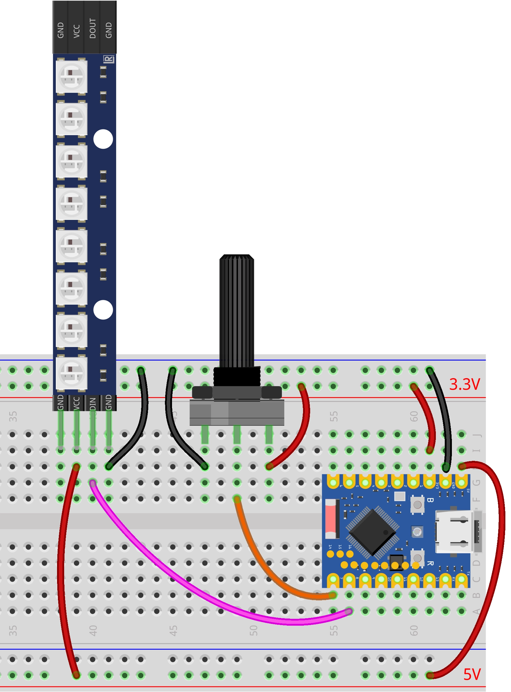

<!-- Image Reference -->


:::tip[Important: About board compatibility]
The core logic of this tutorial applies to all ESP32 boards, but all the operation steps are explained using the example of the [**Waveshare ESP32-S3-Zero mini development board**](https://www.waveshare.com/esp32-s3-zero.htm). If you are using a development board of another model, please modify the corresponding settings according to the actual situation.
:::

## Project Introduction

This project demonstrates a program that controls a WS2812 programmable LED strip using a potentiometer. By rotating the potentiometer, you can change the strip's display effect in real-time: the strip will sequentially go through three stages of color changes (Yellow → Green → Red), and the number of lit LEDs will gradually increase with the rotation, creating a smooth visual gradient effect.

## Hardware Connection

Components required:

- WS2812 LED strip \* 1
- Potentiometer \* 1
- Breadboard \* 1
- Wires
- ESP32 development board

Connect the circuit according to the wiring diagram below:

<Details>
  <summary>ESP32-S3-Zero Pinout Diagram</summary>


</Details>

<div style={{maxWidth:500}}> </div>

## Code Implementation

```python
import time
from machine import Pin, ADC
import neopixel

# --- Configuration Parameters ---
POT_PIN_NUM = 7   # Potentiometer pin
NEO_PIN_NUM = 8   # WS2812 pin
NUM_LEDS = 8      # Number of LEDs

# --- Color Definitions (R, G, B) ---
COLOR_YELLOW = (255, 255, 0)
COLOR_GREEN  = (0, 255, 0)
COLOR_RED    = (255, 0, 0)
COLOR_OFF    = (0, 0, 0)

# Initialize WS2812 LED strip
np = neopixel.NeoPixel(Pin(NEO_PIN_NUM), NUM_LEDS)

# Initialize potentiometer (ADC)
pot = ADC(Pin(POT_PIN_NUM))

def update_leds(adc_val):
    """
    Update LED states based on the ADC value
    adc_val: 0 - 65535
    """
    # Map 0-65535 to 0-24 (3 stages * 8 LEDs)
    total_steps = 3 * NUM_LEDS
    position = int((adc_val / 65535) * total_steps)

    # Cap the maximum value to prevent overflow
    if position > total_steps:
        position = total_steps

    for i in range(NUM_LEDS):
        # Logic judgment: Priority from high to low (Red -> Green -> Yellow)

        # Stage 3: Red overlay (when progress exceeds 16 + LED index)
        if position > (2 * NUM_LEDS + i):
            np[i] = COLOR_RED

        # Stage 2: Green overlay (when progress exceeds 8 + LED index)
        elif position > (1 * NUM_LEDS + i):
            np[i] = COLOR_GREEN

        # Stage 1: Yellow lights up (when progress exceeds LED index)
        elif position > i:
            np[i] = COLOR_YELLOW

        # Otherwise: Turn off
        else:
            np[i] = COLOR_OFF

    # Write data to the LED strip
    np.write()

# --- Main Program ---
print("System started: Potentiometer controlling WS2812")

while True:
    try:
        # Read potentiometer analog value (16-bit unsigned integer: 0 - 65535)
        val = pot.read_u16()

        # Update the lighting
        update_leds(val)

        # Simple delay to prevent overly fast refreshing
        time.sleep_ms(50)

    except KeyboardInterrupt:
        # Turn off all LEDs when Ctrl+C is pressed
        for i in range(NUM_LEDS):
            np[i] = COLOR_OFF
        np.write()
        print("Program stopped")
        break
```

## Code Analysis

- **Import Libraries**: The `machine` library is used for hardware control (ADC and GPIO), the `neopixel` library is used for controlling the WS2812 LED strip, and the `time` library is used for implementing delays. The ESP32 MicroPython firmware includes the `neopixel` library by default; no manual installation is required.

- **Configuration Parameters**: The beginning of the program defines the potentiometer pin number, the WS2812 pin number, and the number of LEDs. Centralizing these parameters facilitates quick adjustments based on actual needs.

  ```python
  # --- Configuration Parameters ---
  POT_PIN_NUM = 7   # Potentiometer pin
  NEO_PIN_NUM = 8   # WS2812 pin
  NUM_LEDS = 8      # Number of LEDs
  ```

- **Color Definitions**: The program defines four colors (Yellow, Green, Red, Off) in RGB triple format, where each value ranges from 0-255. This pre-defined approach makes the code clearer and more readable.

  ```python
  # --- Color Definitions (R, G, B) ---
  COLOR_YELLOW = (255, 255, 0)
  COLOR_GREEN  = (0, 255, 0)
  COLOR_RED    = (255, 0, 0)
  COLOR_OFF    = (0, 0, 0)
  ```

- **Hardware Initialization**:

  - Use `neopixel.NeoPixel()` to initialize the WS2812 LED strip. The first parameter is the GPIO pin object, and the second is the number of LEDs.
  - Use `machine.ADC()` to initialize the potentiometer for analog input.

  ```python
  # Initialize WS2812 LED strip
  np = neopixel.NeoPixel(Pin(NEO_PIN_NUM), NUM_LEDS)

  # Initialize potentiometer (ADC)
  pot = ADC(Pin(POT_PIN_NUM))
  ```

- **Core Function `update_leds()`**: Updates the display state of the LED strip based on the potentiometer's ADC value.

  - **Parameter Mapping**: Maps the ADC range of 0-65535 to 0-24 (3 stages × 8 LEDs), representing the entire display progress.

    ```python
    # Map 0-65535 to 0-24 (3 stages * 8 LEDs)
    total_steps = 3 * NUM_LEDS
    position = int((adc_val / 65535) * total_steps)
    ```

  - **LED-by-LED Judgment**: Iterates through each LED, determining the color it should display based on the current `position` value. The judgment logic follows a priority order from high to low (Red → Green → Yellow), ensuring correct color layering:

    ```python
    for i in range(NUM_LEDS):
        # Stage 3: Red overlay (when progress exceeds 16 + LED index)
        if position > (2 * NUM_LEDS + i):
            np[i] = COLOR_RED
        # Stage 2: Green overlay (when progress exceeds 8 + LED index)
        elif position > (1 * NUM_LEDS + i):
            np[i] = COLOR_GREEN
        # Stage 1: Yellow lights up (when progress exceeds LED index)
        elif position > i:
            np[i] = COLOR_YELLOW
        # Otherwise: Turn off
        else:
            np[i] = COLOR_OFF
    ```

  - **Data Writing**: Calls `np.write()` to send the color data to the WS2812 LED strip. WS2812 uses a single-wire serial communication protocol, so this method must be called for the settings to take effect.

- **Main Loop Logic**: The program performs the following operations in an infinite loop `while True`:

  - **Read Potentiometer**: Uses `pot.read_u16()` to read a 16-bit unsigned integer (range 0-65535).
  - **Update LED Strip**: Calls the `update_leds()` function to update the strip's display based on the read value.
  - **Delay Control**: Uses `time.sleep_ms(50)` to implement a 50-millisecond delay, preventing flickering or resource waste caused by overly fast refreshing.

- **Exception Handling**: Uses a `try...except` structure to enhance program stability.
  - `except KeyboardInterrupt`: Catches user interrupt signals (like Ctrl+C) and turns off all LEDs before exiting, ensuring the hardware is left in a safe state.

## Reference Links

- [Section 4 ADC Analog Input](./04-Analog-Input.md)
- [MicroPython NeoPixel](https://docs.micropython.org/en/latest/library/neopixel.html#module-neopixel)