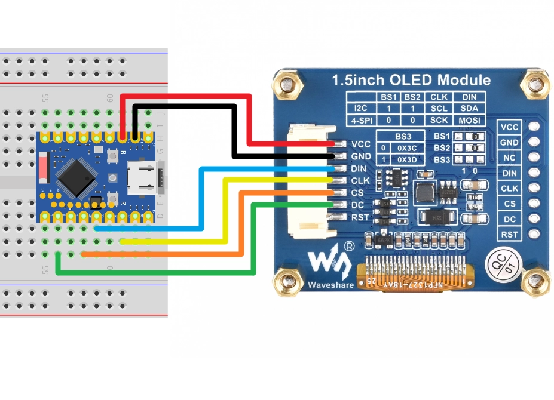

<!-- Image Reference -->


:::tip[Important: About board compatibility]
The core logic of this tutorial applies to all ESP32 boards, but all the operation steps are explained using the example of the [**Waveshare ESP32-S3-Zero mini development board**](https://www.waveshare.com/esp32-s3-zero.htm). If you are using a development board of another model, please modify the corresponding settings according to the actual situation.
:::

## Project Introduction

This project demonstrates how to create a Network Weather Display using an ESP32. By connecting to a Wi-Fi network, the ESP32 will periodically fetch real-time weather data (weather conditions, temperature, and humidity) for a specified city from the [OpenWeather API](https://openweathermap.org/current#builtin) and display this information on a Waveshare 1.5inch OLED screen.

## Hardware Connection

Components required:
- [Waveshare 1.5inch OLED Module](https://www.waveshare.com/1.5inch-oled-module.htm) \* 1
- Breadboard \* 1
- Wires
- ESP32 development board

Connect the circuit according to the wiring diagram below:

<Details>
  <summary>ESP32-S3-Zero Pinout Diagram</summary>


</Details>

:::tip
The following uses the SPI interface to connect the OLED display. This screen also supports I2C, controlled via BS1 and BS2. If using I2C mode, please refer to the wiring method in [Section 7 I2C Communication](./07-I2C-Communication.md).
:::

| ESP32 pin | OLED module |                   Description                 |
| ---------- | --------- | ------------- |
| GPIO 13    | SCK       | SPI clock line    |
| GPIO 11    | MOSI      | SPI data output  |
| GPIO 10    | CS        | Chip select signal     |
| GPIO 8     | DC        | Data/command select|
| 3.3V       | VCC       | Power positive terminal                                |
| GND        | GND       | Power negative terminal                                 |

<div style={{maxWidth:500}}> </div>

## Getting an OpenWeather API Key

OpenWeather is an online service owned by OpenWeather Ltd that provides [developer-friendly free tier access](https://openweathermap.org/full-price#current). Through its API, it delivers global weather data for any geographic location, including current weather conditions, forecasts, nowcasts, and historical weather data.

1. Visit [OpenWeather](https://home.openweathermap.org/users/sign_in) to log in or create an account.

2. Copy the API Key from the [API keys page](https://home.openweathermap.org/api_keys). You can also find your key in the "OpenWeatherMap API Instruction" email sent to your inbox.

   :::info
   Newly generated keys typically **take 10-60 minutes to become active**. If you encounter a 401 error when running the code immediately, please wait a while before trying again.
   :::

## Code Implementation

:::tip
This code example requires the [**`ssd1327.py` driver library**](https://github.com/eMUQI/micropython-ssd1327), which is based on the [micropython-ssd1327](https://github.com/mcauser/micropython-ssd1327) project by community developer mcauser.

Download link: [micropython-ssd1327-master.zip](https://github.com/eMUQI/micropython-ssd1327/archive/refs/heads/master.zip)

Please upload the `ssd1327.py` file from this library to the root directory of your development board.
:::

```python
import time
import network
import urequests
import json
from machine import Pin, SPI
import ssd1327

# Wi-Fi Configuration
WIFI_SSID = "Maker"
WIFI_PASSWORD = "12345678"

# OpenWeatherMap API Configuration (Please replace with your private key)
API_KEY = "your_api_key"

# City to query (e.g., "Shenzhen", "New%20York,US", "London", "Stockholm")
LOCATION = "Stockholm"

# API URL
API_URL = "http://api.openweathermap.org/data/2.5/weather?appid={}&q={}&units=metric"

# Update Interval (seconds)
UPDATE_INTERVAL = 1800  # 30 minutes

# Display Text Brightness (0-15)
TEXT_BRIGHTNESS = 8

# SPI Pin Configuration
SCK_PIN = 13
MOSI_PIN = 11
CS_PIN = 10
DC_PIN = 8
RST_PIN = 9
# Initialize hardware SPI, using id=1, set clock frequency to 10 MHz
spi = SPI(1, baudrate=10000000, sck=Pin(SCK_PIN), mosi=Pin(MOSI_PIN))

# Initialize the display
try:
    # Using SPI interface
    oled = ssd1327.SSD1327_SPI(128, 128, spi, dc=Pin(DC_PIN), res=Pin(RST_PIN), cs=Pin(CS_PIN))
    print("OLED display initialized successfully.")
except Exception as e:
    print(f"Error initializing display: {e}")
    # If the display initialization fails, the program cannot continue
    while True:
        time.sleep(1)

def connect_wifi():
    """Connect to the Wi-Fi network"""
    wlan = network.WLAN(network.STA_IF)
    wlan.active(True)
    if not wlan.isconnected():
        print(f"Connecting to network: {WIFI_SSID}...")
        oled.fill(0)
        oled.text("Connecting to", 5, 20, TEXT_BRIGHTNESS)
        oled.text("WiFi...", 5, 40, TEXT_BRIGHTNESS)
        oled.show()

        wlan.connect(WIFI_SSID, WIFI_PASSWORD)

        # Wait for the connection to succeed
        timeout = 15  # 15-second timeout
        start_time = time.time()
        while not wlan.isconnected() and (time.time() - start_time) < timeout:
            time.sleep(1)
            print(".", end="")

    if wlan.isconnected():
        print("\nNetwork connected!")
        print(f"IP Address: {wlan.ifconfig()[0]}")
        oled.fill(0)
        oled.text("WiFi Connected!", 5, 20, TEXT_BRIGHTNESS)
        oled.text("IP:", 5, 40, TEXT_BRIGHTNESS)
        oled.text(wlan.ifconfig()[0], 5, 55, TEXT_BRIGHTNESS)
        oled.show()
        time.sleep(2)
        return True
    else:
        print("\nFailed to connect to WiFi.")
        oled.fill(0)
        oled.text("WiFi Failed!", 5, 20, TEXT_BRIGHTNESS)
        oled.show()
        return False

def get_weather():
    """Fetch weather data from the OpenWeatherMap API"""
    url = API_URL.format(API_KEY, LOCATION)
    print(f"Fetching weather from: {url}")

    try:
        response = urequests.get(url)

        if response.status_code == 200:
            weather_data = response.json()
            print("API Response:", weather_data) 

            # Extract required information from JSON data
            location_name = weather_data['name']
            weather_text = weather_data['weather'][0]['main']
            temperature = weather_data['main']['temp']
            humidity = weather_data['main']['humidity']

            return location_name, weather_text, temperature, humidity

        else:
            print(f"Error getting weather: HTTP Status {response.status_code}")
            return None, f"HTTP Err {response.status_code}", "", ""

    except Exception as e:
        print(f"Error during API request: {e}")
        return None, "Request Error", "", ""

def display_weather(city, weather, temp, hum):
    """Display weather information on the OLED"""
    oled.fill(0) # Clear the screen

    # City name
    oled.text(f"City: {city}", 5, 10, TEXT_BRIGHTNESS)

    # Weather condition
    oled.text(f"Weather:", 5, 40, TEXT_BRIGHTNESS)
    oled.text(str(weather), 5, 55, TEXT_BRIGHTNESS)

    # Temperature
    oled.text(f"Temp: {temp} C", 5, 80, TEXT_BRIGHTNESS)

    # Humidity
    oled.text(f"Hum:  {hum} %", 5, 100, TEXT_BRIGHTNESS)

    oled.show() # Update the display
    print(f"Display updated: {city}, {weather}, {temp} C, {hum}%")

def display_error(message, detail):
    """Display error information on the OLED"""
    oled.fill(0)
    oled.text(f"Error:", 5, 20, TEXT_BRIGHTNESS)
    oled.text(f"{message}", 5, 30, TEXT_BRIGHTNESS)
    oled.text(f"Detail: ", 5, 50, TEXT_BRIGHTNESS)
    oled.text(f"{detail}", 5, 60, TEXT_BRIGHTNESS)
    oled.show()
    print(f"Error displayed: {message}, {detail}")

# Main Program
def main():
    # First, connect to Wi-Fi
    if not connect_wifi():
        # If the connection fails, do not continue
        return

    while True:
        print("\n" + "="*20)
        oled.fill(0)
        oled.text("Fetching...", 5, 20, TEXT_BRIGHTNESS)
        oled.show()

        city, weather, temp, hum = get_weather()

        if city:
            display_weather(city, weather, temp, hum)
        else:
            # If fetching fails, display an error message
            display_error("API Error", weather)

        print(f"Waiting for {UPDATE_INTERVAL} seconds before next update...")
        time.sleep(UPDATE_INTERVAL)

# Run the main program
if __name__ == "__main__":
    main()
```

## Code Analysis

- **Import Libraries**:

  - `network`: For managing Wi-Fi connections.
  - `urequests`: For sending HTTP requests to fetch data from the API.
  - `json`: For parsing JSON-formatted data returned by the API.
  - `machine`: For controlling hardware (SPI and GPIO).
  - `ssd1327`: For driving the 1.5inch OLED display.
  - `time`: For implementing delays and timing.

- **Configuration Parameters**: The beginning of the program defines Wi-Fi information, API key, target city, and hardware pins. Centralizing these parameters makes it convenient for users to modify the configuration.

  :::tip[Important Note about the OpenWeather API]
  This project uses the OpenWeather API. You need to register an account on **[OpenWeather](https://home.openweathermap.org/users/sign_in)** (a free tier is available after registration) and copy the API key from the **[API keys page](https://home.openweathermap.org/api_keys)**. Add your private key to the `API_KEY` variable.
  :::

  :::tip[Switching to Fahrenheit]
  By default, the API uses `units=metric` which returns temperature in Celsius. To get Fahrenheit instead, change the `API_URL` parameter from `units=metric` to `units=imperial`.
  :::

  ```python
  # Wi-Fi Configuration
  WIFI_SSID = "Maker"
  WIFI_PASSWORD = "12345678"

  # OpenWeatherMap API Configuration (Please replace with your private key)
  API_KEY = "3f70090a4f8d27dc5ebe271907b0b4bf"

  # City to query (e.g., "Shenzhen", "New%20York,US", "London", "Stockholm")
  LOCATION = "Stockholm"

  # API URL
  API_URL = "http://api.openweathermap.org/data/2.5/weather?appid={}&q={}&units=metric"
  ```

- **Hardware Initialization**:

  - **SPI Method (Default)**: Use `machine.SPI()` to initialize the SPI bus, and use `ssd1327.SSD1327_SPI()` to initialize the OLED display.

    ```python
    spi = SPI(1, baudrate=10000000, sck=Pin(SCK_PIN), mosi=Pin(MOSI_PIN))
    oled = ssd1327.SSD1327_SPI(128, 128, spi, dc=Pin(DC_PIN), res=Pin(RST_PIN), cs=Pin(CS_PIN))
    ```

  - **I2C Method**: If using a screen with an I2C interface, you can uncomment the relevant code. Use `machine.I2C()` to initialize the I2C bus and use `ssd1327.SSD1327_I2C()` to initialize.

    ```python
    # I2C Initialization Example
    i2c = I2C(0, scl=Pin(SCL_PIN), sda=Pin(SDA_PIN), freq=400000)
    oled = ssd1327.SSD1327_I2C(128, 128, i2c, I2C_ADDR)
    ```

- **Network Connection Function `connect_wifi()`**: Responsible for connecting to the Wi-Fi network and displaying the connection status on the screen.

  - Use `network.WLAN(network.STA_IF)` to create a station interface.
  - Call `wlan.connect()` to initiate the connection.
  - Use a `while` loop to wait for a successful connection, with a 15-second timeout mechanism.
  - During the connection process, "Connecting..." is displayed on the OLED; upon success, the IP address is shown.

- **Weather Fetching Function `get_weather()`**: Fetches data from the OpenWeather API using the Current Weather Data interface to obtain current weather information for a specified city. Interface documentation: [OpenWeather API - Current Weather Data](https://openweathermap.org/current#builtin)

  - Use `API_URL.format()` to construct the complete request URL.

    ```python
    API_URL = "http://api.openweathermap.org/data/2.5/weather?appid={}&q={}&units=metric"
    ...
    url = API_URL.format(API_KEY, LOCATION)
    ```

  - Use `urequests.get(url)` to send an HTTP GET request.
  - Check if the HTTP status code is 200 (success).
  - Use `response.json()` to parse the returned data and extract the city name, weather condition, temperature, and humidity.

    ```python
    # Extract required information from JSON data
    location_name = weather_data['name']
    weather_text = weather_data['weather'][0]['main']
    temperature = weather_data['main']['temp']
    humidity = weather_data['main']['humidity']
    ```

- **Error Display Function `display_error()`**: Handles error display on the OLED screen.

  - Takes two parameters: `message` (error type) and `detail` (specific error information).
  - Displays formatted error messages to help with debugging connection or API issues.

- **Display Function `display_weather()`**: Displays the fetched weather information on the OLED screen.

  - `oled.fill(0)`: Clears the screen.
  - `oled.text()`: Displays the city, weather, temperature, and humidity at different positions.
  - `oled.show()`: Refreshes the screen display.

- **Main Program Logic `main()`**:
  - First, call `connect_wifi()` to ensure the network is connected.
  - Enter an infinite loop `while True`:
    - Display "Fetching..." to indicate data is being retrieved.
    - Call `get_weather()` to get the latest weather.
    - Call `display_weather()` to update the screen display.
    - Use `time.sleep(UPDATE_INTERVAL)` to go into sleep, waiting for the next update (default 30 minutes).

## Reference Links

- [Section 8 SPI Communication](./08-SPI-Communication.md)
- [Section 9 Wi-Fi Networking Basics](./09-WiFi-Networking.md)
- [OpenWeather API Documentation](https://openweathermap.org/current#builtin)