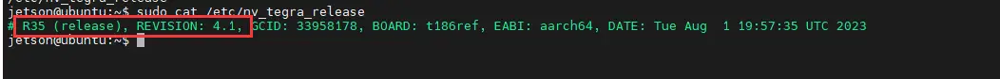
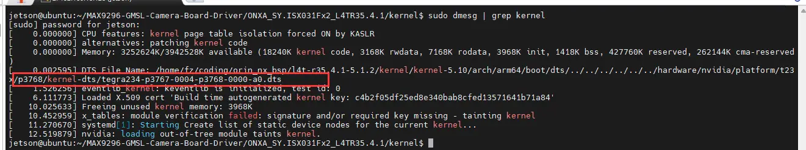

import connectorin from './images/MAX9296-GMSL-DESER-MODULE-details-7.webp';
import connectpower from './images/MAX9296-GMSL-DESER-MODULE-5.webp';
import cfgsetting from './images/MAX9296-GMSL-DESER-MODULE-6.webp';

# Working with Jetson Orin

This module is designed based on the Jetson Orin form factor, allowing users to directly assemble it onto the Jetson Orin Nano/NX Developer Kits.

## Hardware Connection

<div style={{maxWidth: '800px', margin: '0 auto' }}>
  <table style={{ width: '100%', borderCollapse: 'collapse' }}>
    <tr>
      <td rowSpan="2" style={{ width: '65%', padding: '8px' }}>
        
      </td>
      <td style={{ padding: '8px' }}>
        
      </td>
    </tr>
    <tr>
      <td style={{ padding: '8px' }}>
        
      </td>
    </tr>
  </table>
</div>
- As shown, connect the deserializer board's CSI0 interface to the Jetson Orin mainboard's Cam0 interface using the provided cable
     - <font color="red">The CSI definition order for CAM0 and CAM1 on the NVIDIA Jetson® Orin™ Nano Kit is different. Currently, the mainboard can only be connected to the CAM0 interface (please refer to the relevant pin definitions and the CAM0/1 interface definition order in the Jetson® Orin™ Kit schematic) </font>
     - <font color="red">The 22Pin FPC lacks precise impedance control. When using high-resolution cameras with high CSI data rates, it is recommended to use relatively short FPC cables (practical testing shows that for simultaneous input from two 8M cameras, only 5cm cables can be used; for single camera input, 10cm/15cm cables can be used) </font>
- Connect the power cables to the deserializer board's power interface and the 5V & GND pins on the Jetson Orin mainboard's 40PIN header, respectively To ensure the deserializer board receives sufficient power, please connect both 5V pins. External power supply can also be connected
- Connect the GMSL camera(s) to the camera interface(s) on the deserializer board using coaxial cable(s)
- Set the CFG switch to the '0100' position as shown in the diagram (default configuration for ISX031 camera)

## Software Configuration

- The Jetson Orin mainboard needs to be flashed with a corresponding supported Jetson system. Currently, the driver only supports version R35.4.1
  - You can check the current system version using the command: 
    
    ```bash
    cat /etc/nv_tegra_release
    ```

    

- After powering on the mainboard, open a Terminal, download the driver package, and extract it

  ```bash
  wget https://files.waveshare.com/wiki/MAX9296-GMSL-Camera-Board/MAX9296-GMSL-Camera-Board-Driver.zip
  unzip MAX9296-GMSL-Camera-Board-Driver.zip
  ```

- Use the `cd` command to enter the driver package directory and list the files
  - Enter the corresponding directory based on the camera model used. Here we use ISX031 as an example

    ```bash
    cd MAX9296-GMSL-Camera-Board-Driver
    ls
    cd ONXA_SY.ISX031Fx2_L4TR35.4.1
    cd kernel
    ```

- In the kernel files, the dtb folder contains device tree files supporting multiple mainboard models. We need to use the device tree file that matches the current mainboard model
  - First, you can use the command `sudo dmesg | grep kernel` to check the device tree currently used by the mainboard
  - For example, if the queried device tree file is `tegra234-p3767-0004-p3768-0000-a0`

    

- Copy the dtb file and Image file of the same model from the driver to the mainboard's `/boot` directory

  ```bash
  sudo cp dtb/tegra234-p3767-0004-p3768-0000-a0.dtb /boot
  sudo cp Image /boot
  ```

- After copying the files, modify the device tree file specified for boot in `extlinux.conf`
  - Duplicate and add another boot label, change the FDT file path within it to the directory of the copied file, and set the new added label as the default boot option
    <font color="red">Note: Pay close attention when making these modifications. Ensure everything is correct before saving and rebooting the system, otherwise it may cause the system to fail to boot normally</font>

    ```bash
    sudo vi /boot/extlinux/extlinux.conf
    ```

  - In the vi editor, press <kbd>i</kbd> to enter edit mode, and press <kbd>esc</kbd> to exit edit mode. After exiting edit mode, you can type `:wq!` to save the file and quit.
    

- After saving the file, reboot the system

## Quick Test

- Check if the camera is properly detected

  ```bash
  sudo dmesg | grep connected
  ```

  If it returns a message like `/dev/video2 is connected`, it indicates the camera has been properly detected.

- You can use the following command to perform a preview test of the camera.
  - The preview test requires an HDMI or DP display to be connected. Please ensure the screen is properly connected and displaying.
  - Note: Change the video device number to the one indicated in the previous detection step.
  - Note: Modify the command parameters according to the resolution supported by the camera.

  ```bash
  gst-launch-1.0 v4l2src device=/dev/video2 ! "video/x-raw, format=(string)UYVY, width=(int)1920, height=(int)1536" ! fpsdisplaysink video-sink=xvimagesink sync=false
  ```