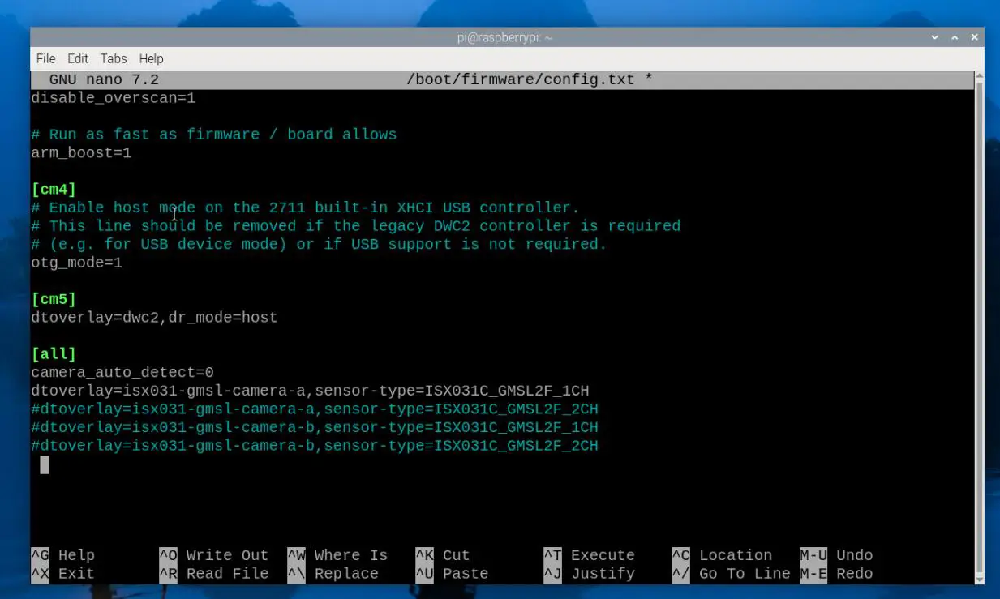

import connectpi from './images/MAX9296-GMSL-DESER-MODULE-7.webp';
import connectpower from './images/MAX9296-GMSL-DESER-MODULE-5.webp';
import cfgsetting from './images/MAX9296-GMSL-DESER-MODULE-6.webp';

# Working with Raspberry Pi

Although the deserializer board's form factor is designed for the Jetson Orin/NX Developer Kit, users can still use it with a Raspberry Pi 5 mainboard with cable connections.

## Hardware Connection

<div style={{maxWidth: '800px', margin: '0 auto' }}>
  <table style={{ width: '100%', borderCollapse: 'collapse' }}>
    <tr>
      <td rowSpan="2" style={{ width: '65%', padding: '8px' }}>
        
      </td>
      <td style={{ padding: '8px' }}>
        
      </td>
    </tr>
    <tr>
      <td style={{ padding: '8px' }}>
        
      </td>
    </tr>
  </table>
</div>

- Connect the deserializer board's CSI0 interface to the Raspberry Pi 5's CAM1 or CAM0 interface using the provided cable.
- Connect the power cables to the deserializer board's power interface and the 5V & GND pins on the Raspberry Pi's 40PIN header, respectively.
- Connect the GMSL camera(s) to the camera interface(s) on the deserializer board using coaxial cable(s)
- Set the CFG switch to the '0100' position as shown in the diagram (default configuration for ISX031 camera)

## Software Configuration

- Testing was performed using the official Raspberry Pi image: `2025-05-13-raspios-bookworm-arm64.img.xz`
  - The download link for the corresponding version is provided here. You can [click here to download the image package](https://downloads.raspberrypi.com/raspios_arm64/images/raspios_arm64-2025-05-13/2025-05-13-raspios-bookworm-arm64.img.xz)
- Flash the image file and boot the Raspberry Pi
  - Extract the .img image file from the downloaded package
  - Use the [Raspberry Pi Imager](https://www.raspberrypi.com/software/) or [balenaEtcher](https://etcher.balena.io/) to write the image file to a TF card
  - Insert the TF card with the flashed image into the Raspberry Pi mainboard, connect the hardware, and power it on
- Open the Raspberry Pi Terminal and use the following commands to download and extract the driver package:

  ```bash
  wget https://files.waveshare.com/wiki/MAX9296-GMSL-Deser-Module/ws-rpi5-gmsl.zip
  unzip ws-rpi5-gmsl.zip
  ```
- Install the driver
  - Use the `cd` command to enter the driver package directory

    ```bash
    cd ws-rpi5-gmsl/
    ```

    

  - Add executable permissions to the installation script and execute it:

    ```bash
    sudo chmod a+x rpi5_gmsl_driver_install.sh
    sudo ./rpi5_gmsl_driver_install.sh
    ```

- Configure the `config.txt` file
  - Edit the file and add the dtoverlay setting as shown in the image below

    ```bash
    sudo nano /boot/firmware/config.txt
    ```

    

  - According to the connected camera, remove the comment symbol `#` from the corresponding setting line. `isx031-gmsl-camera-a` is the camera model being connected, and `sensor-type=ISX031C_GMSL2F_1CH` corresponds to the serializer model and channel count
  - For connecting one ISX031C (either Link A or Link B is acceptable; the program will auto-detect):

    ```
    dtoverlay=isx031-gmsl-camera-a,sensor-type=ISX031C_GMSL2F_1CH
    ```

  - For connecting two ISX031C:

    ```
    dtoverlay=isx031-gmsl-camera-a,sensor-type=ISX031C_GMSL2F_2CH
    ```

  - If connecting to the CAM0 interface, add the `cam0` parameter at the end:

    ```
    dtoverlay=gmsl-isx031,sensor-type=ISX031C_GMSL2F_1CH,cam0
    dtoverlay=gmsl-isx031,sensor-type=ISX031C_GMSL2F_2CH,cam0
    ```

  - The default deserializer I2C address is `0x48`(`0x90 >> 1`). If you need to modify the default address, you can add the `dser-addr` parameter at the end:

    ```
    dtoverlay=isx031-gmsl-camera-a,sensor-type=ISX031C_GMSL2F_1CH,dser-addr=0x4a
    dtoverlay=isx031-gmsl-camera-a,sensor-type=ISX031C_GMSL2F_2CH,dser-addr=0x4a
    ```

- After setting, save the file and reboot the system with `sudo reboot`

# Quick Test

- Install gstreamer1.0 tool

  ```bash
  sudo apt install gstreamer1.0-tools -y
  ```

- The driver board provides a test script for preview. After rebooting the system, you can use the following commands to perform a preview test of the camera
  - Connected to Raspberry Pi CAM1, 2x ISX031C:

    ```bash
    ws_camera_preview.sh ISX031-GMSL-Camera-A csi1 2ch
    ```

  - Connected to Raspberry Pi CAM1, 1x ISX031C:

    ```bash
    ws_camera_preview.sh ISX031-GMSL-Camera-A csi1 1ch
    ```

  - Connected to Raspberry Pi CAM0, 2x ISX031C:

    ```bash
    ws_camera_preview.sh ISX031-GMSL-Camera-A csi0 2ch
    ```

  - Connected to Raspberry Pi CAM0, 1x ISX031C:

    ```bash
    ws_camera_preview.sh ISX031-GMSL-Camera-A csi0 1ch
    ```

- The following is an actual test screenshot for reference only:

  