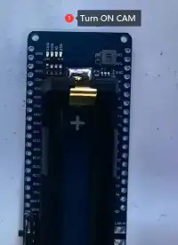
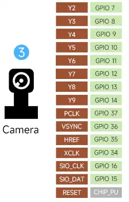
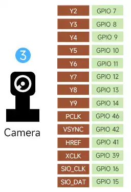
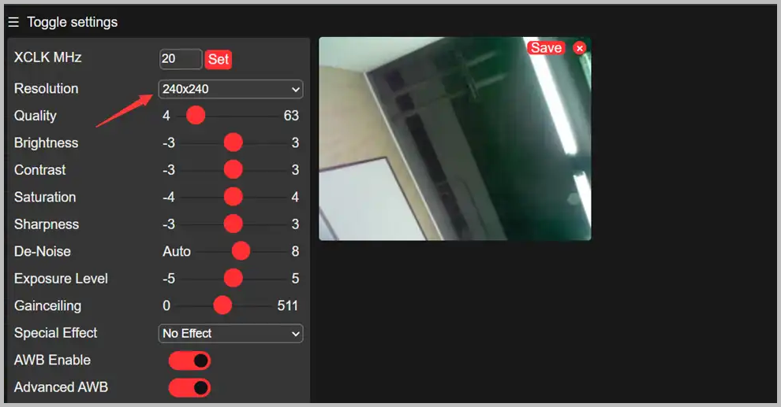
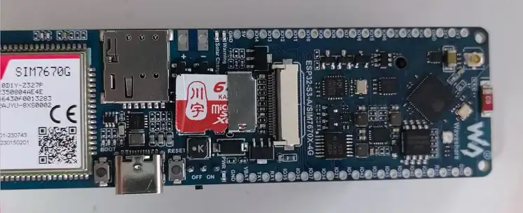
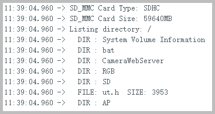
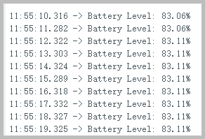
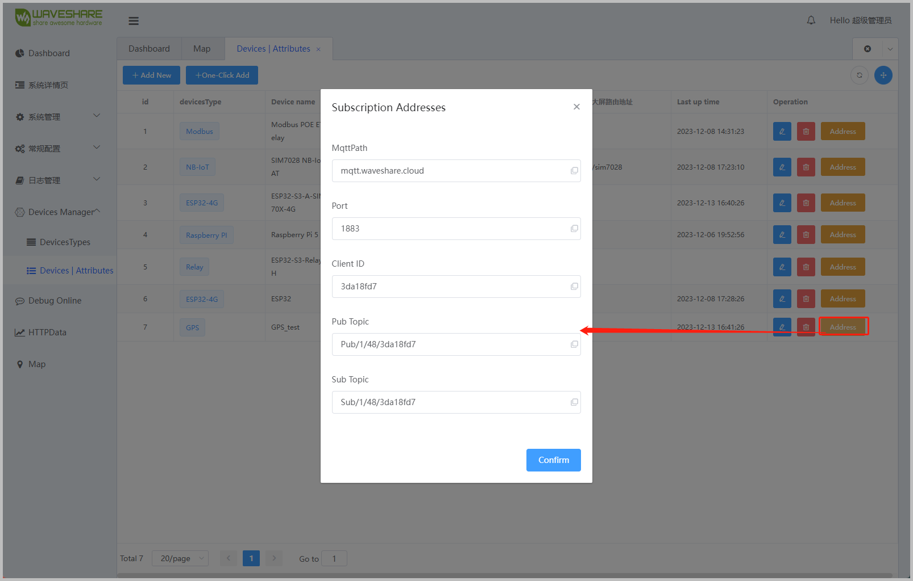
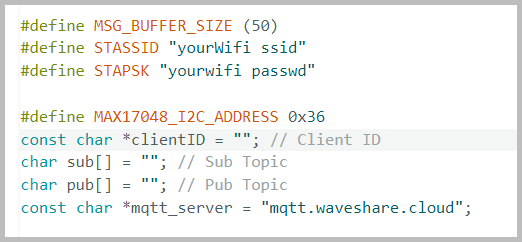
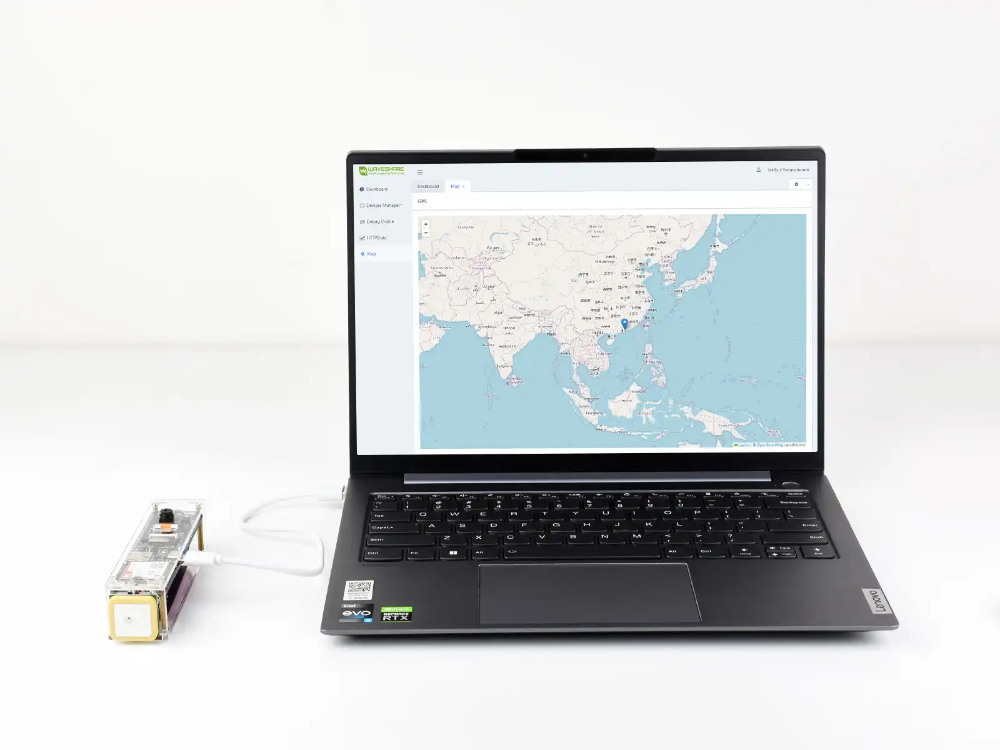

import Tabs from '@theme/Tabs';
import TabItem from '@theme/TabItem';

## ESP32-S3 Applications

### Camera

This example is modified from the official ESP32 `CameraWebServer` example to adapt it for the ESP32-S3 platform.

- Set the Wi-Fi SSID and password, and switch the default hardware to ESP32-S3  
- Turn on the CAM DIP switch on the back of the board and connect a supported camera  
- Confirm the Camera pin definitions as follows:  

  | Pin Definition | V1 Version | V2 Version |
  | :---: | :---: | :---: |
  |  | <div style={{maxWidth:200}}></div> | <div style={{maxWidth:200}}></div> |
  | `#define PWDN_GPIO_NUM`  | -1 | -1 |
  | `#define RESET_GPIO_NUM` | -1 | -1 |
  | `#define XCLK_GPIO_NUM`  | 34 | 39 |
  | `#define SIOD_GPIO_NUM`  | 15 | 15 |
  | `#define SIOC_GPIO_NUM`  | 16 | 16 |
  | `#define Y9_GPIO_NUM`    | 14 | 14 |
  | `#define Y8_GPIO_NUM`    | 13 | 13 |
  | `#define Y7_GPIO_NUM`    | 12 | 12 |
  | `#define Y6_GPIO_NUM`    | 11 | 11 |
  | `#define Y5_GPIO_NUM`    | 10 | 10 |
  | `#define Y4_GPIO_NUM`    | 9  | 9  |
  | `#define Y3_GPIO_NUM`    | 8  | 8  |
  | `#define Y2_GPIO_NUM`    | 7  | 7  |
  | `#define VSYNC_GPIO_NUM` | 36 | 42 |
  | `#define HREF_GPIO_NUM`  | 35 | 41 |
  | `#define PCLK_GPIO_NUM`  | 37 | 46 |

- After flashing the program, open the serial terminal. Access the IP address output by the serial monitor in a browser to view the camera feed, as shown in the following figure:

  <div style={{maxWidth:600}}>
    
  </div>

### TF-Card

- Insert the TF-Card into the TF card slot
  <div style={{maxWidth:600}}>
    
  </div>

- Define the pins

  ```c
  const int SDMMC_CLK  = 5;
  const int SDMMC_CMD  = 4;
  const int SDMMC_DATA = 6;
  const int SD_CD_PIN  = 46;
  ```

- Flash the program and open the terminal to display the file contents

  

### RGB

This development board is equipped with one WS2812B RGB LED. The signal pin is GPIO38. After flashing the example program, the RGB LED will display a gradient effect, as shown in the following figure:  


### BAT

:::tip Note
This development board uses the MAX17048 as the battery fuel gauge IC.
:::

- Confirm the I2C pin connections. There are differences in IO connections between the V1 and V2 versions:

  | MAX17048 Pin | Version     | SDA    | SCL    | Initialization Code         |
  |--------------|----------|--------|--------|----------------------|
  | ESP32-S3 IO  | V1 Version  | GPIO3  | GPIO2  | Wire.begin(3, 2)     |
  | ESP32-S3 IO  | V2 Version  | GPIO15  | GPIO16  | Wire.begin(15, 16)     |

- Flash the example program. The battery alert threshold can be modified as needed

  

## Waveshare Cloud Application

:::tip Note
This application communicates with the A7670E via the ESP32-S3 software serial. It sends AT commands to enable GNSS, parses the NMEA GNSS data, and uploads it to Waveshare Cloud. The specific location of the development board is then displayed on a map page using a Web View.
:::

- Please download the [demo](https://files.waveshare.com/wiki/ESP32-S3-A7670E-4G/ESP32-S3-A-SIM7670X_4G.zip), unzip it, and open the **GNSS-With-WaveshareCloud** example code.
- The map service provided by [Waveshare Cloud](https://waveshare.cloud/#/login?redirect=%252Fyourlocation)
  is used here for demonstration

### Configuration Steps

- Go to the **Devices | Attributes** page, create a device of any type, and obtain the corresponding MQTT connection parameters.

  <div style={{maxWidth:800}}>
    
  </div>

- Fill in the obtained MQTT parameters into the **GNSS-With-WaveshareCloud** example program.  

  

- Compile and flash the program. You can then view the real-time location information of the development board on the Waveshare Cloud map page.  

  <div style={{maxWidth:600}}>
    
  </div>