import Details from '@theme/Details';

# FAQ

## Software Configuration

<Details summary="Q: How does the ESP32-S3 in the example connect to the Internet via PPP dial-up through the 4G module's USB?" className="faq-details" open>
A:
The ESP32-S3 can perform PPP dial-up networking via both the serial port and USB. In this example, the TinyUSB protocol is used to perform dial-up networking using the enumerated USB address.
</Details>

<Details summary="Q: Which version of the firmware library is currently used? Is there a 2.0.13 version available?" className="faq-details" open>
A:
1. The firmware library version currently used is 2.0.7, which was determined based on the development requirements and adaptation status at that time.  
2. Regarding version 2.0.13, there is no directly available example for now. We will also release an updated LVGL version program as soon as possible.  
3. You can also try to integrate it into your project yourself, but you need to pay attention to compatibility issues.
</Details>

<Details summary="Q: How to modify the ESP32-S3 dial-up networking code?" className="faq-details" open>
A:
- The code in this example is compiled and flashed using esp-idf. Using the Arduino IDE requires porting work such as TinyUSB and PPP packet processing.  
- Please refer directly to: https://github.com/espressif/esp-iot-solution/tree/master/examples/usb/host/usb_cdc_4g_module, which is the official Espressif solution. We do not assist in modifying or analyzing the code.  
- If you encounter compilation environment issues, you can also try compiling this simple example program first: https://files.waveshare.com/wiki/ESP32-S3-A-SIM7670X-4G-HAT/Demo/ESP-7670-call-IDF.zip
</Details>

<Details summary="Q: Can you help me review my code? Can you help me modify the code?" className="faq-details" open>
A:
This product is positioned as a development board, not a finished product. This product is positioned as a development board, not a finished product. The product ecosystem is based on the ESP32 core, which is very mature and the development environment is very friendly. We do not assist in modifying code. Please let the makers and geeks use their DIY skills. If you have questions, you can ask our engineers for answers.
If you like our product and wish to customize hardware, casing, software, etc. in bulk, please feel free to contact our sales.

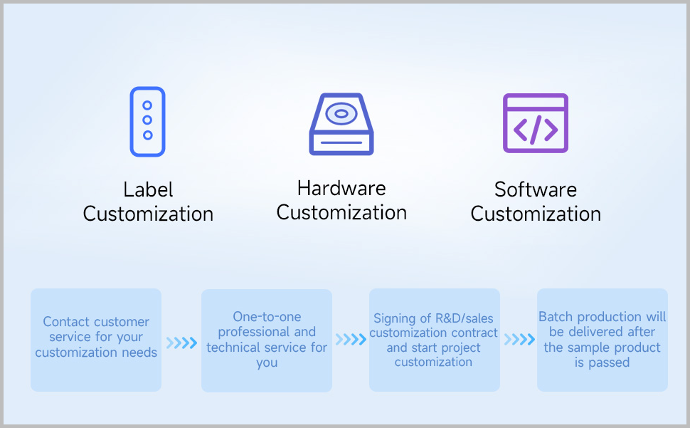

</Details>

<Details summary="Q: Can you assist with modifying the code?" className="faq-details" open>
A:
We do not assist in modifying or analyzing the code; please handle it yourself.
</Details>

<Details summary="Q: The portable WiFi web page loading is very slow. Is this normal?" className="faq-details" open>
A:
- Speed testing software tries to maximize the speed, which can saturate the packet transmission between the module and ESP32-S3, causing lag.  
- The Cat-1 module has a limited data rate and is only suitable for testing.  
- If the client's bandwidth demand is too high, crashes may occur. You can handle this at the source code level yourself.
</Details>

<Details summary="Q: Is it possible to connect to WaveshareCloud via the module itself and report data such as latitude and longitude?" className="faq-details" open>
A:
The development board connects to the A/SIM7670X 4G module's serial port via software serial. After enabling the GNSS function through AT commands, the satellite data received by the module is switched to serial output.  
At this point, executing the Publish command can report the data. The platform side needs to properly filter the returned NMEA data.
</Details>

<Details summary="Q: For the portable WiFi example, how to manually set the module APN for different operators?" className="faq-details" open>
A:
The default APN in the portable WiFi example is empty. If the module cannot automatically identify the SIM card operator, you need to modify the source code.

The steps are as follows:

1. Follow the ESP-IDF section to set up the development environment, install ESP-IDF and VS Code.
2. Open the example program with VS Code and manually set the APN in menuconfig.
   <div style={{maxWidth: '600px' }}>
   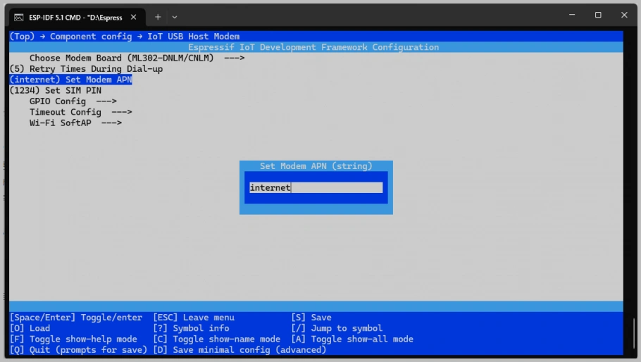
   </div>
3. Flash the program and power cycle the development board.
</Details>

<Details summary="Q: Why does the example program frequently prompt that header files do not exist? Can you provide library files?" className="faq-details" open>
A:
All libraries used in the examples are downloaded via the Arduino IDE's Library Manager.  
Library files are continuously updated and iterated. If library files are missing, simply download and install them directly in the Arduino IDE.
</Details>

<Details summary="Q: I'm not receiving a GPS signal and haven't obtained location information. What should I do?" className="faq-details" open>
A:
- Please connect the GPS antenna to the GNSS antenna interface and place it in an open outdoor environment. Wait for about 1 minute after powering on.

:::note
Since GPS satellite acquisition is unstable indoors, please test the module or antenna on a balcony, near a window, or directly outdoors under a sky view environment.
:::

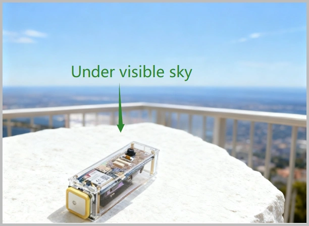

</Details>

<Details summary="Q: Is there an example for transmitting camera video remotely via 4G?" className="faq-details" open>
A:
- There is no ready-made example program currently; secondary development is required.  
- The module only provides the data connection. The camera video stream captured by the ESP32 is currently displayed via an HTML page.  
- For simpler logic, you can use TCP commands to control the ESP32-S3 to take photos and upload image data.  
- Theoretically, 4G video transmission can be achieved via a public server, but performance is limited and hasn't been tested practically.  
- For stable high-definition video transmission, it is recommended to use a Linux main controller like a Raspberry Pi with a 4G/5G cellular module solution.
</Details>

<Details summary="Q: Why is the camera screen black?" className="faq-details" open>
A:
Please configure as follows:

- **Relevant Settings**:

  <div style={{maxWidth: '600px' }}>
  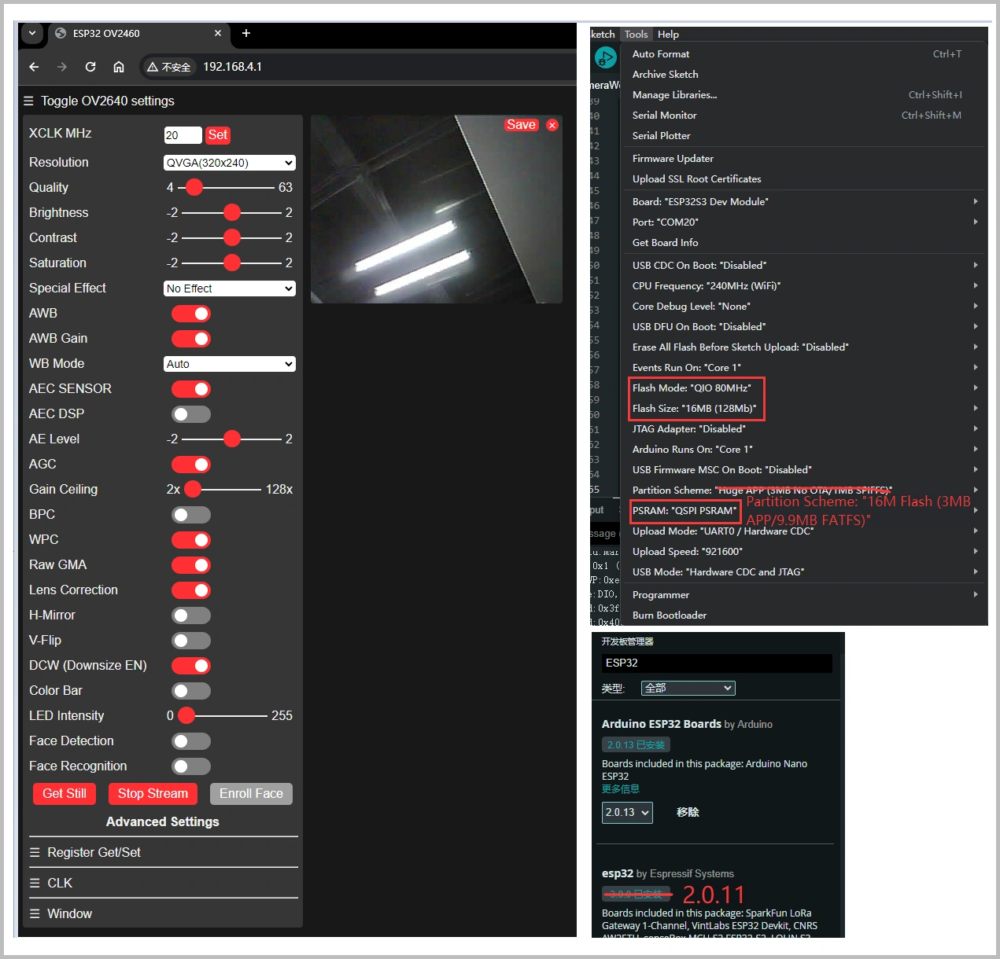
  </div>
  - Flash Size: 16MB (128Mb)
  - PSRAM: QSPI PSRAM
  - Flash Mode: QIO 80MHz
  - Partition Scheme: 16M Flash (3MB APP / 9.9MB FATFS)

- **Instructions**:
  - After entering the webpage, first click Get Still to take a photo, then click Stop Stream for monitoring.

- **Notes**:

  If you received the module after New Year 2026, please use the V2 example program.  
  If issues persist, you can refer to the following configuration:
  - Board: ESP32S3 Dev Module
  - USB CDC On Boot: Enabled
  - CPU Frequency: 240MHz
  - Flash Mode: QIO 80MHz
  - Flash Size: 16MB (128Mb)
  - PSRAM: Disabled
  - Partition Scheme: 16M Flash (3MB APP / 9.9MB FATFS)

</Details>

<Details summary="Q: Why doesn't the hotspot appear after flashing the AP example program?" className="faq-details" open>
A:
The following conditions must be met:  
1. The X7670X has successfully registered with the network and completed dial-up.  
2. The DIP switches on the back of the development board are set to 4G ON, USB OFF, and the board is repowered.  
3. Download the correct firmware; do not confuse A7670 and SIM7670.  
4. During the verification phase, it is recommended to use a phone card that supports calling.
</Details>

<Details summary="Q: How to independently test functions like calling and positioning of the module?" className="faq-details" open>
A:
- Turn on all DIP switches.  
  <div style={{maxWidth: '300px' }}>
  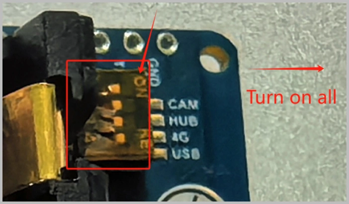
  </div>

- You can use the following example to test calling, SMS, and positioning functions:  
https://files.waveshare.com/wiki/ESP32-S3-A7670E-4G/code/Hard-serial-esp32-7670.zip

  <div style={{maxWidth: '600px' }}>
  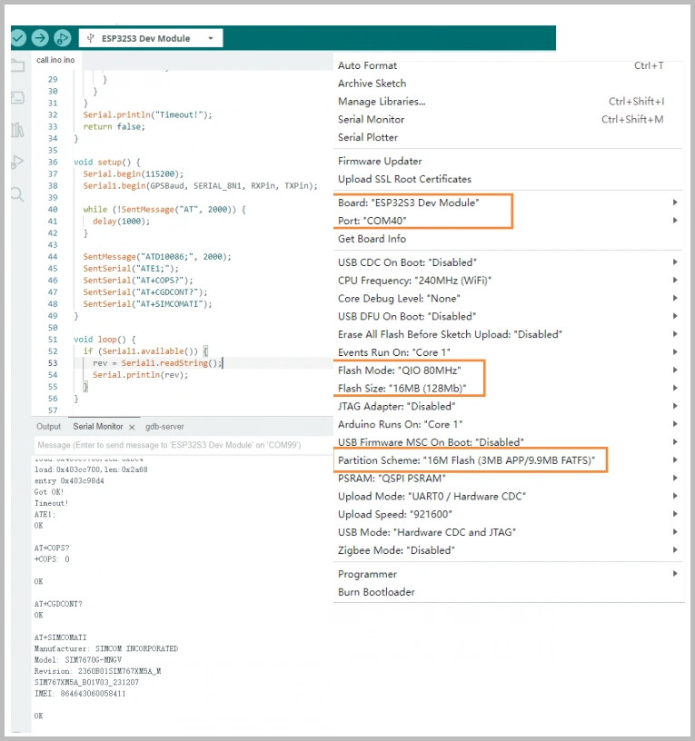
  </div>

- Network check program:  
https://files.waveshare.com/wiki/ESP32-S3-A7670E-4G/code/X7670_Network.ino
</Details>

<Details summary="Q: Flashing firmware fails, prompts waiting for power-on sync and the indicator LED doesn't blink?" className="faq-details" open>
A: Please confirm that it has been switched to UART download mode. UART must be used to download programs to the ESP32-S3.

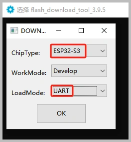

</Details>

<Details summary="Q: Flashing fails on a macOS device?" className="faq-details" open>
A: Please install the CH34X macOS driver first and then try flashing again:  
https://files.waveshare.com/wiki/common/CH34XSER_MAC.7z
</Details>

<Details summary="Q: Can't find the folder path for offline board installation?" className="faq-details" open>
A: Please check View → Hidden items in File Explorer. The path is located under the current user's directory.
<div style={{maxWidth: '600px' }}>
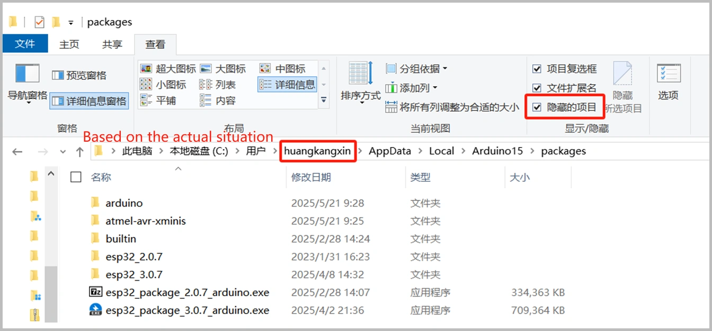
</div>
</Details>

## Hardware Functions

<Details summary="Q: Can XiaoZhi or Volcano Engine be deployed on the ESP32-S3-A7670E-4G? Does it support voice interaction?" className="faq-details" open>
A:
- The ESP32 hardware itself can deploy AI.
- The onboard speaker and microphone are only connected to the A7670E for call functions and are not connected to the ESP32. They cannot be used directly for ESP32 voice interaction.
- For voice interaction, you need to connect a speaker and microphone to the ESP32 separately.
- It is recommended to use an audio module already adapted for XiaoZhi: https://www.waveshare.com/esp32-s3-touch-lcd-1.85c.htm?sku=30684
- If you have substantial ESP32 development experience, you can also connect an external microphone module yourself. You can refer to this open-source example: https://github.com/Jamm02/esp32-audio-router?tab=readme-ov-file#wm8960
- We do not provide code modification or analysis support; please handle it yourself.
</Details>

<Details summary="Q: Can the onboard microphone and speaker interface be used for ESP32 voice interaction? Can I talk directly?" className="faq-details" open>
A:
- No, the onboard microphone and speaker are directly connected to the A7670E. They are only for call functions and are not connected to the ESP32.
- To enable recording and playback on the ESP32, you need to connect an additional audio module using interfaces like SPI.
</Details>

<Details summary="Q: After downloading a program to the module, sometimes the serial port cannot be connected or flashing fails on subsequent downloads. What should I do?" className="faq-details" open>
A:
- Press and hold the RESET button for more than 1 second, wait for the PC to re-identify the device, then try downloading again.
- Press and hold the BOOT button, simultaneously press the RESET button, release RESET first, then release BOOT. The module will enter download mode, which resolves most download issues.
</Details>

<Details summary="Q: Can the ESP32-S3-SIM7670G-4G be powered on using only the battery without an external power supply?" className="faq-details" open>
A:
- After installing the battery for the first time, you need to connect external power to activate the protection mechanism (used to prevent reverse battery connection). Once the battery is fully charged, it can be used without external power.
- It can also be activated by discharging. The Type-C interface, besides charging, can also power external devices, causing the module to discharge and thus completing the activation.
</Details>

<Details summary="Q: Does the camera support auto-focus?" className="faq-details" open>
A: The bundled camera does not support auto-focus.
</Details>

<Details summary="Q: What is the power consumption of this product? How long can it work on one battery?" className="faq-details" open>
A:
- Actual working time depends on the application scenario.
- For example, during continuous photo taking or video recording, the current is approximately 1.8A, and power consumption is about 9W.
- Using a 2600mAh 18650 battery, continuous working time is about 1.5 hours.
  <div style={{maxWidth: '300px' }}>
  
  </div>
</Details>

<Details summary="Q: What is the function of each DIP switch?" className="faq-details" open>
A: The functions of each DIP switch are as shown in the table below:

<div style={{maxWidth: '800px' }}>
| Function | Description | Note |
| ---- | ---- | ---- |
| CAM  | Controls enabling/disabling the camera function | Set to OFF to disable the camera |
| HUB  | Controls power to the USB HUB driver circuit | Set to OFF when using battery to enable low power mode |
| 4G   | Controls A7670E module power | Set to OFF to power off the cellular module |
| USB  | Controls A7670E module USB channel selection | Set to OFF, cannot access the module via USB, enables hotspot function |
</div>
</Details>

<Details summary="Q: How to power off the 4G module?" className="faq-details" open>
A:

- The simplest method is to turn off the 4G DIP switch. After turning it off, the module shuts down. Turning it on again restarts the module.

  <div style={{maxWidth: '400px' }}>
  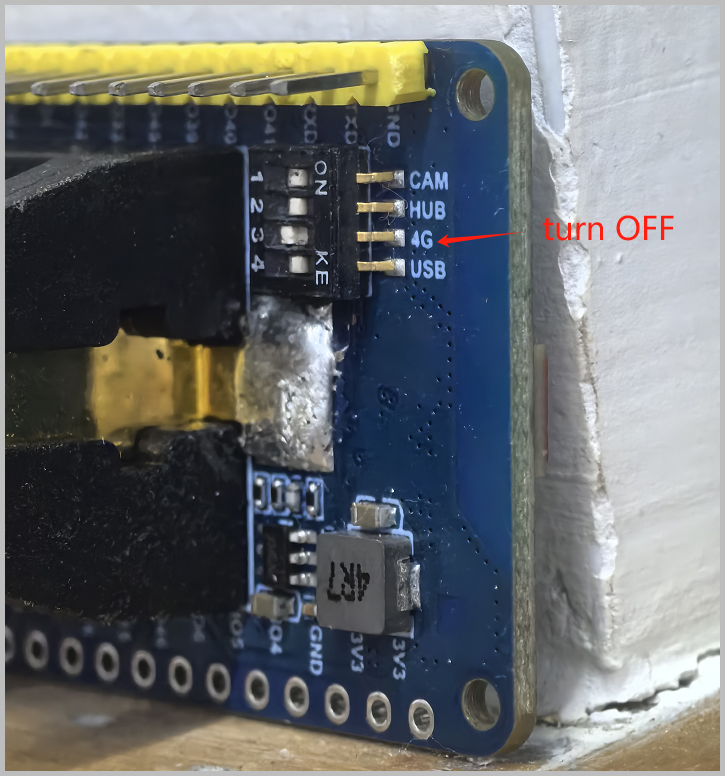
  </div>

- If you need to control it via software, keep the DIP switch off and control it through GPIO33 or GPIO22:
  - GPIO High: Module powers on
  - GPIO Low: Module powers off

- Example code to switch the 4G module on and off every 10 seconds:

  ```cpp
  const int pin = 33;

  void setup() {
    pinMode(pin, OUTPUT);
    Serial.begin(115200);
  }

  void loop() {
    digitalWrite(pin, HIGH);
    delay(10000);

    digitalWrite(pin, LOW);
    delay(10000);
  }
  ```

</Details>

<Details summary="Q: How many IOs and peripherals on the ESP32-S3-A7670E-4G development board can be customized?" className="faq-details" open>
A:
- IOs marked in dark green are unused and can be freely configured for functions like SPI, I2C, I2S, etc.
- IOs marked in light green are used by onboard peripherals like the camera and TF card. If you are not using the corresponding peripheral, you can use the pin headers to route them for other functions.

<div style={{maxWidth: '800px' }}>
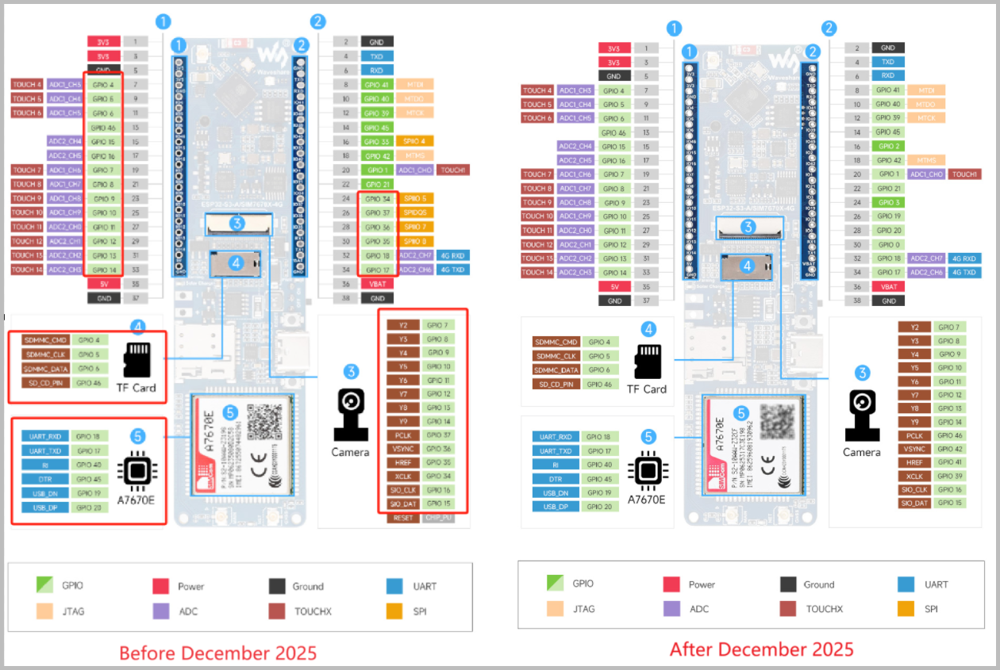
</div>

</Details>

<Details summary="Q: Why is program download abnormal?" className="faq-details" open>
A: Please first press and hold the BOOT button, then re-plug the USB cable, and check if a COM port is recognized.
</Details>

<Details summary="Q: How to assemble the module?" className="faq-details" open>
A: Please refer to the [**Assembly Documentation**](https://files.waveshare.com/wiki/ESP32-S3-A7670E-4G/manual/ESP32-7670-%E7%BB%84%E8%A3%85.pdf).
</Details>

<Details summary="Q: How to switch to an external WiFi antenna?" className="faq-details" open>
A:
- You need to solder the resistor corresponding to the external antenna.
- When using an external antenna, it is recommended to remove the onboard chip antenna, otherwise signal performance may be affected.
  <div style={{maxWidth: '300px' }}>
  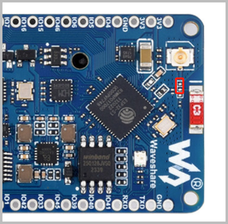
  </div>
- If you are using the V2 version, you do not need to remove the resistor. After removing the ceramic antenna, directly connect the external antenna.

</Details>

<Details summary="Q: Why does the device show as an unknown device?" className="faq-details" open>
A: It is recommended to connect via a USB hub, preferably using a USB 3.0 port.
</Details>

<Details summary="Q: Why are the camera programs for the new version and the old version not interchangeable?" className="faq-details" open>
A:
- New versions after 2026 come with the OV5640 camera by default, with a V2.0 silkscreen on the back.
- The old version uses the OV2640 camera. The drivers and programs for the two are not interchangeable and need to be used separately.

<div style={{maxWidth: '600px' }}>
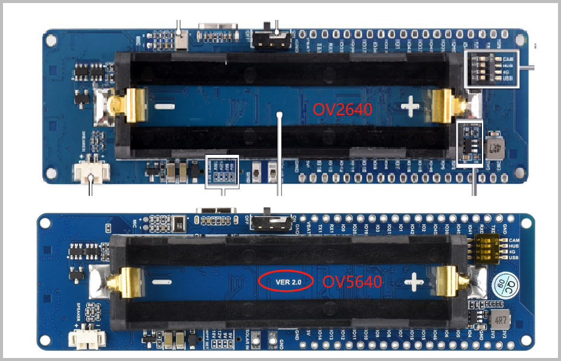
</div>

</Details>
