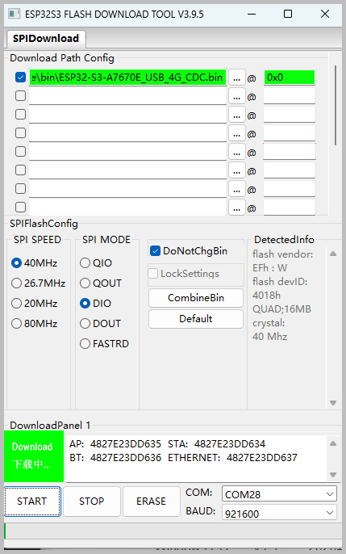
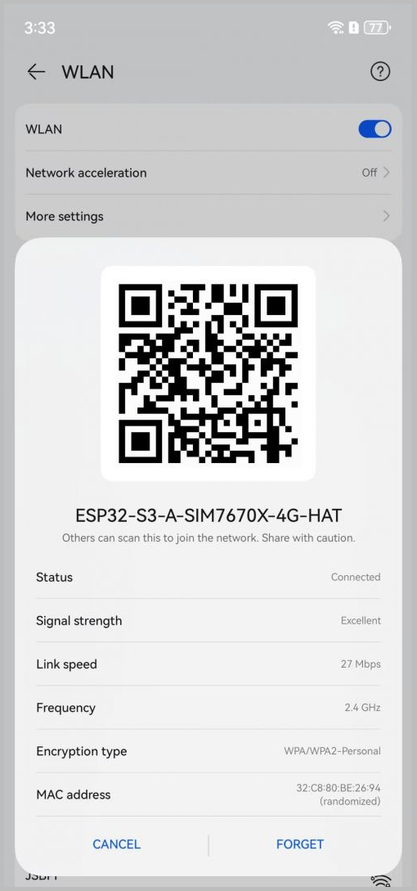
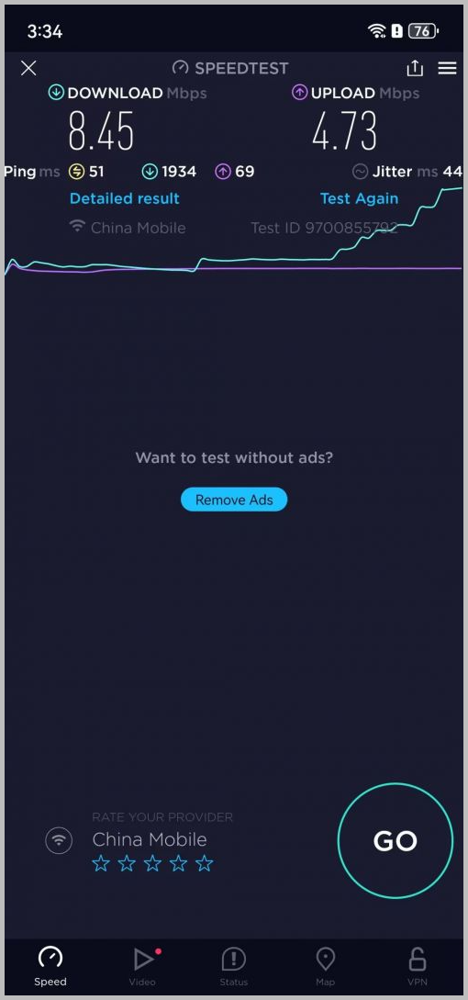
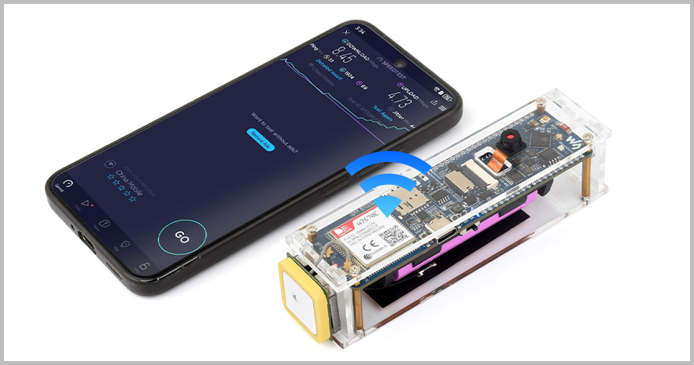

## User Guide

- This application uses the TinyUSB protocol stack to communicate with the 4G Cat-1 module and provides network access directly to the ESP32-S3 via PPP dial-up
-- This example uses pre-compiled firmware. Please download the [Flash Tools](https://www.espressif.com/sites/default/files/tools/flash_download_tool_3.9.5_0.zip) tool first
- Download the firmware:
  - [ESP32-S3-A7670E_USB_4G_CDC.bin](https://files.waveshare.com/wiki/ESP32-S3-A7670E-4G/ESP32-S3-A7670E_USB_4G_CDC.zip)
- Open the Flash Tools utility, select the development mode, choose the firmware file, set the address to 0x0 as shown in the figure, insert the SIM card, and start the download process
  

    
  

- Set the DIP switches on the back of the development board to enable 4G and disable USB. Repower the board and wait for the RGB LED to turn red. Then turn on your phone and connect to the Wi-Fi network: **ESP32-S3-A-SIM7670X-4G-HAT** with the password **12345678** to access the internet.
  

    <table style={{ width: '100%' }}>
      <tr>
        <td rowSpan="1">
          
        </td>
        <td rowSpan="1">
          
        </td>
      </tr>
      <tr>
        <td colspan="2">
          
        </td>
      </tr>
    </table>
  

- You can access the management interface by entering `192.168.4.1` in a browser. The default username is `esp32` and the password is `12345678`

## Troubleshooting

:::caution Note:
If you cannot connect to the network, please follow these steps to troubleshoot:

1. The module must be registered on the operator's network with the APN correctly configured:
   `AT+CGDCONT=1,"IP","your_apn"`

2. Set the DIP switches on the back of the development board to enable 4G and disable USB, then repower the board

3. Ensure you have downloaded the correct firmware for your specific module model (A7670E or SIM7670G). Do not confuse them, and verify the correct file is selected during the flashing process

4. During the verification phase, it is recommended to use a standard phone SIM card that is known to work for data on a phone. Prioritize testing with a card already verified for internet access on a mobile device. Some IoT SIM cards have significant restrictions that may prevent network access or lead to account suspension. Once basic functionality is confirmed, you can switch to other cards

5. For the complete project, please refer to:
   [usb_cdc_4g_module Example Program](https://github.com/espressif/esp-iot-solution/tree/master/examples/usb/host/usb_cdc_4g_module)
   :::