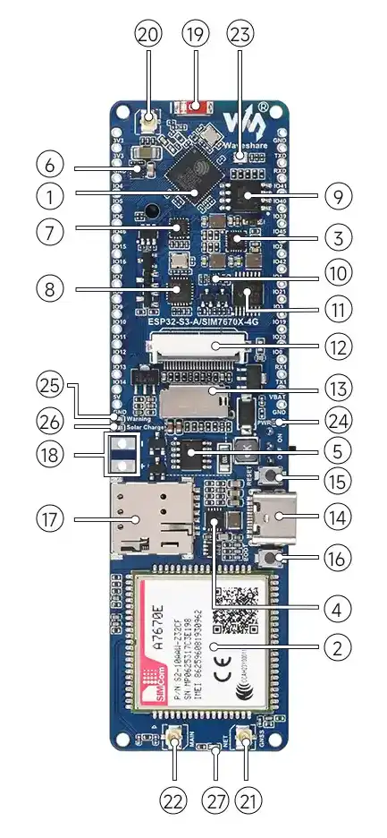
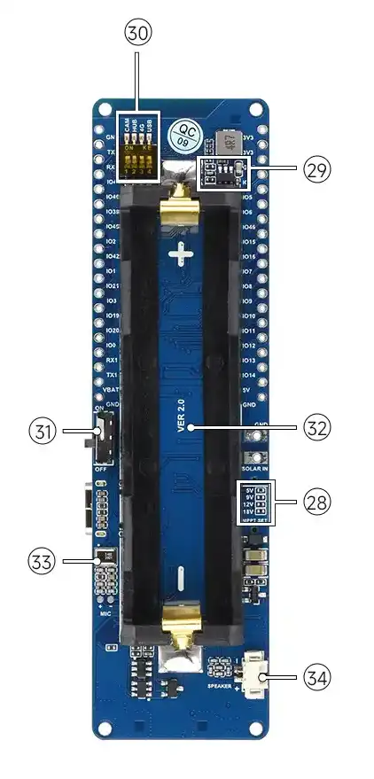
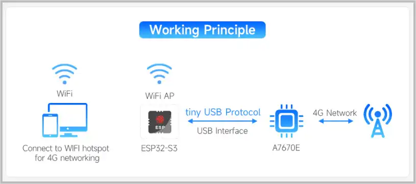
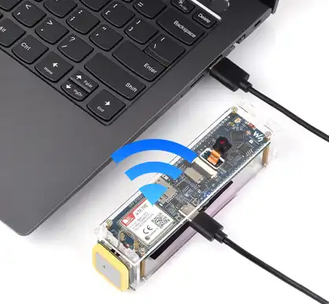
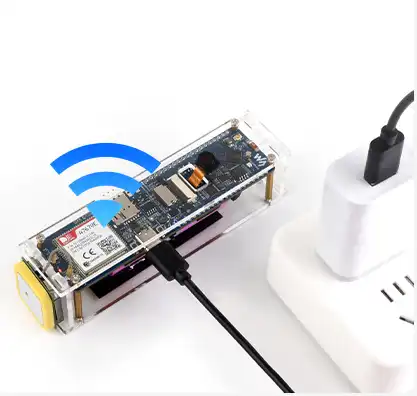
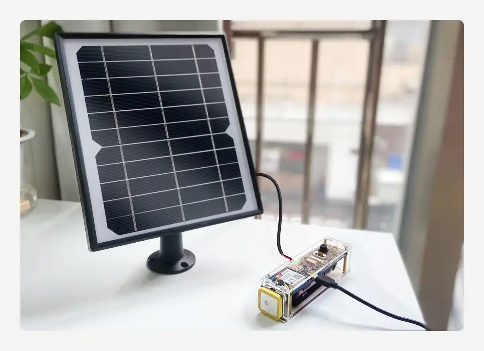
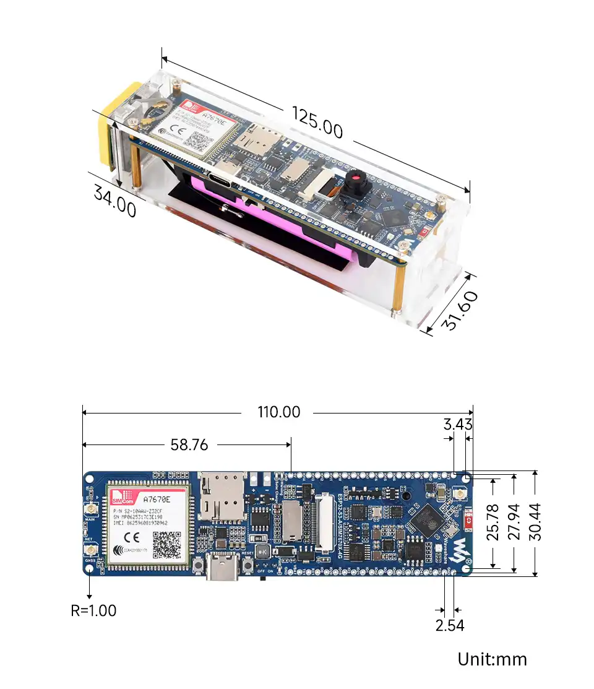

# ESP32-S3-A7670E-4G

 

The ESP32-S3-A7670E-4G (hereinafter referred to as the development board) is a versatile, high-performance microcontroller development board designed by Waveshare. It features an onboard A7670E 4G communication module, a universal OV camera interface, a TF card slot, an RGB LED, an 18650 battery holder, a battery voltage measurement IC, and a solar charging interface, among other peripherals. At its core is the ESP32-S3R2, a system-on-chip (SoC) that integrates low-power Wi-Fi and Bluetooth LE 5.0, supplemented by external 16MB Flash and 2MB PSRAM. The SoC's built-in hardware encryption accelerators, RNG, HMAC, and Digital Signature modules meet the security requirements of IoT applications. The onboard A7670E 4G communication module provides cellular network connectivity, which, combined with the ESP32-S3R2, enables applications such as portable Wi-Fi hotspots and IoT data transmission. Multiple low-power operating states cater to the power consumption needs of various application scenarios, including the Internet of Things (IoT), mobile devices, outdoor surveillance, and smart home solutions.

| SKU   | Product            |
| ----- | ------------------ |
| 26635 | ESP32-S3-A7670E-4G |

## Features

- Equipped with a high-performance Xtensa® 32-bit LX7 dual-core processor clocked at up to 240 MHz
- Supports 2.4 GHz Wi-Fi (802.11 b/g/n) and Bluetooth® 5 (LE) with an onboard antenna
- Built-in 512KB SRAM and 384KB ROM, with stacked 2MB PSRAM and external 16MB Flash

## Hardware Description

 

|     |  |
| -------- | -------------- |

- Onboard TF Card slot, supports file and image storage (⑬)
- Onboard solar charging interface (⑱)
  - The solar input voltage can be switched via resistors on the back
  - The green LED lights up during solar charging (㉖, ㉘)
- Onboard power switch for controlling 18650 battery power (㉛)
- Onboard USB-to-UART chip with automatic download circuit (⑦)
- ESP32-S3 USB directly connected to A7670X USB, supporting TinyUSB + PPP for internet access
- Onboard 18650 battery holder, supports 3.7V single-cell lithium batteries
  - A yellow LED warns of reverse battery connection (㉕)
- Reserved GPIOs, allowing flexible configuration for I2C / SPI and other peripherals
- Onboard GNSS IPEX1 connector (㉑)
- Onboard microphone and speaker interfaces, supporting call functionality (㉝, ㉞)
- Onboard DIP switches to control power for the Camera, USB HUB, and 4G module (㉚)
- Onboard antenna; the original ceramic antenna can be removed to switch to an external antenna (⑲, ⑳)
- Onboard RGB LED, driven by WS2812B (㉓)
- Onboard Camera interface, a 24PIN FPC connector for cameras (⑫). Please refer to the [Supported Camera List](#support-camera)

### LED Indicators Description

- Reverse Battery Indicator: Yellow (㉕)
- Solar Charging Indicator: Green (㉖)
- Power Indicator: Blue (㉔)
- Network Indicator: Red, flashes with a 200ms interval after network registration (㉗)

### Supported Camera List{#support-camera}

| Model    | Max Resolution | Color Type | Lens Size |
| -------- | -------------- | ---------- | --------- |
| OV2640   | 1600 × 1200    | Color      | 1/4"      |
| OV3660   | 2048 × 1536    | Color      | 1/5"      |
| OV5640   | 2592 × 1944    | Color      | 1/4"      |
| OV7670   | 640 × 480    | Color      | 1/6"      |
| OV7725   | 640 × 480    | Color      | 1/4"      |
| NT99141   | 1280 × 720    | Color      | 1/4"      |
| GC032A   | 640 × 480    | Color      | 1/10"      |
| GC0308   | 640 × 480    | Color      | 1/6.5"      |
| GC2145   | 1600 × 1200    | Color      | 1/5"      |
| BF3005   | 640 × 480    | Color      | 1/4"      |
| BF20A6   | 640 × 480    | Color      | 1/10"      |
| SC101IOT   | 1280 × 720    | Color      | 1/4.2"      |
| SC030IOT   | 640 × 480    | Color      | 1/4.2"      |
| SC031GS   | 640 × 480    | Color      | 1/6"      |

## Hardware Connection Description

The ESP32-S3 UART-to-USB and the 4G module's USB share a single Type-C interface.  
Users can select the connection via DIP switches on the back:

- 4G Module USB ↔ Type-C
- 4G Module USB ↔ ESP32-S3

This feature is commonly used for the ESP32-S3 to communicate with the 4G module using TinyUSB, enabling applications such as PPP dial-up internet, portable Wi-Fi hotspots, and wireless access points.

  <table style={{ width: '100%' }}>
    <tr>
      <td colspan="2">
        
      </td>
    </tr>
    <tr>
      <td rowSpan="1">
        
      </td>
      <td rowSpan="1">
        
      </td>
    </tr>
  </table>

## Solar Charging Description

The solar input selection resistor on the back of the development board is used to switch the maximum solar input voltage.

- The default 0Ω resistor connects to the 5V setting
- Supports 5~6V solar panel input
- When using a solar panel with a higher voltage, please short the corresponding voltage solder pads
  
 
    
  

## Dimensions

 

