# Working with Windows

## Hardware Connection

> Before using the module, in addition to the **Type-C USB cable, GNSS antenna, and LTE antenna**, you will also need the following items:

- One **4G SIM card** (active account with 4G/GPRS data service enabled)
- One **headset cable with a microphone** (optional)

### Connection Steps

- **With the power off**  
  - Insert an activated 4G SIM card  
  - Connect the headset cable with a microphone (optional)  
  - Connect the USB cable to your computer  

- Use the **Type-C USB cable**  
  - Connect one end to a USB port on your PC  
  - Connect the other end to the **USB port of the ESP32-S3-A7670E-4G**  

- LED status after power-up  
  - **The PWR LED lights up**  
  - Wait approximately **3 to 5 seconds** for the module to start  
  - **The NET LED stays on**: Module startup is complete  
  - The module automatically searches for the network; subsequently, **the NET LED starts blinking**

## Driver Installation

The first time you use the module on Windows, you need to install the driver:

### Driver Download

[A7600X Windows Driver](https://files.waveshare.com/wiki/ESP32-S3-A7670E-4G/A7600X-Windows-Driver.7z)

### Installation Steps

1. Open Device Manager
  <div style={{maxWidth:'600px'}}>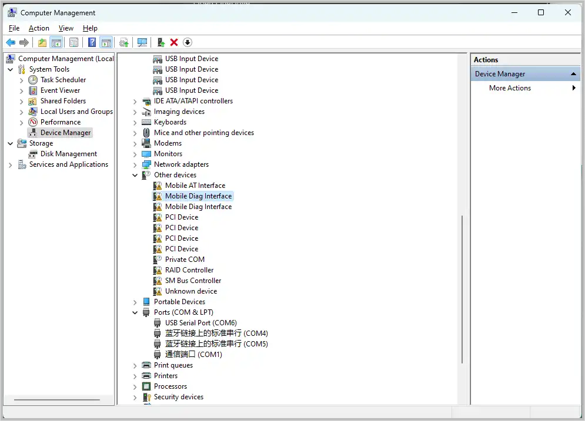 </div>
2. Locate "Mobile AT Interface", then click "Update driver" on the right
   <div style={{maxWidth:'400px'}}>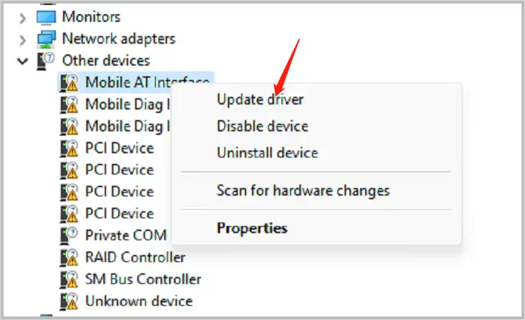 </div>
3. Click "Browse" and select the folder containing the downloaded driver
   <div style={{maxWidth:'500px'}}>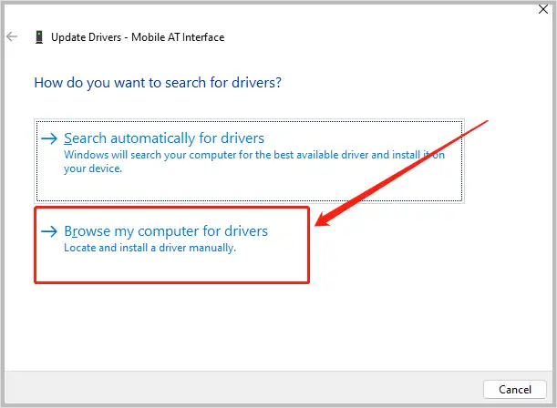 </div>
   <div style={{maxWidth:'500px'}}>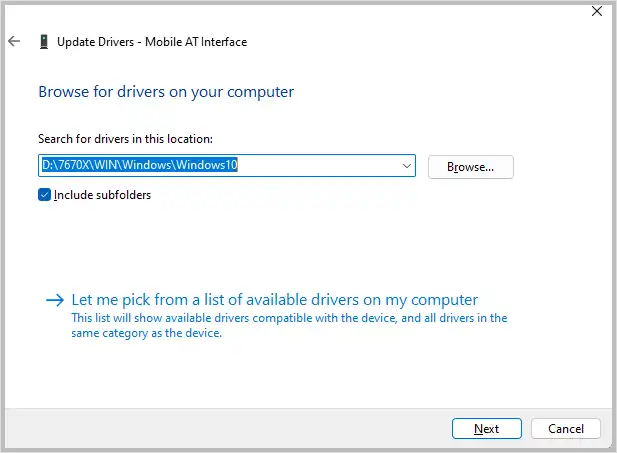 </div>
4. After successful installation, Device Manager will show something like "SimTech HS-USB AT Port 9011”
   <div style={{maxWidth:'400px'}}>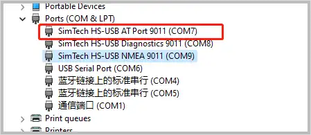 </div>


## Device Recognition

After the driver is installed, several new COM ports will appear in **Device Manager**.

## Common AT Command Functions for Cat-1 Module

### HTTP

<div style={{maxWidth: '800px' }}>
| AT Command | Description | Response |
|---|---|---|
| AT+HTTPINIT | Initialize HTTP service | OK |
| AT+HTTPPARA="URL",https://www.waveshare.cloud/api/sample-test/ | Connect to remote server | OK |
| AT+HTTPDATA=5,1000 | Input data | DOWNLOAD<br />Type `hello`<br />OK |
| AT+HTTPACTION=0 | Start HTTP request<br />0:GET; 1:POST; 2:HEAD; 3:DELETE; 4:PUT  | OK<br />+HTTPACTION: 0,200,54 |
| AT+HTTPTERM | Terminate HTTP service | OK |
| AT+HTTPPARA | Set HTTP parameters | OK |
| AT+HTTPHEAD | Read HTTP response header | OK |
| AT+HTTPREAD | Read HTTP response data | OK |
</div>

<div style={{maxWidth: '600px' }}>
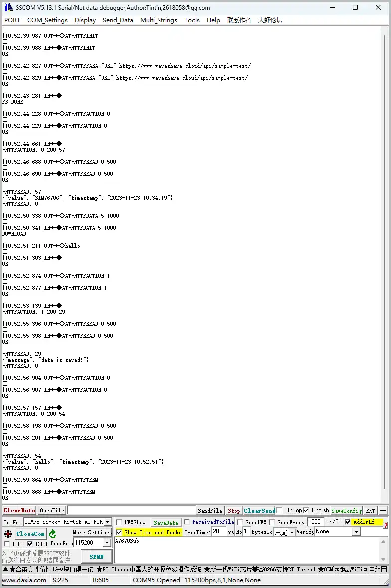
</div>

### MQTT

<div style={{maxWidth: '800px' }}>
| AT Command | Description | Response |
|---|---|---|
| AT+CMQTTSTART | Start MQTT service | OK |
| AT+CMQTTACCQ=0,"Waveshare-7670X",0 | Request an MQTT client | OK |
| AT+CMQTTCONNECT=0,"tcp://mqtt.easyiothings.com",20,1 | Send MQTT connection request, connect to private MQTT server (MQTTS) | OK |
| AT+CMQTTTOPIC=0,8 | Set the topic for publishing | >A7670Pub<br />OK |
| AT+CMQTTPAYLOAD=0,9 | Set the payload for publishing | OK<br />&gt;waveshare |
| AT+CMQTTPUB=0,0,60 | Publish message | OK<br />+CMQTTPUB: 0,0 |
| AT+CMQTTSUB=0,8,1 | Subscribe to a topic | >A7670Sub<br />OK<br />+CMQTTSUBTOPIC: 0,0<br /><br />[10:03:39.665] Received←◆<br />+CMQTTRXSTART: 0,8,15<br />+CMQTTRXTOPIC: 0,8<br />A7670Sub<br />+CMQTTRXPAYLOAD: 0,15<br />`{"data":"test"}`<br />+CMQTTRXEND: 0 |
| AT+CMQTTSTOP | Stop MQTT service | OK |
| AT+CMQTTREL | Release MQTT client | OK |
| AT+CMQTTUNSUBTOPIC | Release subscribed topic | OK |
| AT+CMQTTUNSUB | Unsubscribe  | OK |
</div>

<div style={{maxWidth: '600px' }}>
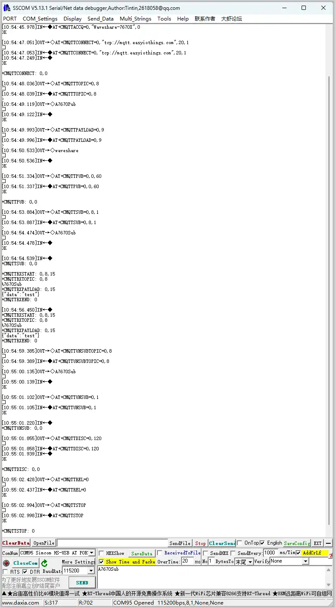
</div>

### GNSS

| AT Command | Description | Response |
|---|---|---|
| AT+CGNSSPWR=1 | Power on GNSS | +CGNSSPWR: READY! |
| AT+CGNSSTST=1 | Enable GNSS data output | OK |
| AT+CGNSSPORTSWITCH=1,0| Switch NMEA data to USB NMEA output | OK |
| AT+CGNSSPORTSWITCH=0,1 | Switch NMEA data to UART output | OK |
| AT+CGPSINFO | Get current GNSS data | Position information |

<div style={{maxWidth: '800px' }}>
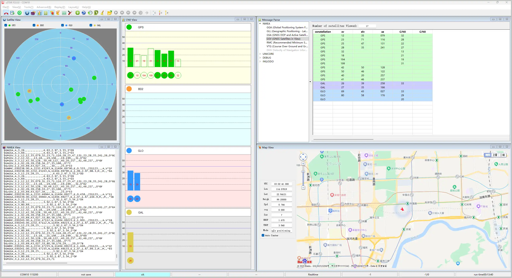
</div>

### Voice Call

- Connect a configured speaker or headset to the development board

  | AT Command | Description | Response |
  |---|---|---|
  | ATD10086; | Make a call | OK<br />VOICE CALL: BEGIN |
  | ATA | Answer a call | OK<br />VOICE CALL: BEGIN |
  | ATH | Hang up a call | OK<br />VOICE CALL: END: 000017 |

### SMS (Send and Receive)

#### Sending an English SMS

- Set the local SMS center number:  
  Execute `AT+CSCA="+8613800755500"` and press **Enter**. A response of `OK` indicates success.  
  Note: The format for China Mobile SMS center numbers is `+861380xxxx500`, where `xxxx` is the area code of your location. The center number may vary by region; you can find it online or check with your carrier. This example uses the Shenzhen area code (0755).
- Set SMS mode to text mode:  
  Execute `AT+CMGF=1` to set the message format to TEXT mode. The response is `OK`.
- Send an SMS:  
  Execute `AT+CMGS="phone number"` and press **Enter** to set the recipient's phone number. After the module returns the `>` prompt, enter the message content (e.g., `Send message test!`).  
  Do not press Enter after the message content. When finished editing, send the hexadecimal value `1A` (which is `CTRL+Z`) to execute the send operation. You can also send `1B` (`ESC`) to cancel.  
  Upon successful sending, the module returns `+CMGS:  15`, indicating the SMS was sent successfully. As shown in the figure below:
  <div style={{maxWidth: '650px' }}>
  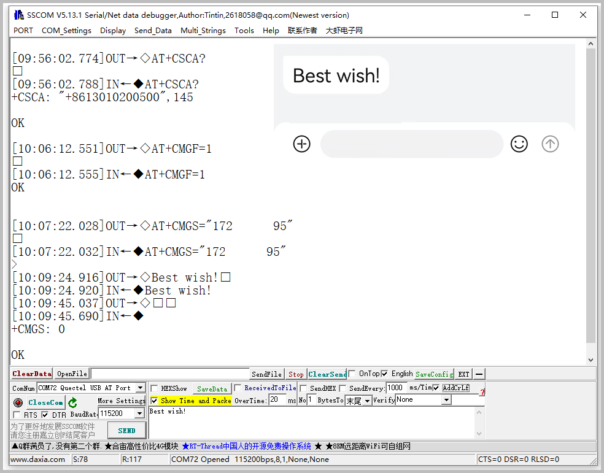
  </div>

#### Receiving an English SMS

- Send an SMS from your phone to the module, for example: `Hello,0909`
- When the module receives an SMS, the serial port will automatically report a notification containing "SM", where "20” indicates that there are currently 20 SMS messages stored in the SIM card, and the sequence number of the latest received SMS is 20
- Read the SMS content:  
  Execute `AT+CMGR=20` to read the 20th SMS (`AT+CMGL="ALL"` reads all SMS messages from the SIM card)
- Delete an SMS:  
  Execute `AT+CMGD=20`
- Convert the returned SMS content into readable text using an encoding conversion tool
  <div style={{maxWidth: '650px' }}>
  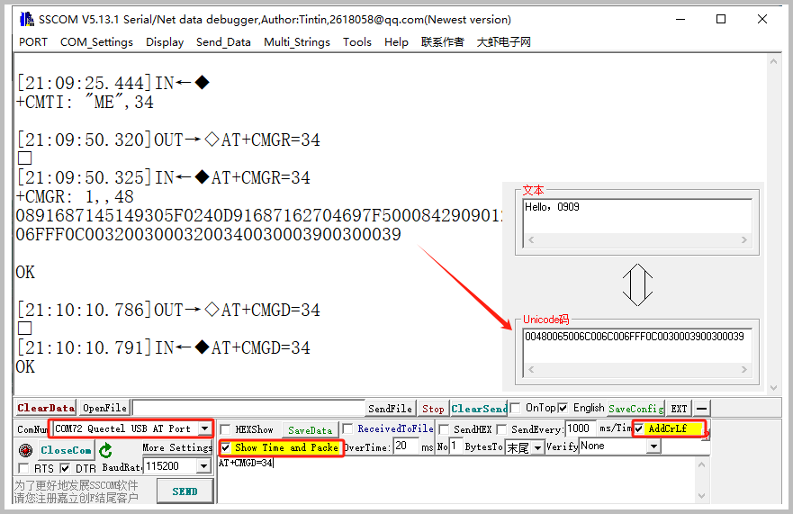
  </div>

#### Sending a Chinese SMS

- Set SMS sending parameters  

  ```text
  AT+CMGF=1                                 //Set as text mode
  AT+CSCS="UCS2”                      // Set the character set to UCS2
  AT+CSMP=17,167,2,25              // Set text mode parameters
  AT+CMGS="00310037003200360030003700360034003700390035"  // Set the recipient's phone number in UCS2 encoding
  ````

- Wait for the module to return the ">" prompt, then send the message content that has been converted by software (e.g., `6700597D7684795D798FFF0`).
Do not press Enter after the message content. When finished editing, send the hexadecimal value `1A` (CTRL+Z) to execute the send operation. As shown in the figure below:

  <div style={{maxWidth: '800px' }}>
  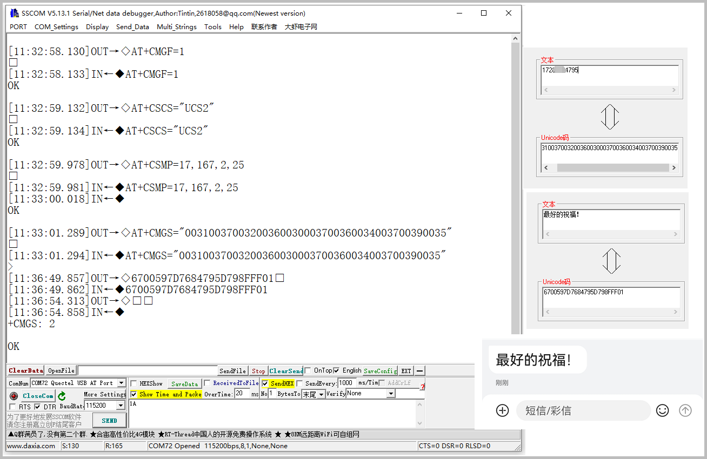
  </div>

#### Receiving a Chinese SMS

- Set SMS reception parameters

  ```text
  AT+CMGF=1                                  // Set to text mode
  AT+CSCS="GSM”                         // Set the character set to GSM
  AT+CNMI=2,1                                 // Configure new SMS indication
  ```

- When a new SMS is received, the serial port will automatically report a notification. Read the SMS content based on the notification, for example:

  ```text
  AT+CMGR=21                                // Read the SMS with sequence number 21
  ```

- Convert the returned SMS content into Chinese text using terminal software. As shown in the figure below:

  <div style={{maxWidth: '650px' }}>
  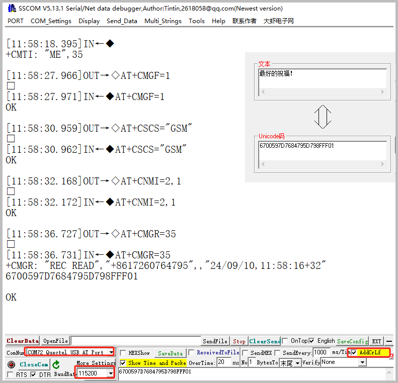
  </div>

### TTS (Text To Speech)

- Common AT commands for TTS are as follows:

   ```bash
   AT+CTTSPARAM=?                     // View the range of adjustable parameters
   AT+CTTSPARAM=1,3,0,1,1        // Set parameters
   AT+CTTSPARAM?                        // Read current TTS parameters
   AT+CTTS=1,"6B228FCE4F7F75288BED97F3540862107CFB7EDF"   // Synthesize and play UCS2 text
   AT+CTTS=2,"1234567890"         // Synthesize and play plain text
   ```

  <div style={{maxWidth: '500px' }}>
  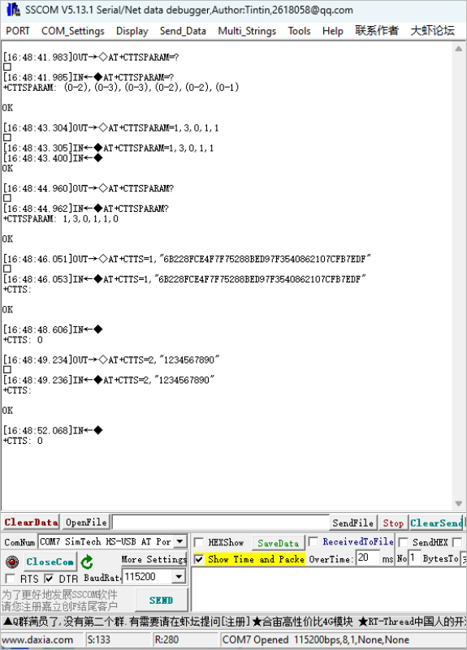
  </div>

### LBS (Base Station Positioning)

- Common commands for LBS base station positioning are as follows:

   ```bash
   AT+CLBS=?                                   // View the range of configurable parameters
   AT+SIMEI=xxxxx                             //If there is no IMEI, set the IMEI first. xxxxx must match the IMEI code on the module's sticker
   AT+CLBS=2                                   //Get the detailed address
   AT+CLBS=1                                   //Get the current latitude and longitude
   ```
   <div style={{maxWidth: '500px' }}>
   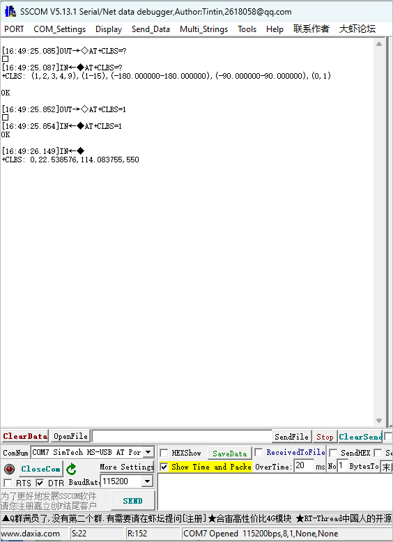
   </div>