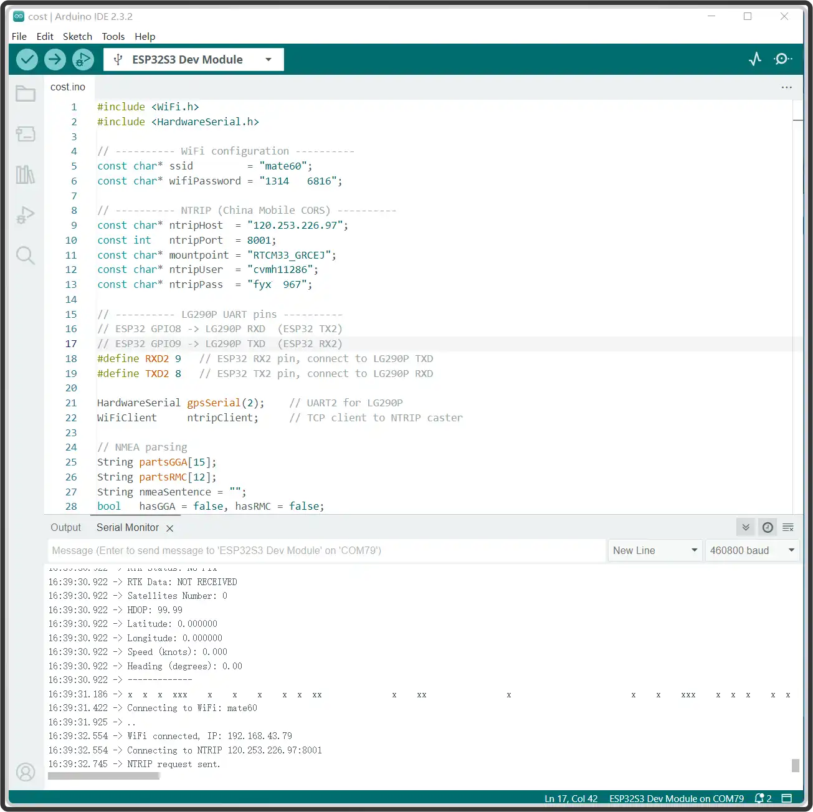
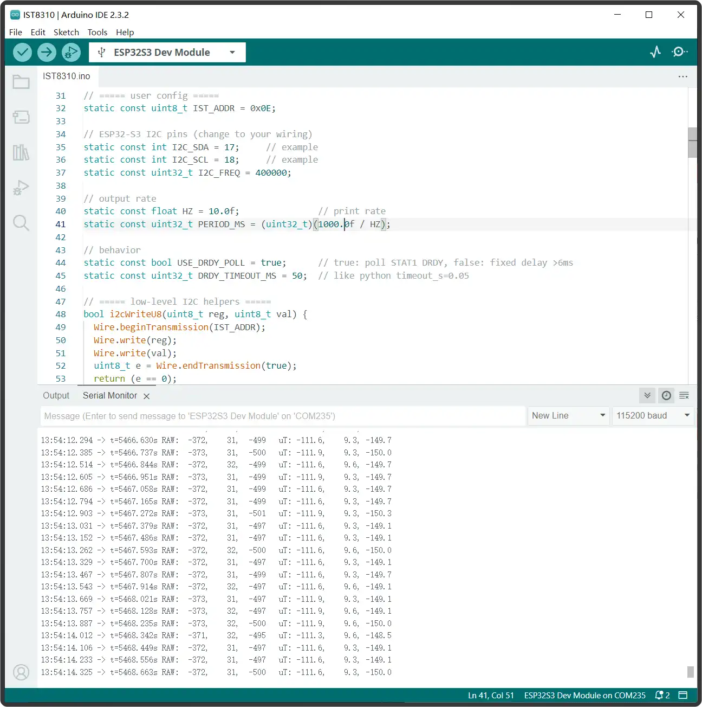

# Working with ESP32

- Connect the Q43 GNSS Helical RTK Module to the ESP32 via UART. Also, connect the antenna and place the setup outdoors in an open area, or at least position the positioning antenna receiver under a clear view of the sky for testing. The pin connection reference table is as follows:

  | ESP32-S3 | Q43 GNSS Helical RTK Module |
  | --- | --- |
  | GND | GND |
  | GPIO17 | SDA |
  | GPIO18 | SCL |
  | GPIO9 | TX1 |
  | GPIO8 | RX1 |
  | 3V3/5V | VCC |

- This example uses the ESP32-S3 for testing. [Set up the ESP32-S3 environment](https://www.waveshare.com/wiki/ESP32-S3-Pico#Arduino), and modify the following parameters in the example code.

  ```cpp
  //Connect ESP to WiFi to enable access to base station server data
  const char* ssid         = "mate60";   //Hotspot SSID
  const char* wifiPassword = "131433";  //Corresponding password
  
  // ---------- NTRIP (Here is an example of Hi-Target CORS, modify the following parameters accordingly)----------
  const char* ntripHost  = "120.253.226.97";
  const int   ntripPort  = 8001;
  const char* mountpoint = "RTCM33_GRCEJ";
  const char* ntripUser  = "cvmh11286";
  const char* ntripPass  = "fyxxx";
  ```

- Download the [program](https://www.waveshare.com/wiki/ESP32-S3-Pico#Arduino). Locate `GetGPS-RTK.ino` in the `Q43-GNSS-Helical-RTK-Module\ESP32\GetGPS-RTK` folder, compile and flash the program to the ESP32-S3. The RTK rover positioning test result is shown in the figure below:

  

- The `IST8310.ino` program was tested, obtaining the X, Y, Z three-axis magnetic induction intensity in the environment, as shown in the figure below:

  
