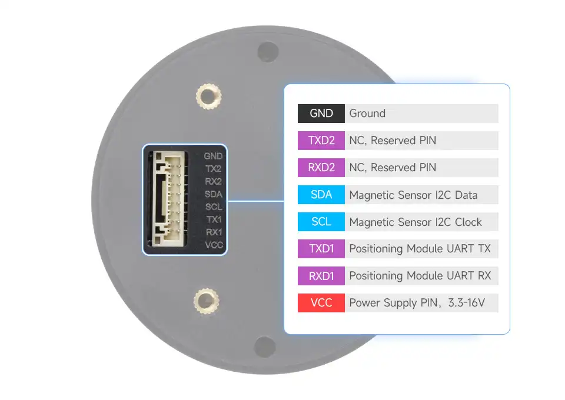
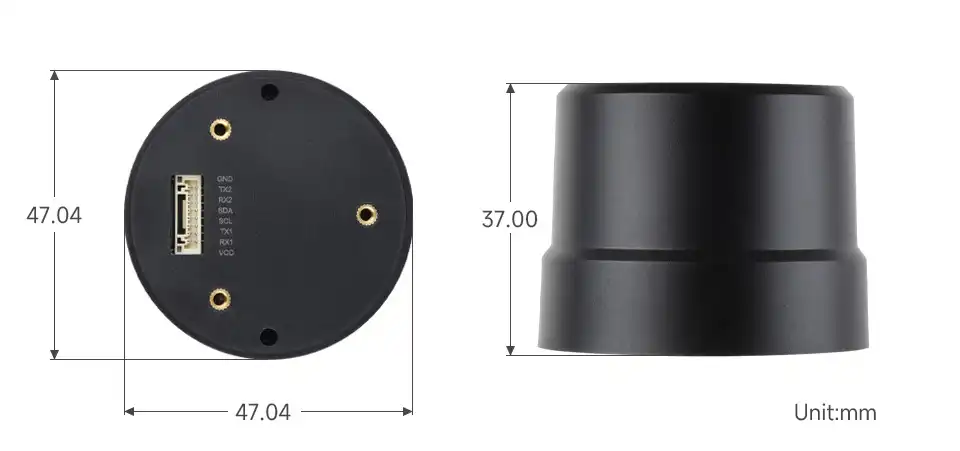

# Q43 GNSS Helical RTK Module

 

The Q43 GNSS Helical RTK Module is an integrated RTK intelligent positioning antenna module that combines an RTK positioning engine, helical antenna, and geomagnetic sensor into a compact unit. The product supports multi-constellation, multi-frequency GNSS signal reception, features dual-frequency RTK positioning capability, and provides stable and reliable high-precision positioning performance. It is an ideal choice for high-precision navigation application scenarios such as smart robots, precision agriculture, mining, surveying and mapping, and autonomous driving.

## Specifications

  <table
    className="all-cs-tb td-center"
    style={{
      width: '100%',
      tableLayout: 'fixed',
      textAlign: 'center',
      fontSize: '101%',
      lineHeight: 1.2,
    }}
  >
    {/* Three-column width ratio control */}
    <colgroup>
      <col style={{ width: '18%' }} />
      <col style={{ width: '22%' }} />
      <col style={{ width: '60%' }} />
    </colgroup>

    <tbody>
      {/* ---------- Antenna Parameters ---------- */}
      <tr>
        <th rowSpan={7}>Antenna Parameters</th>
        <th>Signal Band</th>
        <td>
          GPS: L1/L5 
          BDS: B1I/B1C/B2a/B2b 
          GLONASS: G1  
          GALILEO: E1/E5a/E5b 
          QZSS: L1/L5
        </td>
      </tr>
      <tr>
        <th>Characteristic Impedance</th>
        <td>50 Ω</td>
      </tr>
      <tr>
        <th>Polarization</th>
        <td>RHCP (Right Hand Circular Polarization)</td>
      </tr>
      <tr>
        <th>Coverage</th>
        <td>360°</td>
      </tr>
      <tr>
        <th>Peak Gain</th>
        <td>2.5 dB</td>
      </tr>
      <tr>
        <th>VSWR</th>
        <td>≤ 2</td>
      </tr>
      <tr>
        <th>Axial Ratio</th>
        <td>≤ 3 dB</td>
      </tr>

      {/* ---------- Amplifier Parameters ---------- */}
      <tr>
        <th rowSpan={3}>Amplifier Parameters</th>
        <th>Gain</th>
        <td>23 dB</td>
      </tr>
      <tr>
        <th>Noise Figure</th>
        <td>1.5 dB</td>
      </tr>
      <tr>
        <th>Output VSWR</th>
        <td>≤ 2</td>
      </tr>

      {/* ---------- System Parameters ---------- */}
      <tr>
        <th rowSpan={15}>System Parameters</th>
        <th>Positioning Module</th>
        <td>LB1020</td>
      </tr>
      <tr>
        <th>Geomagnetic Sensor</th>
        <td>IST8310</td>
      </tr>
      <tr>
        <th>Operating Voltage</th>
        <td>3.3 V ~ 16 V</td>
      </tr>
      <tr>
        <th>Power Consumption</th>
        <td>150 mW (Typ.)</td>
      </tr>
      <tr>
        <th rowSpan={3}>Sensitivity (GNSS)</th>
        <td>Cold Start: -148 dBm</td>
      </tr>
      <tr>
        <td>Reacquisition: -159 dBm</td>
      </tr>
      <tr>
        <td>Tracking: -165 dBm</td>
      </tr>
      <tr>
        <th rowSpan={2}>RTK Accuracy (RMS)</th>
        <td>Horizontal: 1 cm + 1 ppm</td>
      </tr>
      <tr>
        <td>Vertical: 2 cm + 1 ppm</td>
      </tr>
      <tr>
        <th>Time Accuracy (RMS)</th>
        <td>20 ns</td>
      </tr>
      <tr>
        <th>Time to First Fix (TTFF)</th>
        <td>26 s (Typ.)</td>
      </tr>
      <tr>
        <th>Time to Initialize</th>
        <td>6 s (Typ.)</td>
      </tr>
      <tr>
        <th>Initialization Reliability</th>
        <td>&gt; 99.9%</td>
      </tr>
      <tr>
        <th>Data Update Rate</th>
        <td>10 Hz</td>
      </tr>
      <tr>
        <th>Data Format</th>
        <td>RTCM 3.3; NMEA-0183</td>
      </tr>

      {/* ---------- Other Parameters ---------- */}
      <tr>
        <th rowSpan={6}>Other Parameters</th>
        <th>Communication Interface</th>
        <td>UART, I2C</td>
      </tr>
      <tr>
        <th>Physical Interface</th>
        <td>GH1.25 8 PIN</td>
      </tr>
      <tr>
        <th>Operating Temperature Range</th>
        <td rowSpan={2}>-40 ℃ ~ +85 ℃</td>
      </tr>
      <tr>
        <th>Storage Temperature Range</th>
      </tr>
      <tr>
        <th>Humidity</th>
        <td>≤ 95%</td>
      </tr>
      <tr>
        <th>Dimensions</th>
        <td>37.00 × Φ47.04 mm</td>
      </tr>
    </tbody>
  </table>

## Pinout Definition

 

## Dimensions

