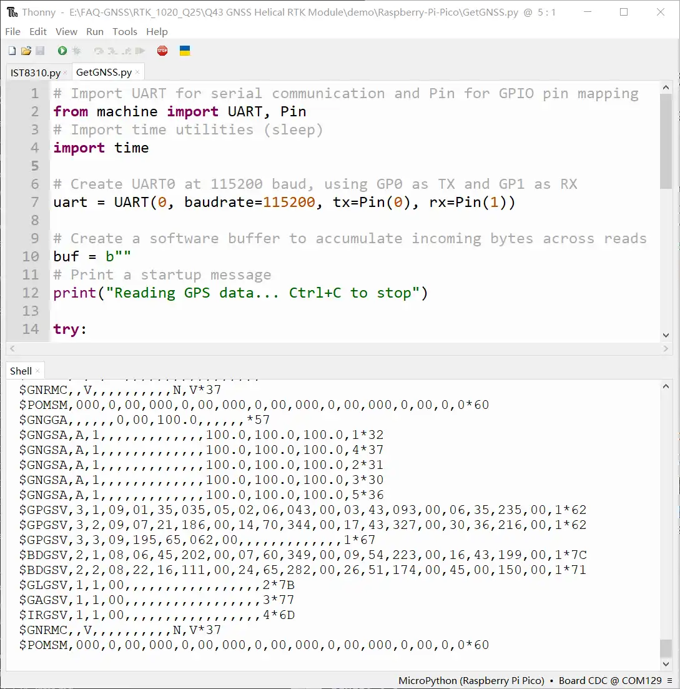
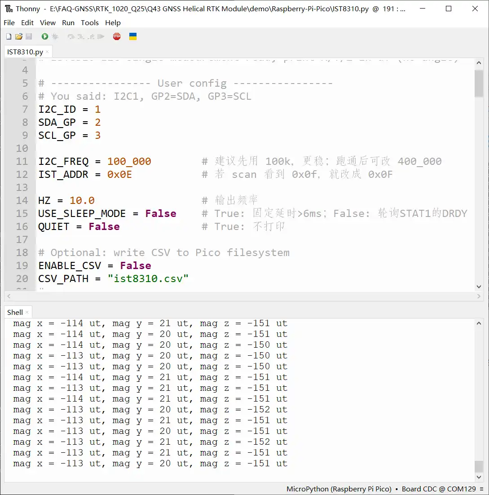

# Working with Raspberry Pi Pico

- If RTK functionality is needed, please use the Raspberry Pi Pico 2 W series and refer to steps similar to ESP32 to achieve RTK positioning. Here, the Raspberry Pi Pico 2 is used as an example to test standard GNSS positioning (GNSS positioning is also the most basic function of the LG290P GNSS RTK Module). The wiring diagram is as follows:

  | Raspberry Pi Pico 2 | Q43 GNSS Helical RTK Module |
  | --- | --- |
  | GND | GND |
  | GP2 | SDA |
  | GP3 | SCL |
  | GP1 | TX1 |
  | GP0 | RX1 |
  | VBUS | VCC |

- Open and run the `GetGNSS.py` example in Thonny to obtain raw GNSS messages, as shown in the figure below:

  

- Run the `IST8310.py` example to measure the spatial magnetic field intensity, as shown in the figure below:

  
