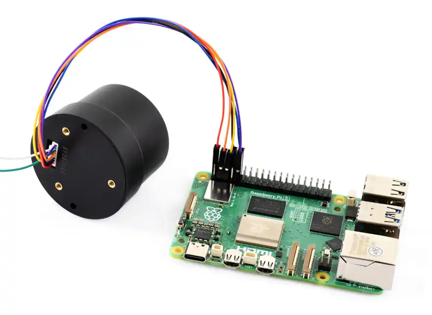
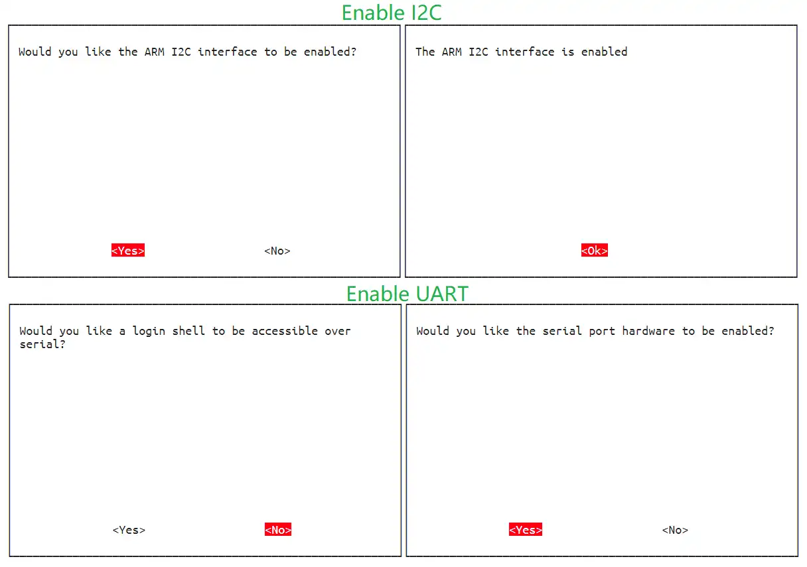
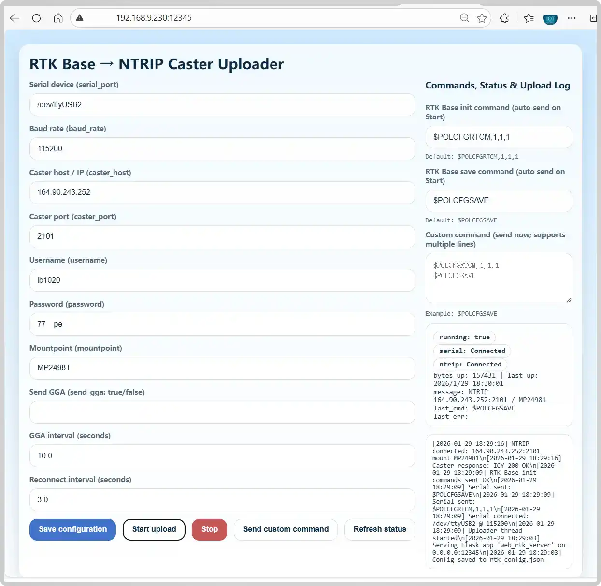
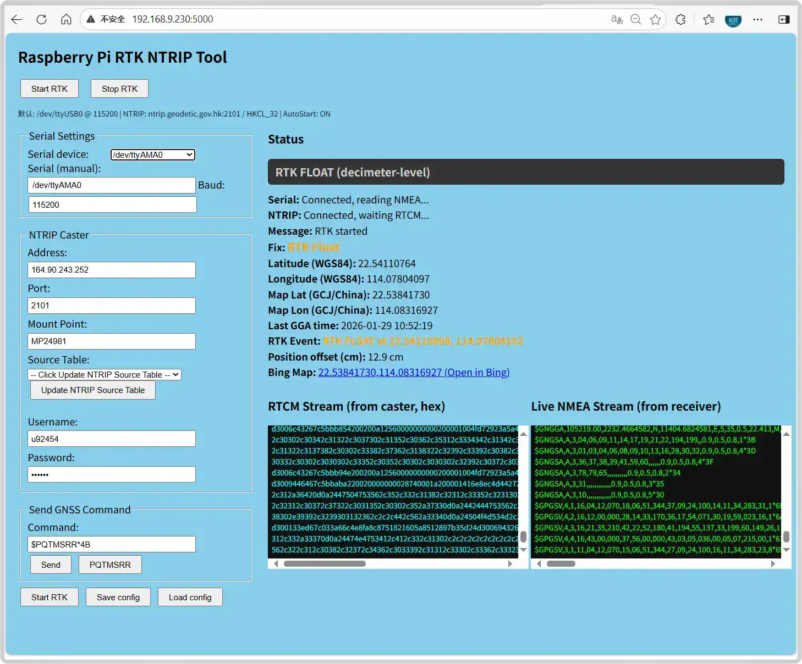
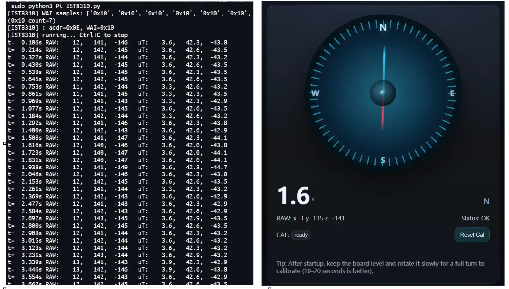

# Working with Raspberry Pi

This section uses Raspberry Pi with two Q43 modules for testing and explanation: one module is set to Base Station mode, the other to Rover mode, while also utilizing the geomagnetic sensor for an electronic compass application. The Linux system operation process is generally similar and can also be adapted to common Linux mainboards such as Jetson and RDK. It is recommended to choose an open, clear outdoor environment with a good view of the sky for testing.☀️The more open the environment and the better the weather conditions, the more stable and accurate the RTK positioning will be.

## Environment Configuration

- Connect the Q43 module to the Raspberry Pi's UART0 and I2C1 pins using a GH1.25 cable. The UART connects to the RTK positioning module, and I2C connects to the IST8310 geomagnetic sensor. The hardware connection is shown in the figure below:
  
  <div style={{maxWidth:600}}> 
  
  </div>

- Enable the Raspberry Pi's I2C and UART interfaces: In the UART settings, first select NO to turn off the shell debug serial port, then select YES to open the UART serial port, as shown below:

  

## RTK Base

Download and run the Python 3 program in the Raspberry Pi terminal; then enter the IP + port number generated by the program in a browser to open the NTRIP Server web interface. The default configuration is 115200 baud rate, serial port ttyAMA0, and pre-configured parameters for Caster Emlid. You can customize them according to the actual situation:

```bash
pip3 install flask pyserial
wget https://files.waveshare.com/wiki/Q43-GNSS-Helical-RTK-Module/Demo/Q43-GNSS-Helical-RTK-Module.zip
sudo unzip Q43-GNSS-Helical-RTK-Module.zip
cd Q43-GNSS-Helical-RTK-Module/Raspberry-Pi/Python
sudo python3 RTK-Base.py
```



## RTK Rover

Open a new terminal on the Raspberry Pi and run the Python 3 program; then enter the IP + port number generated by the program in a browser to open the NTRIP Client web interface. Please fill in the parameters according to the actual Caster to achieve RTK precise positioning:

```bash
sudo python3 RTK-Rover.py
```



## Electronic Compass

The module has an onboard IST8310 geomagnetic sensor, which can be driven via I2C to implement an electronic compass application. Run the following programs on the Raspberry Pi:

```bash
sudo python3 Pi-IST8310.py
sudo python3 Compass-IST8310.py
```

After running the program, you can obtain the environmental magnetic field strength and experience an electronic compass-like functionality:

