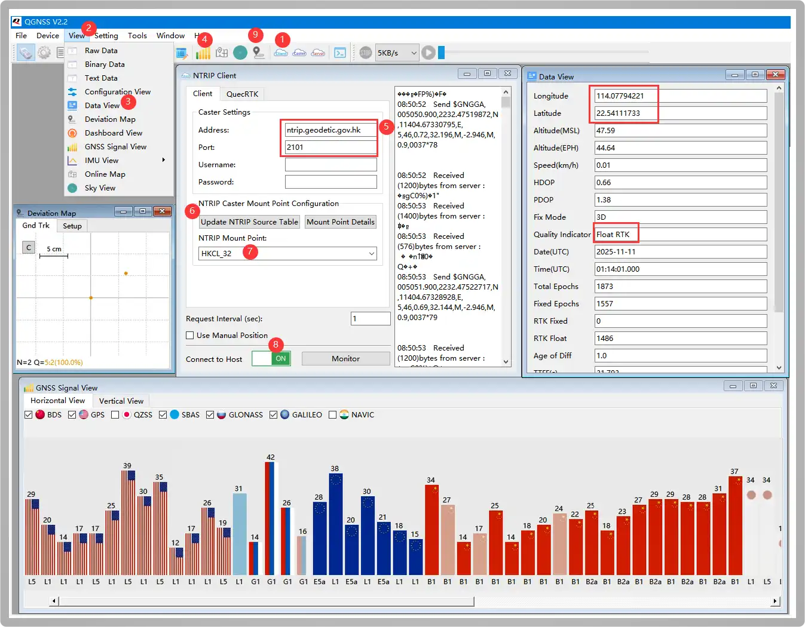
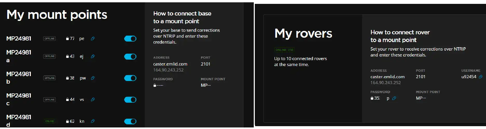
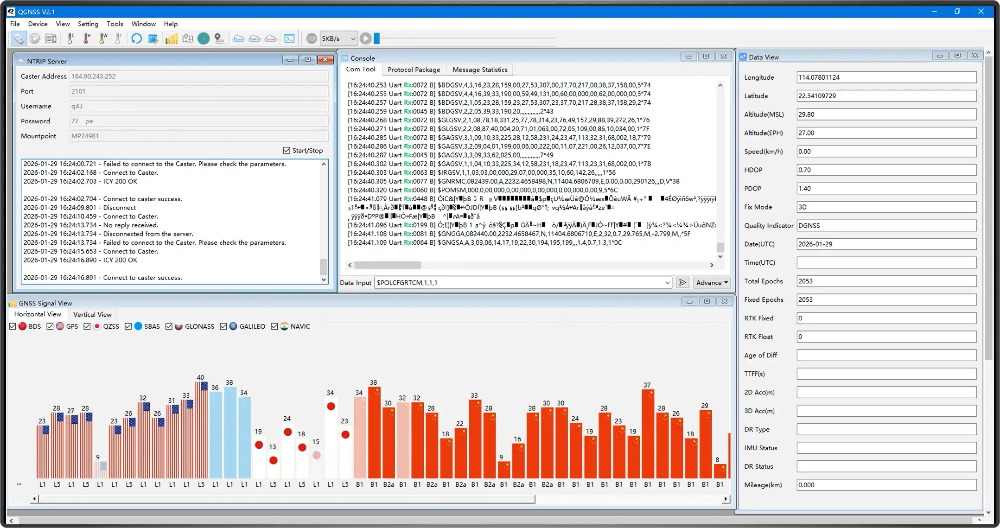
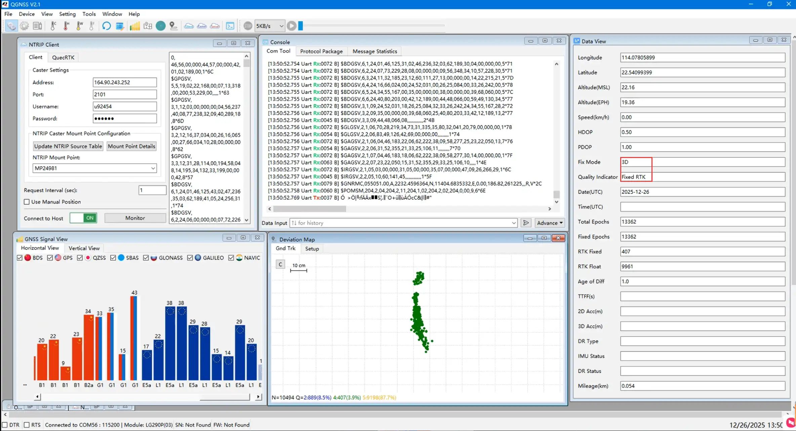

# Working with Windows

This section provides instructions for quickly setting up and using the Q43 GNSS Helical RTK Module with software like QGNSS on a Windows computer. For detailed instructions on using the QGNSS software, please refer to the Quectel_QGNSS_User_Guide_V3.2.pdf file in [QGNSS_2.2.zip](https://files.waveshare.com/wiki/LG290P-GNSS-RTK-Module/Tool/QGNSS%20V2.2_EN.zip).

## Environment Configuration

- Connect the Q43 to a PC / Raspberry Pi / Jetson Orin series mainboard using a [USB to UART Module](https://www.waveshare.com/FT232-USB-UART-Board-type-A.htm). Here, a Windows computer is used as an example for testing. The hardware connection is shown in the figure below:
  
  <div style={{maxWidth:600}}> 
  
  </div>

- Download and double-click to install the [CH343 Window VCP Driver](https://files.waveshare.com/wiki/common/CH343SER.7z).

## RTK Rover Positioning Implementation

:::note Example Description
One Q43 GNSS Helical RTK Module acts as a Rover, purchasing and connecting to a third-party RTK Base Station for testing.
:::

Download and open the [QGNSS Tool](https://files.waveshare.com/wiki/LG290P-GNSS-RTK-Module/Tool/QGNSS_V2.1.14_Build0311.zip). 1️⃣click NTRIP Client, 2️⃣click View, ️3️⃣select Data View to open, 4️⃣open the satellite signal bar graph interface, 5️⃣configure the following Addressh and Port parameters to the corresponding location:

```text
Address:     ntrip.geodetic.gov.hk
Port:        2101
Mount Point: HKCL_32
Username:    (Leave empty)
Password:    (Leave empty)
```

:::warning
Users need to first apply for reference base station services from local institutions. For example, users in the US apply to UNAVCO. As the author is located near Hong Kong, Hong Kong Geodetic Survey Services is used for testing.
:::

6️⃣click Update NTRIP Source Table, 7️⃣ select HKCL_32 node, 8️⃣turn on ON (the button turns green). After successfully communicating with the base station, the NTRIP Client prints the following information:

```text
Received (14) bytes from server:
ICY 200 OK
```

Wait for 2-15 minutes until the latitude, longitude, and a Fixed RTK prompt appear in the Data View window on the right, indicating RTK positioning is achieved. 9️⃣Open the deviation chart to see the positioning accuracy



## RTK Base➡️RTK Caster➡️RTK Rover

:::note Example Description
Two Q43 GNSS Helical RTK Modules are used as an RTK Base Station and a Rover for testing.
:::

- Before setting up the Base Station module, first understand NTRIP (Networked Transport of RTCM via Internet), which transmits RTK differential data over the Internet. It is a protocol for distributing RTK correction data via the Internet/local network. This allows for extending RTK networks with unlimited base stations and rovers. A network with multiple NTRIP devices is called an NTRIP network.

  There are 3 roles in an NTRIP network: NTRIP Caster, which is a server responsible for receiving and sending GNSS differential data. It collects RTK correction data (i.e., RTCM data) from one or more base stations and distributes them to RTK rovers. Public cloud-based Casters like Emlid Caster and rtk2go allow uploading RTCM data to these hubs, simplifying the cumbersome steps of setting up a Caster.
  
  The following uses setting up the public Caster [Emlid Caster](https://caster.emlid.com) for testing:

  
  
  Configure the "My mount points" parameters from the image above for the Base Station, and the "My rovers" parameters for the Rover.

- Open the QGNSS tool. 2️⃣Enter the parameters obtained from the Emlid Caster in the NTRIP Server window:

  ```text
  ADDRESS:     164.90.243.252
  PORT:        2101
  MOUNT POINT: MP24981d
  PASSWORD:    62XXXX
  ```

- Then check "Start". After successfully connecting to the server, it prints:

  ```text
  Connect to caster success
  ICY 200 OK;
  ```
  
  
  
  :::warning
  - When the Q43 operates as a base station, the convergence time is relatively long. It is generally recommended to use the position after the base station has converged for 12 hours as the base station location. The antenna should be installed at a fixed point, ideally in a location with a good view of the sky and minimal obstructions.
  - Emlid Caster is only for testing hardware functionality. For actual deployment, it is recommended to set up your own server for more stable results.
  :::

- Enter the command 1️⃣in the Console checkbox below to automatically converge the coordinates via Survey-in mode, configuring it as base station mode.

  1 Hz MSM4 RTCM Base Station Mode
  
  ```text
  $POLCFGRTCM,1,1,1
  $POLCFGSAVE
  ```

- Simultaneously open Data View to monitor the base station convergence status3️⃣. . After successful convergence, the base station's latitude and longitude will be obtained. Wait for about 12 hours to get more accurate base station coordinates.
- This data is transmitted to the rover via the Caster hub, so the corresponding Caster parameters also need to be configured for the Rover:

  ```text
  ADDRESS:     164.90.243.252
  PORT:        2101
  MOUNT POINT: MP24981d
  USERNAME:    u92454
  PASSWORD:    35XXXX
  ```

- Wait for several hours until both the base station and rover are stable, and Fixed RTK appears, indicating successful RTK positioning.

  
