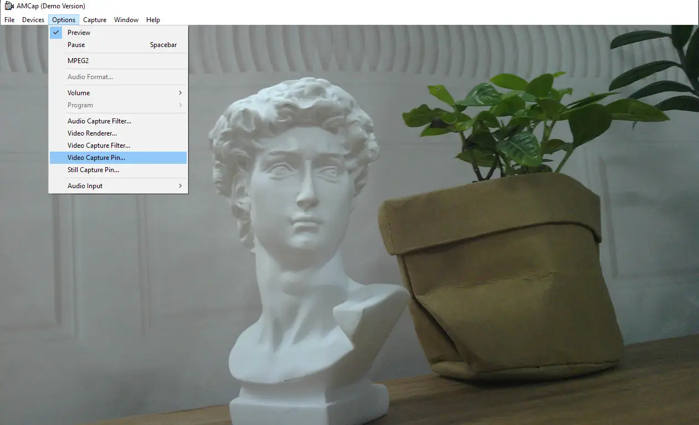

# Working with Windows PC

## Test Software

Most current Windows 10 systems come with a built-in camera application. You can directly open this native Windows camera app for testing.
If you are using Windows 7, or if you cannot find the camera app in your system, you can download and install the AMCAP test software we provide from the [Resources and Documents](./Resources-And-Documents.md).

## Testing Steps

**Windows Native Camera Application**

- Search for "Camera" to open the software.
- Click the gear icon in the top-left corner to open the settings interface, where you can set the resolution for photos or videos.
- Click the video or photo icon on the right to switch between recording and capturing modes.
  

**Amcap Software**

- Download and install [Amcap software](./Resources-And-Documents.md).
- You can click the "Option" menu and select "Video Capture Pin..." or "Still Capture Pin..." to configure image and video parameters.
  
