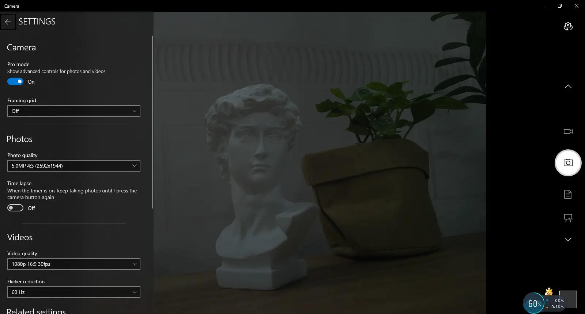
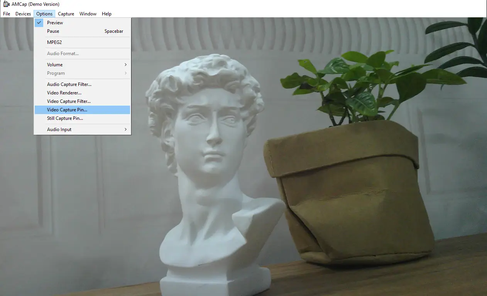

# Working with Windows PC

## Test Software

Most current Windows 10 systems come with a built-in camera application. You can directly open this default Windows camera app for testing.
If you are using Windows 7 or cannot find the camera application on your system, you can download and install the AMCAP test software we provide from the [Resources and Documents](./Resources-And-Documents.md).

## Testing Steps

**Windows Built-in Camera Application**

- Search for "Camera" and open the app.
- Click the gear icon in the top-left corner to open the settings interface, where you can set the resolution for photos or videos.
- Click the video or photo icon on the right to switch between recording and capturing modes.
  

**Amcap Software**

- Download and install the [Amcap software](https://files.waveshare.com/wiki/common/Amcap.zip)
- Click the "Options" menu, then select "Video Capture Pin..." or "Still Capture Pin..." to configure image and video parameters.
  
