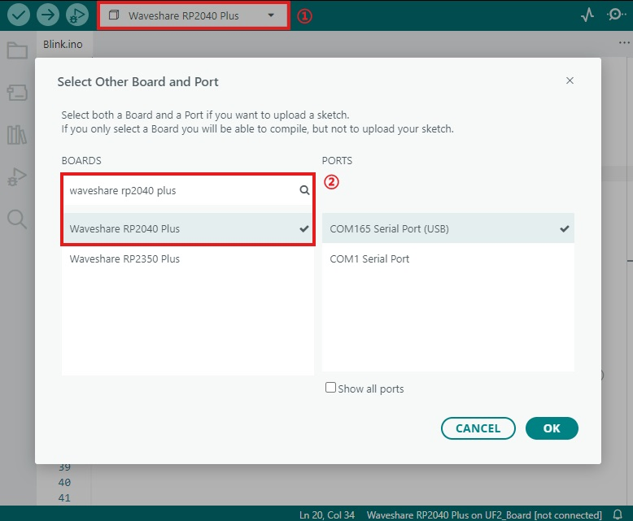

# Working with Arduino

This chapter contains the following sections. Please read as needed:

- [Setting Up Development Environment](#setting-up-development-environment)
- [Other Tips](#other-tips)

## Setting Up Development Environment

Please refer to the **[Install and Configure Arduino IDE Tutorial](/docs/Raspberry-Pi-Pico/Tutorials/Arduino-Tutorials/index.md)** to download and install the Arduino IDE.

## Other Tips

1. The RP2040-Plus can be selected directly within the Arduino IDE. Choose "Waveshare RP2040-Plus".

    
 
    
    

2. After selecting the development board, you can refer to the [Arduino Getting Started Tutorial](../../Tutorials/Arduino-Tutorials/index.md#first-program-upload) to upload your program.