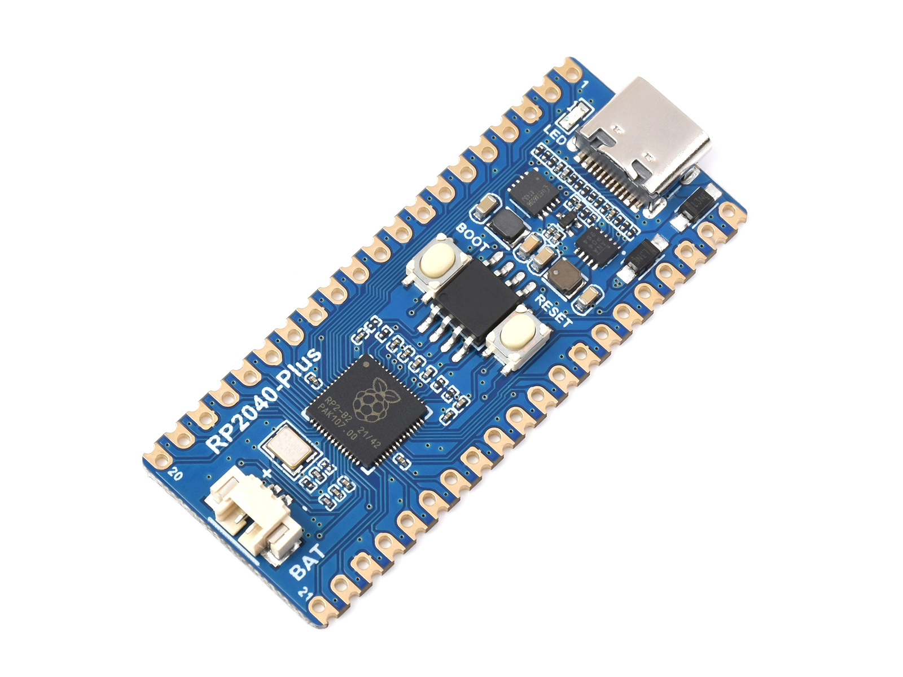
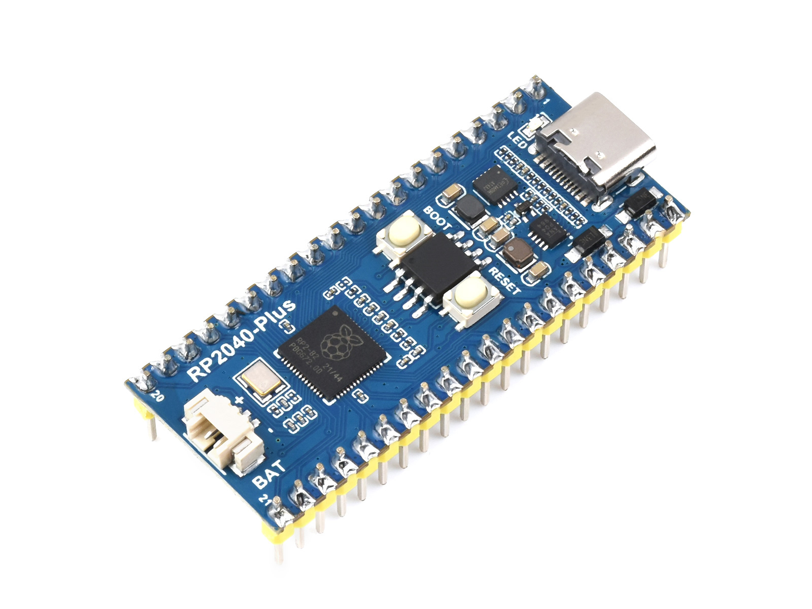
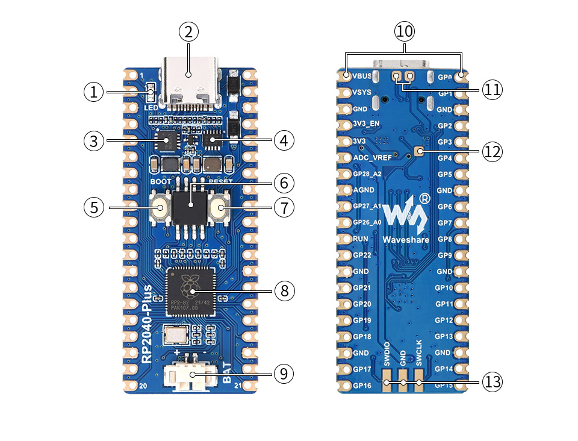
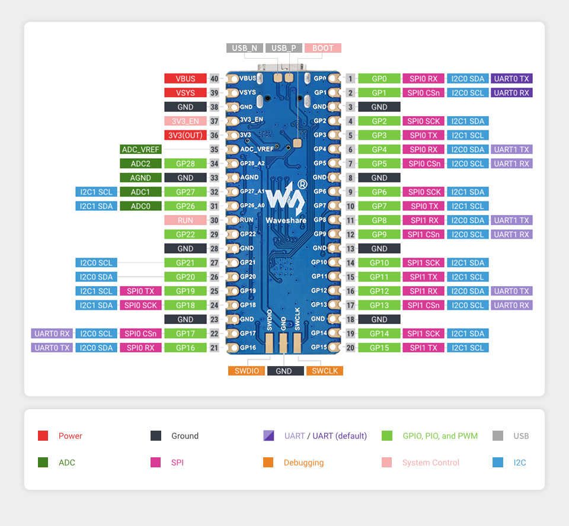
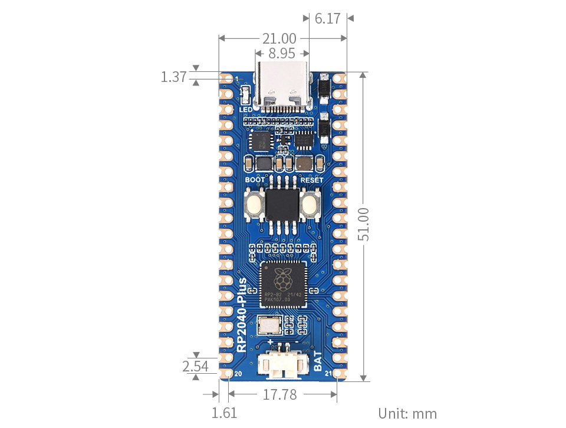

# RP2040-Plus

import Tabs from '@theme/Tabs';
import TabItem from '@theme/TabItem';

<Tabs queryString="variant">
  <TabItem value="RP2040-Plus" label="RP2040-Plus (Without header version)">
    
 

  </TabItem>
  <TabItem value="RP2040-Plus-M" label="RP2040-Plus-M (Header version)" default>
    
 

  </TabItem>
</Tabs>

The RP2040-Plus is a low-cost, high-performance microcontroller development board designed by Waveshare, featuring flexible digital interfaces. On the hardware side, it utilizes the RP2040 microcontroller chip independently developed by Raspberry Pi. It is equipped with a dual-core ARM Cortex M0+ processor running at up to 133MHz, incorporates 264KB of SRAM and 4MB/16MB (optional) of on-chip Flash, and provides 26 multifunctional GPIO pins. On the software side, developers can choose between the C/C++ SDK provided by Raspberry Pi or use MicroPython. It comes with comprehensive development materials and tutorials, enabling quick entry into development and easy integration into products.

| SKU | Product |
| ------ |   ------------------ |
| 20290 | RP2040-Plus |
| 20808 | RP2040-Plus-M |
| 23503 | RP2040-Plus-16MB |
| 23504 | RP2040-Plus-16MB-M |

## Features

- Utilizes the RP2040 microcontroller chip designed by Raspberry Pi
- Equipped with a dual-core ARM Cortex M0+ processor and a flexible clock running at up to 133MHz
- Built-in 264KB of SRAM and 4MB of on-chip Flash
- Utilizes a Type-C port, eliminating concerns about plug orientation.
- Onboard lithium battery charge/discharge interface, beneficial for mobile applications
- Onboard DC-DC chip MP28164, a high-efficiency buck-boost converter capable of handling load currents up to 2A
- Castellated module design allows direct soldering and integration onto user-designed carrier boards
- USB1.1 host and slave device support
- Supports low-power sleep and hibernation modes
- Drag-and-drop programming using mass storage over USB
- Up to 26 multifunctional GPIO pins
- 2x SPI, 2x I2C, 2x UART, 3x 12-bit ADC, and 16 controllable PWM channels
- Accurate on-chip clock and timer
- On-chip accelerated floating-point libraries
- Built-in temperature sensor for real-time chip temperature monitoring
- 8 × programmable I/O (PIO) state machines for custom peripheral support

## Onboard Resources

 

1. **LED Indicator** User status indicator (not a power LED), used for operational status signaling
2. **USB Type-C Interface** For program download and power supply, supports USB communication
3. **ETA6096** High-efficiency lithium battery charge management chip, supports single-cell 3.7V lithium battery charging
4. **MP28164** High-efficiency DC-DC buck/boost power chip, enhances system power supply stability
5. **BOOT Button** Press during reset to enter download mode
6. **On-Chip Flash** Provides program and data storage, available in **4MB (W25Q32JVSSIQ)** and **16MB (W25Q128JVSIQ)** variants
7. **RESET Button** System reset button for rebooting the device
8. **RP2040** Dual-core ARM Cortex-M0+ processor, operating at up to **133MHz**
9. **Battery Interface** MX1.25 connector for connecting a 3.7V lithium battery, supports charging and discharging functions
10. **Pin Headers** Compatible with the standard Raspberry Pi Pico pin interface for easy peripheral expansion
11. **USB Test Points** Expose USB signals for convenient debugging and testing
12. **BOOT Test Points** Connected to the BOOT button circuit, facilitates automatic downloading and debugging
13. **DEBUG Interface** For program download and online debugging, supports development and debugging needs

## Interfaces

 

## Dimensions

 

## Development Methods

The RP2040-Plus supports three programming languages: MicroPython, C/C++, and Arduino, offering developers flexible choices. You can select the appropriate development tools and programming methods based on project requirements and personal preference:

- **Thonny IDE (Working with MicroPython)**: Thonny is a lightweight Python Integrated Development Environment designed for beginners and educational scenarios, now widely used for MicroPython / CircuitPython development. Its interface is simple and intuitive, featuring a built-in Python interpreter, support for serial REPL, code flashing, and debugging, with a straightforward setup process. MicroPython is easy to learn and runs without compilation, making it ideal for beginners to quickly start embedded development. You can refer to the **[Working with MicroPython](./MicroPython.md)** for initial setup, which provides detailed environment configuration steps and example programs.

- **VS Code + Pico SDK (Working with C/C++)**: VS Code is a powerful cross-platform code editor. By installing the Pico VSCode extension, a complete C/C++ development environment can be quickly set up. This extension integrates the Pico SDK toolchain, CMake build system, flashing and debugging tools, supports graphical operations, and offers high development efficiency. C/C++ development fully utilizes hardware performance, making it suitable for projects with higher performance requirements and professional developers, and is more applicable for complex embedded applications. You can refer to the **[Working with C/C++](./C.md)** for initial setup, which provides detailed environment configuration steps and example programs.

- **Arduino IDE (Working with Arduino)**: The Arduino IDE is a convenient, flexible, and easy-to-use open-source electronics prototyping platform. Arduino boasts a vast global user community, offering a massive library of open-source code, project examples, tutorials, and rich library resources. These libraries encapsulate complex functionalities, allowing developers to implement various features quickly without delving into low-level details. It is well-suited for rapid development and prototype verification, significantly shortening development cycles. You can refer to the **[Working with Arduino](./Arduino.md)** for initial setup, which provides detailed environment configuration steps and example programs.
