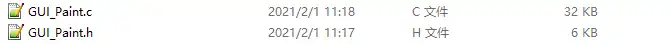
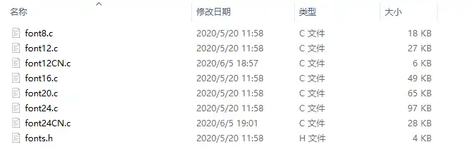
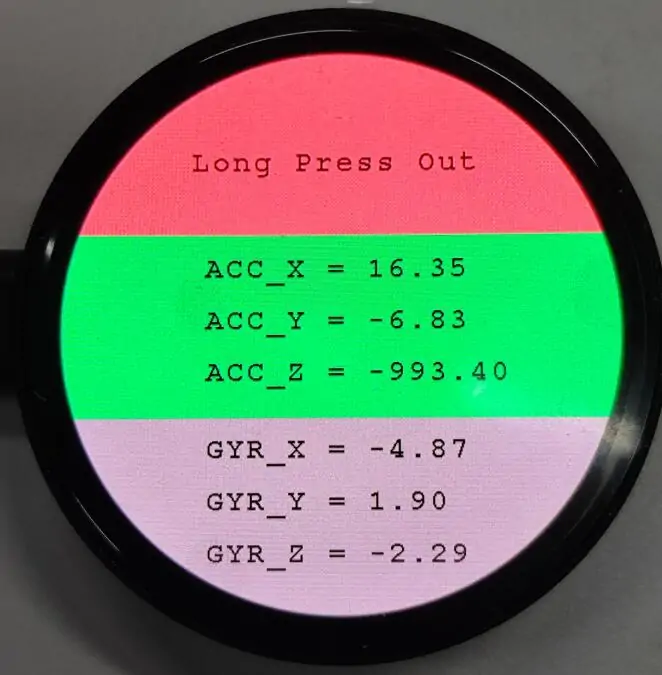
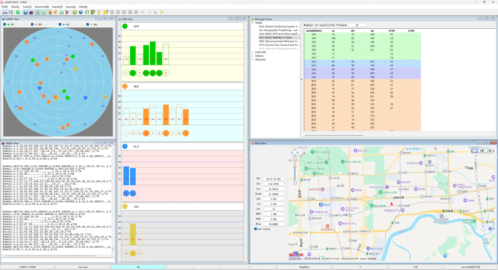
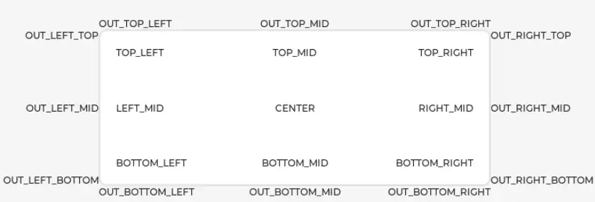

<!-- Example-related Image References -->


# Working with C/C++

This chapter includes the following sections, please read as needed:

- [Setting Up Development Environment](#setting-up-development-environment)
- [Demo](#demo)

## Setting Up Development Environment

Please refer to the **[Install and Configure Pico C/C++ Development Environment Tutorial](/docs/Raspberry-Pi-Pico/Tutorials/C-Tutorials/index.md)** to download and install the Pico VS Code.

## Demo

The C/C++ demos are located in the `C` directory of the [demo package](./Resources-And-Documents.md#5-demo).

| Demo | Basic Program Description | Dependency Library|
| :--------------: | :-----------------------------------------:| :----------: |
|     01_GUI      |              LCD GUI display program              |      -       |
|     02_ES8311    |              Development board audio test program              |      -       |
|     03_FatFs     |     FAT file system, TF card supports SPI/SDIO communication    |      -       |
|     04_GPS_I2C   |   Use I2C to communicate with GPS module and obtain GPS data    |      -       |
|     05_LVGL      |             LCD LVGL display program             |   LVGL V8.1  |

### 01_GUI

**Demo Description**

- Uses PIO-emulated QSPI to communicate with the LCD and implements functions like displaying text and images via GUI.

**Hardware Connection**

- Connect the board to the computer using a USB cable

**Code Analysis**

#### Underlying Hardware Interface

We have encapsulated the hardware operations at a low level. Due to differences in hardware platforms, the internal implementations vary. If you need to understand the internal implementation, you can check the corresponding directory. Many definitions can be seen in `DEV_Config.c(.h)` under the directory: `c\lib\Config`.

- Module initialization and exit handling
    ```c
    void DEV_Module_Init(void);
    void DEV_Module_Exit(void);
    ```
    :::tip 
    This handles GPIO operations before using the LCD and after finishing use.
    :::

- GPIO read/write
    ```c
    void 	DEV_Digital_Write(uint_16 Pin, uint_8 Value);
    uint_8 	DEV_Digital_Read(uint_16 Pin);
    ```
- SPI write data
    ```c
    void DEV_SPI_WriteByte(uint_8 Value);
    ```


#### Upper Layer Applications

For the screen, what if you need to paint, display Chinese and English characters, display pictures, etc., these are all done by the upper layer applications. Many users have asked about graphical processing. We provide some basic functionalities in the GUI, located in the directory: `c\lib\GUI\GUI_Paint.c(.h)`

<div style={{maxWidth: 800}}>
    
</div>

The character fonts that the GUI depends on are located in the directory: `c\lib\Fonts`
 
<div style={{maxWidth: 800}}>
    
</div>

- Create Image Attribute: Create a new image attribute, which includes the name, width, height, rotation angle, and color of the image cache.
    ```c
    void Paint_NewImage(uint16_t *image, uint16_t Width, uint16_t Height, uint16_t Rotate, uint16_t Color)
    Parameters:
        image:  The name of the image cache, which is essentially a pointer to the starting address of the image cache;
        Width:  The width of the image cache;
        Height: The height of image cache;
        Rotate: The rotation angle of the image;
        Color:  The initial color of the image;
    ```

- Select Image Cache: Selects an image cache. The purpose of this selection is to allow you to create multiple image attributes. Since multiple image caches can exist, you can select each image you have created.
    ```c
    void Paint_SelectImage(uint8_t *image)
    Parameters:
        image: The name of the image cache, which is essentially a pointer to the starting address of the image cache;
    ```

- Image Rotation: Set the rotation angle for the selected image. It is best to use this after Paint_SelectImage(). You can choose to rotate by 0, 90, 180, or 270 degrees.
    ```c
    void Paint_SetRotate(uint16_t Rotate)
    Parameters:
        Rotate: The image rotation angle. You can choose ROTATE_0, ROTATE_90, ROTATE_180, ROTATE_270 corresponding to 0, 90, 180, 270 degrees respectively.
    ```
    :::tip 
    The starting pixel for coordinates differs under different rotation angles. Taking 1.14 as an example, the four images correspond to 0°, 90°, 180°, and 270° in order. This is for reference only.
    <div style={{maxWidth: 800}}>
        
    </div>
    :::

- Image Mirroring: Set mirroring for the selected image. You can choose no mirroring, horizontal mirroring, vertical mirroring, or mirroring about the image center.
    ```c
    void Paint_SetMirroring(uint8_t mirror)
    Parameters:
        mirror: The mirroring method for the image. You can choose MIRROR_NONE, MIRROR_HORIZONTAL, MIRROR_VERTICAL, MIRROR_ORIGIN corresponding to no mirroring, horizontal mirroring, vertical mirroring, and mirroring about the image center respectively.
    ```

- Set Pixel Display Position and Color in Cache: This is one of the core GUI functions, handling the display position and color of a pixel within the cache.
    ```c
    void Paint_SetPixel(uint16_t Xpoint, uint16_t Ypoint, uint16_t Color)
    Parameters:
        Xpoint: The X-coordinate of the point within the image cache;
        Ypoint: The Y-coordinate of the point within the image cache;
        Color:  The display color of the point;
    ```

- Fill Image Cache with Color: Fills the image cache with a specific color, typically used to clear the screen to white.
    ```c
    void Paint_Clear(uint16_t Color)
    Parameters:
        Color: The filled color
    ```

- Fill Partial Window in Image Cache with Color: Fill a specific window area within the image cache with a color, often used to clear a window to white, such as when updating time displays to clear the previous second.
    ```c
    void Paint_ClearWindows(uint16_t Xstart, uint16_t Ystart, uint16_t Xend, uint16_t Yend, uint16_t Color)
    Parameters:
        Xstart: The X starting coordinate of the window;
        Ystart: The Y starting coordinate of the window;
        Xend:   The X ending coordinate of the window;
        Yend:   The Y ending coordinate of the window;
        Color:  The filled color
    ```

- Draw Dot: Draw a dot at (Xpoint, Ypoint) in the image cache. You can choose the color, the size, and the style of the dot.
    ```c
    void Paint_DrawPoint(uint16_t Xpoint, uint16_t Ypoint, uint16_t Color, DOT_PIXEL Dot_Pixel, DOT_STYLE Dot_Style)
    Parameters:
        Xpoint: The X-coordinate of the dot;
        Ypoint: The Y-coordinate of the dot;
        Color:  The filled color
        Dot_Pixel: The size of the dot, with 8 default sizes provided:
            typedef enum {
                DOT_PIXEL_1X1  = 1, 	 	// 1 x 1
                DOT_PIXEL_2X2  , 		// 2 X 2
                DOT_PIXEL_3X3  , 	 	// 3 X 3
                DOT_PIXEL_4X4  , 	 	// 4 X 4
                DOT_PIXEL_5X5  , 		// 5 X 5
                DOT_PIXEL_6X6  , 		// 6 X 6
                DOT_PIXEL_7X7  , 		// 7 X 7
                DOT_PIXEL_8X8  , 		// 8 X 8
            } DOT_PIXEL;
        Dot_Style: The style of the dot, defining the method to expand the size of the dot is that, whether to expand from the dot as the center or from the dot as the lower left corner to the upper right.
            typedef enum {
            DOT_FILL_AROUND  = 1,		
            DOT_FILL_RIGHTUP,
            } DOT_STYLE;
    ```

- Draw Line: Draw a line from (Xstart, Ystart) to (Xend, Yend) in the image cache. You can select the color, line width, and line style.
    ```c
    void Paint_DrawLine(uint16_t Xstart, uint16_t Ystart, uint16_t Xend, uint16_t Yend, uint16_t Color, LINE_STYLE Line_Style , LINE_STYLE Line_Style)
    Parameters:
        Xstart: The X starting coordinate of the line;
        Ystart: The Y starting coordinate of the line;
        Xend:   The X ending coordinate of the line;
        Yend:   The Y ending coordinate of the line;
        Color:  The filled color
        Line_width: The width of the line, with 8 default widths provided:
            typedef enum {
                DOT_PIXEL_1X1  = 1, 	 	// 1 x 1
                DOT_PIXEL_2X2  , 		// 2 X 2
                DOT_PIXEL_3X3  ,		// 3 X 3
                DOT_PIXEL_4X4  ,		// 4 X 4
                DOT_PIXEL_5X5  , 		// 5 X 5
                DOT_PIXEL_6X6  , 		// 6 X 6
                DOT_PIXEL_7X7  , 		// 7 X 7
                DOT_PIXEL_8X8  , 		// 8 X 8
            } DOT_PIXEL;
        Line_Style: The line style, choosing between solid line connection or dotted line connection
            typedef enum {
                LINE_STYLE_SOLID = 0,
                LINE_STYLE_DOTTED,
            } LINE_STYLE;
    ```

- Draw Rectangle: Draw a rectangle from (Xstart, Ystart) to (Xend, Yend) in the image cache. You can select the color, line width, and whether to fill the interior of the rectangle.
    ```c
    void Paint_DrawRectangle(uint16_t Xstart, uint16_t Ystart, uint16_t Xend, uint16_t Yend, uint16_t Color, DOT_PIXEL Line_width, DRAW_FILL Draw_Fill)
    Parameters:
        Xstart: The X starting coordinate of the rectangle;
        Ystart: The Y starting coordinate of the rectangle;
        Xend:   The X ending coordinate of the rectangle;
        Yend:   The Y ending coordinate of the rectangle;
        Color:  The filled color
        Line_width: The width of the rectangle's four sides, with 8 default widths provided:
            typedef enum {
                DOT_PIXEL_1X1  = 1, 	 	// 1 x 1
                DOT_PIXEL_2X2  , 		// 2 X 2
                DOT_PIXEL_3X3  ,		// 3 X 3
                DOT_PIXEL_4X4  ,		// 4 X 4
                DOT_PIXEL_5X5  , 		// 5 X 5
                DOT_PIXEL_6X6  , 		// 6 X 6
                DOT_PIXEL_7X7  , 		// 7 X 7
                DOT_PIXEL_8X8  , 		// 8 X 8
            } DOT_PIXEL;
        Draw_Fill: Fill option, determining whether to fill the interior of the rectangle:
            typedef enum {
                DRAW_FILL_EMPTY = 0,
                DRAW_FILL_FULL,
            } DRAW_FILL;
    ```

- Draw Circle: Draw a circle with center at (X_Center, Y_Center) and a radius of Radius in the image cache, and you can choose the color. You can select the color, line width, and whether to fill the interior of the circle.
    ```c
    void Paint_DrawCircle(uint16_t X_Center, uint16_t Y_Center, uint16_t Radius, uint16_t Color, DOT_PIXEL Line_width, DRAW_FILL Draw_Fill)
    Parameters:
        X_Center: The X-coordinate of the circle's center;
        Y_Center: The Y-coordinate of the circle's center;
        Radius:  The radius of the circle;
        Color:    The filled color
        Line_width: The width of the circle's arc, with 8 default widths provided:
            typedef enum {
                DOT_PIXEL_1X1  = 1, 	 	// 1 x 1
                DOT_PIXEL_2X2  , 		// 2 X 2
                DOT_PIXEL_3X3  ,		// 3 X 3
                DOT_PIXEL_4X4  ,		// 4 X 4
                DOT_PIXEL_5X5  , 		// 5 X 5
                DOT_PIXEL_6X6  , 		// 6 X 6
                DOT_PIXEL_7X7  , 		// 7 X 7
                DOT_PIXEL_8X8  , 		// 8 X 8
            } DOT_PIXEL;
        Draw_Fill: Fill option, determining whether to fill the interior of the circle:
            typedef enum {
                DRAW_FILL_EMPTY = 0,
                DRAW_FILL_FULL,
            } DRAW_FILL;
    ```

- Draw Ascii Character: Draw an Ascii character in the image cache with (Xstart, Ystart) as the top-left vertex. You can select the Ascii visible character font, foreground color, and background color.
    ```c
    void Paint_DrawChar(uint16_t Xstart, uint16_t Ystart, const uint8_t Ascii_Char, sFONT* Font, uint16_t Color_Foreground, uint16_t Color_Background)
    Parameters:
        Xstart: The X-coordinate of the number's top-left vertex;
        Ystart: The Y-coordinate of the number's top-left vertex;
        Ascii_Char: The Ascii character;
        Font: The Ascii visible character font. The following fonts are provided in the Fonts folder:
            font8: 5*8 font
            font12: 7*12 font
            font16: 11*16 font
            font20: 14*20 font
            font24: 17*24 font
        Color_Foreground: The font color;
        Color_Background: The background color;
    ```

- Draw English String: Draw a string of English characters in the image cache with (Xstart, Ystart) as the top-left vertex. You can select the Ascii visible character font, foreground color, and background color.
    ```c
    void Paint_DrawString_EN(uint16_t Xstart, uint16_t Ystart, const uint8_t * pString, sFONT* Font, uint16_t Color_Foreground, uint16_t Color_Background)
    Parameters:
        Xstart:  The X-coordinate of the number's top-left vertex;
        Ystart:  The Y-coordinate of the number's top-left vertex;
        pString: The string, which is a pointer;
        Font: The Ascii visible character font. The following fonts are provided in the Fonts folder:
            font8: 5*8 font
            font12: 7*12 font
            font16: 11*16 font
            font20: 14*20 font
            font24: 17*24 font
        Color_Foreground: The font color;
        Color_Background: The background color;
    ```

- Draw Chinese String: Draw a string of Chinese characters in the image cache with (Xstart, Ystart) as the top-left vertex. You can select the GB2312 encoded character font, foreground color, and background color.
    ```c
    void Paint_DrawString_CN(uint16_t Xstart, uint16_t Ystart, const uint8_t * pString, cFONT* font, uint16_t Color_Foreground, uint16_t Color_Background)
    Parameters:
        Xstart:  The X-coordinate of the number's top-left vertex;
        Ystart:  The Y-coordinate of the number's top-left vertex;
        pString: The string, which is a pointer;
        Font: The GB2312 encoded character font. The following fonts are provided in the Fonts folder:
            font12CN: Ascii character 11*21 font, Chinese 16*21 font
            font24CN: Ascii character 24*41 font, Chinese 32*41 font
        Color_Foreground: The font color;
        Color_Background: The background color;
    ```

- Draw Number: Draw a number string in the image cache with (Xstart, Ystart) as the top-left vertex. You can select the Ascii visible character font, foreground color, background color, and decimal places.
    ```c
    void Paint_DrawNum(uint16_t Xpoint, uint16_t Ypoint, uint32_t Nummber, sFONT* Font, uint16_t Digit,uint16_t Color_Foreground, uint16_t Color_Background);
    Parameters:
        Xstart:  The X-coordinate of the number's top-left vertex;
        Ystart:  The Y-coordinate of the number's top-left vertex;
        Number: The displayed number, here is stored in a 32-bit long int type, which can be displayed up to 2147483647.
        Font: The Ascii visible character font. The following fonts are provided in the Fonts folder:
            font8: 5*8 font
            font12: 7*12 font
            font16: 11*16 font
            font20: 14*20 font
            font24: 17*24 font
            Digit: The number of decimal places to display;
        Color_Foreground: The font color;
        Color_Background: The background color;
    ```
    
- Display Time: Display a time period in the image cache with (Xstart, Ystart) as the top-left vertex. You can select the Ascii visible character font, foreground color, and background color.
    ```c
    void Paint_DrawTime(uint16_t Xstart, uint16_t Ystart, PAINT_TIME *pTime, sFONT* Font, uint16_t Color_Background, uint16_t Color_Foreground)
    Parameters:
        Xstart: The X-coordinate of the number's top-left vertex;
        Ystart: The Y-coordinate of the number's top-left vertex;
        pTime:  The time to display, using a predefined time structure; simply pass the hour, minute, and second digits to the parameters;
        Font: The Ascii visible character font. The following fonts are provided in the Fonts folder:
            font8: 5*8 font
            font12: 7*12 font
            font16: 11*16 font
            font20: 14*20 font
            font24: 17*24 font
        Color_Foreground: The font color;
        Color_Background: The background color;
    ```

**Operation Result**

- Import and compile the 01_GUI project using VS Code. After compilation, flash the .uf2 file from the build directory, or directly flash 01_GUI.uf2 from the uf2 directory for quick verification.
    <div style={{maxWidth: 400}}>
        
    </div>

### 02_ES8311

**Demo Description**

- Uses PIO-emulated I2S to communicate with ES8311, enabling audio input and output.

**Hardware Connection**

- Connect the speaker
- Connect the board to the computer using a USB cable

**Code Analysis**

- `es8311_init()`: Initializes ES8311.
- `es8311_sample_frequency_config()`: Configures sampling rate.
- `es8311_microphone_config()`: Configures the microphone.
- `es8311_microphone_gain_set()`: Sets microphone gain.
- `es8311_voice_volume_set()`: Sets volume.
- `Sine_440hz_out()`: Outputs a 440 Hz sine wave.
- `Happy_birthday_out()`: Plays the "Happy Birthday" electronic melody.
- `Loopback_test()`: Audio recording and playback test.
- `Music_out()`: Plays music.

**Operation Result**

- Use VS Code to import and compile the 02_ES8311 project. After compilation, flash the .uf2 file from the build directory, or directly flash the uf2 file from the `02_ES8311\uf2` directory for quick verification.

### 03_FatFs

**Demo Description**

- Uses SPI or PIO-emulated SDIO to communicate with the TF card, implementing a command-line interface similar to busybox or DOS.

**Hardware Connection**

- Insert a TF card
- Connect the board to the computer using a USB cable

**Code Analysis**

- `sd_init_driver()`: Initializes the TF card driver.
- `getchar_timeout_us()`: Gets UART input.
- `process_stdio()`: Processes UART input.

**Operation Result**

1. Use a terminal tool like putty or mobaxterm to open the corresponding USB serial port of the development board.
2. Press the Enter key to start the command-line interface (CLI). You should see a prompt similar to this:
    ```
    >
    ```
3. Enter help command to get the available commands as follows

    ```
    > help
    setrtc <DD> <MM> <YY> <hh> <mm> <ss>:
    Set Real Time Clock
    Parameters: new date (DD MM YY) new time in 24-hour format (hh mm ss)
        e.g.:setrtc 16 3 21 0 4 0

    date:
    Print current date and time

    lliot <drive#>:
    !DESTRUCTIVE! Low Level I/O Driver Test
        e.g.: lliot 1

    format [<drive#:>]:
    Creates an FAT/exFAT volume on the logical drive.
        e.g.: format 0:

    mount [<drive#:>]:
    Register the work area of the volume
        e.g.: mount 0:

    unmount <drive#:>:
    Unregister the work area of the volume

    chdrive <drive#:>:
    Changes the current directory of the logical drive.
    <path> Specifies the directory to be set as current directory.
        e.g.: chdrive 1:

    getfree [<drive#:>]:
    Print the free space on drive

    cd <path>:
    Changes the current directory of the logical drive.
    <path> Specifies the directory to be set as current directory.
        e.g.: cd 1:/dir1

    mkdir <path>:
    Make a new directory.
    <path> Specifies the name of the directory to be created.
        e.g.: mkdir /dir1

    ls:
    List directory

    cat <filename>:
    Type file contents

    simple:
    Run simple FS tests

    big_file_test <pathname> <size in bytes> <seed>:
    Writes random data to file <pathname>.
    <size in bytes> must be multiple of 512.
        e.g.: big_file_test bf 1048576 1
        or: big_file_test big3G-3 0xC0000000 3

    cdef:
    Create Disk and Example Files
    Expects card to be already formatted and mounted

    start_logger:
    Start Data Log Demo

    stop_logger:
    Stop Data Log Demo
    ```


### 04_GPS_I2C

**Demo Description**

- This example demonstrates actively querying the LC76G for NMEA data using I2C. The transmitted data is printed to the serial port, allowing direct use of an NMEA parsing tool to obtain information such as latitude and longitude.

**Hardware Connection**

- Connect the GNSS ceramic antenna 
- Connect the board to the computer using a USB cable

**Code Analysis**

- `i2c_master_init()`: Initializes I2C.
- `writeDataToI2C()`: Sends commands and reads data.

**Operation Result**

- Use VS Code to import and compile the 04_GPS_I2C project. After compilation, flash the .uf2 file from the build directory, or directly flash the 04_GPS_I2C.uf2 file from the uf2 directory for quick verification.

    <div style={{maxWidth: 800}}>
            
    </div>

### 05_LVGL

**Demo Description**

- Uses PIO-emulated QSPI to communicate with the LCD and implements functions like displaying text and images via LVGL.

**Hardware Connection**

- Connect the board to the computer using a USB cable

**Code Analysis**

#### Source Code Structure

- The source code of the LVGL library is located in `lib\lvgl` of the project folder, version 8.1. For secondary development, please refer to the corresponding version's development documentation.
- LVGL library related settings are in `examples\inc\lv_conf.h` of the project folder, where you can set display refresh rate, system data usage, etc.

    <div style={{maxWidth: 600}}>
            
    </div>

- The application code for the LVGL library is located in `examples\src\LVGL_example.c` of the project folder.

    <div style={{maxWidth: 600}}>
                
    </div>

#### LVGL Initialization

Before using the LVGL graphics library, you need to initialize LVGL.
- LVGL Library Initialization Function

    Location: `examples\src\LVGL_example.c`

    Function: Mainly used to initialize the hardware and structure variables required by LVGL.
    ```c
    LVGL_Init();
    ```
- LVGL Core Initialization

    Location: `examples\src\LVGL_example.c`
    ```c
    /*2.Init LVGL core*/
    lv_init();
    ```

#### LVGL Run

The LVGL library calls the heartbeat function lv_tick_inc at regular intervals to notify LVGL of the elapsed time so that LVGL can update its internal time state and handle time-related tasks such as animations, timers, etc. The lv_task_handler function also needs to be called in the loop of the main function so that LVGL can handle events and tasks in time to ensure that the user interface responds and refreshes.

- LVGL Heartbeat Interface

    Location: `examples\src\LVGL_example.c`

    Implementation: Ensure the priority of `lv_task_handler` is lower than that of `lv_tick_inc`. In this example, `lv_tick_inc` is called in the timer callback function.
    ```c
    //Timer callback is called every 5ms
    add_repeating_timer_ms(5, repeating_lvgl_timer_callback, NULL, &lvgl_timer);

    static bool repeating_lvgl_timer_callback(struct repeating_timer *t) 
    {
        lv_tick_inc(5);
        return true;
    }
    ```

- LVGL Task Handler

    Location: `examples\src\LCD_XinXX_LVGL_test.c`

    Implementation: To handle LVGL tasks, `lv_timer_handler()` needs to be called periodically. In this example, it's called in the main function loop.
    ```c
    int main()
    {
        ...
        while (1)
        {
        lv_task_handler();
        DEV_Delay_ms(5); 
        ...
        }
    }
    ```

#### LVGL Display

To implement LVGL display, you must initialize a display driver and set the various properties of the display driver, such as color format, draw buffer, rendering mode, and display callback function. At each `LV_DISP_DEF_REFR_PERIOD` (set in `lv_conf.h`), LVGL detects if something has happened on the UI that needs to be redrawn. For example, a button is pressed, a chart is changed, an animation occurs, etc. When redrawing is needed, LVGL calls the display callback function to complete the drawing of the image in the refresh area.

- LVGL Display Refresh Rate Setting

    Location: `examples\inc\lv_conf.h`

    Setting: You can also set the refresh period time for the display buffer in `lv_conf.h`. Modify this definition to change the screen refresh time.
    ```
    #define LV_DISP_DEF_REFR_PERIOD  10 // Unit: ms, here is 10ms
    ```

- LVGL Display Color Setting

    Location: `examples\inc\lv_conf.h`

    Purpose: Since the pixel color storage method constructed by the `lv_color_t` structure by default is inconsistent with the data format required for transmission in this example, direct transmission would cause color differences in the displayed image.
    ```c
    #define LV_COLOR_16_SWAP 1
    ```

- LVGL Display Related Variable Definitions

    Location: `examples\src\LVGL_example.c`

    Function: Defines the display driver `disp_drv` and drawing buffer `disp_buf`. In this example, the drawing buffer `buf0` is set to the entire screen area, which can effectively reduce aliasing during full-screen refreshes and improve screen refresh rate.
    ```c
    static lv_disp_drv_t disp_drv;
    static lv_disp_draw_buf_t disp_buf;
    static lv_color_t *buf0;
    ```

- LVGL Display Device Registration

    Location: `examples\src\LVGL_example.c`

    Function: Completes the LVGL core structure variables according to design requirements, initializes the display driver `disp_drv`, and sets the drawing buffer, which is a simple array used by LVGL to render screen content. Once rendering is ready, the content of the drawing buffer is sent to the display using the `disp_drv_flush_cb` function set in the display driver.
    ```c
    /*3.Init LVGL display*/
    buf0 = (lv_color_t *)malloc(DISP_HOR_RES * DISP_VER_RES);
    lv_disp_draw_buf_init(&disp_buf, buf0, NULL, DISP_HOR_RES * DISP_VER_RES); 
    lv_disp_drv_init(&disp_drv);    
    disp_drv.flush_cb = disp_flush_cb;
    disp_drv.draw_buf = &disp_buf;        
    disp_drv.hor_res = DISP_HOR_RES;
    disp_drv.ver_res = DISP_VER_RES;
    lv_disp_t *disp= lv_disp_drv_register(&disp_drv);   
    ```

- LVGL Display Callback Function

    Location: `examples\src\LVGL_example.c`

    Function: Mainly completes the drawing of the image in the refresh area.
    ```c
    void disp_flush( lv_disp_drv_t *disp_drv, const lv_area_t *area, lv_color_t *color_p )
    Parameters:
        lv_disp_drv_t *disp_drv: Displays driver structure pointers, which contain information about the display and function pointers. This parameter is often used to notify you that the refresh is complete
        const lv_area_t *area  : Region structure pointer, containing the position information of the area to be refreshed. In this demo, you can use it for creating TFT display window.
        lv_color_t *color_p    : Color structure pointer, indicating the color data to be displayed in the refresh area. In this demo, it reads the address as DMA input to transmit data to the QSPI bus and completes the image drawing
    ```

- LVGL Display Callback Function Implementation

    Location: `examples\src\LVGL_example.c`

    Implementation: In this example, to minimize processor utilization, DMA is used for color data transfer. `color_p` is set as the read address, and the QSPI interface's TX FIFO register is set as the write address.
    ```c
    static void disp_flush_cb(lv_disp_drv_t * disp, const lv_area_t * area, lv_color_t * color_p)
    {
        AMOLED_1IN75_SetWindows(area->x1, area->y1, area->x2+1 , area->y2+1);  // Set the LVGL interface display position

        QSPI_Select(qspi);
        QSPI_Pixel_Write(qspi, 0x2c);
        dma_channel_configure(dma_tx,   
                            &c,
                            &qspi.pio->txf[qspi.sm], 
                            color_p, // read address
                            ((area->x2 + 1 - area->x1) * (area->y2 + 1 - area->y1))*2,
                            true);// Start DMA transfer
    }
    ```

- LVGL Refresh Completion Notification Implementation

    Location: `examples\src\LVGL_example.c`

    Function: After each image refresh is complete, the LVGL core needs to be notified so that LVGL can prepare to render the next refresh image.
    
    Implementation: This example notifies LVGL image refresh completion in the DMA transfer complete interrupt service function.
    ```c
    static void dma_handler(void)
    {
        if (dma_channel_get_irq0_status(dma_tx)) 
        {
            dma_channel_acknowledge_irq0(dma_tx);
            QSPI_Deselect(qspi);  
            lv_disp_flush_ready(&disp_drv); // Indicate you are ready with the flushing
        }
    }
    ```

#### LVGL Input

In LVGL, users can register input devices such as touchpads, mice, keyboards, or encoders, etc. Users can control the user interface through these input devices to achieve better interaction.

- LVGL Input Device Callback Function Call Frequency Setting

    Location: `examples\inc\lv_conf.h`

    Setting: LVGL calls the input device callback function every 30ms by default to update events triggered by the input device. This can be set in `lv_conf.h`.
    ```c
    #define LV_INDEV_DEF_READ_PERIOD 30 // Unit: ms, here is 30ms
    ```

- LVGL Input Device Registration

    Location: `examples\src\LVGL_example.c`

    Setting: Register the touch screen device `indev_ts` and initialize it.
    ```c
    /*4.Init touch screen as input device*/ 
    lv_indev_drv_init(&indev_ts);           // Device initialization
    indev_ts.type = LV_INDEV_TYPE_POINTER;  // Register as touch screen device
    indev_ts.read_cb = ts_read_cb;          // Set callback function
    lv_indev_t * ts_indev = lv_indev_drv_register(&indev_ts); // Register device
    //Enable IRQ
    DEV_KEY_Config(Touch_INT_PIN);
    DEV_IRQ_SET(Touch_INT_PIN, GPIO_IRQ_EDGE_RISE, &touch_callback);
    DEV_KEY_Config(SYS_OUT);
    DEV_IRQ_SET(SYS_OUT, GPIO_IRQ_EDGE_FALL, &touch_callback);
    ```

- LVGL Input Device Callback Function

    Location: `examples\src\LVGL_example.c`

    Function: Mainly used to update input events.
    ```c
    static void ts_read_cb(lv_indev_drv_t * drv, lv_indev_data_t*data);
    Parameters:
    lv_indev_drv_t *indev_drv: Pointer to the input device driver structure in LVGL. In this case, the structure is a touch screen input device driver
    lv_indev_data_t *data    : Pointer to the input device data structure in LVGL. In this case, the structure is used to store the status and data of the input device, including the current touch state (pressed or released) and the coordinates of the touch points
    ```

- Touch Screen Input Device Callback Function Implementation

    Location: `examples\src\LVGL_example.c`
    
    Implementation: Mainly updates the touch screen's touch state and touch point coordinates through touch interrupts.
    ```c
    static void touch_callback(uint gpio, uint32_t events)
    {
        if (gpio == TOUCH_INT_PIN)
        {
            CST9217_Read_Data(); // Get coordinate data
            ts_x = CST9217.data[0].x;
            ts_y = CST9217.data[0].y;
            ts_act = LV_INDEV_STATE_PRESSED;
        }
        else if(gpio == SYS_OUT)
        {
            watchdog_reboot(0,0,0);
        }
    }

    static void ts_read_cb(lv_indev_drv_t * drv, lv_indev_data_t*data)
    {
        data->point.x = ts_x;
        data->point.y = ts_y; 
        data->state = ts_act;
        ts_act = LV_INDEV_STATE_RELEASED;
    }
    ```

#### LVGL Widget Layout

In LVGL, we can create various user interfaces. The basic components of the interface are objects, also called widgets, such as buttons, labels, images, lists, charts, or text areas. In a interface, we can create multiple widgets simultaneously and set their positions, sizes, parent objects, styles, and event handlers and other basic properties.

- LVGL Widget Initialization

    Location: `examples\src\LVGL_example.c`

    Function: Mainly used for styling and laying out widgets.
    ```c
    void Widgets_Init(void);
    ```

- LVGL Create Tile

    Location: `examples\src\LVGL_example.c`

    Function: A Tile view is a container object whose elements (called tiles) can be arranged in a grid. Users can navigate between tiles by swiping. Call `lv_tileview_add_tile(tileview, row_id, col_id, dir)` to create a new tile at row `row_id` and column `col_id`. `dir` can be `LV_DIR_LEFT`/`RIGHT`/`TOP`/`BOTTOM`/`HOR`/`VER`/`ALL` or values to allow sliding to adjacent tiles in the given direction.
    ```c
    //Create a tile at (0,0), supporting sliding down to (0, 1
    tile1 = lv_tileview_add_tile(tv, 0, 0, LV_DIR_BOTTOM);
    ```

- LVGL Create Widget

    Location: `examples\src\LVGL_example.c`

    Function: Create a widget. Different widgets require different function interfaces, and you can choose a parent object for creation.
    ```c
    //Create a widget where tab1 is the parent object of the key, which can be replaced with a widget such as list, title, etc. that can have child objects
    sw = lv_switch_create(tab1);
    ```

- LVGL Widget Alignment and Positioning

    Location: `examples\src\LVGL_example.c`

    Function: Enables widgets to be positioned with offset based on a reference point. The widget aligns to the center of the offset reference point widget.

    Alignment standard: The LVGL library supports both internal and external alignments. By default, the upper-left corner is the origin, the leftward as the positive horizontal direction, and the downward as the positive vertical direction.
    ```c
    //Position the btn widget at the center point, offset 45 pixels to the left
    lv_obj_align(sw, LV_ALIGN_CENTER, -45, 0);
    ```
    <div style={{maxWidth: 800}}>
            
    </div>

- LVGL Widget Font Size Switching 

    Location: `examples\inc\lv_conf.h`, `examples\src\LVGL_example.c`

    Function: In practical applications, one interface may require multiple font sizes. You can enable multiple font sizes in `lv_conf.h` and set the default font size. When setting font size, the widget needs to be styled so that it can be rendered according to the set style. Using the `lv_obj_add_style` function, different parts of the widget can be rendered in different states.
    ```c
    #define LV_FONT_MONTSERRAT_16 1                                // Enable 16pt font
    #define LV_FONT_MONTSERRAT_18 1                                // Enable 18pt font
    #define LV_FONT_DEFAULT &lv_font_montserrat_18                 // Set default font size to 18pt

    static lv_style_t style_label;                   
    lv_style_init(&style_label);                                   // Initialize style
    lv_style_set_text_font(&style_label, &lv_font_montserrat_16);  // Set font size to 16pt
    lv_obj_add_style(label,&style_label,0);                        // Set label theme style
    ```

- LVGL Widget Event Handling

    Location: `examples\src\LVGL_example.c`

    Function: In LVGL, you can add event handling callback functions to widgets so that when events like clicks, scrolls, or redraws occur on the widget, the event is triggered, and the event handling callback function is entered. In the program, call `lv_obj_add_event_cb(obj, event_cb, filter, user_data)` to add an event handler `event_cb` for the `filter` event to widget `obj`. When widget `obj` triggers the `filter` event, the system automatically calls the `event_cb` function. The last parameter is a pointer to any custom data available in the event.
    ```c
    //Add an event handler sw_event_cb for the LV_EVENT_VALUE_CHANGED event to the sw widget
    lv_obj_add_event_cb(sw, sw_event_cb,LV_EVENT_VALUE_CHANGED,NULL);
    ```

**Operation Result**

- Use VS Code to import and compile the 05_LVGL project. After compilation, flash the .uf2 file from the build directory, or directly flash the 05_LVGL.uf2 file from the uf2 directory for quick verification.

    <div style={{maxWidth: 400}}>
            
    </div>