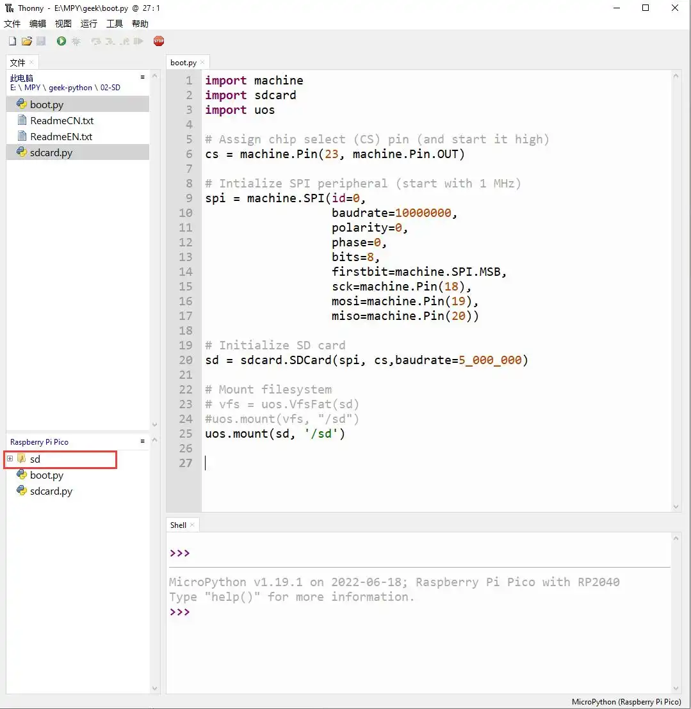
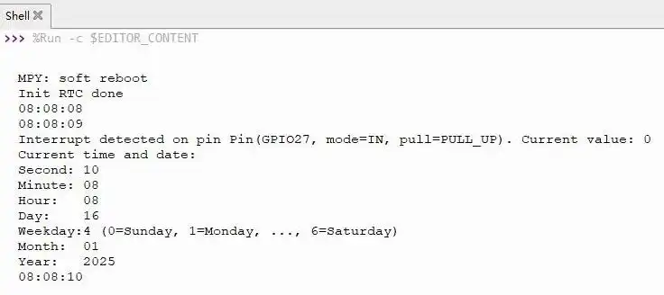
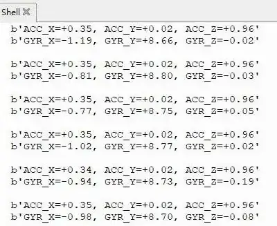

<!-- Example-related Image References -->

# Working with MicroPython

This chapter includes the following sections, please read as needed:

- [MicroPython Getting Started Tutorials](#MicroPython-getting-started)
- [Setting Up Development Environment](#setting-up-development-environment)
- [Demo](#demo)

## MicroPython Getting Started Tutorials {#MicroPython-getting-started}

New to Pico MicroPython development and want to get started quickly? We have prepared a general introductory tutorial for you. These tutorial is designed to help developers quickly become familiar with Thonny IDE and start developing. The content covers environment setup, project creation, component usage, and peripheral programming, helping you take the first step in MicroPython programming.

- [Section 1 Basic Introduction](https://pico.wiki/index.php/2021/04/27/getting-started-with-raspberry-pi-pico-basic-intro.html)
- [Section 2 GPIO](https://pico.wiki/index.php/2021/04/06/getting-started-with-raspberry-pi-pico-gpio.html)
- [Section 3 PWM](https://pico.wiki/index.php/2021/04/06/getting-started-with-raspberry-pi-pico-pwm.html)
- [Section 4 ADC](https://pico.wiki/index.php/2021/04/06/getting-started-with-raspberry-pi-pico-adc.html)
- [Section 5 UART](https://pico.wiki/index.php/2021/05/28/getting-started-with-raspberry-pi-pico-uart.html)
- [Section 6 I2C](https://pico.wiki/index.php/2021/06/08/getting-started-with-raspberry-pi-pico-i2c.html)
- [Section 7 SPI](https://pico.wiki/index.php/2021/06/09/getting-started-with-raspberry-pi-pico-spi.html)
- [Section 8 PIO](https://pico.wiki/index.php/2021/07/19/getting-started-with-raspberry-pi-pico-pio.html)

## Setting Up Development Environment

Please refer to the **[Install and Configure Thonny IDE Tutorial](/docs/Raspberry-Pi-Pico/Tutorials/MicroPython-Tutorials/index.md)** to download and install the Thonny IDE.

## Demo

The Micropython demos are located in the `Micropython` directory of the [demo package](./Resources-And-Documents.md#5-demo).

| Demo | Basic Program Description | Dependency Library|
| :--------------: | :-----------------------------------------:| :----------: |
|      01_SD       |                 Mount TF card                 |      -       |
|      02_RTC      |                Get RTC data               |      -       |
|      03_IMU      |               Get six-axis sensor data             |      -       |
|    04_GPS_UART   |    Communicate with GPS module using UART to get GPS data  |      -       |

### 01_SD

**Demo Description**

- Uses SPI to communicate with the TF card and mounts the TF card to the development board. After successful mounting, you can view and modify the contents of the TF card via Thonny.

**Hardware Connection**

- Insert a TF card
- Connect the board to the computer using a USB cable

**Code Analysis**

- `sdcard.SDCard(spi, cs, baudrate)`: Creates a TF card object and binds the initialized SPI interface and CS pin to the TF card driver.
- `uos.mount(sd, '/sd')`: Mounts the TF card file system to the `/sd` directory. After successful mounting, users can perform file read/write operations on the TF card via the `/sd` path, such as creating, reading, or deleting files.

**Operation Result**

- Upload all py files from the 01_SD folder to the development board via Thonny and reset the board. After resetting, the development board will automatically mount the TF card to the sd directory according to the boot.py program.

    

        
    

### 02_RTC

**Demo Description**

- Uses I2C to communicate with the onboard RTC chip, sets and reads RTC time data, and tests if the RTC interrupt is functioning correctly.

**Hardware Connection**

- Connect the board to the computer using a USB cable

**Code Analysis**

- `RTC = PCF85063()`: Creates an RTC object.
- `RTC.setDate(weekday, day, month, year)`: Sets the RTC date.
- `RTC.setTime(hour, minute, second)`: Sets the RTC time.
- `RTC.readTime()`: Reads the RTC time.
- `RTC.setAlarm(second, minute, hour, day, weekday)`: Sets the RTC alarm.
- `RTC.enableAlarm()`: Enables the RTC alarm.

**Operation Result**

- Run the py files in the 02_RTC folder using Thonny.

    

        
    

### 03_IMU

**Demo Description**

- Uses I2C to communicate with the onboard six-axis sensor and reads the sensor data.

**Hardware Connection**

- Connect the board to the computer using a USB cable

**Code Analysis**

- `IMU = QMI8658()`: Creates an IMU object.
- `IMU.Read_XYZ()`: Reads the six-axis sensor data.

**Operation Result**

- Run the py files in the 03_IMU folder using Thonny.

    

        
    

### 04_GPS_UART

**Demo Description**

 - Uses UART to communicate with the onboard GPS and queries the LC76G for NMEA data.

**Hardware Connection**

- Connect the GNSS ceramic antenna 
- Connect the board to the computer using a USB cable

**Code Analysis**

- `gnss_l76b=l76x.L76X()`: Creates a GPS object.
- `gnss_l76b.l76x_send_command()`: Sends initialization commands.
- `gnss_l76b.uart_any()`: Checks if there is data in the UART buffer.
- `gnss_l76b.uart_receive_byte()`: Receives UART data.

**Operation Result**

- Upload all directories and files from the 04_GPS_UART folder to the development board using Thonny, then run the `coordinates_converted.py` file in the example folder.

    

        
    

