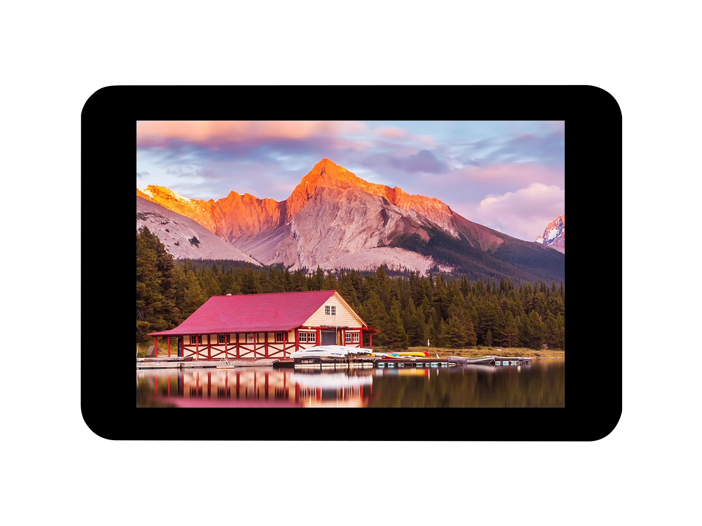
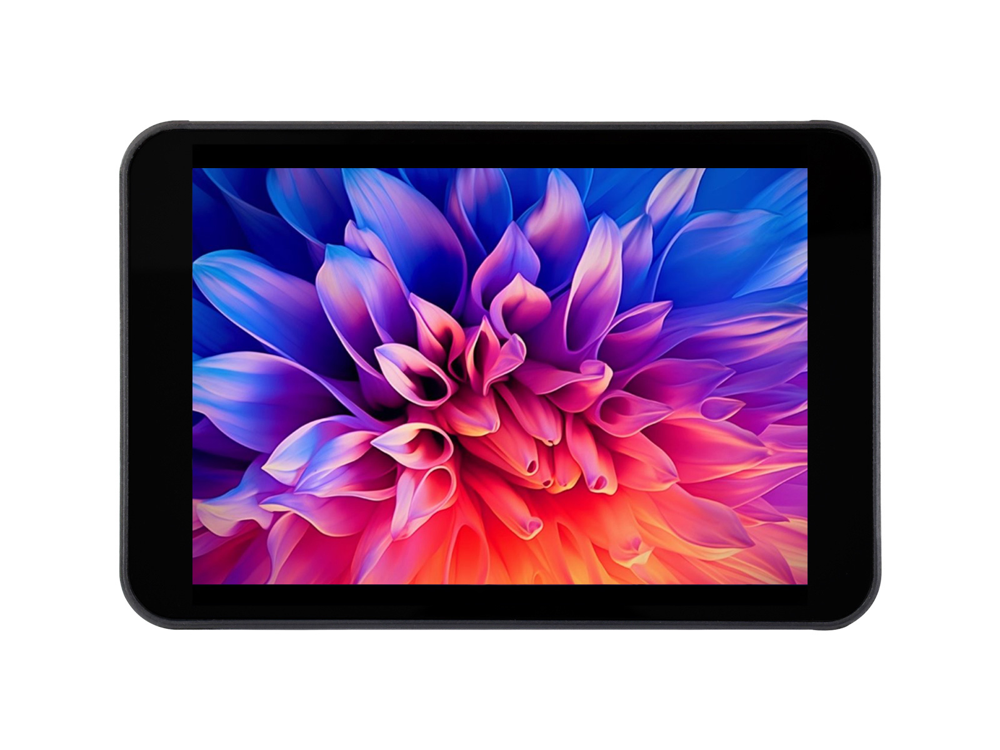
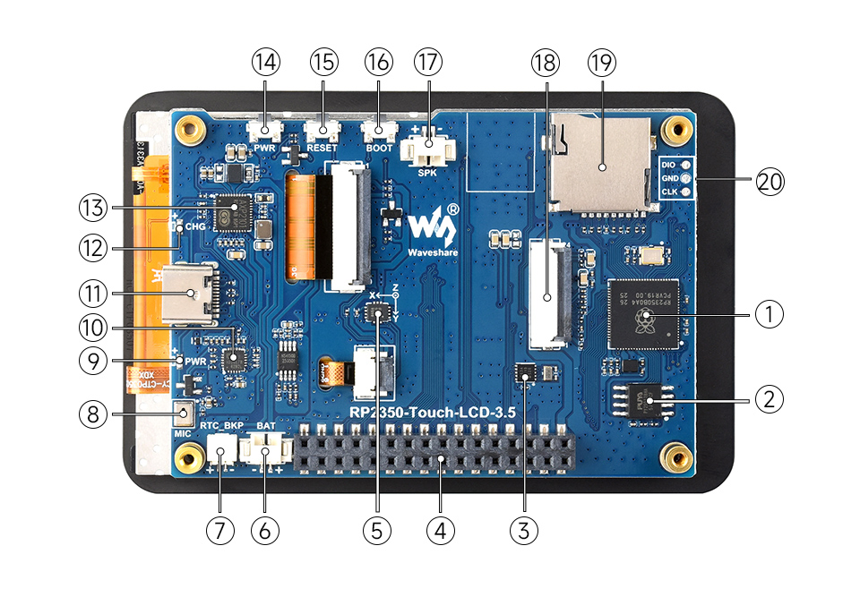
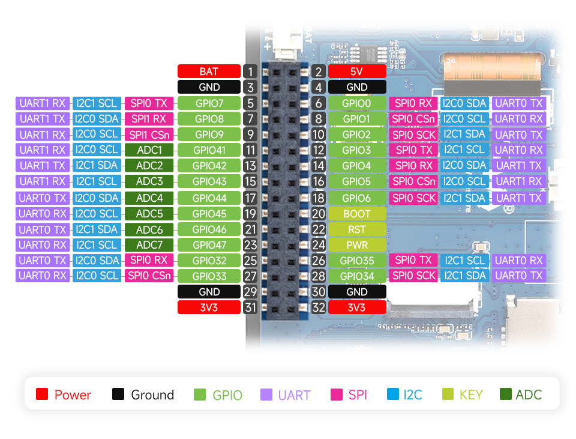
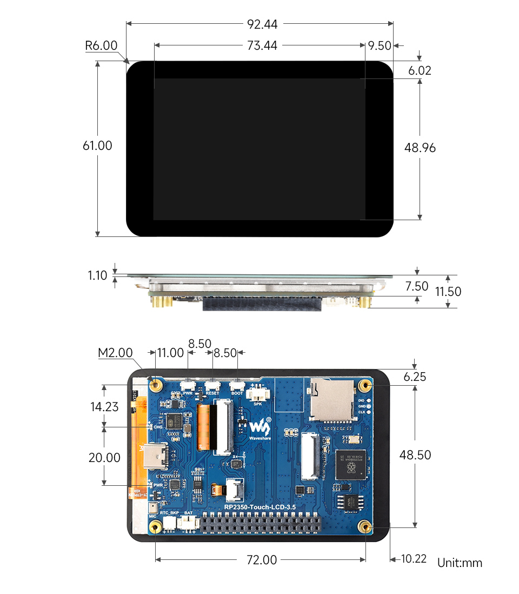
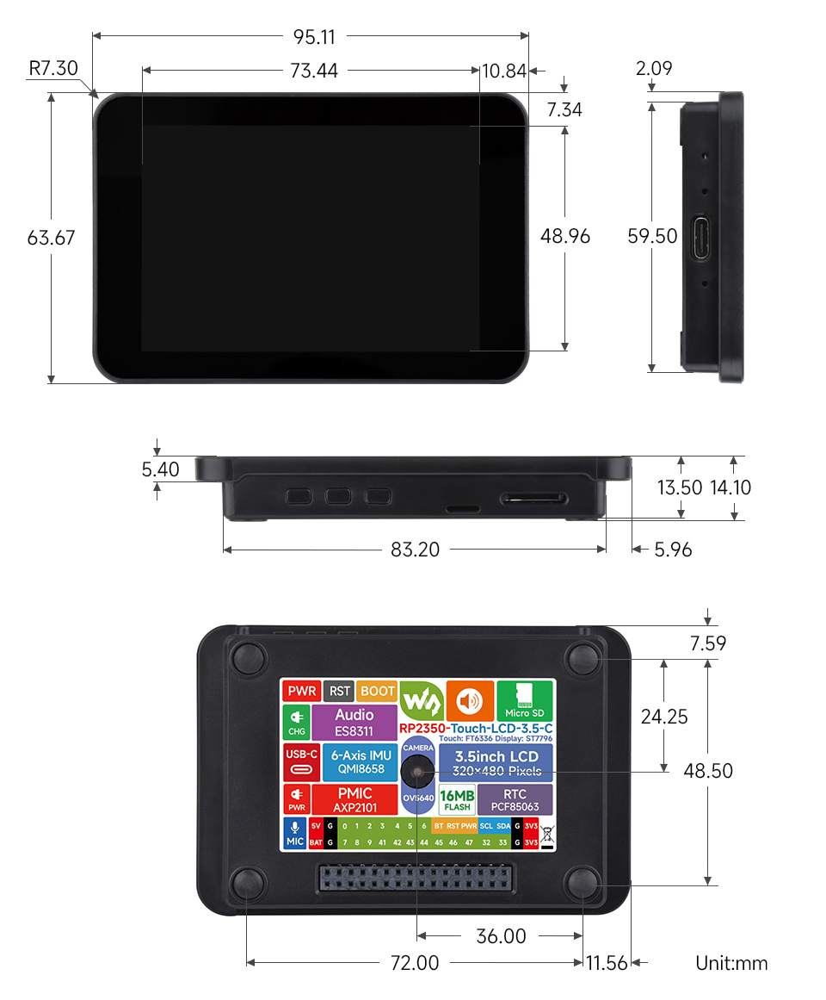

# RP2350-Touch-LCD-3.5

import Tabs from '@theme/Tabs';
import TabItem from '@theme/TabItem';

<Tabs queryString="variant">
  <TabItem value="RP2350-Touch-LCD-3.5" label="RP2350-Touch-LCD-3.5 (Without Case)">
    
 

  </TabItem>
  <TabItem value="RP2350-Touch-LCD-3.5-C" label="RP2350-Touch-LCD-3.5 (With Case)" default>
    
 
 
  </TabItem>
</Tabs>

This product is a high-performance, highly integrated microcontroller development board independently designed by Waveshare. Within a compact form factor, it integrates a 3.5inch capacitive high-definition IPS screen, a highly integrated power management chip, a low-power audio codec chip, a camera interface, a six-axis sensor (3-axis accelerometer and 3-axis gyroscope), an RTC, a TF card slot, and other peripherals, facilitating development and integration into end products.

| SKU | Product | 
| --- | --- | 
| 33894 | RP2350-Touch-LCD-3.5 |
| 33896 | RP2350-Touch-LCD-3.5-C |

## Features

- Utilizes the RP2350B microcontroller chip designed by Raspberry Pi
- Unique dual-core, dual-architecture, featuring dual-core ARM Cortex-M33 processors and dual-core Hazard3 RISC-V processors, both operating at up to 150MHz, allowing flexible switching between the two architectures for users
- Built-in 520KB of SRAM and 16MB of on-chip Flash
- Utilizes a Type-C port, eliminating concerns about plug orientation.
- Built-in 3.5inch capacitive touch high-definition IPS display with a resolution of 320×480, 65K colors for clear color pictures
- Embedded with ST7796 driver chip and FT6336 capacitive touch chip, communicating through SPI and I2C interfaces respectively, minimizes required IO pins
- On-board camera interface, compatible with mainstream cameras such as OV2640 and OV5640, suitable for image and video capture
- Onboard 3.7V MX1.25 lithium battery recharge/discharge header.
- USB1.1 host and slave device support
- Supports low-power sleep and hibernation modes
- Drag-and-drop programming using mass storage over USB
- 22 × multi-functional GPIO pins
- 2 × SPI, 2 × I2C, 2 × UART, 7 × 12-bit ADC and 18 × controllable PWM channels
- Accurate on-chip clock and timer
- Built-in temperature sensor for real-time chip temperature monitoring
- 12 × programmable I/O (PIO) state machines for custom peripheral support

## Onboard Resources

 

1. **RP2350B** Dual-core, dual-architecture processor, up to 150MHz operating frequency  
2. **16MB Flash** For storing programs and data  
3. **PCF85063** RTC clock chip  
4. **2.54mm Pin Header Interface** Brings out available IO function pins for easy expansion  
5. **QMI8658** 6-axis IMU includes a 3-axis gyroscope and a 3-axis accelerometer  
6. **MX1.25 Lithium Battery Interface** For connecting a 3.7V lithium battery, supports charging and discharging, with adjustable charging current  
7. **SH1.0 RTC Battery Interface** Supports connecting a rechargeable RTC battery  
8. **Microphone** For audio capture  
9. **Power Indicator** Indicates system power status  
10. **ES8311** Low-power audio codec chip  
11. **USB Type-C Interface** For program download, supports USB 1.1 host and device modes  
12. **Charging Indicator** Indicates battery charging status  
13. **AXP2101** Highly integrated power management chip  
14. **PWR Power Button** Controls power on/off and supports custom functions  
15. **RESET Button** System reset button  
16. **BOOT Button** Press during reset to enter download mode  
17. **MX1.25 Speaker Connector** For connecting an external speaker  
18. **Camera Interface** Supports mainstream cameras such as OV5640 / OV2640  
19. **TF Card Slot** Supports TF card for storage expansion  
20. **Debug Interface** Convenient for program downloading and online debugging  

## Interfaces

 

## Dimensions

### Without Case

 

### With Case

 

## Development Methods

The RP2350-Touch-LCD-3.5 supports three programming languages: MicroPython, C/C++, and Arduino, offering developers flexible choices. You can select the appropriate development tools and programming methods based on project requirements and personal preference:

- **Thonny IDE (Working with MicroPython)**: Thonny is a lightweight Python Integrated Development Environment designed for beginners and educational scenarios, now widely used for MicroPython / CircuitPython development. Its interface is simple and intuitive, featuring a built-in Python interpreter, support for serial REPL, code flashing, and debugging, with a straightforward setup process. MicroPython is easy to learn and runs without compilation, making it ideal for beginners to quickly start embedded development. You can refer to the **[Working with MicroPython](./MicroPython.md)** for initial setup, which provides detailed environment configuration steps and example programs.

- **VS Code + Pico SDK (Working with C/C++)**: VS Code is a powerful cross-platform code editor. By installing the Pico VSCode extension, a complete C/C++ development environment can be quickly set up. This extension integrates the Pico SDK toolchain, CMake build system, flashing and debugging tools, supports graphical operations, and offers high development efficiency. C/C++ development fully utilizes hardware performance, making it suitable for projects with higher performance requirements and professional developers, and is more applicable for complex embedded applications. You can refer to the **[Working with C/C++](./C.md)** for initial setup, which provides detailed environment configuration steps and example programs.

- **Arduino IDE (Working with Arduino)**: The Arduino IDE is a convenient, flexible, and easy-to-use open-source electronics prototyping platform. Arduino boasts a vast global user community, offering a massive library of open-source code, project examples, tutorials, and rich library resources. These libraries encapsulate complex functionalities, allowing developers to implement various features quickly without delving into low-level details. It is well-suited for rapid development and prototype verification, significantly shortening development cycles. You can refer to the **[Working with Arduino](./Arduino.md)** for initial setup, which provides detailed environment configuration steps and example programs.
