<!-- Image Reference -->


# Raspberry Pi Pico C/C++ Getting Started

> This tutorial will introduce how to use the Pico VS Code extension for C/C++ development and guide you through configuring a C/C++ development environment based on the Pico SDK.

:::tip[Important Note: Development Board Compatibility]
The core logic of this tutorial applies to all RP series development boards. However, all operational steps are explained using the [**Raspberry Pi Pico 2**](https://www.waveshare.com/raspberry-pi-pico-2.htm?sku=28568) as an example. If you are using a development board of another model, please modify the corresponding settings according to the actual situation.
:::

## 1. What is Pico C/C++ Development

C/C++ development for the Raspberry Pi Pico is based on the official **[Pico SDK](https://www.raspberrypi.com/documentation/microcontrollers/c_sdk.html)**, a C/C++ software development kit specifically designed for Pico series chips such as the RP2040 and RP2350. The Pico SDK provides a rich set of API libraries for controlling peripherals such as GPIO, I2C, SPI, PWM, and ADC, as well as advanced features like multi-core processing, timers, and DMA.

To simplify the setup and use of the C/C++ development environment, the Raspberry Pi team has released the **Pico VS Code extension**. This extension integrates the following features:

- **One-Click Installation:** Automatically installs and manages development dependencies such as the Pico SDK, CMake, and compiler toolchain.
- **Project Management:** Quickly create, import, and configure C/C++ projects through a graphical wizard.
- **Compilation and Building:** Integrates CMake and Ninja build systems for one-click compilation and UF2 firmware generation.
- **Flashing and Debugging:** Supports UF2 firmware flashing and enables breakpoint debugging, single-step execution, and variable inspection via OpenOCD.
- **Cross-Platform Support:** Provides a unified development experience on Windows, macOS, and Linux.

:::info[Scope of application]
- This tutorial is applicable to the Raspberry Pi Pico, Pico 2, and all RP series development boards developed by Waveshare Electronics.
- The installation tutorial uses Windows 11 as the default example. For other operating systems, please refer to the [official Raspberry Pi tutorial](https://www.raspberrypi.com/news/pico-vscode-extension/).
:::

## 2. Install the Visual Studio Code Editor

1. Download and install [Visual Studio Code](https://code.visualstudio.com/).

2. During installation, it is recommended to check the option "Add 'Open with Code' action to Windows Explorer file context menu”.

    :::tip
    If VS Code is already installed, please check if the version is v1.87.0 or higher.
    :::
    <div style={{maxWidth: 590}}>
        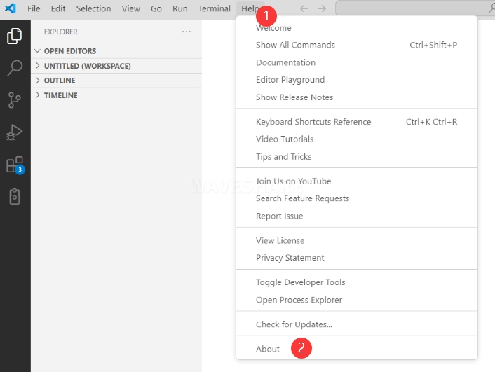
    </div>
    <div style={{maxWidth: 352}}>
        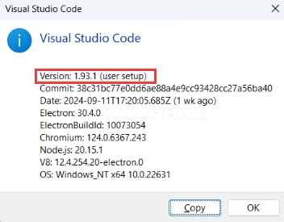
    </div>
  
## 3. Installing Pico Extension

1. Click on Extensions and select "Install from VSIX".
    <div style={{maxWidth: 538}}>
        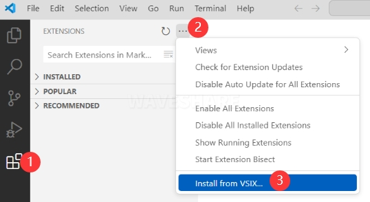
    </div>

2. Select the software package with the .vsix extension and click Install.
    <div style={{maxWidth: 576}}>
        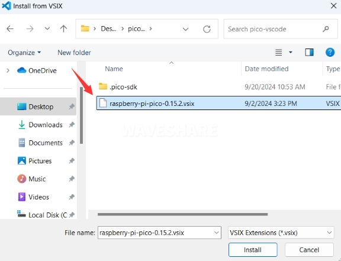
    </div>

3. VS Code will then automatically install the raspberry-pi-pico extension and its dependencies. You can click Refresh to view the installation progress.
    <div style={{maxWidth: 381}}>
        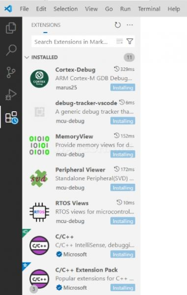
    </div>

4. When "Completed installing extension." is shown in the bottom right corner, close VS Code.
    <div style={{maxWidth: 630}}>
        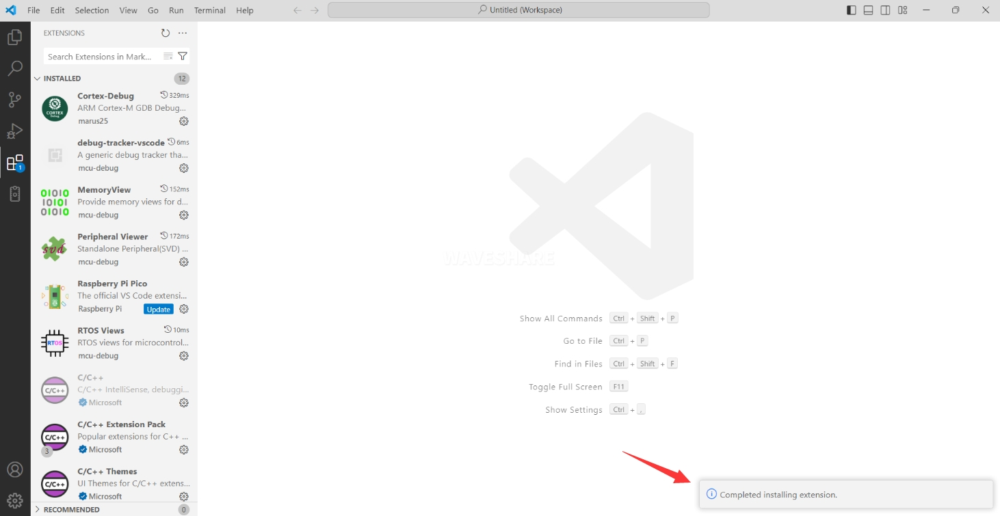
    </div>

5. The extension version in the offline package is 0.15.2. After installation, update it to the latest version.
    <div style={{maxWidth: 630}}>
        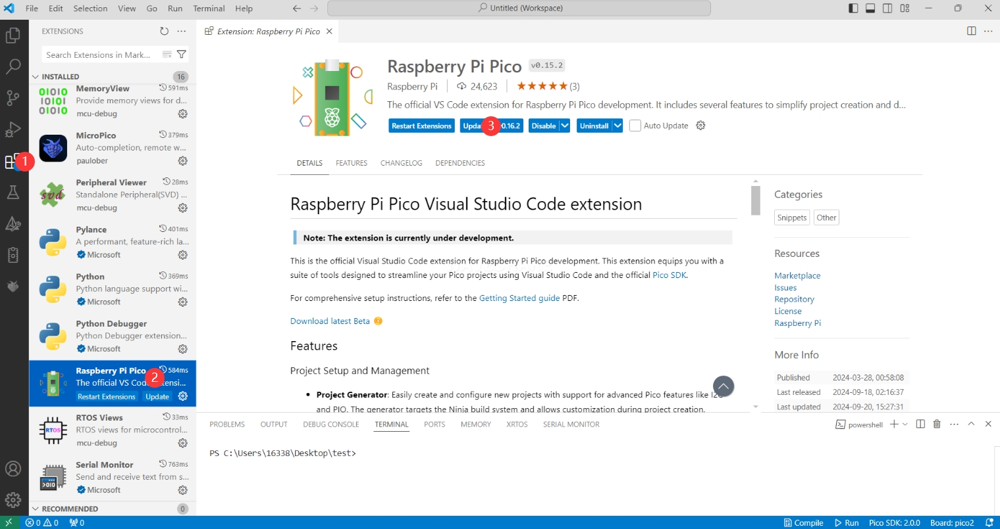
    </div>

## 4. Configuring the C/C++ Development Environment

1.  Open the directory `C:\Users\YourUsername`, and copy the entire `.pico-sdk` folder to this directory.
    <div style={{maxWidth: 630}}>
        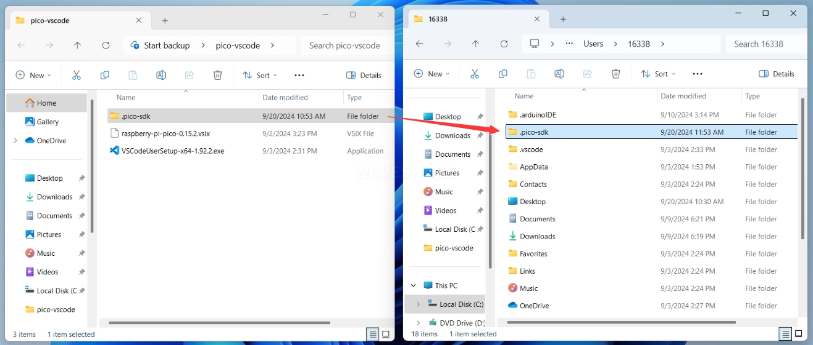
    </div>

2. Copy completed.
    <div style={{maxWidth: 630}}>
        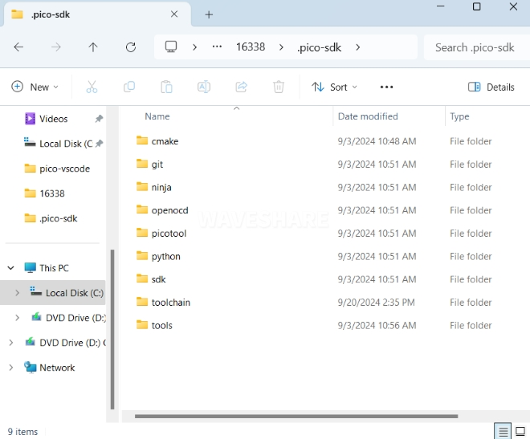
    </div>

3. Open VS Code and configure the various paths in the Raspberry Pi Pico extension settings.
    <div style={{maxWidth: 630}}>
        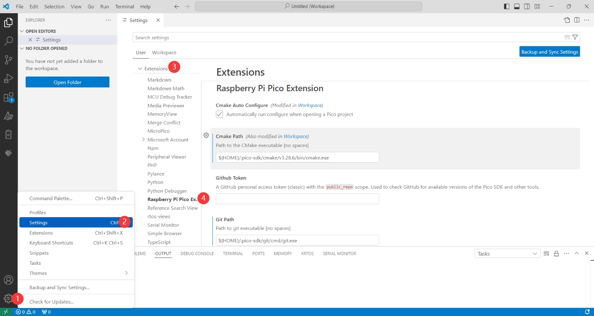
    </div>
    The configuration is as follows:
    ```
    Cmake Path:
    ${HOME}/.pico-sdk/cmake/v3.28.6/bin/cmake.exe

    Git Path:
    ${HOME}/.pico-sdk/git/cmd/git.exe    

    Ninja Path:
    ${HOME}/.pico-sdk/ninja/v1.12.1/ninja.exe

    Python3 Path:
    ${HOME}/.pico-sdk/python/3.12.1/python.exe          
    ```

## 5. Creating a New Project
 
1. After the configuration is complete, you can create a new project for testing. Enter the project name, select the save path, and then click **Create** to create the project. If you want to use the official example code, you can click **Example** next to the project name to select it.
    <div style={{maxWidth: 630}}>
        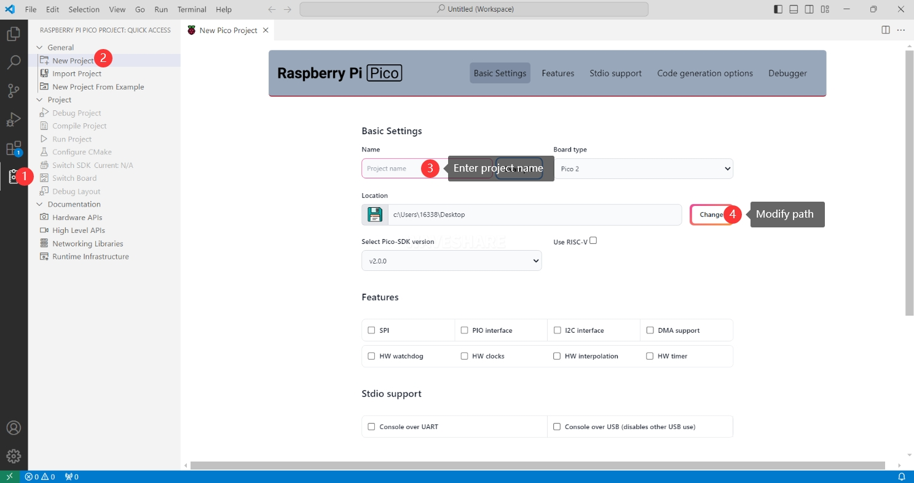
    </div>

2. A project successfully created.
    <div style={{maxWidth: 630}}>
        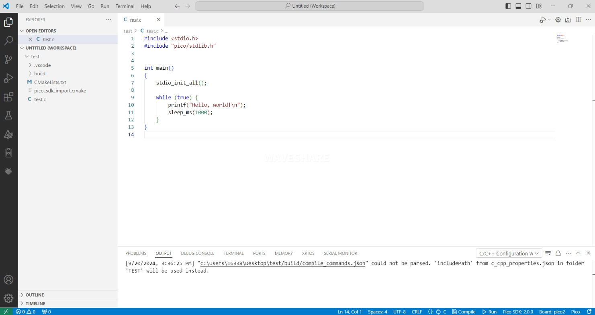
    </div>

## 6. Compiling C/C++ Projects

1. When compiling for the first time, you need to select the Pico SDK version.
    <div style={{maxWidth: 630}}>
        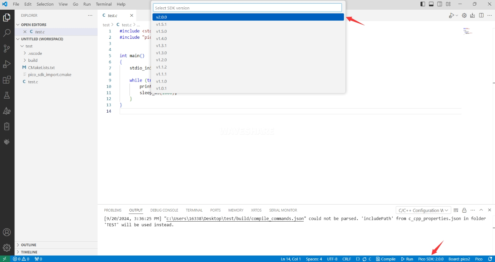
    </div>

2. Select **Yes** for advanced configuration.
    <div style={{maxWidth: 630}}>
        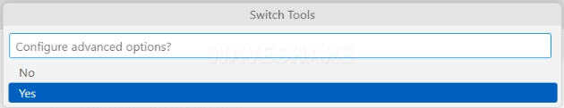
    </div>

3. Select the cross-compilation toolchain:
    - **13.2.Rel1**: Suitable for ARM cores (Pico, Pico W, etc.)
    - **RISCV.13.3**: Suitable for RISC-V cores (RISC-V mode of Pico 2)

    Choose the appropriate toolchain based on your development board and requirements.
    <div style={{maxWidth: 631}}>
        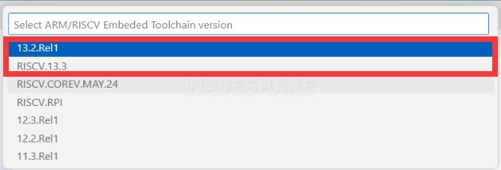
    </div>

4. Select the CMake version as **Default** (using the path configured previously).
    <div style={{maxWidth: 627}}>
        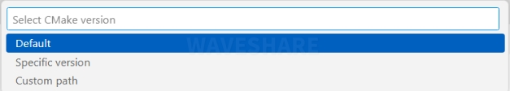
    </div>

5. Ninja build tool version selection: **Default**
    <div style={{maxWidth: 623}}>
        
    </div>

6. Select the development board.
    <div style={{maxWidth: 630}}>
        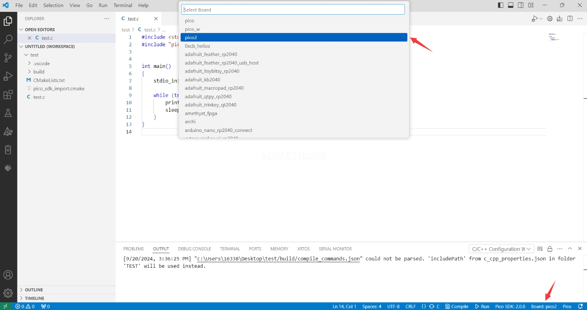
    </div>

7. After completing the configuration, click the **Compile** button to start compiling.
    <div style={{maxWidth: 630}}>
        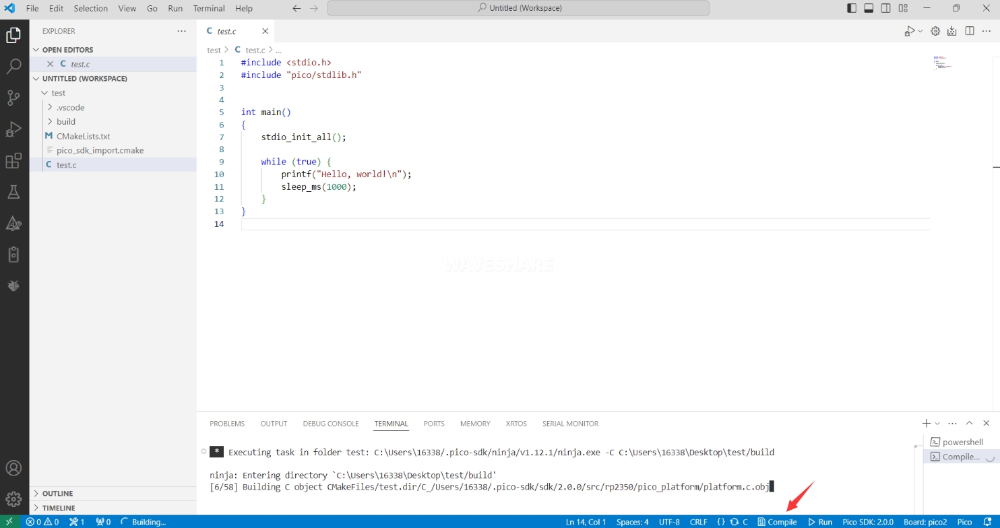
    </div>

8. After successful compilation, a firmware file in `uf2` format will be generated in the `build` directory of the project.
    <div style={{maxWidth: 630}}>
        
    </div>

## 7. Flashing the Firmware

Two methods are available for flashing the compiled firmware onto the development board:

1. **Flashing using the Pico VS Code plugin**
    Connect the development board to your computer and click "Run" to directly flash the firmware.
    <div style={{maxWidth: 630}}>
        
    </div>

2. **Manually flashing the firmware**
    ```
    1. Press and hold the Boot button.
    2. Connect the development board to the computer.     
    3. Then the computer will recognize the development board as a USB device.
    4. Copy the uf2 format file to the USB drive. The device will then automatically reboot, completing the firmware flash.
    ```

## 8. Importing C/C++ Project

1. In the Pico VS Code extension, select "Import Project," and then choose the directory where your project is located.
    <div style={{maxWidth: 630}}>
        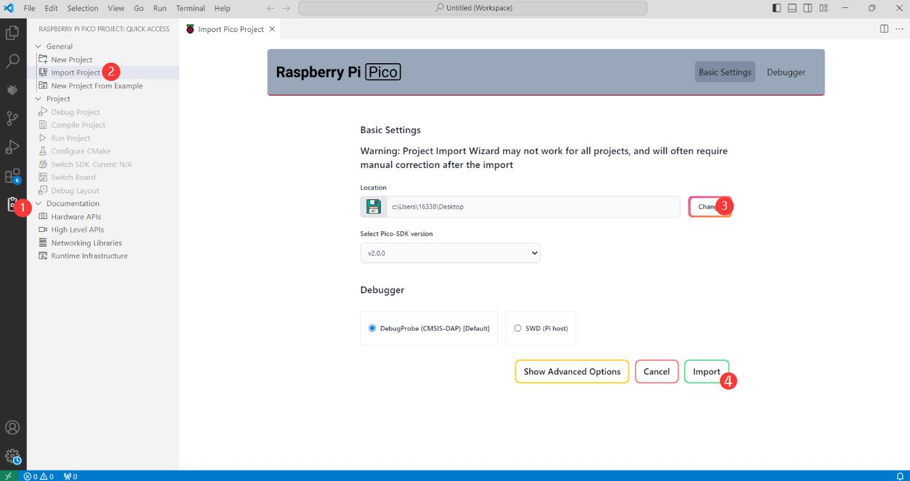
    </div>

2. **Important Note:** The `CMakeLists.txt` file in the imported project must not contain any Chinese characters (including in comments), otherwise the import may fail.

3. **Development Board Configuration:** After importing the project, you need to check if the `CMakeLists.txt` file contains the development board configuration code. The following configuration is required for proper switching between Pico and Pico 2:
    <div style={{maxWidth: 630}}>
        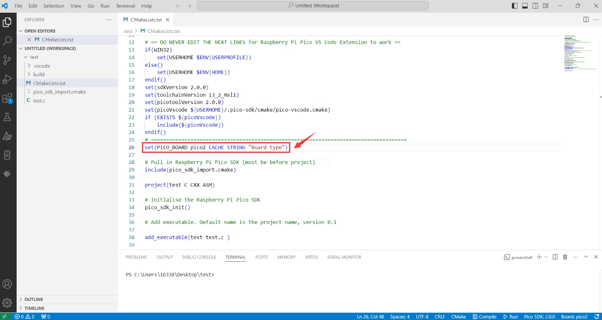
    </div>
    ```
    set(PICO_BOARD pico2 CACHE STRING "Board type")
    ```

    :::tip
    If this configuration is not present in `CMakeLists.txt`, even if Pico 2 is selected in VS Code, the compiled firmware will still be for the original Pico.
    :::

## 9. Reference Links
- [Raspberry Pi Pico VS Code Extension Notes](https://www.raspberrypi.com/news/pico-vscode-extension/)
- [Pico VS Code GitHub](https://github.com/raspberrypi/pico-vscode)