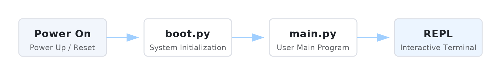
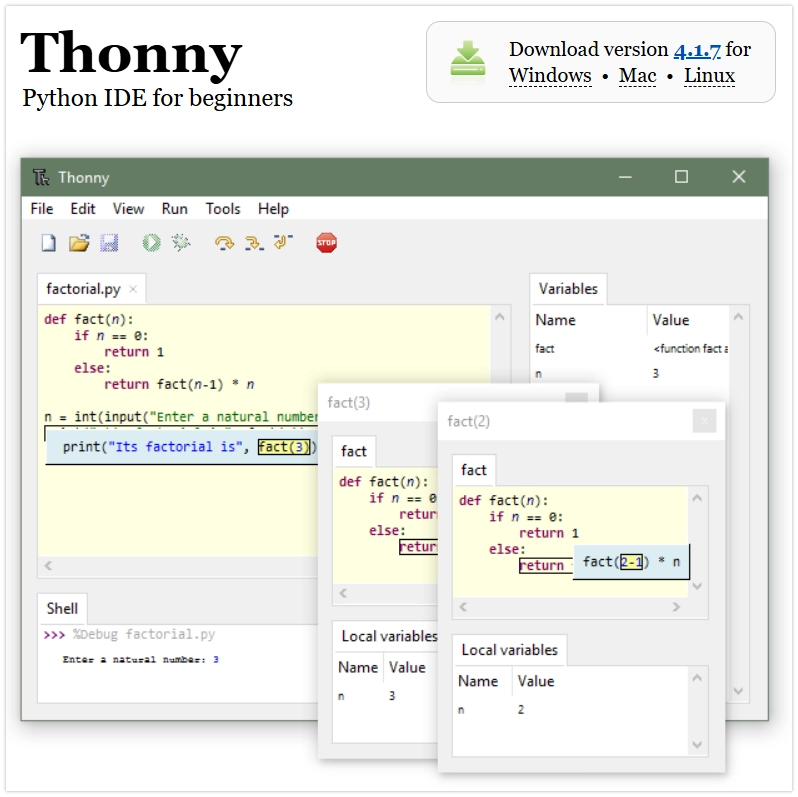

<!-- Image Reference -->
import ImgMicropyDownloadThonny from './images/01-Download-Thonny.webp';
import ImgMicropythonShell from './images/01-MicroPython-Shell.webp';
import ImgMicropythonUpload1 from './images/01-MicroPython-Upload-1.gif';
import ImgMicropythonUpload2 from './images/01-MicroPython-Upload-2.webp';
import ImgMicropythonUpload3 from './images/01-MicroPython-Upload-3.webp';
import ImgMicropythonUpload4 from './images/01-MicroPython-Upload-4.webp';
import ImgMicropythonUpload5 from './images/01-MicroPython-Upload-5.webp';
import ImgMicropythonUpload6 from './images/01-MicroPython-Upload-6.webp'; 

# Raspberry Pi Pico MicroPython Getting Started

> This tutorial introduces MicroPython and guides you through setting up the MicroPython development environment for Pico.

:::tip[Important Note: Development Board Compatibility]
The core logic of this tutorial applies to all RP series development boards. However, all operational steps are explained using the [**Raspberry Pi Pico**](https://www.waveshare.com/raspberry-pi-pico.htm?sku=19310) as an example. If you are using a development board of another model, please modify the corresponding settings according to the actual situation.
:::

Welcome to the Waveshare Raspberry Pi Pico MicroPython Getting Started Tutorial!

This series of tutorials is based on the Waveshare Raspberry Pi Pico development board and the Thonny IDE environment, aiming to help learners get started with Raspberry Pi Pico development. It is recommended to study in order, or you can choose the chapters you are interested in according to your own needs.

- [Section 1: Basic Introduction](https://pico.wiki/index.php/2021/04/27/getting-started-with-raspberry-pi-pico-basic-intro.html)
- [Section 2: GPIO](https://pico.wiki/index.php/2021/04/06/getting-started-with-raspberry-pi-pico-gpio.html)
- [Section 3: PWM](https://pico.wiki/index.php/2021/04/06/getting-started-with-raspberry-pi-pico-pwm.html)
- [Section 4: ADC](https://pico.wiki/index.php/2021/04/06/getting-started-with-raspberry-pi-pico-adc.html)
- [Section 5: UART](https://pico.wiki/index.php/2021/05/28/getting-started-with-raspberry-pi-pico-uart.html)
- [Section 6: I2C](https://pico.wiki/index.php/2021/06/08/getting-started-with-raspberry-pi-pico-i2c.html)
- [Section 7: SPI](https://pico.wiki/index.php/2021/06/09/getting-started-with-raspberry-pi-pico-spi.html)
- [Section 8: PIO](https://pico.wiki/index.php/2021/07/19/getting-started-with-raspberry-pi-pico-pio.html)

You can use any RP series development board you have on hand and follow along with components you prepare yourself.

If you wish to avoid the hassle of selecting components, we also offer the following learning kits, which contain the core hardware for learning Raspberry Pi Pico:

- [**Raspberry-Pi-Pico-Basic-Kit**](https://www.waveshare.com/Raspberry-Pi-Pico-Basic-Kit.htm): Raspberry Pi Pico Basic Starter Kit, MicroPython Programming Learning Kit
- [**Raspberry-Pi-Pico-Sensor-Kit-B**](https://www.waveshare.com/pico-sensor-kit-b.htm?sku=24099): Raspberry Pi Pico Entry-Level Sensor Kit, Including Pico Expansion Board and 15 common modules

Of course, you can also choose the more powerful Raspberry Pi Pico 2 learning kits:

- [**Raspberry-Pi-Pico-2-Basic-Kit**](https://www.waveshare.com/raspberry-pi-pico-2.htm?sku=28588): Raspberry Pi Pico 2 Basic Starter Kit, MicroPython Programming Learning Kit
- [**Raspberry-Pi-Pico-2-Sensor-Kit**](https://www.waveshare.com/raspberry-pi-pico-2.htm?sku=28579): Raspberry Pi Pico 2 Sensor Kit, including Pico expansion board and 15 common modules

---

## 1. What is MicroPython?

MicroPython is a lean and efficient implementation of the Python 3 programming language, specifically optimized to run on microcontrollers and other resource-constrained environments.

MicroPython supports a variety of microcontroller platforms. It can run on devices with as little as 16KB of RAM. On the RP2040 (264KB RAM) and RP2350 (520KB RAM), you will get a more complete and smoother functional experience.

Simply put, MicroPython is a "miniature version" of Python that runs on microcontrollers. It allows developers to control hardware using Python syntax, lowering the barrier to entry for embedded development.

A comparison of using MicroPython with other development methods is as follows:

| Feature      | MicroPython | Arduino | VS Code |
| -------- | ----------- | ------- | ------- |
| Learning Difficulty | Low          | Medium  | High   |
| Development Efficiency | High         | Medium  | Low    |
| Performance | Medium       | High    | Highest|
| Memory Usage | Relatively High | Medium  | Controllable |

### 1.1 Operating Principle

The operation of MicroPython relies primarily on the firmware flashed onto the device.

1. **Interactive Interpreter (REPL)**:
   When the MicroPython firmware starts, it runs a miniature Python interpreter and enters a standby state. At this point, through a serial connection, the user can enter the **REPL** (Read-Eval-Print Loop) environment. Python commands sent in this environment are executed immediately and return results. This immediate feedback mechanism significantly improves debugging efficiency.
    <div style={{maxWidth: 600}}>
        
    </div>
2. **File Execution Mechanism**:
   In addition to interactive input, MicroPython also supports running code saved in the file system. When the device boots, it attempts to run `boot.py` (the system boot script) and `main.py` (the user's main program) in sequence. Saving your code as `main.py` enables the program to run automatically upon device power-up.
    

### 1.2 Differences from Standard Python

- **Independent Implementation**: MicroPython is not a modification of the standard Python (CPython) source code; it is written from the ground up for embedded environments. It strictly adheres to Python 3 syntax, but its internal implementation is different.
- **Functionality is a Subset**: Due to the limited memory (RAM) and flash (Flash) of microcontrollers, MicroPython only includes a subset of the core libraries from standard Python. Some large libraries or libraries that are not suitable for embedded scenarios (such as the full versions of `numpy` or `requests`) are removed or replaced with more streamlined modules.
- **Hardware Support**: The most distinctive feature of MicroPython is the addition of modules for controlling hardware, such as the `machine` module (for controlling GPIO, I2C, SPI, etc.) and the `network` module (for controlling Wi-Fi, Bluetooth).
- **Cross-Platform**: In addition to the RP series development boards, it supports many other boards, such as the ESP32 series, ESP8266, STM32 series, etc.

## 2. Setting Up Development Environment

[Thonny](https://thonny.org/) is a Python Integrated Development Environment (IDE) designed for beginners, with built-in, comprehensive support for MicroPython. It allows you to easily perform all operations such as firmware flashing, file management, and code debugging.

:::note
The following content of this tutorial will be demonstrated uniformly using **Thonny IDE**.
:::

### 2.1 Installing Thonny

:::tip Alternative Download (Mirror)
If the download speed is slow or the download fails, you can download from [**this link**](https://files.waveshare.com/wiki/common/Thonny.zip) (Windows).
:::

Go to the [Thonny official website](https://thonny.org/) to download and install Thonny.

[](https://thonny.org/)

### 2.2 Configuring Thonny

After installation, configure the language and board environment on the first run. Since we are using RP series development boards, make sure to select the Raspberry Pi option for the board environment.
1.  First, connect the development board to your computer. Left-click the "Configure interpreter" option in the bottom-right corner of Thonny.
    <div style={{maxWidth: 500}}>
        
    </div>
2. In the pop-up window, select MicroPython (Raspberry Pi Pico), and choose the corresponding port
    <div style={{maxWidth: 500}}>
        
    </div>

### 2.3 Flashing Firmware
1. **Flash the Firmware**: Press and hold the BOOT button, then connect the board to your computer. Release the BOOT button, and a removable disk will appear on your computer. Copy the firmware file into it.
    :::info Note
    Flashing the firmware provided by MicroPython's official source may cause the device to be unrecognized. Please use the firmware from the links below or the one in the development board's corresponding program package.<br />
    - [Pico Firmware](https://files.waveshare.com/wiki/common/RPI_PICO-20250415-v1.25.0.zip)<br />
    - [Pico2 Firmware](https://files.waveshare.com/wiki/common/WAVESHARE-RP2350-20250711-v1.26.0.zip)<br />
    - [Pico2 16MB Firmware](https://files.waveshare.com/wiki/common/WAVESHARE-RP2350-20250807-v1.26.0-16MB.zip)<br />
    - [RP2350B Firmware](https://files.waveshare.com/wiki/common/WAVESHARE_RP2350B.zip)
    :::
    <div style={{maxWidth: 600}}>
        
    </div>

2. **Restart the Interpreter**: After successful flashing, click the red **Stop** button on the toolbar to restart the on-board interpreter.
    <div style={{maxWidth: 400}}>
        
    </div>

3. **Check the Prompt**: After successful connection, the MicroPython version information, board information, and the `>>>` prompt should appear in the Shell window, indicating that you have successfully entered the board's MicroPython REPL environment.
    <div style={{maxWidth: 600}}>
        
    </div>

### 2.4 Verifying the Development Environment

1. **Run Test Code**: At the `>>>` prompt, type your first line of MicroPython code and press Enter:

   ```python
   print('Hello, Raspberry Pi Pico!')
   ```
    <div style={{maxWidth: 600}}>
        
    </div>

   You should immediately see Raspberry Pi Pico return the message `Hello, Raspberry Pi Pico!`.

At this point, the Raspberry Pi Pico MicroPython development environment has been set up, and you have successfully run the first line of code.

## 3. Reference Links

- [MicroPython RP Series Notes (Github README)](https://github.com/micropython/micropython/blob/master/ports/rp2/README.md)
- [MicroPython Official Documentation](https://docs.micropython.org/en/latest/reference/index.html)
- [MicroPython GitHub Wiki](https://github.com/micropython/micropython/wiki)
- [Raspberry Pi MicroPython Notes](https://www.raspberrypi.com/documentation/microcontrollers/micropython.html)

